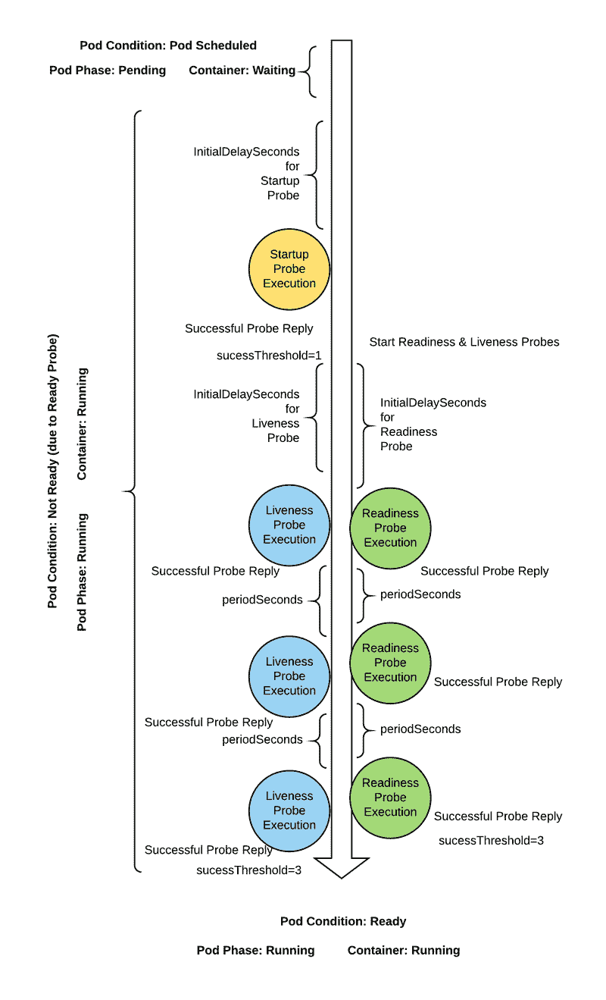

# Kubernetes 探测器:启动、活性、就绪

> 原文：<https://itnext.io/kubernetes-probes-startup-liveness-readiness-a9fc9ccff4b2?source=collection_archive---------2----------------------->


作者 Levent Ogut

Kubernetes 具有颠覆性，因为它增加了云部署的可伸缩性、速度、可移植性和可观察性。虽然它带来了一个包含强大功能和选项的完整生态系统，并简化了复杂的部署，但它也有自己的挑战。Kubernetes 带给我们的一个重要特性是高可用性。Kubernetes 中有许多高可用性选项；在本文中，我们将讨论用于应用程序/微服务本身的高可用性选项。

pods——Kubernetes 中最小的可部署单元——一旦应用了声明性配置，就会被调度。Kube-scheduler 负责计算和调度；一旦调度被接受，它就处于受控和计算的环境中，并且它被 pod 条件视为服务就绪或未就绪。使用启动、就绪和活动探测器，我们可以控制 pod 何时应该被视为启动、准备好服务或活动。我们将探讨这些条件和触发因素。



# Pod 和容器状态

豆荚有阶段和条件；容器有状态。这些状态属性可以而且将会根据探测结果而改变，所以让我们来研究一下它们。

Pod 状态对象包括一个[阶段](https://kubernetes.io/docs/concepts/workloads/pods/pod-lifecycle#pod-phase)字段。这个[相位场](https://kubernetes.io/docs/concepts/workloads/pods/pod-lifecycle#pod-phase)告诉 Kubernetes 和我们一个 pod 在哪个执行周期。

*   **Pending:** 被集群接受，容器尚未设置。
*   **运行:**至少有一个容器处于运行、启动或重新启动状态。
*   **成功:**所有容器退出，状态码为零；pod 将不会重新启动。
*   **失败:**所有容器都已终止，并且至少有一个容器以非零状态代码退出。
*   **未知:**无法确定 pod 的状态。

# Pod 条件

除了荚果阶段，还有荚果条件。这些还提供了关于 pod 所处状态的信息。

*   **PodScheduled:** 已经成功选择一个节点对 pod 进行调度，调度完成。
*   集装箱准备好了:所有的集装箱都准备好了。
*   **初始化**:初始化容器启动。
*   **准备就绪:**分离舱可以服务请求；因此，它需要包含在服务和负载平衡器中。

我们可以通过`kubectl describe pods <POD_NAME>`命令查看 pod 状态。

```
kubectl describe pods <POD_NAME>
```

示例输出如下:

```
...
Conditions:
  Type              Status
  Initialized       True 
  Ready             True 
  ContainersReady   True 
  PodScheduled      True 
...
```

# 集装箱国家

容器有三种简单的状态。

*   [**等待**](https://kubernetes.io/docs/reference/generated/kubernetes-api/v1.19/#containerstatewaiting-v1-core) **:** 成功启动所需的进程正在运行。
*   [**正在运行**](https://kubernetes.io/docs/reference/generated/kubernetes-api/v1.19/#containerstaterunning-v1-core) **:** 容器正在执行。
*   [**终止**](https://kubernetes.io/docs/reference/generated/kubernetes-api/v1.19/#containerstateterminated-v1-core) **:** 容器开始执行，以成功或失败结束。

# 浏览 Pod 对象的状态

通过发出 Kubernetes get pods -o yaml 命令，我们可以从 pod 对象中看到 [pod](https://kubernetes.io/docs/reference/generated/kubernetes-api/v1.20/#pod-v1-core) 条件和容器状态。

```
...
status:
  conditions:
  - lastProbeTime: null
    lastTransitionTime: "2021-02-08T11:11:53Z"
    status: "True"
    type: Initialized
  - lastProbeTime: null
    lastTransitionTime: "2021-02-08T11:14:20Z"
    status: "True"
    type: Ready
  - lastProbeTime: null
    lastTransitionTime: "2021-02-08T11:14:20Z"
    status: "True"
    type: ContainersReady
  - lastProbeTime: null
    lastTransitionTime: "2021-02-08T11:11:52Z"
    status: "True"
    type: PodScheduled
  containerStatuses:
  - containerID: containerd://7fc67a850ba439f64ecb51a129a2d7dcbc4a3402b253daa3a6827787f7c80e40
    image: docker.io/library/nginx:latest
    imageID: docker.io/library/nginx@sha256:10b8cc432d56da8b61b070f4c7d2543a9ed17c2b23010b43af434fd40e2ca4aa
    lastState:
      terminated:
        containerID: containerd://c4416e69b7348a7e7be3f7046dc9745dfb38ba537e5b8c06da5020c67b12b3d8
        exitCode: 137
        finishedAt: "2021-02-08T11:14:52Z"
        reason: Error
        startedAt: "2021-02-08T11:14:05Z"
    name: nginx
    ready: true
    restartCount: 1
    started: true
    state:
      running:
        startedAt: "2021-02-08T11:16:28Z"
  hostIP: x.x.x.x
  phase: Running
  podIP: 10.1.239.205
  podIPs:
  - ip: 10.1.239.205
  qosClass: BestEffort
  startTime: "2021-02-08T11:11:53Z"
```

如果你更喜欢 JSON，你可以使用`kubectl get pods <POD_NAME> -o jsonpath='{.status}' | jq`

```
{
  "conditions": [
    {
      "lastProbeTime": null,
      "lastTransitionTime": "2021-02-08T11:11:53Z",
      "status": "True",
      "type": "Initialized"
    },
    {
      "lastProbeTime": null,
      "lastTransitionTime": "2021-02-08T11:14:20Z",
      "status": "True",
      "type": "Ready"
    },
    {
      "lastProbeTime": null,
      "lastTransitionTime": "2021-02-08T11:14:20Z",
      "status": "True",
      "type": "ContainersReady"
    },
    {
      "lastProbeTime": null,
      "lastTransitionTime": "2021-02-08T11:11:52Z",
      "status": "True",
      "type": "PodScheduled"
    }
  ],
  "containerStatuses": [
    {
      "containerID": "containerd://7fc67a850ba439f64ecb51a129a2d7dcbc4a3402b253daa3a6827787f7c80e40",
      "image": "docker.io/library/nginx:latest",
      "imageID": "docker.io/library/nginx@sha256:10b8cc432d56da8b61b070f4c7d2543a9ed17c2b23010b43af434fd40e2ca4aa",
      "lastState": {
        "terminated": {
          "containerID": "containerd://c4416e69b7348a7e7be3f7046dc9745dfb38ba537e5b8c06da5020c67b12b3d8",
          "exitCode": 137,
          "finishedAt": "2021-02-08T11:14:52Z",
          "reason": "Error",
          "startedAt": "2021-02-08T11:14:05Z"
        }
      },
      "name": "nginx",
      "ready": true,
      "restartCount": 1,
      "started": true,
      "state": {
        "running": {
          "startedAt": "2021-02-08T11:16:28Z"
        }
      }
    }
  ],
  "hostIP": "x.x.x.x",
  "phase": "Running",
  "podIP": "10.1.239.205",
  "podIPs": [
    {
      "ip": "10.1.239.205"
    }
  ],
  "qosClass": "BestEffort",
  "startTime": "2021-02-08T11:11:53Z"
}
```

# Kubernetes 的探针

Kubernetes 提供探针(健康检查)来监控和处理 pod 的状态或条件，以确保只有健康的 pod 才能服务于交通。

Kubelet 负责运行健康检查，用相关信息更新 API 服务器。

# 探测处理器

三个可用的处理程序可以覆盖几乎任何场景。

## 执行操作

[ExecAction](https://kubernetes.io/docs/reference/generated/kubernetes-api/v1.19/#execaction-v1-core) 在容器内部执行命令；这也是一个网关功能，可以处理任何事情，因为我们可以运行任何可执行文件；这可能是一个运行几个 curl 请求来确定状态的脚本，或者是一个连接到外部依赖项的可执行文件。确保可执行文件不会创建僵尸进程。

## TCP 套接字操作

[TCPSocketAction](https://kubernetes.io/docs/reference/generated/kubernetes-api/v1.19/#tcpsocketaction-v1-core) 连接到一个已定义的端口，检查该端口是否打开，主要用于不进行 HTTP 对话的端点。HTTP 获取操作

向定义的路径发送 HTTP Get 请求作为探测；HTTP 响应代码决定探测是否成功。

# 通用探头参数

每种类型的探测器都有通用的可配置字段:

*   **initialDelaySeconds** :容器启动后、探头启动前的秒数。(默认值:0)
*   **周期秒**:pod 的频率。(默认值:10)
*   **超时秒数**:预期响应超时。(默认值:1)
*   **successThreshold** :收到多少成功结果，从失败状态转换到健康状态。(默认值:1)
*   **失败尿道阈值**:接收到多少失败结果，以从健康状态转换到失败状态。(默认值:3)

如您所见，我们可以详细配置探头。为了成功配置探针，我们需要分析我们的应用/微服务的需求和依赖性。

# 启动探测器

如果您的流程需要时间来准备，读取文件、解析大型配置、准备一些数据等等，您应该使用[启动探测器](https://loft.sh/blog/kubernetes-startup-probes-examples-common-pitfalls/)。如果探测失败，超过阈值，它将重新启动，以便操作可以重新开始。您需要相应地调整 initialDelaySeconds 和 periodSeconds，以确保该过程有足够的时间来完成。否则，您会在重启的循环中找到您的 pod。

# 就绪探测

如果您想控制发送到 pod 的流量，您应该使用就绪探测器。[准备就绪探测器](https://loft.sh/blog/kubernetes-readiness-probes-examples-common-pitfalls/)修改 pod 条件:准备更改 Pod 是否应包含在服务和负载平衡器中。当探测成功的次数足够多(阈值)时，这意味着 pod 可以接收流量，并且它应该包含在服务和负载平衡器中。如果您的流程有能力将自己从服务中取出进行维护，读取大量数据用于服务，等等。同样，您应该使用就绪探测器。因此，pod 可以通过就绪探测器向 kublet 发出信号，表示它希望暂时停止服务。

# 活性探针

如果发生意外错误时容器不能自行崩溃，请使用活跃度探测器。使用活跃度探测器可以克服进程可能存在的一些错误。一旦[活性探针](https://loft.sh/blog/kubernetes-liveness-probes-examples-common-pitfalls/index-1/)失效，Kublet 重启 pod。

如果您的进程可以通过退出来处理这些错误，您就不需要使用活跃度探测器；然而，在未知的错误被修复之前，包容它们是有利的。

# 例如:Kubernetes API

Kubernetes API 还包括健康检查端点:healthz(已弃用)、readyz、livez。

让我们看看设计用于就绪探头的`readyz`端点。

```
kubectl get --raw='/readyz?verbose'
```

单个服务运行状况被组合起来显示运行状况。

```
[+]ping ok
[+]log ok
[+]etcd ok
[+]informer-sync ok
[+]poststarthook/start-kube-apiserver-admission-initializer ok
[+]poststarthook/generic-apiserver-start-informers ok
[+]poststarthook/start-apiextensions-informers ok
[+]poststarthook/start-apiextensions-controllers ok
[+]poststarthook/crd-informer-synced ok
[+]poststarthook/bootstrap-controller ok
[+]poststarthook/scheduling/bootstrap-system-priority-classes ok
[+]poststarthook/start-cluster-authentication-info-controller ok
[+]poststarthook/aggregator-reload-proxy-client-cert ok
[+]poststarthook/start-kube-aggregator-informers ok
[+]poststarthook/apiservice-registration-controller ok
[+]poststarthook/apiservice-status-available-controller ok
[+]poststarthook/kube-apiserver-autoregistration ok
[+]autoregister-completion ok
[+]poststarthook/apiservice-openapi-controller ok
[+]shutdown ok
healthz check passed
```

我们来看一下`livez`端点。

```
kubectl get --raw='/livez?verbose'
```

单个服务运行状况被组合起来显示运行状况。

```
[+]ping ok
[+]log ok
[+]etcd ok
[+]poststarthook/start-kube-apiserver-admission-initializer ok
[+]poststarthook/generic-apiserver-start-informers ok
[+]poststarthook/start-apiextensions-informers ok
[+]poststarthook/start-apiextensions-controllers ok
[+]poststarthook/crd-informer-synced ok
[+]poststarthook/bootstrap-controller ok
[+]poststarthook/scheduling/bootstrap-system-priority-classes ok
[+]poststarthook/start-cluster-authentication-info-controller ok
[+]poststarthook/aggregator-reload-proxy-client-cert ok
[+]poststarthook/start-kube-aggregator-informers ok
[+]poststarthook/apiservice-registration-controller ok
[+]poststarthook/apiservice-status-available-controller ok
[+]poststarthook/kube-apiserver-autoregistration ok
[+]autoregister-completion ok
[+]poststarthook/apiservice-openapi-controller ok
healthz check passed
```

# 结论

我们探索了 Kubernetes 探测器；它们是高可用性等式的重要组成部分。另一方面，错误配置会对我们的应用程序/微服务的可用性产生负面影响。最重要的是适当地配置和测试不同的场景以找到最佳值；我们需要考虑外部来源的稳定性，以及我们是否会在探测响应端点上包括这种检查。我们已经看到，就绪探测器的动作是在服务和负载平衡器中删除或包含 pod，而活性探测器的动作是在超过阈值的足够多的故障时重新启动 pod。您可以在“进一步阅读”部分找到以前文章的链接，这些文章详细介绍了就绪性、活性和启动探测。

# 进一步阅读

*   [Kubernetes 启动探测器—示例&常见陷阱](https://loft.sh/blog/kubernetes-startup-probes-examples-common-pitfalls/)
*   [Kubernetes 活性探针—示例&常见陷阱](https://loft.sh/blog/kubernetes-liveness-probes-examples-common-pitfalls/index-1/)
*   [Kubernetes 就绪探针—示例&常见陷阱](https://loft.sh/blog/kubernetes-readiness-probes-examples-common-pitfalls/)
*   [Kubernetes 核心探测器文档](https://kubernetes.io/docs/reference/generated/kubernetes-api/v1.19/#probe-v1-core)
*   [配置活性、就绪和启动探测器](https://kubernetes.io/docs/tasks/configure-pod-container/configure-liveness-readiness-startup-probes/)
*   [Kubernetes 容器探测器文档](https://kubernetes.io/docs/concepts/workloads/pods/pod-lifecycle/#container-probes)。
*   [容器生命周期挂钩文档](https://kubernetes.io/docs/concepts/containers/container-lifecycle-hooks/)

*最初发布于*[*https://loft . sh*](https://loft.sh/blog/kubernetes-probes-startup-liveness-readiness/)*。*