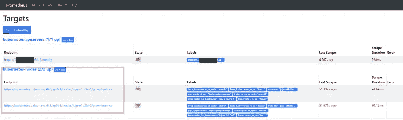
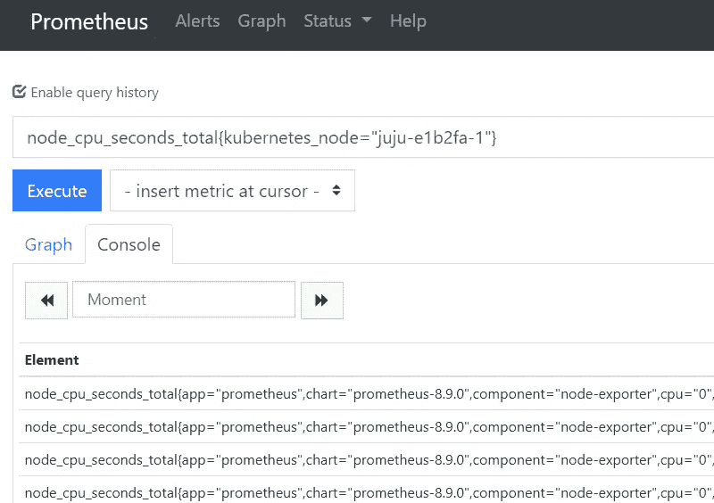
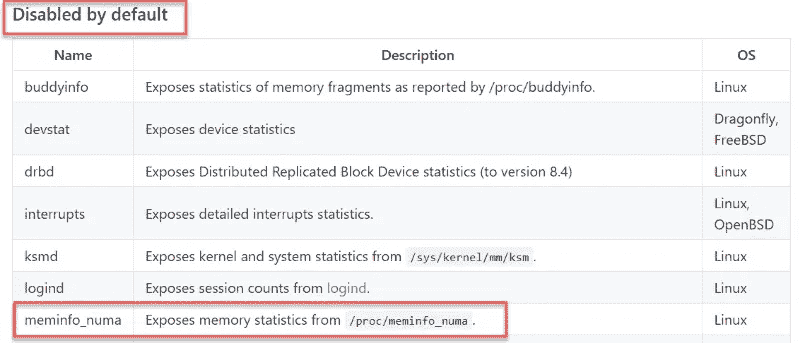
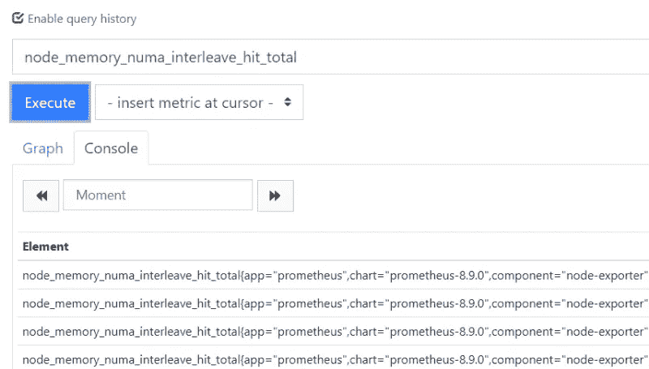
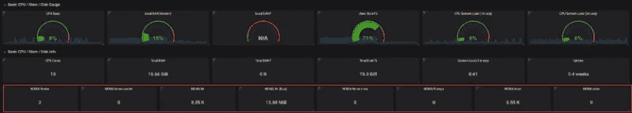
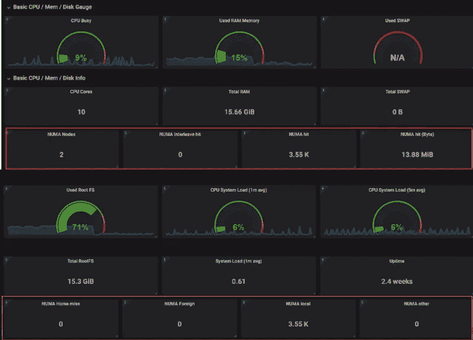

# 库伯内特—普罗米修斯收集 NUMA 信息

> 原文：<https://itnext.io/kubernetes-prometheus-collect-numa-information-c563acb4a564?source=collection_archive---------4----------------------->

我们博客的每一个读者都知道我们关心 NUMA 架构和优化。尽管架构本身很容易理解，但日常运营却很难优化 NUMA 平衡。

在纯 VMware vSphere 环境中跟踪当前的 NUMA 节点平衡已经很难了，但在顶层使用额外的 Kubernetes/Container 层对其进行监控会更加困难。

我们将在以后讨论更多的 NUMA 和其他关键的资源监控和优化，但是让我们从最简单的部分开始。如何使用流行的[普罗米修斯节点导出器](https://github.com/helm/charts/tree/master/stable/prometheus-node-exporter)获得 Kubernetes 节点的 NUMA 细节。

我们假设您已经在您的 [Kubernetes](https://kubernetes.io/) 环境中运行了 [Prometheus](https://prometheus.io) 节点导出器。如果没有，已经有很多很棒的博客文章和一些不错的掌舵图了。

以下是其中一个帖子:

[https://medium . com/devopslinks/trying-Prometheus-operator-with helm-minikube-b 617 a2 DCC fa 3](https://medium.com/devopslinks/trying-prometheus-operator-with-helm-minikube-b617a2dccfa3)

# 赫尔姆和达蒙塞特

典型的 helm charts 创建一个 daemonset，它在每个 Kubernetes 节点上部署节点导出器 pod。

这样，您就不需要在每次向群集中添加新节点时都考虑部署节点导出器 pod。好的方面是，每个出口商 pod 都有标签集，所以一旦 pod 启动并运行，Prometheus 就会自动收集指标。

# 检查普罗米修斯

如果节点已经被擦除，您可以很容易地检查您的 Prometheus 服务器:



只需访问 prometheus 服务器并检查 Kubernetes-nodes 是否被列为目标。

# 检查节点导出器指标

要检查收集的指标，只需键入 node_ 并选择一个指标。



但是当你开始搜索 NUMA 指标时，这个列表将保持空白(除非你已经做了这篇博客文章所要做的改变)。

# 启用 NUMA 收集器

当您通读官方文档时，您会注意到默认情况下没有收集一些指标。对于所有与 NUMA 相关的指标也是如此，这些指标通常可以在/proc/meminfo_numa 下找到。



要启用 NUMA 收集，您需要为 daemonset 中的节点导出器窗格设置一些参数。为了获得这些信息，让我们首先搜索 daemonset。

下一步是编辑要更改的 daemonset。

```
kubectl edit daemonset.apps/prometheus-node-exporter
```

在这里，您应该找到包含 args-add**—-collector . meminfo _ numa**的容器的 spec 部分，并保存文件。

```
spec: containers: - args: - --path.procfs=/host/proc - --path.sysfs=/host/sys - --collector.meminfo_numa
```

保存 daemonset 时，所有相关的 pod 将自动终止、删除并使用新的参数集创建。

等待几分钟，在普罗米修斯数据库中再次搜索 NUMA，您应该会看到一些指标。

node _ memory _ numa _ interleave _ hit _ total 就是一个例子。



完美—现在我们可以在仪表板上添加一些有意义的图表了。您既可以使用自己的 Grafana 实例，也可以使用我们内置的性能分析器产品(Kubernetes 集成仍然是测试版，但离最终发布只有几天了)。如果你想尝试一下，请联系我们。



1.  NUMA 节点
2.  NUMA 交错命中
3.  NUMA 命中(数字/字节)
4.  NUMA 家小姐
5.  NUMA 外国
6.  NUMA 本地
7.  NUMA 其他

如果您想更多地了解 Linux 上最重要的 NUMA 指标，这应该是一个不错的起点:

*   numa_hit:从进程需要的节点分配的页数。
*   numa_miss:从该节点分配的页数，但进程首选另一个节点。
*   numa_foreign:分配给另一个节点的页数，但流程首选此节点。
*   local_node:当进程在本地运行时，从该节点分配的页数。
*   other_node:当进程远程运行(在另一个节点上)时，从该节点分配的页数。
*   interleave_hit:使用交叉策略成功分配的页数。

[https://blog . tsun anet . net/2011/06/declarations-on-linuxs-numa-stats . html](https://blog.tsunanet.net/2011/06/clarifications-on-linuxs-numa-stats.html)

*原载于 2019 年 4 月 25 日*[*【https://www.opvizor.com*](https://www.opvizor.com/kubernetes-configure-prometheus-node-exporter-to-collect-numa-information)*。*