# 在 5 分钟内将 kubernetes+Rancher Cluster Manager 2.6 安装到装有 k3d/k3s 的 macOS 笔记本电脑上

> 原文：<https://itnext.io/kubernetes-rancher-cluster-manager-2-6-on-your-macos-laptop-with-k3d-k3s-in-5-min-8acdb94f3376?source=collection_archive---------0----------------------->

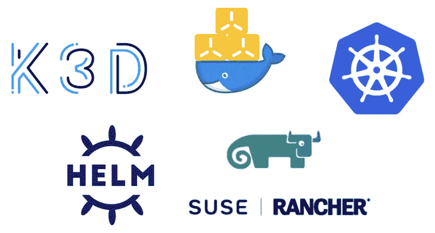

> **牧场主集群管理器 2.6.1** 于 10 月 19 日更新

本文展示了如何在您的 Macbook 上使用 k3d(由 k3s 支持)建立一个 Kubernetes 集群，使用崭新的 Rancher Cluster Manager 2.6 建立一个最小的 Kubernetes 本地实验室开发环境。

本文的目标是构建一个**本地实验室**来评估全新的 Rancher Cluster Manager 2.6，这样您就可以练习部署&使用一个*棒极了*的 web UI 来观察 Kubernetes 工作负载。

> 本设置是 ***不用于生产*** 。在生产中，您将有第二个 prod 集群，与部署 Rancher 的集群不同

## ***TL；博士安装 Docker &头盔，运行最后的要点即可，看这个 asci NEMA:***[https://asciinema.org/a/uao5iovk75B0Iggw6kPurAmCo](https://asciinema.org/a/uao5iovk75B0Iggw6kPurAmCo)

# 先决条件

你的 Macbook 只有两个先决条件:Docker & homebrew。

1.  大苏尔马科斯(11.6)
2.  带有 3 个 CPU 和 6 GB 内存的 Docker 台式机(4.0.1)
3.  自制([安装文档](https://docs.brew.sh/Installation))

> 如果你对 Windows 10 的操作方法感兴趣，请阅读以下内容:[https://it next . io/kubernetes-rancher-2-5-on-your-Windows-10-laptop-with-k3d-and-k3s-7404 f 288342 f](/kubernetes-rancher-2-5-on-your-windows-10-laptop-with-k3d-and-k3s-7404f288342f)

# 概观

先决条件:确保 Docker (6 GB mem)
0 中有足够的资源。用自制软件安装 k3d，kubectl 和 helm

1.  使用 k3d 启动单节点 Kubernetes 集群(使用 k3s 发行版)
2.  使用 helm 引导证书管理器，然后转移到集群
3.  使用 Rancher GUI 观察集群

# 先决条件:确保你有足够的资源

Kubernetes 和 Rancher 需要一些资源来运行所有的容器，以使我们作为开发人员的生活更加轻松。我本地的实验室有 8 个 CPU 和 16 GB 内存，我给了 Docker 3 个 CPU 和 6 GB 内存。

实验室，不是生产

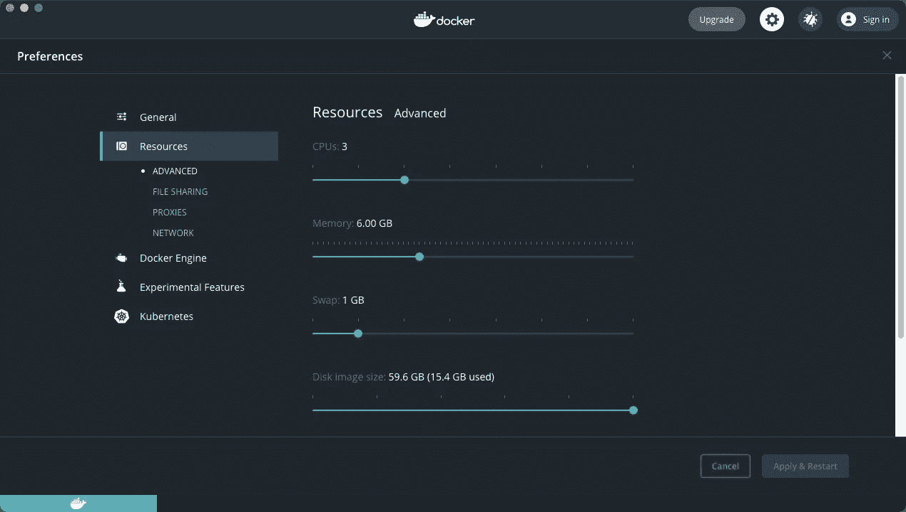

> 你不需要**而不是**更改你的`/etc/hosts`，因为我们会使用`.localhost` [DNS 魔法](https://en.wikipedia.org/wiki/.localhost)让你的浏览器自动将任何`.localhost`域名路由到`127.0.0.1`。

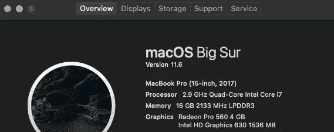

我的本地实验室有 8 个 CPU 和 16 GB 内存

# 0/3 用自制软件安装 k3d、kubectl 和 helm

我在桌面上创建了一个工作文件夹`k3s-rancher`来保存未来的 kubeconfig 文件。有经验的 k8 手会使用`kubectl config get-contexts`来确保他们在正确的集群上工作，但我将保持简单。

```
brew install k3d kubectl helm
```

运行`brew list k3d kubectl helm`后，如果你看到这样的屏幕，你就拥有了一切

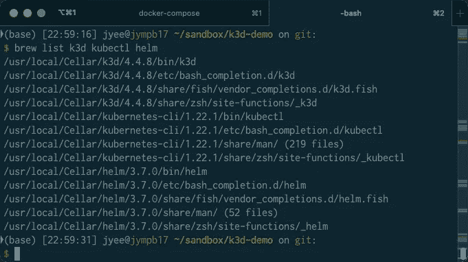

# 1/3 使用 k3d 启动单节点 Kubernetes 集群(使用 k3s 发行版)

[k3d](https://k3d.io/) 使得创建一个 K8s 集群变得容易，这个集群使用 [k3s](https://k3s.io/) 发行版，只有 Docker Desktop 作为依赖。k3s 是 K8s 的一个小发行版，可以在 Raspberry Pi 上运行——但它和任何 K8s 发行版一样得到了[认证，你可以在生产中运行它](https://thenewstack.io/how-rancher-labs-k3s-makes-it-easy-to-run-kubernetes-at-the-edge/)。

> 请注意，我指定了 k3s 映像 k3d 和 Rancher Desktop 0.4.1 在 2021 年 9 月中旬都出现了问题，这些版本将一起工作。在不久的将来，您可能不需要指定一个`--image`参数

```
k3d cluster create k3d-rancher \
    --api-port 6550 \
    --servers 1 \
    --image rancher/k3s:v1.20.10-k3s1 \
    --port 443:443@loadbalancer \
    --wait --verbose
```

输出日志将以如下方式结束:

```
...
INFO[0013] Successfully added host record to /etc/hosts in 2/2 nodes and to the CoreDNS ConfigMap                                                    INFO[0013] Cluster 'k3d-rancher' created successfully!                                                                                               INFO[0013] --kubeconfig-update-default=false --> sets --kubeconfig-switch-context=false                                                              DEBU[0013] Updating default kubeconfig with a new context for cluster k3d-rancher                                                                    DEBU[0013] Setting new current-context 'k3d-k3d-rancher'                                                                                             DEBU[0013] Wrote kubeconfig to '/Users/jyee/.kube/config'                                                                                            INFO[0013] You can now use it like this:                                                                                                             kubectl config use-context k3d-k3d-rancher                                                                                                           kubectl cluster-info $ k3d cluster list                                                                                                                                   NAME          SERVERS   AGENTS   LOADBALANCER                                                                                                        k3d-rancher   1/1       0/0      true
```

使用这些命令为新集群设置`kubectl`。你也可以使用`kubectl config use-context`，但是我发现这让很多初学者感到困惑(包括我！).

```
KUBECONFIG_FILE=~/.kube/k3d-rancher
k3d kubeconfig get k3d-rancher > $KUBECONFIG_FILE
chmod 600 $KUBECONFIG_FILE
export KUBECONFIG=$KUBECONFIG_FILE
kubectl get nodes
```

# 2/3 使用 helm 引导证书管理器，然后转移到集群

这些命令从`rancher-latest` repo 安装 Rancher 2.6 及其必备的证书管理器，遵循这些文档:[https://Rancher . com/docs/Rancher/v 2.6/en/installation/install-Rancher-on-k8s/](https://rancher.com/docs/rancher/v2.6/en/installation/install-rancher-on-k8s/)

```
### Install cert-manager with helm
helm repo add jetstack [https://charts.jetstack.io](https://charts.jetstack.io)
helm repo update
kubectl create namespace cert-manager
helm install cert-manager jetstack/cert-manager \
    --namespace cert-manager \
    --version v1.5.3 \
    --set installCRDs=true --wait --debug
kubectl -n cert-manager rollout status deploy/cert-manager
date### Install the helm repos for rancher
helm repo add rancher-latest [https://releases.rancher.com/server-charts/latest](https://releases.rancher.com/server-charts/latest)
helm repo update
kubectl create namespace cattle-system
helm install rancher rancher-latest/rancher \
    --namespace cattle-system \
    --version=2.6.1 \
    --set hostname=rancher.localhost \
    --set bootstrapPassword=congratsthanandayme \
    --wait --debug
kubectl -n cattle-system rollout status deploy/rancher
kubectl -n cattle-system get all,ing
date
```

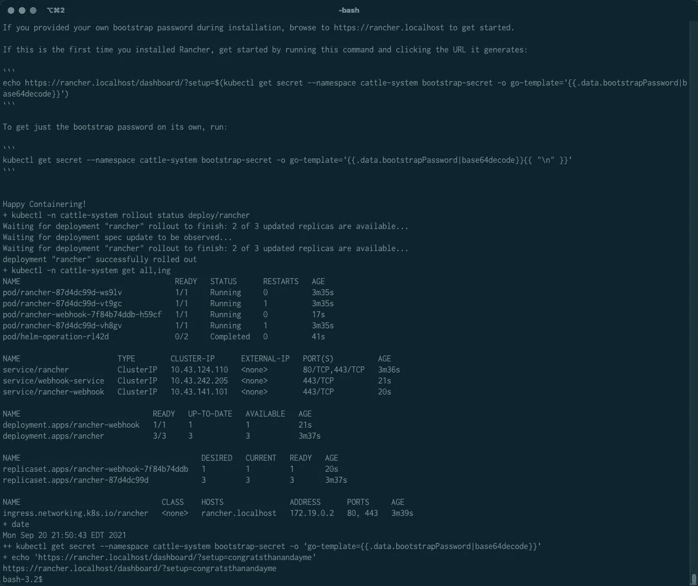

# 3/3 使用 Rancher GUI 观察集群

看到行`deployment "rancher" successfully rolled out`后，浏览到[https://rancher . localhost](https://rancher.localdev)。如果你看到这个屏幕，你不能手动接受风险，你可能不得不使用[*this is unsafe*](https://dev.to/brettimus/this-is-unsafe-and-a-bad-idea-5ej4)chrome 诡计。你可以通过点击红色的警告三角形并键入“thisisunsafe”(相信我！)

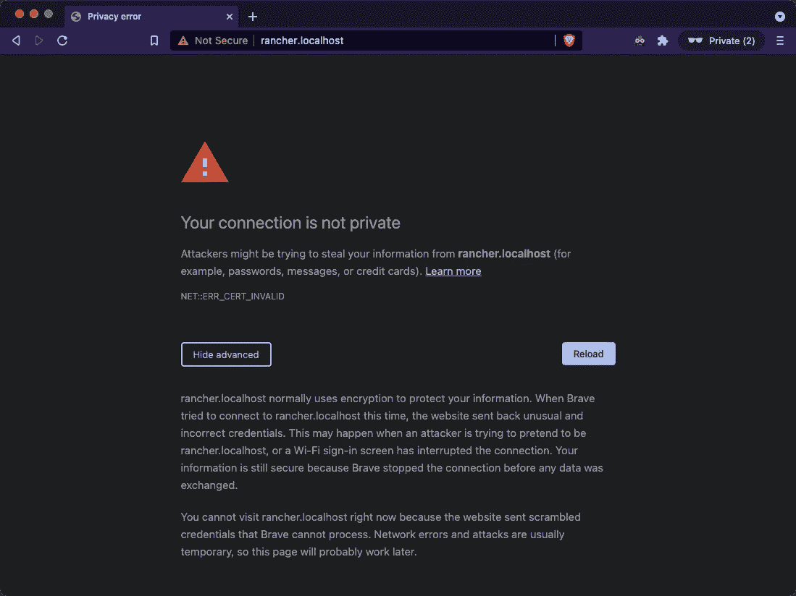

以管理员身份登录，使用安装 Rancher 时使用的引导密码，在本例中是`admin | congratsthanandayme`

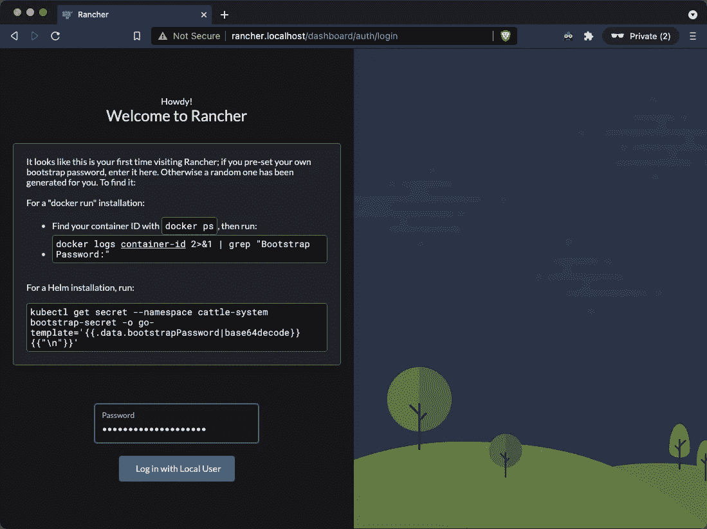

接受主机名并开始！

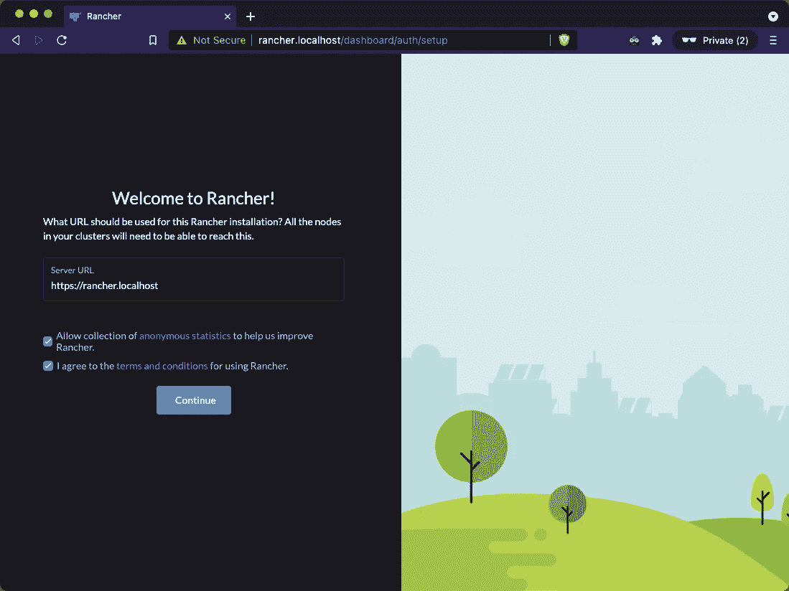

这是欢迎页面

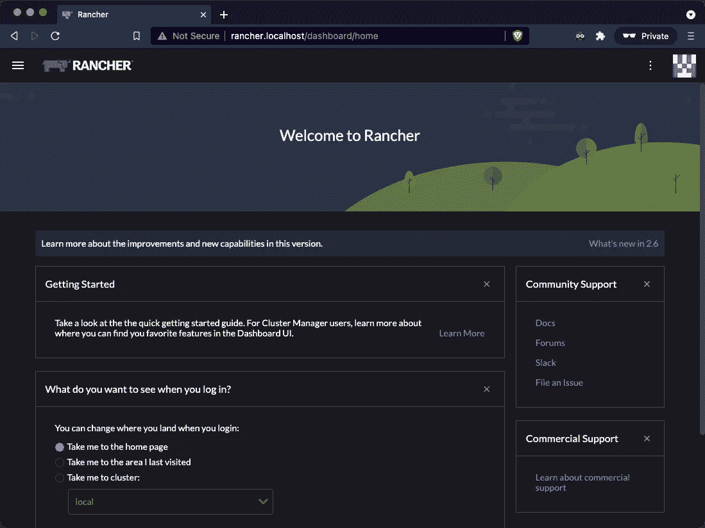

点击左上角的汉堡包，调出集群并选择`local`集群

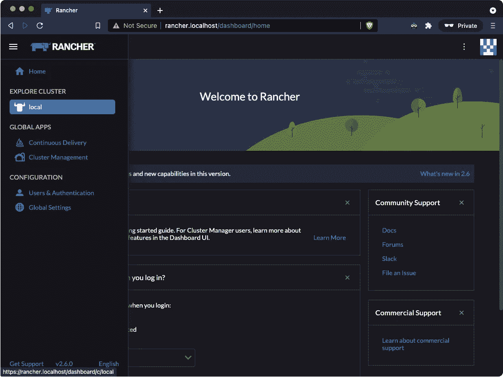

现在您可以看到在这个“空的”Kubernetes 集群上运行的所有资源、节点和部署的摘要屏幕。您还可以看到使用的 pod、核心和内存的数量。这种资源可观察性是使用 Kubernetes 的一个巨大优势，我再也不想回到 bash 了。

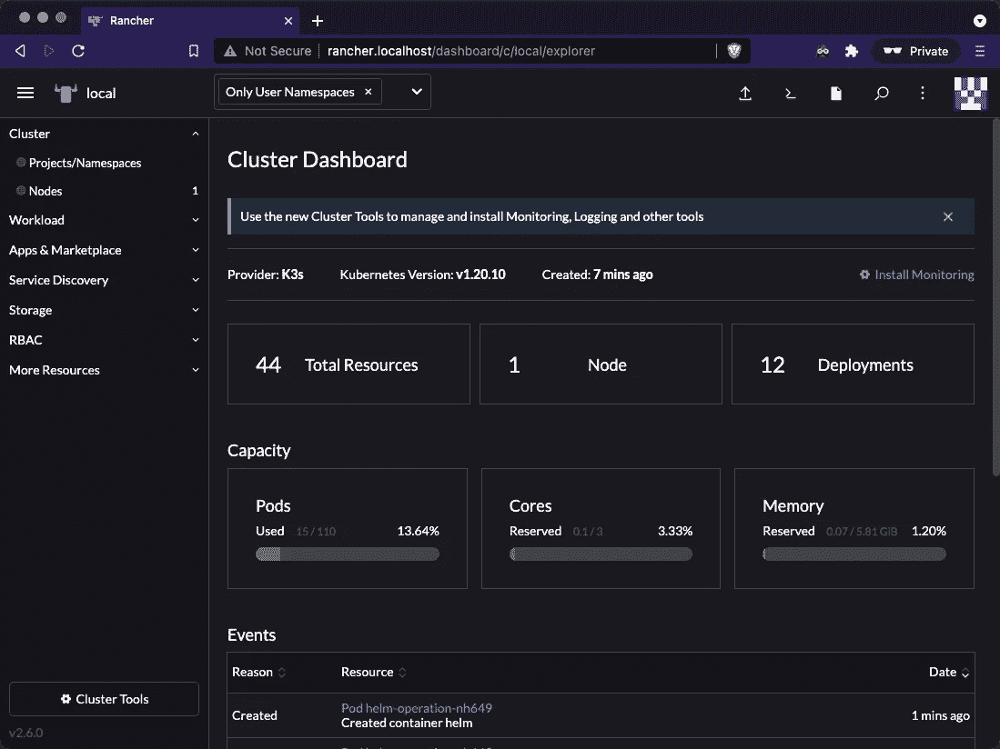

单击左上角的 Kubectl Shell 按钮，您将在浏览器中打开一个终端*，与您的集群和资源进行交互。在下面的例子中，我列出了所有的公共资源和入口。*

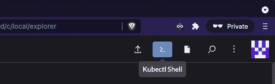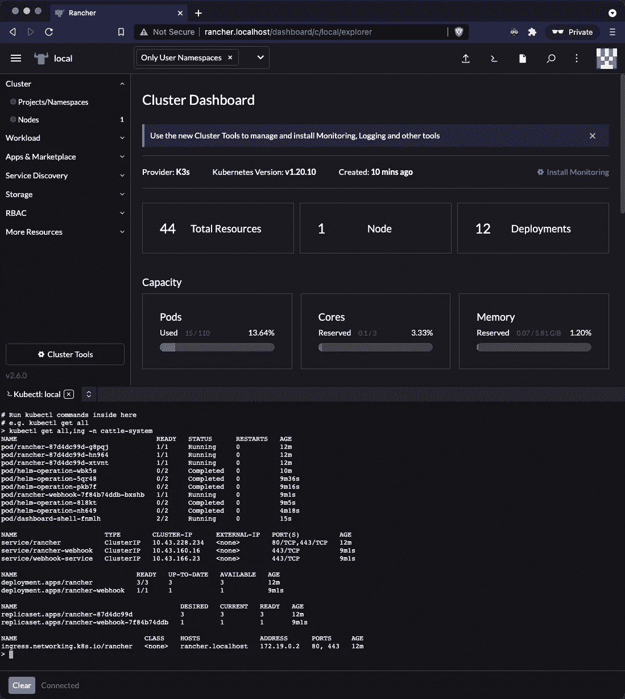

Rancher Cluster Manager 2.6 中有许多很棒的新特性，我将很快发布另一篇关于如何部署和公开简单工作负载的文章。

感谢 [Brandon Gulla](https://medium.com/u/ce902113ac3a?source=post_page-----7404f288342f--------------------------------) 向我介绍 k3d，感谢 [Thorsten K](https://medium.com/u/f4cb33e4a07f?source=post_page-----7404f288342f--------------------------------) 提供 k3d 演示，这将继续激励我，并希望有更多其他开发者！！

下面是安装牧场主脚本的要点(这里是 asci NEMA:[https://asciinema.org/a/uao5iovk75B0Iggw6kPurAmCo](https://asciinema.org/a/uao5iovk75B0Iggw6kPurAmCo))