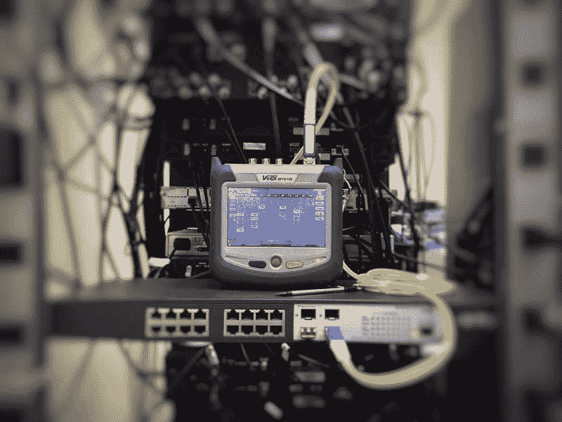

# Kubernetes 就绪性调查—示例和常见陷阱

> 原文：<https://itnext.io/kubernetes-readiness-probes-examples-common-pitfalls-136e3a9a058d?source=collection_archive---------2----------------------->

作者 Levent Ogut



Kubernetes 是部署我们的微服务和应用的绝佳平台。其中一个出色的特性是，当 pods 不能正常工作时，它会被重启或从服务中删除。Kubernetes 需要我们的帮助来了解一个 pod 是否在工作。这是通过容器探测器配置的。

任何应用程序都可能由于错误、缺少对外部资源的依赖等原因而处于不健康状态。为了确保我们的流量正确流动，我们需要确保配置了探测器。

探针是 kubelet 对健康检查的回答，有三个处理程序:

*   [**ExecAction**](https://kubernetes.io/docs/reference/generated/kubernetes-api/v1.19/#execaction-v1-core) :命令执行检查，如果命令的退出状态为 0，则认为成功。
*   **TCPSocketAction** : TCP 检查确定端口是否打开，如果打开，则认为成功。
*   **HTTPGetAction** : HTTP 检查确定状态码是否等于或大于 200 且小于 400。

每种类型的探测器都有通用的可配置字段:

*   **initialDelaySeconds** :容器启动后`initialDelaySeconds`后探头开始运行(默认值:0)
*   **周期秒**:探头运行的频率(默认值:10)
*   **超时秒数**:探头超时(默认值:1)
*   **成功阈值**:标记容器健康/就绪所需的成功探测次数(默认值:1)
*   **失败尿道阈值**:当探针失败时，它将尝试`failureThreshold`次，然后才认为不健康/未准备好(默认值:3)

这些参数需要根据您的应用规范进行配置。

Exec action 只有一个字段，就是检查命令的`command.`退出状态，状态为零(0)表示健康，其他值表示不健康。

```
 readinessProbe:
          initialDelaySeconds: 1
          periodSeconds: 5
          timeoutSeconds: 1
          successThreshold: 1
          failureThreshold: 1
          exec:
            command:
            - cat
            - /etc/nginx/nginx.conf
```

我们需要定义`host`和`port`参数，`host`参数默认为集群内部的 pod IP。

```
 readinessProbe:
          initialDelaySeconds: 1
          periodSeconds: 5
          timeoutSeconds: 1
          successThreshold: 1
          failureThreshold: 1
          tcpSocket:
            host:
            port: 80
```

HTTP 探测器有额外的选项可以配置。

*   **主机**:要连接的主机/IP(默认:pod IP)
*   **方案**:发出请求时使用的方案(默认:HTTP)
*   **路径**:路径
*   **httpHeaders** :定义为头/值映射的头数组
*   **端口**:要连接的端口

提示:如果需要设置 HTTP 的主机头，请在 httpHeaders 上这样做，而不是 Host 参数。

```
 readinessProbe:
          initialDelaySeconds: 1
          periodSeconds: 2
          timeoutSeconds: 1
          successThreshold: 1
          failureThreshold: 1
          httpGet:
            host:
            scheme: HTTP
            path: /
            httpHeaders:
            - name: Host
              value: myapplication1.com
            port: 80
          initialDelaySeconds: 5
          periodSeconds: 5
```

# Kubernetes 的就绪性调查

Kubernetes 运行就绪探测，以了解何时可以向 pod 发送流量，即将 pod 转换到`Ready`状态。例如，如果一个 pod 被用作服务的后端端点，则就绪性探测将确定该 pod 是否会接收流量。在 pod 的整个生命周期中执行就绪探测；这意味着就绪探测在到达`Ready`状态后继续执行。此外，我们的应用程序可以通过用不同的值响应探测器，使自己不可用于维护或一些后台任务。

pod 会转换以下状态:

*   **PodScheduled** : Pod 被调度在一个可用的节点上
*   **集装箱就绪**:所有集装箱处于`Ready`状态
*   **初始化**:所有初始化容器都被启动
*   **就绪** : Pod 准备接收流量(就绪探测)

# 就绪性探测的常见陷阱

就绪探测器在容器的生命周期内检查配置的动作；因此，回答中的任何中断或延迟都可能导致服务中断。有时，应用程序需要读取大量数据，遇到延迟问题或进行昂贵的计算，这可能会阻止提供这样的答案。在配置就绪探测器时，应该考虑这种行为。强烈建议在使用就绪探测器之前进行彻底的测试。

# 连锁故障

考虑到这一点，我们已经用 HTTPGet 配置了一个就绪探测器，我们的应用程序在应答探测器之前检查数据库连接。让我们假设有一个数据库问题；在这种情况下，除非数据库恢复，否则所有 pod 都将无法访问。我们想要这种行为吗？当然不是，我们可以将数据库错误反馈到前端，并通知用户不可用；即使我们增加`failureThreshold`，我们也可能无法避免连锁故障。在任何情况下，我都建议避免对就绪性探测答案的外部依赖。

# 外部依赖性

让我们假设您有一个用于缓存的键/值存储，并且您的就绪探测端点也检查这个连接。应用程序能够在没有键/值存储的情况下运行，因为它只会降低速度，但它会在每次需要访问数据时运行完整的数据库查询。在这种情况下，如果准备就绪探测因为键/值存储不可用而失败，那么您的整个应用程序将停机一段时间——直到您修复了键/值存储，这当然是不希望的。

您需要清楚地设计您的探测器，考虑您的应用程序在出现故障时的行为和响应。您可能希望重启 pod(通过活性检查)或使用就绪探测器将其从服务中移除。

# 示例:Nginx 部署示例

为了查看就绪探测器的运行情况，我们可以配置一个示例应用程序，在本例中是一个简单的 NGINX web 服务器。这里我们定义了一个简单的部署配置:

```
apiVersion: apps/v1
kind: Deployment
metadata:
  name: k8s-probes
  labels:
    app: nginx
spec:
  replicas: 1
  selector:
    matchLabels:
      app: nginx
  template:
    metadata:
      labels:
        app: nginx
    spec:
      containers:
      - name: nginx
        image: nginx
        ports:
        - containerPort: 80
        readinessProbe:
          initialDelaySeconds: 1
          periodSeconds: 2
          timeoutSeconds: 1
          successThreshold: 1
          failureThreshold: 1
          httpGet:
            host:
            scheme: HTTP
            path: /
            httpHeaders:
            - name: Host
              value: myapplication1.com
            port: 80
```

将该配置保存到一个名为 k8s-probes-deployment.yaml 的文件中，并使用`kubectl apply -f k8s-probes-deployment.yaml`应用它。

```
apiVersion: v1
kind: Service
metadata:
  labels:
    app: nginx
  name: nginx
  namespace: default
spec:
  ports:
  - name: nginx-http-port
    port: 80
  selector:
    app: nginx
  sessionAffinity: None
  type: NodePort
```

将这个配置保存到一个名为 k8s-probes-svc.yaml 的文件中，并使用`kubectl apply -f k8s-probes-svc.yaml`应用它。

就绪探测没有单独的端点，但是我们可以使用`kubectl describe pods <POD_NAME>`命令访问事件，例如，获取当前状态。

使用`kubectl get pods`命令查看 pod 的状态。

```
kubectl get pods
```

pod 及其状态和就绪状态将会显示出来，我们的 pod 正在按预期运行。

```
NAME                          READY   STATUS    RESTARTS   AGE
k8s-probes-7d57f897dd-td2q2   1/1     Running   0          1m23s
```

与`kubectl describe pod <POD_NAME>`

```
kubectl describe pod k8s-probes-755b4bf57c-jgcqw
```

在输出的底部会显示`Events`:

```
Events:
  Type    Reason     Age   From               Message
  ----    ------     ----  ----               -------
  Normal  Scheduled  15m   default-scheduler  Successfully assigned default/k8s-probes-755b4bf57c-jgcqw to k8s-probes
  Normal  Pulling    15m   kubelet            Pulling image "nginx"
  Normal  Pulled     15m   kubelet            Successfully pulled image "nginx" in 1.418647753s
  Normal  Created    15m   kubelet            Created container nginx
  Normal  Started    15m   kubelet            Started container nginx
```

让我们用`kubectl get endpoints`命令来看看端点。

```
kubectl get endpoints
```

我们可以看到 Nginx 服务有一个端点。

```
NAME         ENDPOINTS           AGE
kubernetes   10.132.0.42:16443   8h
nginx        10.1.85.203:80      6m11s
```

要查看更多细节，我们可以使用`kubectl describe endpoints nginx`命令。

```
Name:         nginx
Namespace:    default
Labels:       app=nginx
Annotations:  endpoints.kubernetes.io/last-change-trigger-time: 2020-11-13T20:34:13Z
Subsets:
  Addresses:          10.1.85.203
  NotReadyAddresses:  <none>
  Ports:
    Name             Port  Protocol
    ----             ----  --------
    nginx-http-port  80    TCP
```

将就绪探针的`port`参数配置为 81，并应用配置。

让我们再次检查 pod 状态

```
kubectl get pods
```

默认情况下，我们已经更新了部署，因此创建了一个新的 pod，正如您所看到的，它没有处于就绪状态。

```
NAME                          READY   STATUS    RESTARTS   AGE
k8s-probes-755b4bf57c-jgcqw   1/1     Running   0          13m
k8s-probes-7d57f897dd-td2q2   0/1     Running   0          2m49s
```

这里的状态是正在运行，但是`READY`状态确定我们的 pod 尚未准备好。让我们用`kubectl describe pods <POD_NAME>`命令来研究状态和事件。

```
kubectl describe pod k8s-probes-7d57f897dd-td2q2
```

我们可以看到，由于连接被拒绝，就绪探测失败，因此 pod 不会接收任何流量。

```
Events:
  Type     Reason     Age                From               Message
  ----     ------     ----               ----               -------
  Normal   Scheduled  58s                default-scheduler  Successfully assigned default/k8s-probes-7d57f897dd-td2q2 to k8s-probes
  Normal   Pulling    57s                kubelet            Pulling image "nginx"
  Normal   Pulled     56s                kubelet            Successfully pulled image "nginx" in 1.211289526s
  Normal   Created    56s                kubelet            Created container nginx
  Normal   Started    56s                kubelet            Started container nginx
  Warning  Unhealthy  4s (x10 over 49s)  kubelet            Readiness probe failed: Get "http://10.1.85.202:81/": dial tcp 10.1.85.202:81: connect: connection refused
```

让我们直接检查状态:

```
kubectl get pods k8s-probes-7d57f897dd-td2q2 -o jsonpath='{.status.containerStatuses[0].state}'
```

状态是“正在运行”。

```
{"running":{"startedAt":"2020-11-17T11:47:21Z"}}
```

让我们来看看就绪状态:

```
kubectl get pods k8s-probes-7d57f897dd-td2q2 -o jsonpath='{.status.containerStatuses[0].ready}'
```

如你所见，集装箱还没准备好。

让我们再来看看端点:

```
kubectl get endpoints
```

列出了服务和相关端点:

```
NAME         ENDPOINTS           AGE
kubernetes   10.132.0.42:16443   8h
nginx                            11m
```

这里我们可以看到，我们的 Nginx 服务没有任何端点，因为容器还没有准备好接受流量。

# 结论

我们已经看到了就绪探测的效果，并研究了我们可以配置的参数。虽然我们进行了 HTTP 检查，但是这里显示的概念也适用于其他检查。您需要了解您的应用程序的体系结构和依赖性，以便能够配置和操作就绪探测器。了解您的应用程序是至关重要的，因为配置不当的就绪性探测器可能会导致您的应用程序不可用。请不要忘记，准备就绪探测将在容器的整个生命周期中运行。

# 进一步阅读

*   [Kubernetes 核心探测文件](https://kubernetes.io/docs/reference/generated/kubernetes-api/v1.19/#probe-v1-core)
*   [配置活跃度、就绪和启动探测器](https://kubernetes.io/docs/tasks/configure-pod-container/configure-liveness-readiness-startup-probes/)
*   [Kubernetes 集装箱探测器文档](https://kubernetes.io/docs/concepts/workloads/pods/pod-lifecycle/#container-probes)
*   [容器生命周期挂钩文档](https://kubernetes.io/docs/concepts/containers/container-lifecycle-hooks/)

[Ildefonso Polo](https://unsplash.com/@i_m_polo?utm_source=unsplash&utm_medium=referral&utm_content=creditCopyText) 在 [Unsplash](https://unsplash.com/s/photos/telecommunications?utm_source=unsplash&utm_medium=referral&utm_content=creditCopyText) 上拍摄的照片

*原发布于*[*https://loft . sh*](https://loft.sh/blog/kubernetes-readiness-probes-examples-common-pitfalls/)*。*