# Kubernetes 在生产中的资源使用和管理

> 原文：<https://itnext.io/kubernetes-resource-management-in-production-d5382c904ed1?source=collection_archive---------0----------------------->

## 请求、限制、超量承诺、闲置/浪费、节流


https://unsplash.com/photos/QwoNAhbmLLo

在我们将 Kubernetes 应用程序投入生产之前，我们应该了解 K8s 资源管理。**核心是理解 Kubernetes 调度程序如何处理资源请求和限制**，然后其他一切都有意义了。所以，让我们开始吧！

## 读完这篇文章后，你将会:

*   理解要求和限制
*   了解 k8s 调度程序如何处理资源
*   有关于如何提高集群使用率和稳定性的想法吗

## TL；速度三角形定位法(dead reckoning)

*   设置内存请求=限制
*   不设置 CPU 限制或禁用 kubelet 中的 CPU 限制实施
*   使用率应低于请求数
*   使用 HPA / VPA 缩放
*   监控/提醒 pod 资源使用情况

# 豆荚资源

在 k8s 中，一个 pod 可以有一个或多个容器，通常由 Docker 运行。

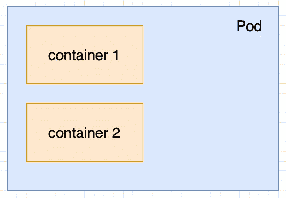

pod 可以被看作是紧密协作的容器的包装器，这就是为什么它们应该运行在同一台机器(节点)上。这意味着总的 pod 资源是其所有容器资源的总和。

## 资源请求和限制

将为每个容器指定资源请求和限制，例如:

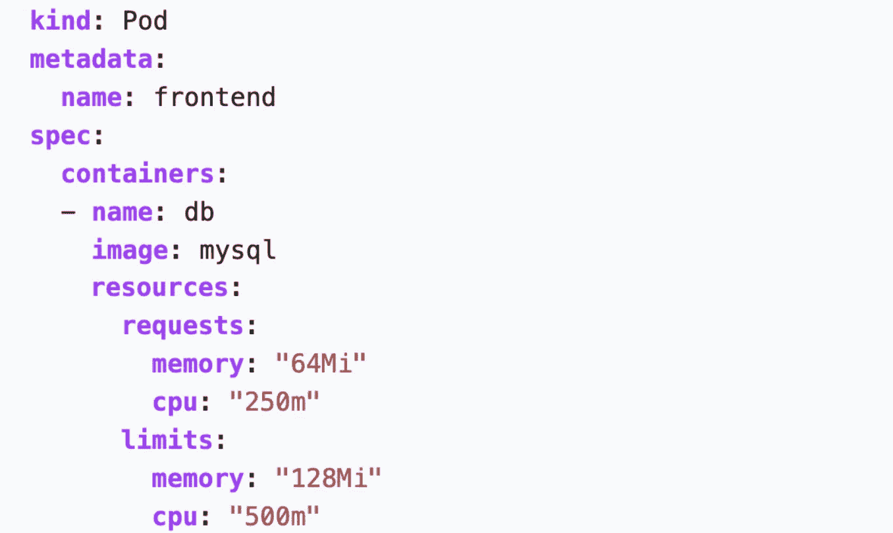

**请求**是保证和保留的资源。没有其他豆荚可以使用这些。

**限制**是允许使用比请求更多的资源。如果一个容器达到其指定的限制，它将被限制 CPU 和驱逐内存。

# 调度程序

k8s 调度程序负责决定哪个 pod 可以在哪个节点上运行。它通过查看各种配置(如亲和力、污点、容忍度)来做到这一点，但我们将只查看主要的一个:自由资源。

当调度器做出关于“空闲资源”的决定时，它只查看两个数字:**节点可分配**和**资源请求**。

## 节点可分配性与容量

调度程序查看节点可分配性，它只是整个节点容量减去硬定义的(在 kubelet 中)数量或百分比，即“系统预留”。

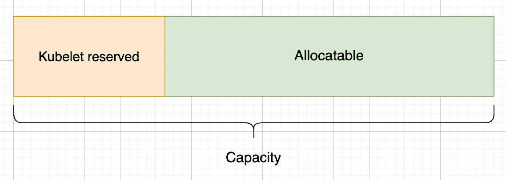

我们可以简单地通过查看像`kubectl get node worker1 -oyaml`这样的节点来查看可分配的容量。重要的是，无论节点上运行多少 pod，这些数字都不会改变。只要节点通过 kubelet 注册，它们就是固定的。

## 根据调度程序释放资源

`free = node allocatable — sum(all pod resource requests)`

这意味着调度程序实际上永远不会直接查看节点或 pods 的 CPU/内存使用情况，而只会考虑所请求的内容。

# 调度程序正在运行

让我们来看一个调度决策工作流的例子，它有两个节点，在开始时完全是空的。

([图像来源](https://www.youtube.com/watch?v=eBChCFD9hfs&t=2167s)

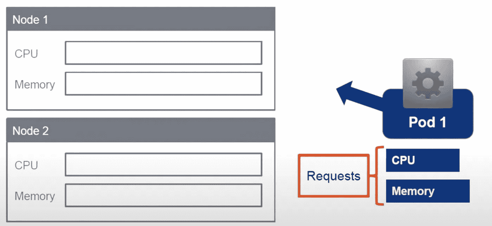

蓝色 pod 有资源请求，在节点 1 上进行计划

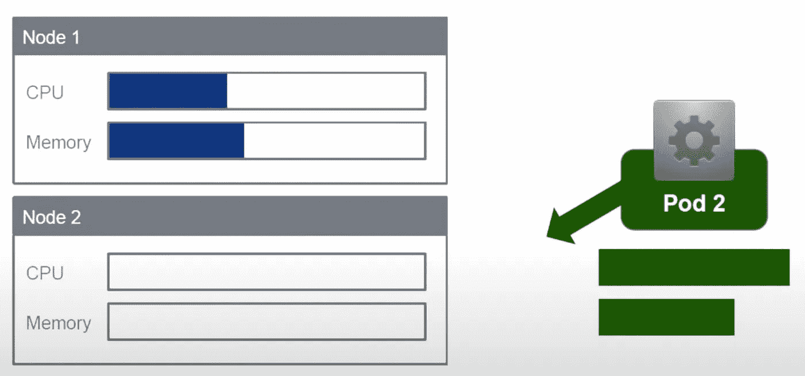

绿色单元被安排在节点 2 上

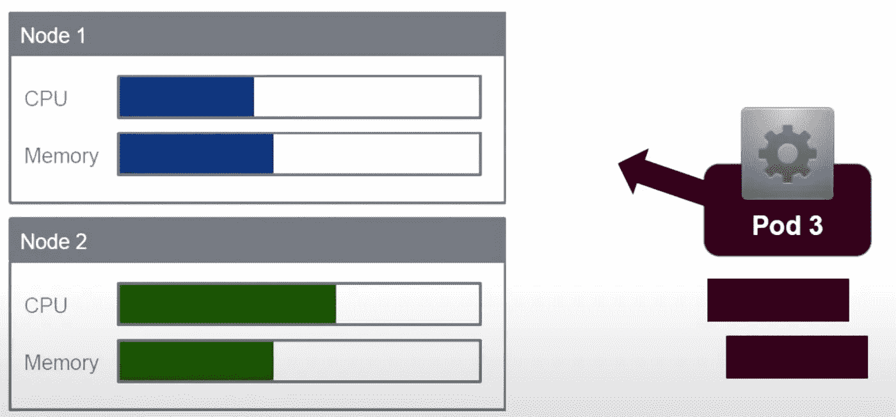

紫色 pod 被安排在节点 1 上

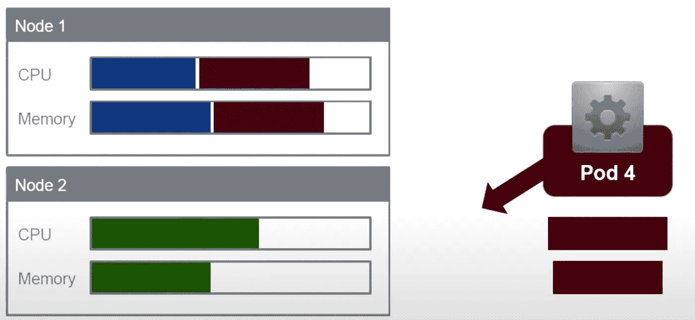

调度程序尝试在节点 2 上调度红色 pod

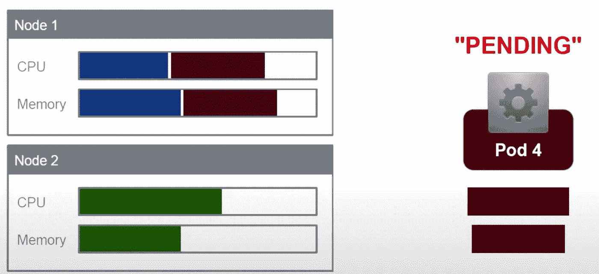

…但是没有更多的资源可用，所以它仍处于挂起状态

现在让我们看看上面的图片，其中节点 1 有两个 pod，节点 2 有一个 pod 在运行。节点上显示的所有颜色代表资源**请求**，由于调度程序忽略了这些限制，所以看不到限制。因此，我们现在可以理解懈怠和过度承诺。

# K8s 中的松弛和超量承诺

下图显示了可视化松弛和超量承诺的示例指标。

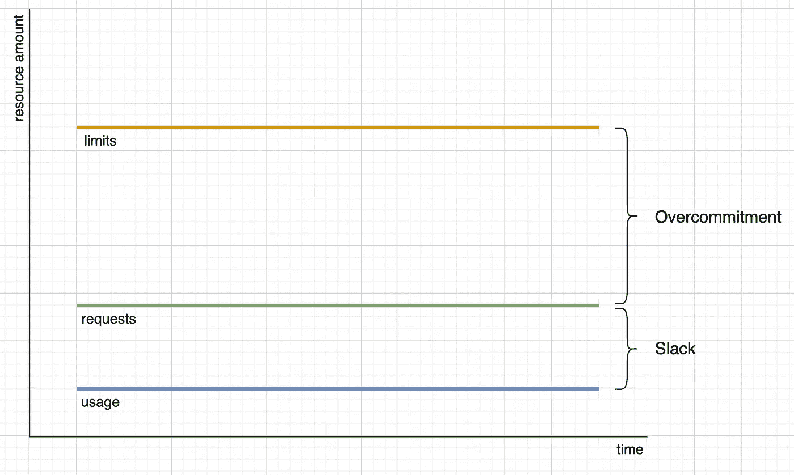

接下来，我们将更详细地讨论这个示例指标和其他指标。但首先，我们将更深入地探究懈怠和过度承诺，以彻底理解它们。

# 松弛的

浪费的资源称为时差。k8s 中的 Slack 描述了被请求但未被使用的资源。让我们看看下面的例子:

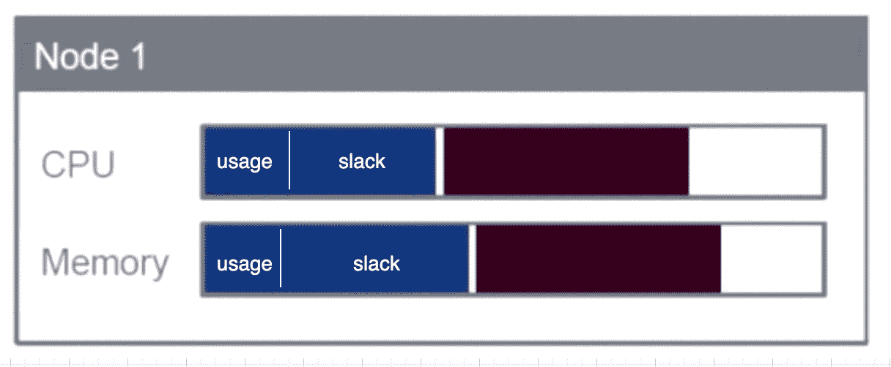

这里我们看到在节点 1 上安排了两个 pod。蓝色部分显示了 pod1 的资源请求。但是 pod1 实际上只使用了它所请求的大约 1/3，这意味着其余部分是空闲的。

为什么？因为 k8s 调度器不查看实际的使用情况，它只查看指定的请求值。

# 过度承诺

过量使用意味着如果所有单元都开始使用所有可能的资源，我们将在一个节点上安排更多的单元。这只有在不是所有的豆荚同时消耗所有它们能消耗的资源时才有效，所以这是一场赌博。让我们来看一个例子:

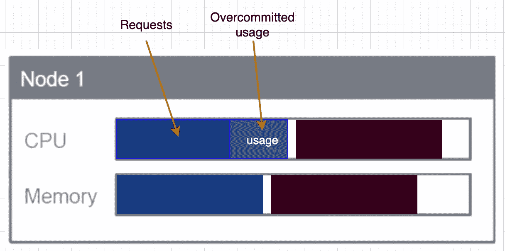

这里我们看到蓝色 pod 的 CPU 使用率实际上超过了请求，这意味着它使用了过量的资源。这是可能的，因为我们指定的限制高于请求。

现在我们可以认为这一切都还好，对吗？但是 k8s 调度程序将只查看请求，它可能认为在没有空闲资源的情况下仍然有足够的空闲资源，并在该节点上调度新的 pods。

## CPU 过量使用扑克

只要超额使用不超过节点的容量，CPU 超额使用就不会出现问题。让我们来看看这样一个场景:

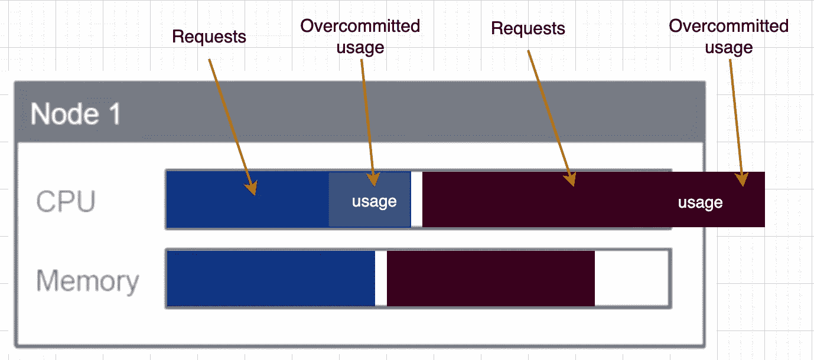

实际使用量超过容量:导致 CPU 节流

在这种情况下，节点上的两个 pod 都将被抑制。每个 pod 都可以被调节到它所请求的值，因为只有这个值是有保证的。因此，CPU 过量使用可能并不太糟糕，它只会导致节流。

但是即使在这种情况下，k8s 调度器可能仍然认为 node1 有足够的“空闲 CPU”用于另一个 pod，因为:它只查看请求。

## 内存过量使用扑克

对于内存来说，这有点不同，因为内存不能像 CPU 一样被节流。它不是一个基于时间的值，但它包含不能简单地收缩或扩展的实际数据。

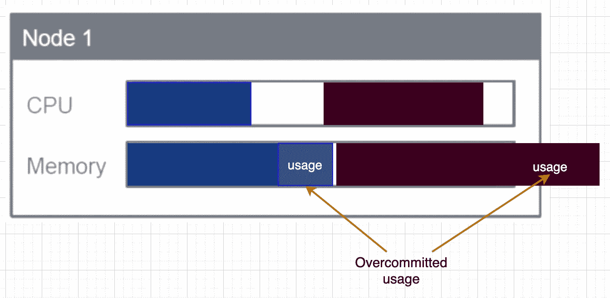

实际使用量超过容量:导致 pod 驱逐、终止或 OOM 异常

kubelet 是一个在 VM 上运行的进程，它通过与 k8s API 通信将 VM 注册为一个节点。在这之后，它从 API 接收 pod 规范来运行。

kubelet 有一些处理 OOM 情况的机制，如上图所示。它可以注意到它的 pod 是否开始使用比请求更多的内存，以及它是否会很快用完。如果是这样，它就可以根据优先级驱逐 pod。它还可以给自己条件`MemoryPressure`，调度器将考虑该条件(更多关于进一步向下的节点压力)。

**但是！不能保证 kubelet 有足够的时间注意到这一点并驱逐 pod。可能发生的情况是，节点本身遇到内存不足的问题，操作系统本身开始杀死随机进程([源](https://kubernetes.io/docs/tasks/administer-cluster/out-of-resource/#node-oom-behavior))。**

这就是为什么建议永远不要允许内存过量使用，所以总是设置`requests=limits`。

## 基于优先级的 Kubelet pod 驱逐

kubelet 考虑 QoS ( [服务质量](https://kubernetes.io/docs/tasks/configure-pod-container/quality-service-pod/))和[优先级](https://kubernetes.io/docs/concepts/configuration/pod-priority-preemption/)来决定驱逐哪些 pod 以释放资源。

> 唯一同时考虑 QoS 和 Pod 优先级的组件是 [kubelet 资源不足驱逐](https://kubernetes.io/docs/tasks/administer-cluster/out-of-resource/)。kubelet 首先根据 pod 对饥饿资源的使用是否超过请求，然后根据优先级，最后根据相对于 pod 的调度请求的饥饿计算资源的消耗，对要驱逐的 pod 进行排序。([来源](https://kubernetes.io/docs/concepts/configuration/pod-priority-preemption/#interactions-of-pod-priority-and-qos))

# CPU 限制导致不必要的 CPU 节流


这可以成为你最大的 k8s 兔洞之一，一定要小心；)关于这个有一个公开的 [Github 问题](https://github.com/kubernetes/kubernetes/issues/67577)。

**简而言之:**如果我们为一个 pod 设置任何 CPU 限制，它可能会受到抑制，即使使用量没有接近限制。比如，如果一个 pod 使用限制为`1000 millicpu`的`200 millicpu`，它可能仍然会受到限制，导致延迟/性能问题。

Youtube 上有一个来自 Zalando 的 Henning Jacobs 关于这个的非常棒的[演讲，我建议观看。](https://www.youtube.com/watch?v=eBChCFD9hfs)

**因此，建议不定义 CPU 限制**或通过`--cpu-cfs-quota=false`禁用 kubelet 中的 CPU 限制。但是在使用托管云集群时，后者可能是不可能的。

## 那么如何防止一个 pod 使用过多的 CPU 呢？

*   监控 pod 的使用情况，并在使用量超过请求量时发出警报。如果有，请提出要求
*   通过 HPA/VPA 实施扩展

[我对使用 Prometheus](/k8s-monitor-pod-cpu-and-memory-usage-with-prometheus-28eec6d84729) 监控 pod 资源使用情况的介绍。

# 设定适当的要求和限制

让我们看几个场景，讨论这些场景是好是坏。**这些只是一般观察，对于特定的使用情形可能会有所不同！**

## 常见场景#1

我们有很高的松弛度，我们允许过度承诺，这并不好。

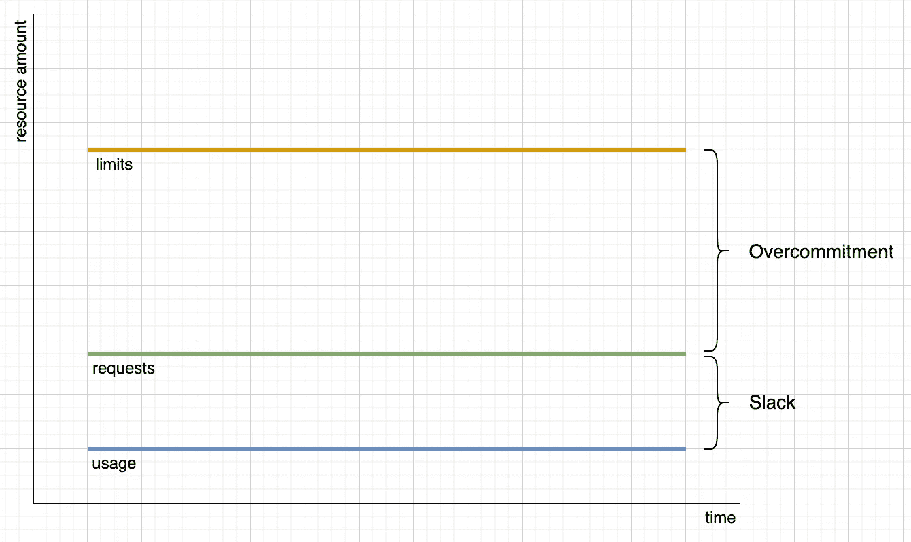

## 常见场景#2

我们没有懈怠，但我们实际上利用了过量的资源，这并不好。

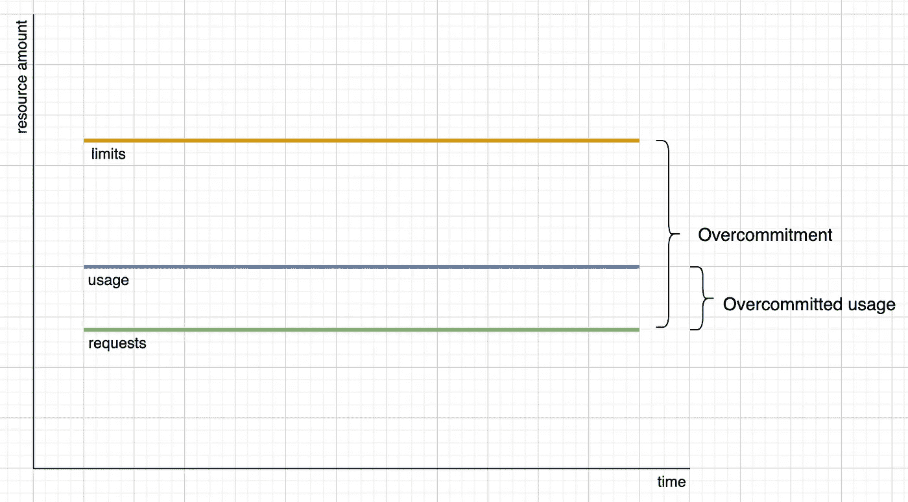

## 接近最佳方案

我们为内存设置了`requests=limits`。对于 CPU，如果我们在 Kubelets 中禁用了限制强制(`cpuCfsQuota=false`)，我们可以做同样的事情。否则我们不会为 CPU 定义任何限制。

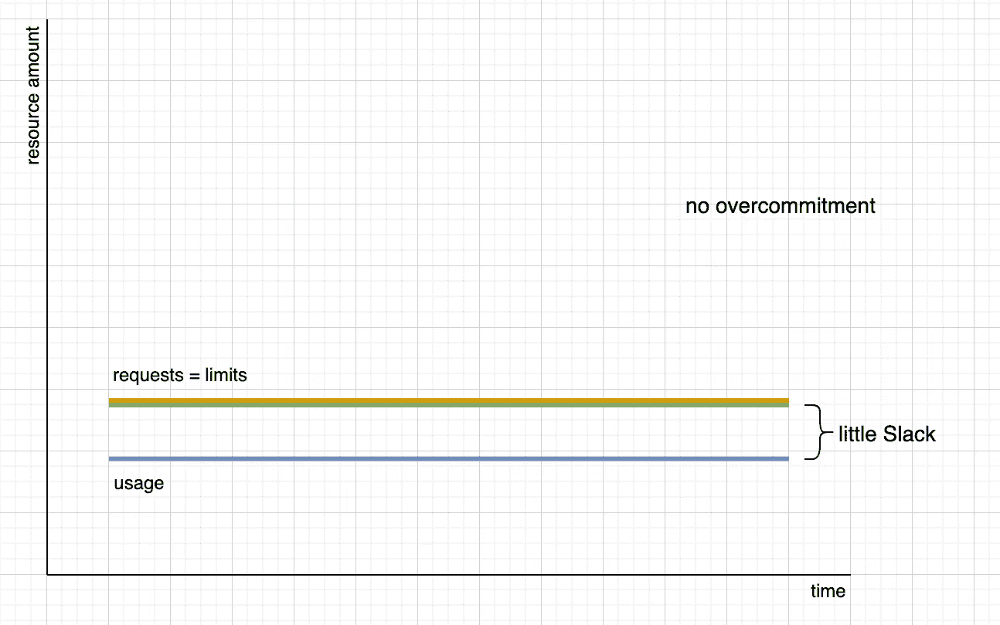

对于 CPU，根本不要设置限制或禁用限制实施

## 更现实的场景

这种用法可能永远不会是好的和稳定的，而是波动的。在这种情况下，我们仍然应该注意使用率总是低于我们的要求。是的，为了可预测性和稳定性，这将导致更高的松弛度。

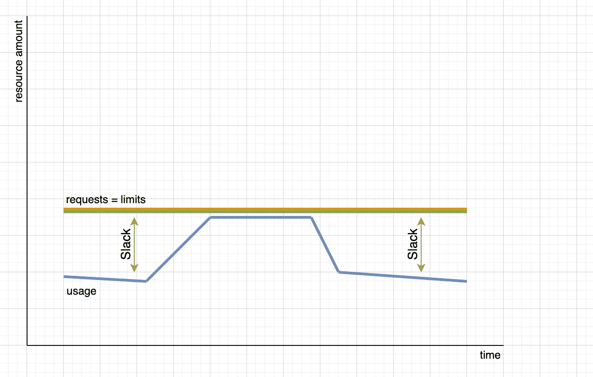

对于 CPU，根本不要设置限制或禁用限制实施

## 通过缩放减少松弛

为了拉平使用曲线并使其低于要求，我们可以使用 HPA 之类的扩展。一旦它注意到使用朝着请求/限制上升，它将创建更多的实例来分散负载。

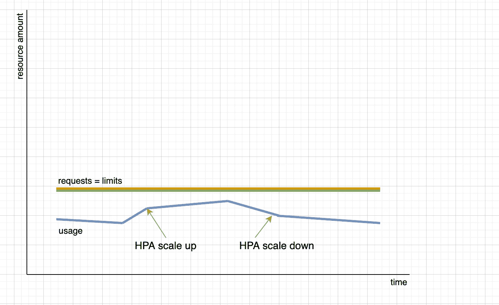

对于 CPU，根本不要设置限制或禁用限制实施

上图显示了一个单元的资源使用情况。如果创建更多副本，所有 pod 使用的资源总量将会上升。有了 HPA，单个 pod 的使用曲线可以变平，因此可以更高效地进行调度。

## Pod 在初始化期间使用更多资源

这是一个棘手的问题。如果你有好的解决方案，请在评论中告诉我们。

如果一个 pod 在初始化期间使用了更多的资源，那么将请求设置为较高的初始化使用率将在所有进一步的运行时间中导致较高的松弛度。因此，在这种情况下，允许 CPU 过载是可以的，但不允许内存过载。

有人可能认为应该可以将 init-logic 移动到一个在实际应用程序容器之前运行的 [initContainer](https://kubernetes.io/docs/concepts/workloads/pods/init-containers) 中，如下所示:

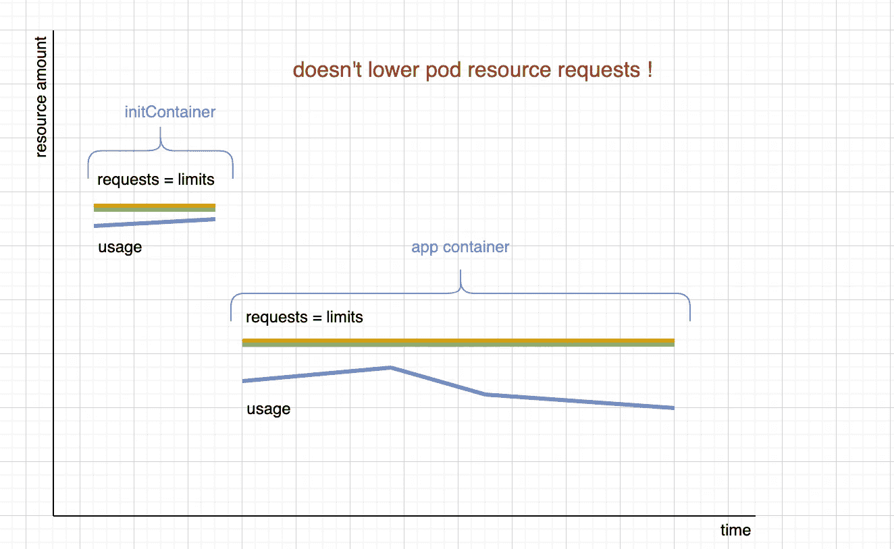

总的 pod 资源请求将是初始容器资源请求

但是这实际上并没有降低总的 pod 资源请求，因为调度程序是这样计算总的 pod 资源请求的( [source1](https://kubernetes.io/docs/concepts/workloads/pods/init-containers/) ， [source2](https://www.magalix.com/blog/kubernetes-patterns-the-init-container-pattern) ):

```
pod requests = max(max(initContainers), sum(containers))
```

# 丙戊酸；虚拟个人助理

HPA(水平 Pod 自动缩放器)非常适合无状态和现代服务。但是如果我们有一个有状态的或者单一的服务，这就不那么容易了。

VPA(垂直 Pod 自动缩放器)可以调整正在运行的 Pod 的资源请求，而不是创建更多副本。它还可用于仅推荐最佳请求值。更多尽在[我的 VPA 介绍文章](/k8s-vertical-pod-autoscaling-fd9e602cbf81)。

# 节点压力

我在本文中经常提到，k8s 调度程序从不查看节点上的实际资源使用情况，它只查看节点可分配和 pod 请求。

这基本上是对的，但是一个节点可以给自己一个类似于`MemoryPressure`或者`DiskPressure`的条件( [source1，](https://kubernetes.io/docs/concepts/architecture/nodes/#condition)source 2)。如果一个节点有这种情况，调度器将认为它不是最佳候选。但是需要注意的是，没有 `CpuPressure`条件，也没有基于 CPU 的 pod 驱逐。

# 为什么连资源都有限制？

如果为了最佳的可预测性和安全性，最好是永远不允许过度承诺(`request<limits`)，那么为什么还要存在限制呢？

## 轻松开始

有了广泛的请求和限制，开始开发应用程序就更容易了，因为我们还不知道真正的用途。

## 优化资源使用

理论上，让非关键 pod 利用超量承诺来减少空闲时间是一个好主意。那么，如果一个节点处于压力之下，允许过量使用的 pod 将首先被逐出( [QoS](https://kubernetes.io/docs/tasks/configure-pod-container/quality-service-pod/) )。

如果 kubelet 在未来变得“完美”,能够预测 OOM 问题并驱逐正确的 pod，那么允许内存过量使用可能会变得可行。

# 工具

有一个 [Kube 资源报告](https://github.com/hjacobs/kube-resource-report)，它很容易安装到集群中([掌舵图](https://github.com/hjacobs/kube-resource-report/tree/main/unsupported/chart/kube-resource-report))，并提供了一个关于使用和空闲的很好的概述。这有助于与我们创建自己的 Prometheus 仪表盘进行对比，以进行监控和警报。

# 结论

深入研究 k8s 如何管理资源可能相当复杂。一般来说，我们总是希望使用率低于要求，至少为了最好的可预测性和稳定性。一旦我们的应用程序在生产中稳定运行，我们就可以尝试优化松弛部分。

如果你不同意我在这里写的东西，有不同的意见或处理方式，请在下面的评论中告诉我们！

# 来源

*   我非常推荐观看来自 Zalando 的 Henning Jacobs 的精彩演讲:

*   Kubernetes 调度解释:[https://www . oreilly . com/content/kubernetes-scheduling-magic-discovered](https://www.oreilly.com/content/kubernetes-scheduling-magic-revealed/)
*   引擎盖下的 Kubernetes 调度程序，查看源代码:[https://www.mgasch.com/post/sched-reconcile](https://www.mgasch.com/post/sched-reconcile/)
*   Kubelet 资源不足处理:[https://kubernetes . io/docs/tasks/administrator-cluster/资源不足](https://kubernetes.io/docs/tasks/administer-cluster/out-of-resource/#scheduler)

# 成为 Kubernetes 认证

[](https://killer.sh)

[https://killer.sh](https://killer.sh)