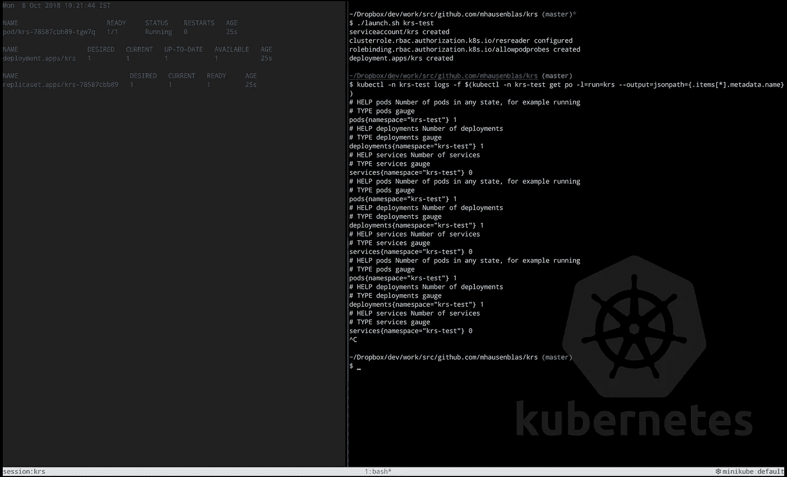

# Kubernetes 资源统计

> 原文：<https://itnext.io/kubernetes-resource-statistics-e8247f92b45c?source=collection_archive---------3----------------------->



krs 在行动中的截图。

> 收集资源统计数据(例如，在某个名称空间中有多少 pod 正在运行)对于有时必要的活动可能是有用的。有了我最近开发的名为`krs`的小工具，现在以一种零配置的方式来做这件事就很简单了。

上周，我在纽约 O'Reilly Velocity 做了一个主题为[排除 Kubernetes 应用程序故障](http://troubleshooting.kubernetes.sh/)的演讲，作为后续，受到积极反馈和关于该主题的大量讨论的激励，我从工具的角度重新审视了这个领域。事实证明，除了[kubernetes-incubator/spartakus](https://github.com/kubernetes-incubator/spartakus)和[kubernetes/kube-state-metrics](https://github.com/kubernetes/kube-state-metrics)之外，我们手头并没有多少轻量级工具可以用来收集资源统计数据，比如名称空间中的 pod 或服务数量。所以我在回家的路上坐下来，开始编写一个小工具——创造性地命名为`krs`,这是 Kubernetes Resource Stats 的缩写——它允许你收集这些统计数据。

您可以通过两种方式使用 [mhausenblas/krs](https://github.com/mhausenblas/krs) :

*   直接从命令行(Linux、Windows 和 macOS 的二进制文件可用)
*   集群内部署，使用 [launch.sh](https://github.com/mhausenblas/krs/blob/master/launch.sh) 脚本，动态创建适当的 RBAC 权限。

请注意，现在还很早，这是大量的 WIP，但是到目前为止，`krs`的 0.1 版本有以下特点:

*   基于每个命名空间，定期收集资源统计信息(支持 pod、部署和服务)。
*   以 [OpenMetrics 格式](https://openmetrics.io)公开这些统计数据。
*   直接通过二进制文件使用，或者在包含所有依赖项的容器化设置中使用。

在目前的形式下，因为我是个懒虫，我假设你已经安装并配置了`kubectl`，以便`krs`工作。换句话说，为了收集统计数据，`krs`依赖于要执行的`kubectl get all`命令。另一方面，谁在使用 Kubernetes 而没有安装`kubectl`？；)

使用`krs`非常简单…只需[下载](https://github.com/mhausenblas/krs/releases)适用于您平台的二进制文件，然后像这样执行它:

```
$ krs thenamespacetowatch
# HELP pods Number of pods in any state, for example running
# TYPE pods gauge
pods{namespace="thenamespacetowatch"} 13
# HELP deployments Number of deployments
# TYPE deployments gauge
deployments{namespace="thenamespacetowatch"} 6
# HELP services Number of services
# TYPE services gauge
services{namespace="thenamespacetowatch"} 4
```

上面将在前台启动`krs`，从名称空间`thenamespacetowatch`收集资源统计信息，并在`stdout`上以 OpenMetrics 格式分别输出，供您进一步处理。

但是，你可能会问，为什么不用这些指标做一些有用的事情(比如把它们存储在 S3)。因为 [*Unix 哲学*](http://harmful.cat-v.org/cat-v/) *。*

对于那些想知道为什么不直接使用 Prometheus 或[kubernetes/kube-state-metrics](https://github.com/kubernetes/kube-state-metrics)来完成这个任务的人:嗯，你当然可以，为什么不呢？`krs`的重点实际上是作为现有工具的轻量级和易于使用的替代品，甚至可能在某些方面稍微互补。