# Kubernetes 资源和自动缩放—从基础到卓越

> 原文：<https://itnext.io/kubernetes-resources-and-autoscaling-from-basics-to-greatness-7cae17fbf27b?source=collection_archive---------0----------------------->

# 介绍

自动缩放应用程序运行的资源并不是一个新的想法。我们可以在 AWS 中通过使用 [*自动缩放组*](https://docs.aws.amazon.com/autoscaling/ec2/userguide/AutoScalingGroup.html) 来实现多年。当应用程序直接在 EC2 实例上运行时，我们可以根据负载的变化增加或减少实例的数量。

用 Kubernetes 部署和运行我们的应用程序给自动伸缩带来了不同程度的复杂性。我们不仅可以通过添加节点来扩展应用程序，还可以通过添加单元来扩展应用程序。此外，在没有 Kubernetes 控制平面参与的情况下添加新节点(例如 EC2 实例)可能是徒劳的。

在这篇博客中，我们将尝试描述 Kubernetes 用来实现自动缩放的构件。我们将看到 Kubernetes 如何收集和使用指标来自动缩放 pod 和节点。我们将使用 AWS [*EKS*](https://aws.amazon.com/eks/?whats-new-cards.sort-by=item.additionalFields.postDateTime&whats-new-cards.sort-order=desc&eks-blogs.sort-by=item.additionalFields.createdDate&eks-blogs.sort-order=desc) 来展示用于在 pod 和节点级别实现自动伸缩的模式和最佳实践。

# 收集指标

那么 Kubernetes 控制平面和其他相关组件如何知道所有节点上运行的 pod 和容器所使用的内存、CPU 和其他资源的数量呢？嗯，它从集群中每个工作节点上运行的 Kubelets 获得帮助。Kubelet 将 [cAdvisor](https://github.com/google/cadvisor) 捆绑到其二进制文件中，该文件从节点上运行的容器中收集相关的指标。Kubelet 将这些指标作为 API 端点公开。在 EKS 集群上，您可以通过首先执行以下代理命令来查看这些指标:

```
kubectl proxy --port=8080 &
```

然后调用下面的 API 端点(用集群中的一个真实节点名替换 **{NODE_NAME}** )

```
# curl [http://localhost:8080/api/v1/nodes/{NODE_NAME}/proxy/metrics/cadvisor](http://localhost:8080/api/v1/nodes/ip-10-16-10-212.ec2.internal/proxy/metrics/cadvisor)
```

从结果中可以看出，所有需要的指标都由 API 公开了(而且是普罗米修斯指标格式！).

按照 Kubernetes 的逻辑，我们期望这些指标可以通过暴露在 [*API-server*](https://kubernetes.io/docs/concepts/overview/components/#kube-apiserver) 上的 API 端点获得。为了实现这一点，API-server 需要一种机制来聚集来自所有节点的指标。然而，API-server 本身并不这样做，它使用一个名为 [*metrics-server*](https://github.com/kubernetes-sigs/metrics-server) 的特殊集群插件，该插件需要部署到集群上。

度量服务器充当 Kubelets 和 API 服务器之间的中介(图 1)。首先，指标服务器发现集群中的节点，然后收集和汇总指标。API-server 使用由 metrics-server 聚合的指标，通过 API 端点向集群的其他部分公开所需的信息。

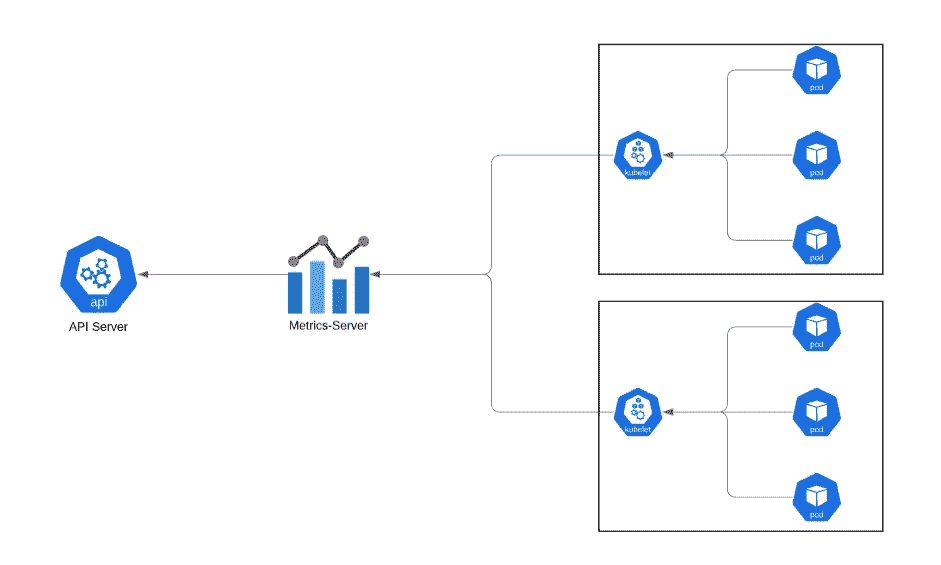

**图 1** 。metrics-server 从运行在 worker 节点上的 Kubelets 收集指标。API 服务器向控制器展示指标。

在 EKS 集群上，默认情况下不部署度量服务器。您可以使用此 [*向导*](https://docs.aws.amazon.com/eks/latest/userguide/metrics-server.html) 来部署它。

在部署 metric-server 之后，我们可以使用之前使用的相同的代理命令，然后调用以下命令从 API-server 获取 pods 的 CPU 和内存使用情况:

```
# curl [http://localhost:8080/apis/metrics.k8s.io/v1beta1/pods/](http://localhost:8080/apis/metrics.k8s.io/v1beta1/pods/)
```

# Pod 调度—请求和限制

在声明一个新的 pod 时，我们可以指定其专用的 [*资源*](https://kubernetes.io/docs/concepts/configuration/manage-resources-containers/) (通常是内存和 CPU)。正如我们将要看到的，我们可以指定所需的*最小资源，称为**。*我们还可以指定*的最大资源使用量，称为*。重要的是要记住，资源是为 pod 中的每个容器单独声明的，而不是作为一个整体为每个 pod 声明的。pod 所需的总资源是其所有容器所需资源的总和。****

*****请求*****

***让我们来看看下面的吊舱减速:***

```
***apiVersion: v1
kind: Pod
metadata:
  name: two-containers-pod
spec:
  containers:
  - image: ubuntu
    command: ["/bin/bash", "-c", "--"]
    args: ["while true; do sleep 30; done;"]
    name: container1
    resources:
      **requests:
        cpu: 500m
        memory: 300Mi**
  - image: ubuntu
    command: ["/bin/bash", "-c", "--"]
    args: ["while true; do sleep 30; done;"]
    name: container2
    resources:
      **requests:
        cpu: 100m
        memory: 400Mi*****
```

***此 pod 减速指定了两个容器。第一个容器要求至少 500m 个 CPU(半个 CPU 内核的时间)和 300Mi 的 RAM。第二个容器请求最少 1 亿个 CPU(1/10 的 CPU 内核时间)和 400 兆内存。pod 要求至少 600 兆 CPU 和 700 兆内存。一种方法是描述 pod 运行的节点( *kubectl describe nodes* 命令)。这样做将向我们展示以下内容:***

**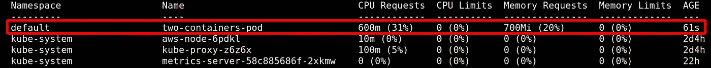**

*****kubectl 描述节点*****

**但是我们为什么要关心一个 pod 需要的最小资源，难道我们不应该只关心它能消耗的最大资源吗？嗯，这与 Kubernetes [*调度器*](https://kubernetes.io/docs/concepts/scheduling-eviction/kube-scheduler/#:~:text=kube%2Dscheduler%20is%20the%20default,manage%20the%20lifecycle%20of%20containers.%20.&text=In%20a%20cluster%2C%20Nodes%20that,Pod%20are%20called%20feasible%20nodes.) 的工作方式有关。让我们看看在描述节点时得到的更多信息:**

**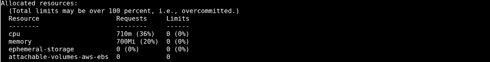**

*****kubectl 描述节点*****

**我们可以看到，节点有 36%的 CPU 和 20%的内存是由运行的 pods 请求的。这正是调度程序在需要调度一个新的 pod 时要检查的内容。调度器将 pod 请求的请求与每个节点上的空闲资源量(未请求)进行比较，并选择具有足够可用资源的节点。如果我们要求将一个 CPU 请求为 3000m 个 CPU 的 pod 调度到一个只有两个 CPU 的工作节点的集群，我们可以看到这一点。pod 将卡在 [*待定*](https://kubernetes.io/docs/tasks/debug-application-cluster/debug-pod-replication-controller/#my-pod-stays-pending) 状态。描述 pod(使用 *kubectl describe pod* 命令)将向我们展示以下内容:**

**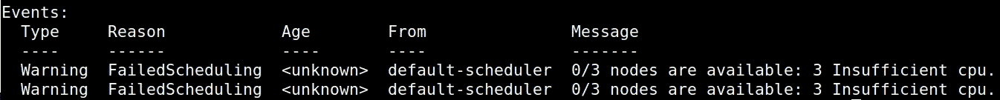**

****T21【kubectl】形容荚 ****

**Kubernetes 集群中的每个工作节点都有自己的资源容量(CPU 和内存的总量)。但是，被安排到一个节点的单元不能使用所有的节点容量。一部分 CPU 和内存需要保留给 OS 和运行在节点上的其他 Kubernetes 组件(比如 Kubelet)。当描述一个节点( *kubectl describe nodes* 命令)时，我们会注意到对于*容量*和*可分配:*有一个输出**

**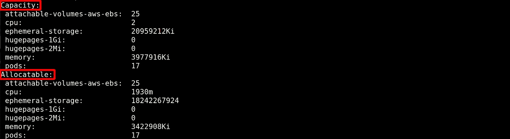**

*****kubectl 描述节点*****

***容量*是节点的总容量(我们从云提供商那里得到的)。*可分配的*是在我们为操作系统和其他 Kubernetes 组件预留了所需资源后，pod 可用的资源总量。调度程序在调度 pod 时只考虑*可分配的*资源。**

**需要记住的最后一件重要事情是，调度程序不会评估节点的当前资源利用率来做出决定。调度器仅基于节点上运行的 pods 已经请求的资源总量来做出他的决定。例如，假设有一个 2 个 CPU 的工作节点，运行着总共有 1700m 个 CPU 请求的 pod。当前实际的 CPU 利用率是 10% (2 亿个 CPU)。即使当前有 1800m 个 CPU 可用，尝试调度向该节点请求 400m 个 CPU 的 pod 也会失败。**

****极限值****

**我们通过在每个容器上设置*限制*来设置 pod 可以利用的最大资源:**

```
**apiVersion: v1
kind: Pod
metadata:
  name: limits-pod
spec:
  containers:
  - image: ubuntu
    command: ["/bin/bash", "-c", "--"]
    args: ["while true; do sleep 30; done;"]
    name: limits-container
    resources:
      requests:
        cpu: 300m
        memory: 300Mi
      **limits:
        cpu: 1000m
        memory: 500Mi****
```

**在上面的示例中，我们部署了一个容量限制为 1000m CPUs 个 CPU 内核)和 500Mi RAM 的 pod。现在，当容器试图消耗比它的*限制*更多的资源时会发生什么？结果取决于它试图过度消耗的资源。**

**CPU 是*可压缩的*资源，而内存是*不可压缩的*。在容器内运行的进程不能使用超过其限制的 CPU。因为 CPU 是一种可压缩的资源，结果可能是响应时间变慢，但是进程本身通常不会崩溃。另一方面，试图过度消耗内存会导致进程终止(臭名昭著的 [*OOMKilled*](https://kubernetes.io/docs/tasks/configure-pod-container/assign-memory-resource/) 错误)。当一个内存片被一个进程消耗掉时，它就归这个进程所有，不先杀死它就不能被取走(因此有了 *OOMKilled* )。这就是为什么内存是一种不可压缩的资源。**

****服务质量****

**正如我们已经看到的，在陈述请求时，我们必须考虑节点的*可分配的*资源(在 2 个 CPU 的节点上不能请求 3000m 个 CPU)。但是限制可以被过量使用，这意味着所有 pod 的限制的总和可以大于节点*可分配的*资源。这样，一个节点可以耗尽它的资源，Kubernetes 将需要决定哪些 pod 应该被杀死，以便该节点继续运行。为了做出这些决定，Kubernetes 使用了 [*QoS*](https://www.replex.io/blog/everything-you-need-to-know-about-kubernetes-quality-of-service-qos-classes) (服务质量)。pod 的 QoS 是从其容器请求和限制中推导出来的。有三类服务质量:**

1.  ***保底***
2.  ***可爆发***
3.  ***最大努力***

**对于为其所有容器配置了请求和限制的 pod，实现了*保证的* QoS 等级。必须为 CPU 和内存指定请求和限制，并且它们必须相同(提示:如果忽略请求而只指定限制，Kubernetes 会将其视为请求=限制)。此 QoS 类别中的 pod 将最后被逐出。**

***可突发的* QoS 等级是为不具有等于所有容器上的限制的请求的 pod 或具有至少一个没有指定限制的容器的 pod 实现的。因为限制不等于请求，所以 pod 可以使用比它们所请求的(突发)更多的资源，但是达到限制。此 QoS 类别中的 pod 将在*保证的*pod 之前被驱逐，但仅在*尽力而为的 pod 之后被驱逐。***

**对于绝对没有为其任何容器配置请求或限制的 pod，实现了 best effort QoS 类别。这种 QoS 级别的 pod 将首先被淘汰。**

****极限范围****

**对容器没有限制的豆荚是危险的生物，在某些情况下，它们可以让一个节点屈服。想象一个应用程序遭受 [*内存泄漏*](https://en.wikipedia.org/wiki/Memory_leak#:~:text=In%20computer%20science%2C%20a%20memory,accessed%20by%20the%20running%20code.) 问题，在一个没有内存限制的 pod 内运行。pod 将开始消耗越来越多的内存。因为它可以消耗的内存量没有限制，所以它可能会对与其一起运行的所有其他进程产生严重影响。没有 CPU 限制的 pod 也会出现同样的问题，消耗越来越多的 CPU 时间。**

**处理这个问题的一个方法是对我们部署的所有 pod 的所有容器设置限制。集群管理员可以通过强制实施每个 pod 或容器的最小和最大请求和限制来增加另一层保护。这是使用一个名为[*limit range*](https://kubernetes.io/docs/concepts/policy/limit-range/)*的准入控制器在一个*名称空间内完成的。****

**LimitRange 将为缺少默认值的容器声明注入指定的默认值。这将保护我们免受上述情况的影响。此外，LimitRange 在新配置或现有配置的准入阶段强制实施默认值和限制。如果某些资源声明违反了 LimitRange 中指定的约束，它将被拒绝。**

**让我们通过在 limit-range 名称空间中声明以下 LimitRange 对象来看看这一点:**

```
**apiVersion: v1
kind: LimitRange
metadata:
  name: limit-range-obj
  namespace: limit-range
spec:
  limits:
  - default:
      cpu: 500m
      memory: 1Gi
    max:
      cpu: 1000m
      memory: 2Gi    
    defaultRequest:
      cpu: 100m
      memory: 200Mi
    type: Container**
```

**这个 LimitRange 指定了 500m CPUs 和 1Gi RAM 的默认限制。它还将默认请求设置为 100m CPUs 和 200 mi RAM。LimitRange 还设置了 1000m CPUs 和 2Gi RAM 的最大值。现在让我们部署一个没有声明资源的 pod(注意，我们将 pod 部署到限制范围的名称空间):**

```
**apiVersion: v1
kind: Pod
metadata:
  name: limit-range-pod
  **namespace: limit-range**
spec:
  containers:
  - image: ubuntu
    command: ["/bin/bash", "-c", "--"]
    args: ["while true; do sleep 30; done;"]
    name: limit-range-container**
```

**运行*ku bectl-n limit-range get pod limit-range-pod-o YAML*命令将产生以下结果:**

**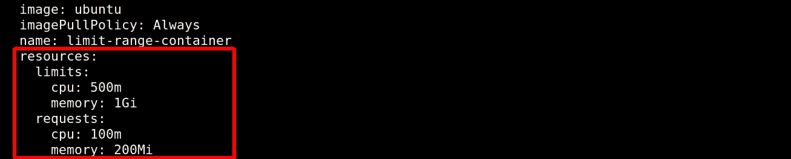**

*****ku bectl-n limit-range get pod limit-range-pod-o YAML*****

**正如我们所看到的，LimitRange 准入控制器识别出我们没有声明任何请求或限制，并且已经注入了指定的缺省值。现在，让我们部署一个具有指定请求但没有限制的 pod:**

```
**apiVersion: v1
kind: Pod
metadata:
  name: limit-range-pod
  namespace: limit-range
spec:
  containers:
  - image: ubuntu
    command: ["/bin/bash", "-c", "--"]
    args: ["while true; do sleep 30; done;"]
    name: limit-range-container
    resources:
      **requests:
        cpu: 300m
        memory: 300Mi****
```

**运行*ku bectl-n limit-range get pod limit-range-pod-o YAML*命令将产生以下结果:**

****

*****ku bectl-n limit-range get pod limit-range-pod-o YAML*****

**如我们所见，这些请求是 pod 减速中指定的请求，而不是 LimitRange 中指定的请求。然而，未设置的限制由 LimitRange 许可控制器实施。最后一件事，让我们尝试部署一个请求的资源超过 LimitRange 中配置的最大值(1000m CPUs 和 2Gi RAM)的 pod:**

```
**apiVersion: v1
kind: Pod
metadata:
  name: limit-range-pod
  namespace: limit-range
spec:
  containers:
  - image: ubuntu
    command: ["/bin/bash", "-c", "--"]
    args: ["while true; do sleep 30; done;"]
    name: limit-range-container
    resources:
      **requests:
        cpu: 2000m
        memory: 2.5Gi****
```

**尝试部署此 pod 将导致以下错误:**

**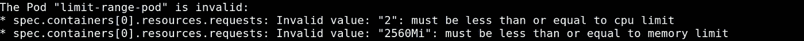**

**RangeLimit 也可以强制执行我们在 pod 级别上看到的相同限制。在这种情况下，为容器配置的资源总和不得超过为 RangeLimit 中的 pod 配置的限制。**

# **水平 Pod 自动缩放器(HPA)**

**水平自动缩放的第一个实现是传统的 AWS [*自动缩放组*](https://docs.aws.amazon.com/autoscaling/ec2/userguide/AutoScalingGroup.html) (ASGs)。对于 AWS ASGs，我们有一组相同的 EC2 实例(使用相同的 [*AMI*](https://docs.aws.amazon.com/AWSEC2/latest/UserGuide/AMIs.html) )。然后，EC2 服务根据我们指定的度量阈值添加或删除 EC2 实例。例如，您可以将 CPU 阈值设置为 80%。当观察到的当前运行实例的平均 CPU 利用率在定义的时间范围内高于 80%时，将启动一个新的 EC2 实例，平均 CPU 利用率将下降。另一方面，如果当前运行的实例的平均 CPU 利用率在定义的时间范围内低于 80%，一个或多个 EC2 实例将被终止。kubernetes[*Horizontal Pod auto scaler*](https://kubernetes.io/docs/tasks/run-application/horizontal-pod-autoscale/)(HPA)以非常相似的方式工作，但是作用于 Pod 而不是 EC2 实例。**

**让我们通过关注 CPU 利用率来继续我们的讨论。对于 ASGs，我们声明一个特定的 CPU 利用率阈值，根据该阈值做出自动伸缩决策。但是，在 Kubernetes 中，没有地方声明这个特定的 CPU 利用率阈值。对于 HPA，pod 的请求被用作阈值。HPA 计算当前 pod 的 CPU 利用率与 pod 的原始请求的比率。**

**考虑一个具有两个 pod [*部署*](https://kubernetes.io/docs/concepts/workloads/controllers/deployment/) 和控制部署的副本(pod)数量的 HPA 的示例。一个 pod 目前使用 9 亿个 CPU，另一个使用 6 亿个 CPU。在这种情况下，两个 pod 的总 CPU 利用率为 1500m CPU(900+600 = 1500m CPU)。如果 CPU 请求设置为每个机架 500m 个 CPU，HPA 需要将当前所需的机架数量设置为 3 (1500/500=3)。这意味着 HPA 需要强制部署将其复制副本数量更改为 3，以便可以添加另一个单元。**

**请注意，所需 pod 数量的计算结果总是四舍五入到下一个大整数。因此，如果上例中当前的总 CPU 利用率是 1100m 个 CPU(而不是 1500m 个 CPU)，HPA 仍然会向部署中多添加一个单元(1100/500=2.2，四舍五入为 3)。**

**总之，我们需要记住一个重要的事实。因为 HPA 需要 pod 的请求作为其考虑的阈值，所以我们必须用请求声明 pod 的所有容器。**

**HPA 本身由两部分组成，Kubernetes API 资源和控制器。控制器使用 metric-server 聚集的指标(在 *metrics.k8s.io* 、 *custom.metrics.k8s.io* 和*external . metrics . k8s . io*API 中公开)来定期调整 pod 的数量。API 资源声明控制器做出调整决策所依据的参数。**

**HPA 可以调整以下 Kubernetes 对象的副本(pod)数量:**

*   **部署**
*   **复制集**
*   **复制控制器**
*   **状态集**

**通过修改 [*比例子资源*](https://github.com/kubernetes/kubernetes/blob/release-1.2/docs/design/horizontal-pod-autoscaler.md#scale-subresource) 来动态调整吊舱数量。HPA 控制器通过更改 ScaleSpec 中的副本字段来更新所需 pod 的数量。HPA 本身不会改变吊舱的数量。它只更新所需的状态。自动缩放对象的控制器(例如，部署控制器)是负责对变更采取行动并相应地更新窗格数量的人。**

**让我们看看颐康保障户口的运作。我们将从以下两个副本部署开始:**

```
**apiVersion: apps/v1
kind: Deployment
metadata:
  name: hpa-deployment
spec:
  **replicas: 2**
  selector:
    matchLabels:
      app: hpa-deployment
  template:
    metadata:
      labels:
        app: hpa-deployment
    spec:
      containers:
      - image: ubuntu
        command: ["/bin/bash", "-c", "--"]
        args: ["while true; do sleep 30; done;"]
        name: hpa-container
        resources:
          **requests:
            cpu: 500m****
```

**如您所见，单个容器 pod 的请求被设置为 500m CPUs。接下来，我们声明 HPA:**

```
**apiVersion: autoscaling/v2beta2
kind: HorizontalPodAutoscaler
metadata:
  name: hpa-test
spec:
  scaleTargetRef:
    **apiVersion: apps/v1
    kind: Deployment
    name: hpa-deployment**
  minReplicas: 1
  maxReplicas: 4
  metrics:
  - type: Resource
    resource:
      name: cpu
      target:
        type: Utilization
        averageUtilization: 80**
```

**稳定的 HPA *autoscaling/v1* API 版本仅支持基于 CPU 利用率的扩展。我们在这里使用的 *autoscaling/v2beta2* 版本也增加了对内存和自定义指标的支持。我们已经将上面创建的部署设置为 HPA 的目标( *scaleTargetRef* )。我们将最小副本数设置为 1 ( *minReplicas* )，最大副本数设置为 4 ( *maxReplicas* )。HPA 将根据 CPU 利用率进行扩展，阈值设置为 80% ( *平均利用率*)。**

**使用 *kubectl get hpa* 命令，我们将看到以下内容:**

**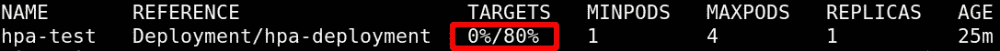**

**最初的部署是一个 2 副本的部署，但是因为 pod 的 CPU 利用率基本上是空闲的，HPA 已经将副本的数量减少到一个副本的最低配置。我们可以通过描述 HPA(使用 *kubectl describe hpa* 命令)来看到它的作用:**

**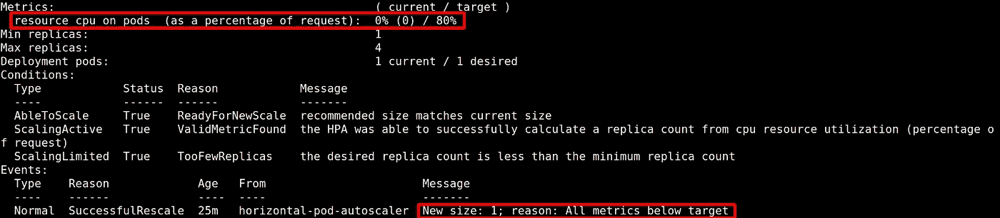**

****kubectl 描述 hpa****

**为了测试 HPA 如何增加单元的数量，我们将从正在运行的单元中运行 [*stress*](https://www.hecticgeek.com/stress-test-your-ubuntu-computer-with-stress/) 命令来加载整个 CPU:**

```
**# stress -c 1**
```

**现在 HPA 将显示以下内容(使用 *kubectl get hpa* 命令):**

**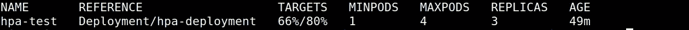**

*****kubectl 获取 hpa*****

**在上面的部署中，我们将 CPU 请求设置为 500m 个 CPU。HPA 阈值设置为 4 亿个 CPU(5 亿个 CPU 的 80%，如上面的**目标**输出所示)。*压力*命令创建了一个完整 CPU 的负载(1000m 个 CPU)。处理负载所需的吊舱数量是 3 (1000/400=2.5，四舍五入为 3，如上面的**副本**输出所示)。结果，HPA 迫使部署增加了两个吊舱。每个 pod 上的平均负载现在将是 3.33 亿个 CPU(1000/3 ~ 3.33 亿个 CPU)，这是部署中声明的 5 亿个 CPU 请求的 66%(如上面的**目标**输出所示)。**

# **集群自动缩放器**

**HPA 是一个很好的解决方案，可以处理当前运行的 pod 上负载的动态增加或减少。但是，我们可能会达到无法再添加更多单元的地步，因为节点本身已满负荷。**

**当 HPA 注意到阈值被突破时，它将尝试添加一个或多个 pod。最后，调度程序将负责将 pod 调度到节点上，但是因为节点处于满负荷状态，所以这将失败。结果将是当前正在运行的 pod 上的高负载，而新的 pod 则停留在挂起状态。摆脱这种死锁的唯一方法是向集群添加更多的节点，这正是 [*集群自动缩放器*](https://github.com/kubernetes/autoscaler/tree/master/cluster-autoscaler) (CA)的用途。**

****集群自动缩放器(CA)基础知识****

**CA 为我们完成两项任务。首先，它将监视由于缺少可用资源而处于未决状态的 pod。然后，它将向 Kubernetes 集群添加节点以减轻负载。其次，它将通过终止未充分利用的节点来降低云成本。**

**CA 在 API-server 上初始化一个 [*观察器*](https://kubernetes.io/docs/reference/using-api/api-concepts/#efficient-detection-of-changes) 。通过*手表*机制，寻找*可调度* PodCondition 设置为 *false* 且*原因*设置为*不可调度*的 pod。当 CA 注意到一个 pod 处于这种状态时，它将尝试向群集中添加一个节点。**

**在 CA 的术语中，*节点组*是一组具有相同容量(CPU、内存)的虚拟机(AWS 中的 EC2 实例)。在 AWS 中，CA 使用自动扩展组(ASG)作为其节点组。**

**当一个节点需要被添加到 ASG 以容纳新的 pod 时，CA 增加 ASG [*期望容量*](https://docs.aws.amazon.com/AWSCloudFormation/latest/UserGuide/aws-properties-as-group.html#cfn-as-group-desiredcapacity) 。DesiredCapacity 的增加将启动一个扩展事件，这将导致启动一个新的 EC2 实例。将会添加新的 EC2 实例，直到 ASG 中的当前实例数量达到 CA 设置的所需容量，或者达到 ASG 的[MaxSize](https://docs.aws.amazon.com/AWSCloudFormation/latest/UserGuide/aws-properties-as-group.html#cfn-as-group-maxsize)(图 2)**

**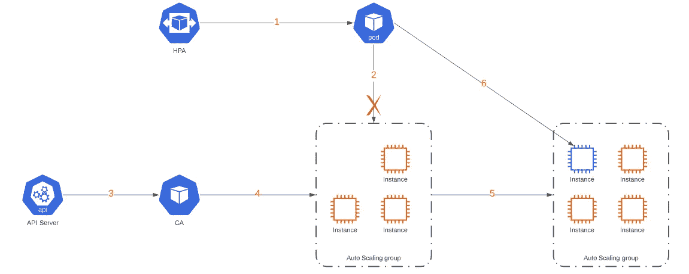**

****图二。行动中的 CA。 *1。*** *HPA 尝试向集群添加一个 pod。* ***2。*** *由于节点上缺乏资源，pod 无法调度。* ***3。****CA 通过 API-server 上的监视器，注意到未决的 pod。* ***4。****CA 增加了 ASG 的期望容量。* ***5。*** *一个新的 EC2 实例被添加到 ASG 中。* ***6。*** *新的 pod 被调度到新的 EC2 实例上。***

**向群集中添加新节点是一个耗时耗力的过程。为了避免启动不合适的节点，CA 预先检查节点与 pod 请求的资源的兼容性。例如，添加一个 2 CPU 节点来容纳一个具有 2500m CPUs 的 CPU 请求的 pod 不会解决挂起 pod 的问题。**

**CA 还会寻找未充分利用的节点，并尝试终止它们以节省云成本。CA 启动指定节点的驱逐和终止必须满足两个条件。首先，已经在指定节点上运行的 pod 的请求资源的总和必须小于该节点的*可分配*资源的 50%。第二，在指定节点上运行的 pod 可以被调度到不同的节点。具有[*pod disruption budget*](https://kubernetes.io/docs/concepts/workloads/pods/disruptions/#pod-disruption-budgets)【PDB】的 pod、kube-system pod、直接创建的 pod(例如，不通过部署)、具有本地存储的 pod 以及与节点具有特定亲缘关系的 pod 是可以禁止终止指定节点的一些示例。**

**如果满足上述所有条件的时间超过特定的时间段(默认为 10 分钟)，CA 将启动驱逐和终止序列。CA 一次终止一个节点，以避免出现 pod 没有合适的节点运行的情况。节点的驱逐是通过 pod 驱逐 API 完成的。CA 将等待一段时间(默认为 10 分钟)让 pod 正常终止。在此期间之后，即使某些 pod 仍在运行，该节点也会终止。**

****CA 扩展器****

**Kubernetes 集群可以由一个或几个助理秘书长组成。正如我们将看到的，一些 ASG 可以基于 [*按需*](https://docs.aws.amazon.com/AWSEC2/latest/UserGuide/ec2-on-demand-instances.html) 实例，而一些基于 [*当场*](https://docs.aws.amazon.com/AWSEC2/latest/UserGuide/using-spot-instances.html#:~:text=A%20Spot%20Instance%20is%20an,is%20called%20a%20Spot%20price.) 实例。在多个 ASG 的情况下，CA 需要决定应该扩大其中的哪一个。为了实现这一点，CA 使用 [*扩展器*](https://github.com/kubernetes/autoscaler/blob/master/cluster-autoscaler/FAQ.md#what-are-expanders) ，它规定了 CA 在选择要扩展的 ASG 时使用的逻辑。目前，我们可以从五个可用的 [*扩展器*](https://github.com/kubernetes/autoscaler/blob/master/cluster-autoscaler/FAQ.md#what-are-expanders) 中进行选择:**

1.  ***Random Expander* :顾名思义，这个扩展器会以随机的方式将 CA 扩展为可用的 ASG 之一。这是 CA 使用的默认扩展器。**
2.  ***Most-pods* *扩展器*:当要调度的 pods 有 [*nodeSelector*](https://kubernetes.io/docs/concepts/scheduling-eviction/assign-pod-node/#nodeselector) 或 [*nodeAffinity*](https://kubernetes.io/docs/concepts/scheduling-eviction/assign-pod-node/#node-affinity) 绑定到特定 ASG 的节点时，此扩展器很有用。如果 CA 要扩展这个特定的 ASG，它将向集群引入一个新的节点，在该节点上可以调度挂起的 pod。**
3.  ***最少浪费* *扩展器*:当要调度的 pods 是 CPU**T5 或者 内存受限时，这个扩展器很有用。对于 CPU 绑定的 pod，ASG 可以使用 [*计算优化的*](https://docs.aws.amazon.com/AWSEC2/latest/UserGuide/compute-optimized-instances.html) EC2 实例，而对于内存绑定的 pod，ASG 可以使用 [*内存优化的*](https://docs.aws.amazon.com/AWSEC2/latest/UserGuide/memory-optimized-instances.html) EC2 实例。CA 将根据 pods CPU 或内存请求扩大具有最佳匹配的 ASG。****
4.  ***价格* *扩展器*:这个扩展器使用一个 [*算法*](https://github.com/kubernetes/autoscaler/blob/master/cluster-autoscaler/proposals/pricing.md) 来预测哪个节点组在扩大规模时将是最划算的。目前仅在 [*GCE*](https://cloud.google.com/compute) 和 [*GKE*](https://cloud.google.com/kubernetes-engine) 上可用。**
5.  ***优先级* *扩展器*:该扩展器使集群管理员能够为不同的 ASG 设置优先级。稍后，我们将看到如何使用这个扩展器。**

****操场****

**为了查看我们的 CA 的运行情况，我们使用 Kubernetes 版本 1.17 部署了一个 EKS 集群。集群由三个[](https://docs.aws.amazon.com/eks/latest/userguide/worker.html)**自管理的 ASGs 工作节点组成。第一组由三个按需 t3.medium 实例组成。第二组由来自 m5.large 系列(2 CPU/8GB RAM)的 spot 实例组成。第三个 ASG 由 m5.xlarge 系列的 spot 实例组成(4c pu/16GB RAM)。该架构的概述可以在图 3 中找到。****

******

*****图 3。Kubernetes 集群由 3 个助理秘书长组成。**每组跨越 3 个 az。其中一个 ASG 由按需 EC2 实例组成(DesiredCapacity 设置为 3)。另外两个 ASG 由具有不同 CPU 和内存(2 CPU/8GB RAM 和 4 CPU/16GB RAM)的 spot 实例(**初始所需容量设置为零**)组成***

***使用 spot 实例是节省云成本的一个好方法，但是需要了解 spot 实例的运行方式以及如何将它们与 Kubernetes 集成。一个很好的起点是这个 [*博客*](https://aws.amazon.com/blogs/compute/cost-optimization-and-resilience-eks-with-spot-instances/) ，它是我们在集群*的配置和部署期间流动的。****

**为了区分 3 个 ASG，我们使用 Kubernetes [*节点标签*](https://kubernetes.io/docs/tasks/configure-pod-container/assign-pods-nodes/) 。我们使用 EC2 [*用户数据*](https://aws.amazon.com/premiumsupport/knowledge-center/eks-worker-nodes-cluster/) 来标注节点。对于点播组，我们使用以下用户数据:**

```
**#!/bin/bash
set -o xtrace
/etc/eks/bootstrap.sh us-east-1-devops-eks --kubelet-extra-args --node-labels=**env=devops,node_type=compute**,subnet=private**
```

**对于 2 CPU/8GB RAM spot ASG，用户数据为:**

```
**#!/bin/bash
set -o xtrace
/etc/eks/bootstrap.sh us-east-1-devops-eks --kubelet-extra-args --node-labels=**env=devops,node_type=Spot2Cpu8Gb**,subnet=private**
```

**对于 4CPUs/16GB RAM spot ASG，用户数据为:**

```
**#!/bin/bash
set -o xtrace
/etc/eks/bootstrap.sh us-east-1-devops-eks --kubelet-extra-args --node-labels=**env=devops,node_type=Spot4Cpu16Gb**,subnet=private**
```

**由于 spot 实例可以在任何时候被 AWS 终止( [*Spot 实例中断*](https://docs.aws.amazon.com/AWSEC2/latest/UserGuide/spot-interruptions.html) ),我们希望我们的 CA 被部署在稳定的随需应变 ASG 上。为了实现这一点，我们将下面的[*node affinity*](https://kubernetes.io/docs/concepts/scheduling-eviction/assign-pod-node/#node-affinity)*添加到 CA 部署清单 *:****

```
****...**
affinity:
  nodeAffinity:
    requiredDuringSchedulingIgnoredDuringExecution:
      nodeSelectorTerms:
      - matchExpressions:
        - key: env
          operator: In
          values:
          - **devops**
        - key: node_type
          operator: In
          values:
          - **compute
...****
```

**我们需要用两个特定的标记来标记 ASG，这样 CA 就会发现它们，并将它们添加到其管理的 ASG 中。这两个标签是:**

```
**k8s.io/cluster-autoscaler/**<cluster-name>**=owned
k8s.io/cluster-autoscaler/enabled=true**
```

****<集群名称>** 应该替换为 EKS 集群名称。**

**在我们的例子中，我们希望 CA 只管理基于现场的 ASG。为了实现这一点，我们用上面的两个标记只标记了基于点的 ASG。**

**在我们的示例中，我们还希望现场助理从零开始横向扩展，然后纵向扩展到零。为此，我们将两个现场助理秘书长的*所需容量*和*最小尺寸*设置为零。此外，我们将只希望特定的吊舱部署到现场助理秘书长。为此，我们将再次使用 *nodeAffinity* 。下面显示了一个 *nodeAffinity* 配置，该配置限制 pod 在标签为 **env=devops** 和 **node_type** 等于 Spot2Cpu8Gb **或** Spot4Cpu16Gb 的节点上运行:**

```
****...**
affinity:
  nodeAffinity:
    requiredDuringSchedulingIgnoredDuringExecution:
      nodeSelectorTerms:
      - matchExpressions:
        - key: env
          operator: In
          values:
          **- devops**
        - key: node_type
          operator: In
          values:
          **- Spot2Cpu8Gb
          - Spot4Cpu16Gb
...****
```

**当 CA 从零开始缩放 ASG 时，我们需要记住一件重要的事情。Kubernetes 控制平面只有在 ASG 节点标签启动并注册到 API 服务器后才会知道它们。因此，如果 CA 需要从零开始横向扩展 ASG，它不知道 ASG 节点标签。在我们希望 CA 考虑节点标签的情况下(就像上面的 *nodeAffinity* 一样)，我们需要用相关的节点标签 [*标记*](https://github.com/kubernetes/autoscaler/blob/master/cluster-autoscaler/FAQ.md#how-can-i-scale-a-node-group-to-0)ASG 本身。在我们的示例中，对于 2CPUs/8GB RAM spot ASG，我们添加了以下标记:**

```
**k8s.io/cluster-autoscaler/node-template/label/env=devops
k8s.io/cluster-autoscaler/node-template/label/node_type=Spot2Cpu8Gb**
```

**对于 4CPUs/16GB RAM spot ASG，我们添加了以下标签:**

```
**k8s.io/cluster-autoscaler/node-template/label/env=devops
k8s.io/cluster-autoscaler/node-template/label/node_type=Spot4Cpu16Gb**
```

**总结一下 ASG 的标记，2 CPU/8GB RAM spot ASG 的最终结果是:**

**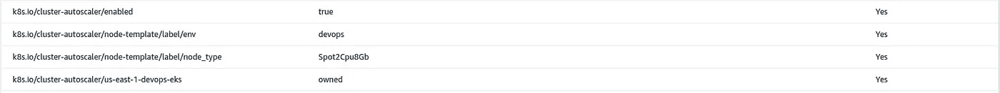**

****2 CPUs/8GB 现货 ASG 标签****

**而对于 4CPUs/16GB RAM spot ASG，标签为:**

**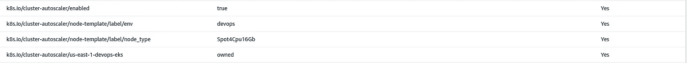**

****4c pus/16GB 现货 ASG 标签****

**为了处理 spot 实例中断，我们使用 [*AWS 节点终止处理程序*](https://github.com/aws/aws-node-termination-handler#helm) 。节点终止处理程序是一个[*DaemonSet*](https://kubernetes.io/docs/concepts/workloads/controllers/daemonset/)*部署到集群中的所有节点。DaemonSet 的 pod 利用 EC2 [*实例元数据服务*](https://docs.aws.amazon.com/AWSEC2/latest/UserGuide/instancedata-data-retrieval.html) 来获得关于 [*EC2 维护事件*](https://docs.aws.amazon.com/AWSEC2/latest/UserGuide/monitoring-instances-status-check_sched.html) 和 [*EC2 现场中断*](https://docs.aws.amazon.com/AWSEC2/latest/UserGuide/spot-interruptions.html) *的通知。*当在特定节点上运行的 DaemonSet 的特定 pod 注意到实例即将被终止时，它将首先 [*封锁*](https://kubernetes.io/docs/concepts/architecture/nodes/#manual-node-administration) 该节点，这将阻止调度程序将新的 pod 调度到它上面。然后节点终止处理器盒将 [*排空*](https://kubernetes.io/docs/concepts/architecture/nodes/#manual-node-administration) 节点。有了这个设置，我们可以优雅地处理现场实例中断，避免应用程序的突然中断。***

****测试最少浪费的膨胀机****

**我们首先部署了配置了最少浪费扩展器的 CA:**

```
****...**
command:
  - ./cluster-autoscaler
  - --v=4
  - --stderrthreshold=info
  - --cloud-provider=aws
  - --skip-nodes-with-local-storage=false
  - **--expander=least-waste**
  - --scale-down-unneeded-time=1m
  - --**node-group-auto-discovery=asg:tag=k8s.io/cluster-autoscaler/enabled,k8s.io/cluster-autoscaler/us-east-1-devops-eks
...****
```

**如前所述，CA 目标的两个 ASG 的初始 DesiredCapacity 设置为零。为了测试新节点的启动，我们声明了以下部署(低 cpu 部署):**

```
**apiVersion: apps/v1
kind: Deployment
metadata:
  name: low-cpu-deployment
spec:
  **replicas: 3**
  strategy:
    rollingUpdate:
      maxSurge: 1
      maxUnavailable: 0
  selector:
    matchLabels:
      app: low-cpu-deployment
  template:
    metadata:
      labels:
        app: low-cpu-deployment
    spec:
      containers:
      - image: ubuntu:18.04
        command: ["/bin/bash", "-c", "--"]
        args: ["while true; do sleep 30; done;"]
        name: hpa-container
        resources:
          **requests:
            cpu: 500m**
      affinity:
        nodeAffinity:
          requiredDuringSchedulingIgnoredDuringExecution:
            nodeSelectorTerms:
            - matchExpressions:
              - key: env
                operator: In
                values:
                **- devops**
              - key: node_type
                operator: In
                values:
                **- Spot2Cpu8Gb
                - Spot4Cpu16Gb****
```

**部署声明了一个 3 副本，具有 500m CPUs 的 CPU 请求和将 pod 绑定到我们的 spot ASGs 的 nodeAffinity。当部署应用到集群时，我们可以看到，pod 最初处于挂起状态，因为没有可以部署 pod 的节点。几分钟后，CA 完成其工作并启动一个新节点:**

**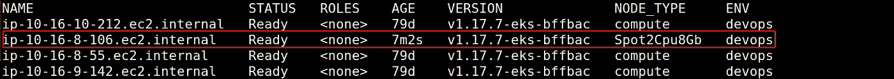**

****kubectl get node -Lnode_type，env****

**pod 本身很快被调度和部署到该节点:**

**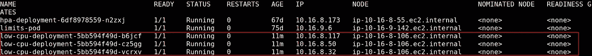**

****kubectl get pod -owide****

**由于每个 pod 请求 5 亿个 CPU，CA 从 2CPUs/8GB ASG 启动了一个 EC2 实例。接下来，我们声明了以下部署(高 cpu 部署):**

```
**apiVersion: apps/v1
kind: Deployment
metadata:
  name: high-cpu-deployment
spec:
  **replicas: 3**
  strategy:
    rollingUpdate:
      maxSurge: 1
      maxUnavailable: 0
  selector:
    matchLabels:
      app: high-cpu-deployment
  template:
    metadata:
      labels:
        app: high-cpu-deployment
    spec:
      containers:
      - image: ubuntu:18.04
        command: ["/bin/bash", "-c", "--"]
        args: ["while true; do sleep 30; done;"]
        name: hpa-container
        resources:
          requests:
            **cpu: 3000m**
      affinity:
        nodeAffinity:
          requiredDuringSchedulingIgnoredDuringExecution:
            nodeSelectorTerms:
            - matchExpressions:
              - key: env
                operator: In
                values:
                **- devops**
              - key: node_type
                operator: In
                values:
                **- Spot2Cpu8Gb
                - Spot4Cpu16Gb****
```

**除了一个例外，此部署与之前的相同，CPU 请求现在设置为 3000 个 CPU。为了容纳单元，CA 需要添加三个 4CPU/16GB 节点，每个节点一个单元。通过检查群集中的节点，我们可以看到三个 4CPU/16GB 节点如预期的那样添加到了群集中:**

**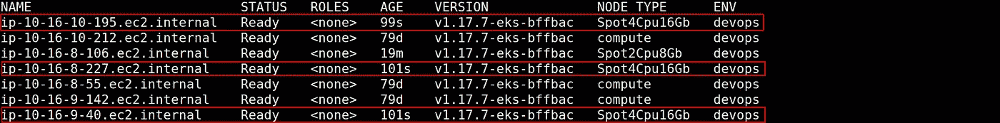**

****kubectl get node -Lnode_type，env****

**部署的 3 个单元已计划并部署到节点，每个节点一个单元:**

**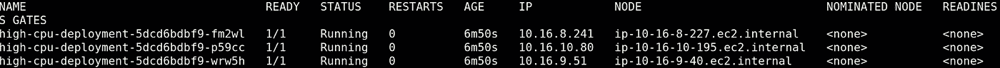**

****库贝克特尔获得 pod -owide****

**为了测试未充分利用的节点的终止，我们将高 cpu 部署副本数量从 3 个减少到 2 个。正如预测的那样，CA 最终发现其中一个 4CPU/16GB 节点未得到充分利用，并将其终止，只剩下两个 4CPU/16GB 节点:**

****

****库贝克获取节点类型，环境****

**最后，我们删除两个部署，这最终导致 CA 终止两个现场 ASG 的所有节点，只留下按需 EC2 节点:**

****

****kubectl get node -Lnode_type，env****

****将 HPA 与 CA 相结合****

**为了了解 HPA 如何与 CA 一起工作，我们首先部署了以下部署:**

```
**apiVersion: apps/v1
kind: Deployment
metadata:
  name: high-cpu-deployment
spec:
  **replicas: 1**
  strategy:
    rollingUpdate:
      maxSurge: 1
      maxUnavailable: 0
  selector:
    matchLabels:
      app: high-cpu-deployment
  template:
    metadata:
      labels:
        app: high-cpu-deployment
    spec:
      containers:
      - image: ubuntu:18.04
        command: ["/bin/bash", "-c", "--"]
        args: ["while true; do sleep 30; done;"]
        name: hpa-container
        resources:
          requests:
            **cpu: 3000m**
      affinity:
        nodeAffinity:
          requiredDuringSchedulingIgnoredDuringExecution:
            nodeSelectorTerms:
            - matchExpressions:
              - key: env
                operator: In
                values:
                **- devops**
              - key: node_type
                operator: In
                values:
                **- Spot2Cpu8Gb
                - Spot4Cpu16Gb****
```

**该部署有一个单元，其 CPU 请求为 3000m CPU。这触发了 CA，CA 添加了一个 4CPU/16GB 节点，并导致 pod 被调度并启动到该节点上。**

**其次，我们针对上述部署配置了以下 HPA:**

```
**apiVersion: autoscaling/v2beta2
kind: HorizontalPodAutoscaler
metadata:
  name: hpa-high-cpu-deployment
spec:
  scaleTargetRef:
    apiVersion: apps/v1
    kind: Deployment
    name: **high-cpu-deployment**
  **minReplicas: 1
  maxReplicas: 4**
  metrics:
  - type: Resource
    resource:
      name: cpu
      target:
        type: Utilization
        **averageUtilization:** **20****
```

**我们将 **averageUtilization** 字段设置为所请求的 CPU (600m 个 CPU)的 20%。**

**为了加载 pod CPU，我们使用运行 pod 中的 [*stress*](https://www.hecticgeek.com/stress-test-your-ubuntu-computer-with-stress/) 命令，加载一个完整的 CPU(1000m CPU):**

```
**# stress -c 1**
```

**不久之后，HPA 注意到了负载，并将所需的复制副本数量更改为 2:**

****

****ku bectl get HPA HPA-高 CPU-部署****

**因为 pod 需要 3000m CPUs，所以新的 pod 需要启动一个单独的 4CPU/16GB 节点。CA 注意到挂起的 pod，并向当前运行的节点添加了另一个 4CPU/16GB 节点:**

****

****kubectl get node -Lnode_type，env****

**最终，新的单元被调度并部署到新的节点:**

**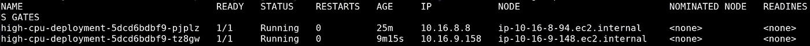**

****kubectl get pod -owide****

**查看 HPA，我们可以看到添加新 pod 的结果:**

****

****ku bectl get HPA HPA-高 CPU-部署****

**现在，我们将停止第一个节点上的应力，这将导致两个闲置的吊舱。HPA 将注意到这一变化，并最终将所需的副本数量减少到 1:**

****

****ku bectl get HPA HPA-高 CPU-部署****

**这将留给我们一个 pod 和一个不需要的 4CPU/16GB 节点。不久之后，CA 将注意到空闲节点并终止它，只给我们留下一个 4CPU/16GB 节点:**

**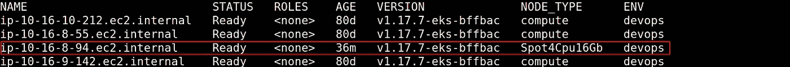**

****kubectl get node -Lnode_type，env****

****基于优先级的扩展器****

**想象一下这样一种情况，我们需要部署具有 500m CPUs 的 CPU 请求，但是能够突发到 3000m CPUs 的 pod。我们希望不惜任何代价调度 pod，即使它们被调度到无法提供 3000m CPUs 最大突发的节点。如果我们应该部署以下部署(突发 cpu 部署):**

```
**apiVersion: apps/v1
kind: Deployment
metadata:
  name: burst-cpu-deployment
spec:
  replicas: 1
  strategy:
    rollingUpdate:
      maxSurge: 1
      maxUnavailable: 0
  selector:
    matchLabels:
      app: burst-cpu-deployment
  template:
    metadata:
      labels:
        app: burst-cpu-deployment
    spec:
      containers:
      - image: ubuntu:18.04
        command: ["/bin/bash", "-c", "--"]
        args: ["while true; do sleep 30; done;"]
        name: hpa-container
        resources:
          **requests:
            cpu: 500m
          limits:
            cpu: 3000m**  
      affinity:
        nodeAffinity:
          requiredDuringSchedulingIgnoredDuringExecution:
            nodeSelectorTerms:
            - matchExpressions:
              - key: env
                operator: In
                values:
                - devops
              - key: node_type
                operator: In
                values:
                - Spot2Cpu8Gb
                - Spot4Cpu16Gb**
```

**我们会发现，在当前的 CA 配置下，已经启动的节点是 2CPU/8GB 节点。CA 查看 pod(500m CPU)的请求，并选择 2CPU/8GB 节点。我们需要一种方法来使 4CPU/16GB ASG 优先于 2CPU/8GB，这样我们将有一个可以承受 CPU 突发的节点。这正是 [*基于优先级的扩展器*](https://github.com/kubernetes/autoscaler/blob/master/cluster-autoscaler/expander/priority/readme.md) 的用途。**

**使用基于优先级的扩展器，我们可以规定 CA 的优先级，其中一个 ASG 应该扩展到哪个 CA。此扩展器需要一个用于声明 ASGs 优先级的配置映射。我们可以使用正则表达式来匹配 ASG 的名称。配置图必须命名为*cluster-auto scaler-priority-expander*。这个 ConfigMap 必须部署到我们已经部署了 CA 的同一个名称空间中(在我们的例子中是 kube-system)。对配置映射的更改会即时应用到 CA(无需在更改配置映射后重新部署 CA)。**

**我们已经声明了以下配置映射:**

```
**apiVersion: v1
kind: ConfigMap
metadata:
  **name: cluster-autoscaler-priority-expander
  namespace: kube-system**
data:
  **priorities: |-
    100: 
      - Spot2Cpu8Gb
    200: 
      - Spot4Cpu16Gb****
```

****优先级**是正整数，其中较高的值意味着较高的优先级。我们为 2CPU/8GB ASG 设置了 100 的优先级，为 4CPU/16GB ASG 设置了 200 的优先级。我们还将 CA 配置更改为以下内容:**

```
****...** command:
  - ./cluster-autoscaler
  - --v=4
  - --stderrthreshold=info
  - --cloud-provider=aws
  - --skip-nodes-with-local-storage=false
  - **--expander=priority**
  - --scale-down-unneeded-time=1m
  - --**node-group-auto-discovery=asg:tag=k8s.io/cluster-autoscaler/enabled,k8s.io/cluster-autoscaler/us-east-1-devops-eks**
**...****
```

**接下来，我们必须重新部署可突发的 pod(突发 cpu 部署),不久之后，我们可以看到 CA 已经启动了一个 4CPU/16GB 节点:**

**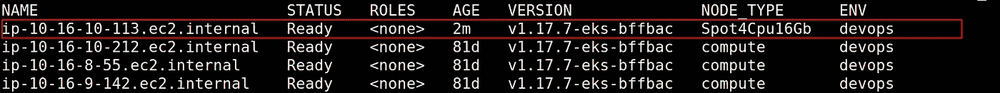**

****kubectl get node -Lnode_type，env****

**pod 已计划并部署到此节点:**

**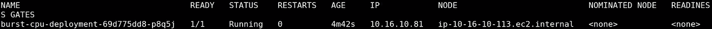**

****kubectl 获取 pod -owide****

****Pod 优先级和抢占****

**有些情况下，我们需要 Kubernetes 调度程序从一个节点中驱逐 pods，以便可以调度其他更重要的 pods。这是通过设置 [*pod 优先级*](https://kubernetes.io/docs/concepts/configuration/pod-priority-preemption/) 来实现的。当具有较高优先级的 pod 需要被调度到具有低资源的节点上时，调度器将*抢占*(驱逐)较低优先级的 pod 以释放资源。**

**通过在减速箱内的 *priorityClassName* 中指定[*priority class*](https://kubernetes.io/docs/concepts/configuration/pod-priority-preemption/#priorityclass)*对象名称，将优先级附加到减速箱。让我们看一个*优先级*对象减速的例子:***

```
**apiVersion: scheduling.k8s.io/v1
kind: PriorityClass
metadata:
  name: cluster-default
**value: 50**
**globalDefault: true**
description: "Cluster default priority class."**
```

**优先级在**值**整数字段中设置，可以设置为小于或等于 10 亿的值。值越大，优先级越高。在上面的例子中，我们已经将布尔型**全局默认**字段设置为真。这将对集群中没有配置 *priorityClassName* 的任何 pod 强制执行 **value** 字段中指定的优先级(在我们的示例中为 50)。如果集群缺少 *PriorityClass* 且 **globalDefault** 设置为 true，则没有定义 *priorityClassName* 的 pod 的优先级将默认为零。**

**优先级也会影响 pod 的调度顺序。当需要调度 pod 时，它们被放入调度队列中。Kubernetes 调度程序从队列中挑选 pod，并尝试为它们安装合适的节点。在较低和较高优先级的单元被添加到调度队列的情况下，调度器将首先尝试调度较高优先级的单元。如果由于任何原因较高优先级的 pod 调度失败(例如，缺少节点资源和没有可用于抢占的 pod)，调度器将对 pod 应用回退，并且调度器将尝试调度较低优先级的 pod。**

**在某些情况下，调度程序不会考虑 [*Pod 中断预算*](https://kubernetes.io/docs/concepts/workloads/pods/disruptions/#pod-disruption-budgets) (PDB，我们稍后会看到)*Pod 被抢占。例如，如果调度程序找不到替代的方法，一个 pod 将被驱逐以支持更高优先级的方法，即使它的抢占违反了它的 PDB。***

***可能存在这样的情况，即我们不希望特定的挂起 pod 触发 CA 扩展序列。为了解决这个问题，CA 支持优先级切断。如果处于未决状态的 pod 的优先级低于截止值(默认情况下为 10)，CA 将不会启动它们的扩大。此外，如果节点被 CA 指定为终止，则优先级低于截止的 pod 将不会阻止规模缩小。***

***现在，让我们来看看 pod 优先级和抢占是如何用于过度配置集群节点的。***

*****延迟敏感型应用和过度配置*****

***在具有大量不可预测的负载峰值的延迟敏感型应用程序中，CA 本身不会给出足够快的响应。纵向扩展延迟(从 pod 转换到挂起状态到它开始处理请求的时间)可能相当长(以分钟为单位)。纵向扩展延迟可以分为三个部分。***

***第一部分是 CA 注意到有一个 pod 处于挂起状态并决定扩大哪个 ASG 所需的时间。这对于小型集群(少于 100 个节点，每个节点 30 个机架)平均需要 5 秒，对于大型集群(100–1000 个节点，每个节点 30 个机架)平均需要 15 秒。Pod *亲和*和*反亲和*可能会严重影响这个阶段。第二部分是云提供商调配节点所需的时间，可能需要几分钟。第三部分是 Kubelet 向集群注册、提取 pod 的容器映像并启动它们所花费的时间。这也可能需要几分钟，取决于容器图像的大小和应用程序的启动时间。***

**我们可以通过减少第二和第三部分来减少纵向扩展延迟。对于第三部分，我们可以减小容器图像大小并优化应用程序启动时间。第二部分将要求我们保留一个热节点池( [*过度供应*](https://github.com/kubernetes/autoscaler/blob/master/cluster-autoscaler/FAQ.md#how-can-i-configure-overprovisioning-with-cluster-autoscaler) )，以便可以立即调度和启动应用程序容器。为了实现这一点，我们利用 pod 优先级和先占权。**

**为了超额供应，我们使用一个低优先级的部署运行 pod(图 4)。CA 将添加节点来容纳低优先级的 pods(热节点池)。如果出现峰值，HPA 将增加实际应用程序部署的副本数量。优先级高于当前正在运行的 pod 的应用程序 pod 将抢占正在运行的 pod，并启动到热池节点上。因此，我们将让低优先级的 pod 处于未决状态。注意到处于未决状态的 pod，CA 将向热池添加更多的节点，以容纳低优先级的 pod。**

**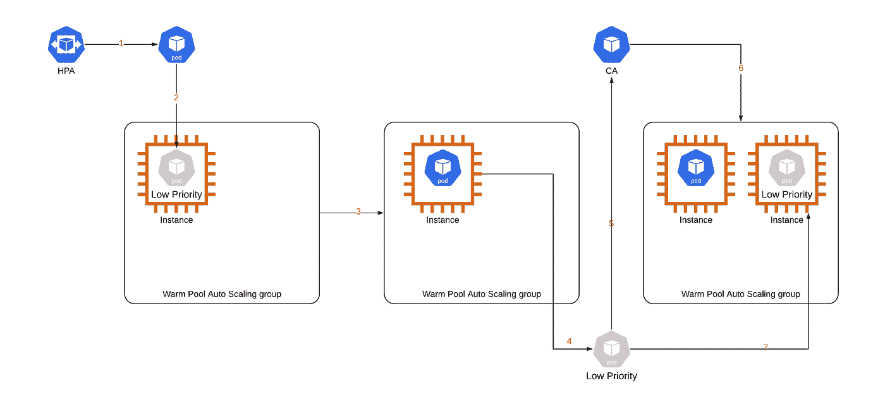**

****图 4。** **过度配置。** **1。**由于负载激增，HPA 向应用程序部署添加了一个副本。 **2。**新的 pod 被调度到一个热池节点上。 **3。**由于新的 pod 比当前运行的 pod 具有更高的优先级，低优先级的 pod 被抢占。 **4。**低优先级 pod 转换到待定状态。 **5。**CA 注意到有一个待定的 pod。 **6。**CA 向热池添加一个新节点。 **7。**低优先级 pod 被调度并启动到新的热池节点。**

**让我们创建一个上面的例子。我们首先声明下面的 **PriorityClass** :**

```
**apiVersion: scheduling.k8s.io/v1
kind: PriorityClass
metadata:
  **name: overprovisioning**
**value: -1**
globalDefault: false
description: "Warm pool overprovision nodes priority class."**
```

**在这个例子中，我们将优先级**值** we 设置为-1。请确保不要将该值设置为低于 CA 截止值(默认情况下为-10)，因为在这种情况下 CA 不会启动扩大。**

**接下来，我们为低优先级 pod 声明一个部署。我们使用 [*暂停*](https://groups.google.com/g/kubernetes-users/c/jVjv0QK4b_o) 容器作为 pod 的唯一容器，并将 **priorityClassName** 设置为我们在上面声明的 *PriorityClass* 的名称。**

```
**apiVersion: apps/v1
kind: Deployment
metadata:
  name: overprovisioning-low-priority-deployment
spec:
  replicas: 1
  strategy:
    rollingUpdate:
      maxSurge: 1
      maxUnavailable: 0
  selector:
    matchLabels:
      app: overprovisioning-low-priority-deployment
  template:
    metadata:
      labels:
        app: overprovisioning-low-priority-deployment
    spec:
      **priorityClassName: overprovisioning**
      containers:
      **- image: 602401143452.dkr.ecr.us-east-   1.amazonaws.com/eks/pause-amd64:3.1**
        name: overprovisioning-low-priority
        resources:
          requests:
            cpu: 3000m
      affinity:
        nodeAffinity:
          requiredDuringSchedulingIgnoredDuringExecution:
            nodeSelectorTerms:
            - matchExpressions:
              - key: env
                operator: In
                values:
                - devops
              - key: node_type
                operator: In
                values:
                - Spot2Cpu8Gb
                - Spot4Cpu16Gb**
```

**不久之后，CA 将启动一个节点，低优先级 pod 被调度并启动到该节点上。接下来，我们声明以下部署:**

```
**apiVersion: apps/v1
kind: Deployment
metadata:
  name: high-cpu-deployment
spec:
  replicas: 1
  strategy:
    rollingUpdate:
      maxSurge: 1
      maxUnavailable: 0
  selector:
    matchLabels:
      app: high-cpu-deployment
  template:
    metadata:
      labels:
        app: high-cpu-deployment
    spec:
      containers:
      - image: ubuntu:18.04
        command: ["/bin/bash", "-c", "--"]
        args: ["while true; do sleep 30; done;"]
        name: hpa-container
        resources:
          requests:
            cpu: 3000m
      affinity:
        nodeAffinity:
          requiredDuringSchedulingIgnoredDuringExecution:
            nodeSelectorTerms:
            - matchExpressions:
              - key: env
                operator: In
                values:
                - devops
              - key: node_type
                operator: In
                values:
                - Spot2Cpu8Gb
                - Spot4Cpu16Gb**
```

**发生了两件事。首先，低优先级 pod 被抢占，并转换到挂起状态。其次，应用程序窗格被调度并启动到节点:**

**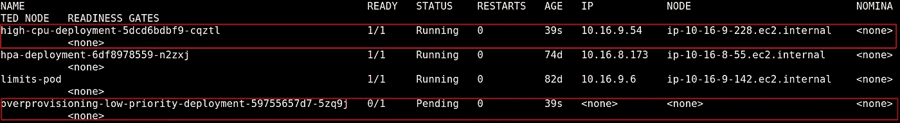**

****kubectl 获取 pod -owide****

**注意到低优先级 pod 处于挂起状态的 CA 已经向热池添加了一个节点，并且低优先级 pod 被调度并启动到这个新节点上:**

**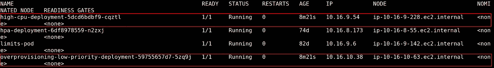**

****kubectl 获取 pod -owide****

**接下来，我们针对应用程序部署声明了以下 HPA:**

```
**apiVersion: autoscaling/v2beta2
kind: HorizontalPodAutoscaler
metadata:
  name: hpa-high-cpu-deployment
spec:
  scaleTargetRef:
    apiVersion: apps/v1
    kind: Deployment
    name: **high-cpu-deployment**
  minReplicas: 1
  maxReplicas: 4
  metrics:
  - type: Resource
    resource:
      name: cpu
      target:
        type: Utilization
        averageUtilization: 20**
```

**现在我们将加载应用程序窗格，从运行窗格中使用[*stress*](https://www.hecticgeek.com/stress-test-your-ubuntu-computer-with-stress/)*命令来加载一个完整的 CPU (1000m 个 CPU):***

```
***# stress -c 1***
```

***HPA 注意到了负载的变化，并向部署中添加了第二个副本:***

******

*****ku bectl get HPA HPA-高 CPU-部署*****

***这将强制应用程序部署再添加一个 pod。通过抢占低优先级 pod，新 pod 被调度并启动到热池节点上:***

***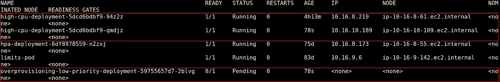***

*****kubectl get pod -owide*****

***同样，CA 将向热池添加另一个节点，保持稳定的热池大小:***

******

*****kubectl get node -Lenv，node_type*****

# ***Pod 中断预算(PDB)***

***[*高可用性*](https://en.wikipedia.org/wiki/High_availability#:~:text=High%20availability%20(HA)%20is%20a,increased%20reliance%20on%20these%20systems.) (HA)是关键任务应用的支柱之一。在 AWS 中，最佳实践是将一个应用程序的几个副本分散到在不同的 [*可用性区域*](https://docs.aws.amazon.com/AWSEC2/latest/UserGuide/using-regions-availability-zones.html) (AZs)中运行的 EC2 实例上(通常通过使用 ASG)，并在它们前面放置一个负载平衡器。如果一个实例崩溃，EC2 服务将启动一个新的 EC2 实例作为替代。它还将尝试 [*在 az 之间重新平衡*](https://docs.aws.amazon.com/autoscaling/ec2/userguide/auto-scaling-benefits.html#arch-AutoScalingMultiAZ)EC2 实例，这样我们将尽可能均匀地分布 EC2 实例。***

**为了在 Kubernetes 中部署 HA 应用程序，我们通常使用一个 ASG 将工作节点启动到不同的 az 中。然后，我们尝试通过使用[*【pod antiaffinity】*](https://kubernetes.io/docs/concepts/scheduling-eviction/assign-pod-node/#affinity-and-anti-affinity)*(图 5) *，在不同 az 中的节点之间均匀分布应用程序的副本(pod)。*但是我们如何确保我们总是运行最小数量的副本呢？集群管理员和 [*集群自动缩放器*](https://github.com/kubernetes/autoscaler/tree/master/cluster-autoscaler) (CA)可以 [*驱逐*](https://kubernetes.io/docs/tasks/administer-cluster/safely-drain-node/) 节点。 [*Pod 中断预算*](https://kubernetes.io/docs/concepts/workloads/pods/disruptions/#pod-disruption-budgets) (PDB)可以保护我们的 HA 应用。***

**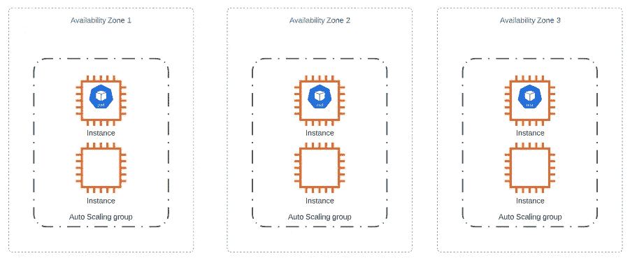**

****图 5。**三个副本的 Kubernetes HA 应用程序在三个可用性区域自动缓存组上的每个可用性区域运行一个副本。**

**有了 PDB，我们可以确保在给定时间内始终有最少数量的 pod 可用。如果这违反了 PDB ( [*自愿中断*](https://kubernetes.io/docs/concepts/workloads/pods/disruptions/#voluntary-and-involuntary-disruptions) )，PDB 将阻止 CA 甚至管理员驱逐 pod。当然，PDB 不会在物理机崩溃或网络分区( [*非自愿中断*](https://kubernetes.io/docs/concepts/workloads/pods/disruptions/#voluntary-and-involuntary-disruptions) )等事件中提供帮助。因此，在为应用程序设置 PDB 时，我们必须考虑 pods 在不受 Kubernetes 自身控制的情况下终止的情况。**

**在图 6 中，我们可以看到一个示例，由于资源消耗较低，HPA 终止了两个副本应用程序单元中的一个，只剩下一个副本可用。**

**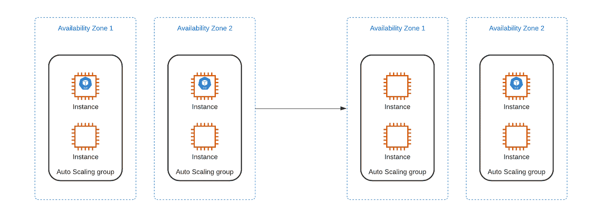**

****图 6。**由于资源消耗较低，两个复制副本应用程序箱中的一个被 HPA 终止。**

**现在，假设在应用程序进入几分钟后，CA 指定最后一个 pod 正在其上运行的节点终止。CA 将开始从该节点驱逐所有的 pod。在我们没有 PDB 的情况下，应用程序的最后一个复制副本将被终止，并且应用程序将不可用，直到 pod 部署到另一个节点。如果我们为 PDB 配置了最少一个 pod，那么 CA 操作将会被阻止(图 7)。**

**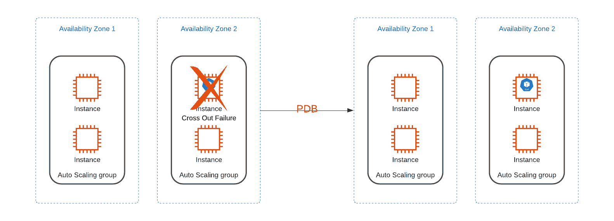**

****图 7。**CA 指定终止的节点，并试图驱逐 pod。PDB 阻止 pod 驱逐并维护一个副本工作应用程序。**

**让我们通过部署以下 3 个副本部署来看一个示例:**

```
**apiVersion: apps/v1
kind: Deployment
metadata:
  name: pdb-deployment
  **labels:
    app: pdb-deployment**
spec:
  replicas: 3
  strategy:
    rollingUpdate:
      maxSurge: 1
      maxUnavailable: 0
  selector:
    matchLabels:
      app: pdb-deployment
  template:
    metadata:
      labels:
        app: pdb-deployment
    spec:
      containers:
      - image: ubuntu:18.04
        command: ["/bin/bash", "-c", "--"]
        args: ["while true; do sleep 30; done;"]
        name: pdb-container
        **resources:
          requests:
            cpu: 500m
          limits:
            cpu: 500m****
```

**部署被标记为 **app: pdb-deployment** ，并且容器具有 CPU 请求和 500m CPUs 的限制。接下来，我们配置 PDB:**

```
**apiVersion: policy/v1beta1
kind: PodDisruptionBudget
metadata:
  name: test-pdb
spec:
  **minAvailable: 2**
  **selector:
    matchLabels:
      app: pdb-deployment****
```

**在 PDB 中，我们可以将可用副本的最小数量或不可用副本的最大数量设置为整数或百分比。我们用 **minAvailable** 字段设置了可用副本的最小数量(在上面的例子中，它被设置为 2)。我们用 **maxUnavailable** 字段设置不可用副本的最大数量。**

**PDB 保护通过部署(如我们的示例)、副本集和状态集部署的副本。我们使用 **matchLabels** 选择器来创建两者之间的绑定(在我们的示例中，这被设置为 **app: pdb-deployment** ，以匹配部署标签)。**

**描述 PDB(使用 *kubectl describe pdb* 命令)将向我们展示以下内容:**

**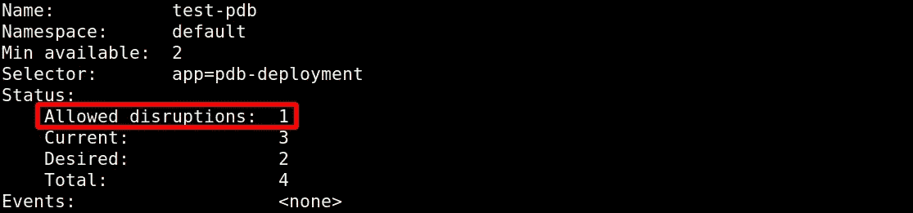**

****ku bectl 描述 pdb 测试-pdb****

**因为我们有 3 个副本部署，并且 PDB **minAvailable** 字段设置为 2，所以 **Allowed disruptions** 字段的值计算为 1。这意味着我们一次最多可以从部署中删除 1 个复制副本。**

**为了完成我们的示例，让我们部署以下 HPA 配置:**

```
**apiVersion: autoscaling/v2beta2
kind: HorizontalPodAutoscaler
metadata:
  name: hpa-pdb
spec:
  scaleTargetRef:
    apiVersion: apps/v1
    kind: Deployment
    name: pdb-deployment
  **minReplicas: 1**
  maxReplicas: 4
  metrics:
  - type: Resource
    resource:
      name: cpu
      target:
        type: Utilization
        averageUtilization: 80**
```

**HPA 将副本的最小数量设置为 1，并以我们的部署为目标。由于部署中的单元处于 CPU 空闲状态，HPA 将尝试将复制副本的数量缩减到最少 1 个。过了一会儿，我们会看到只剩下部署的一个吊舱。这与我们配置的 PDB 相矛盾。描述 PDB(使用 *kubectl describe pdb* 命令)将向我们展示以下内容:**

**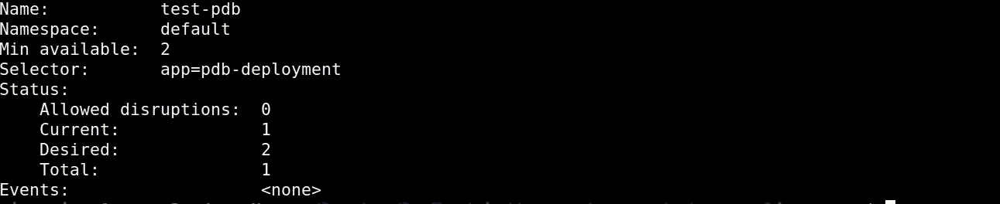**

***kubectl 描述 pdb 测试-pdb***

**如我们所见，HPA 不支持 PDB，因此我们在为 HA 应用程序配置 HPA 时需要小心。现在，让我们尝试清空剩下最后一个副本的节点(使用 *kubectl drain* 命令):**

**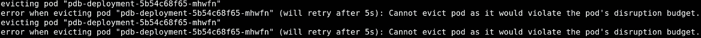**

***在这种情况下，PDB 阻止了我们对节点进行排水的尝试。***

# ***结论***

***Kubernetes 让我们管理从容器级别到节点级别的资源的粒度是惊人的。使用我们上面描述的工具和模式，集群管理员可以达到很高的控制水平。***

***稳定性、低延迟和高可用性通常是现代应用程序的必备条件。将 Kubernetes 的正确附加组件和最佳实践与云的力量相结合，使我们能够构建支持这些应用的基础架构。***