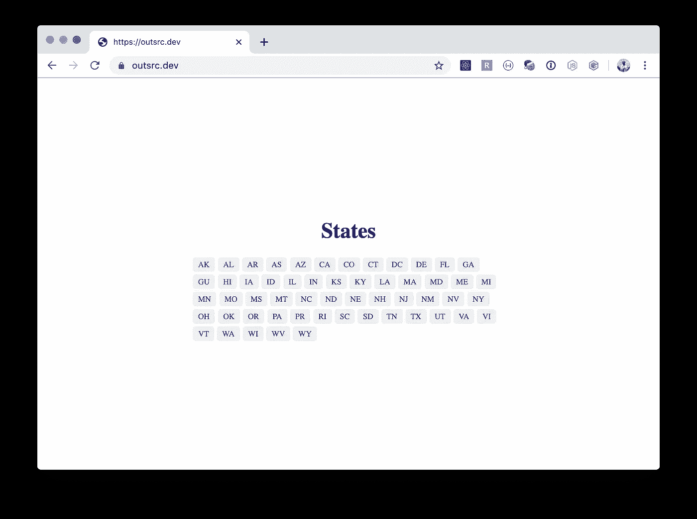
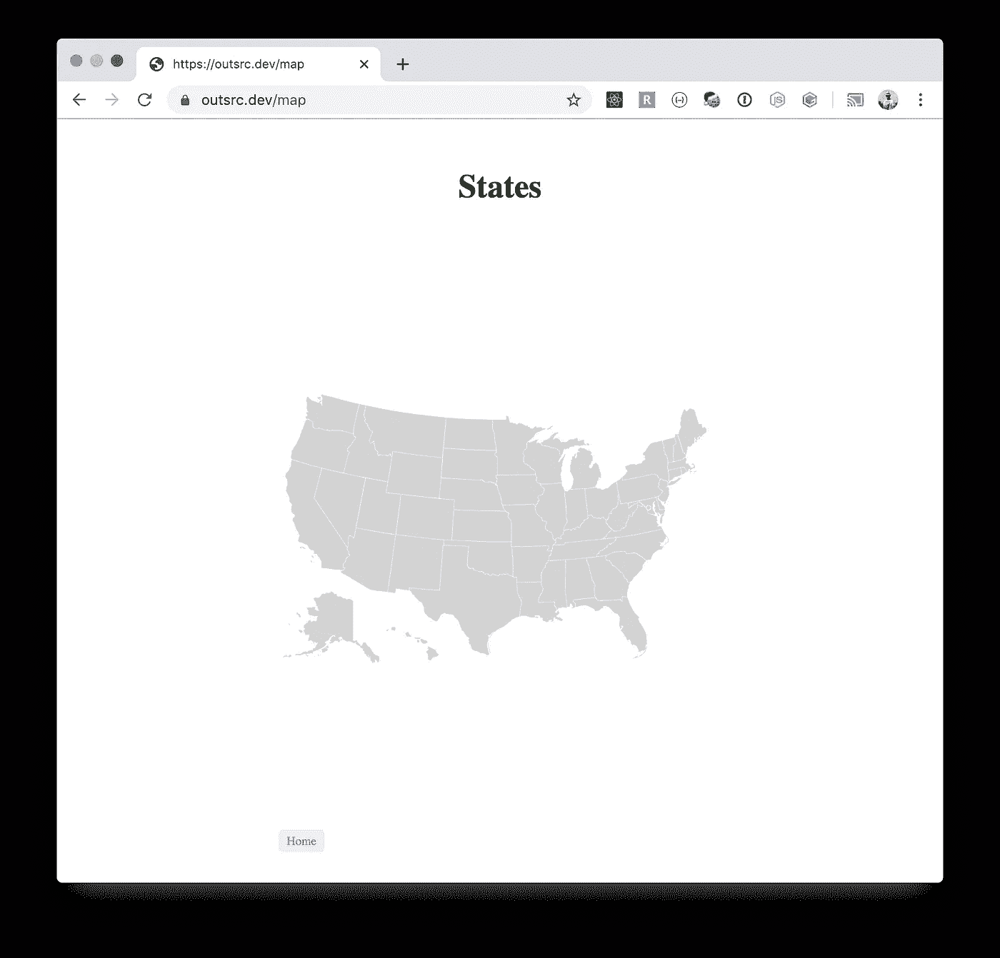
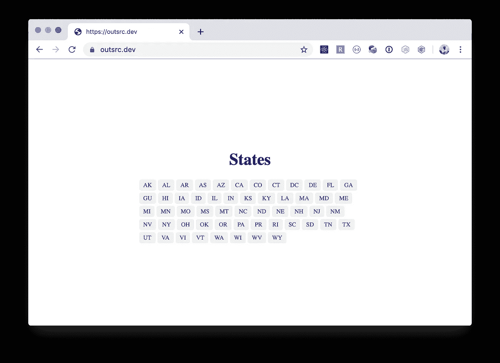
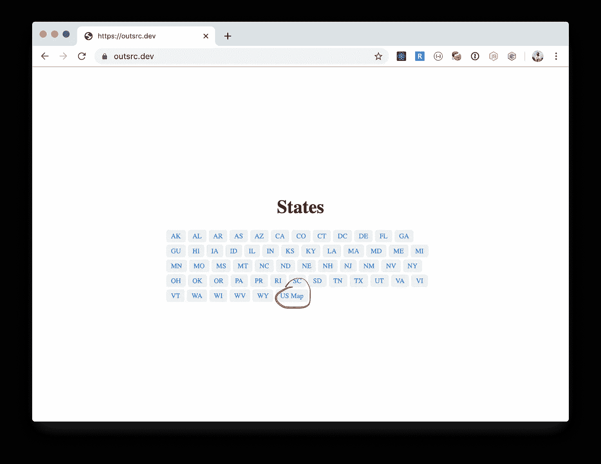
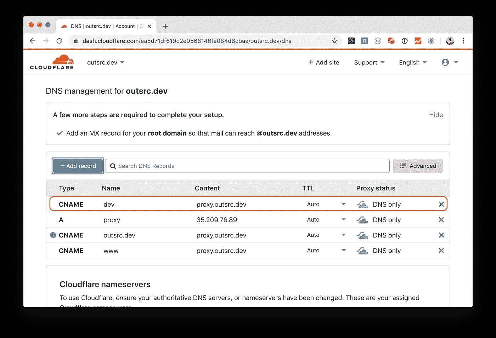
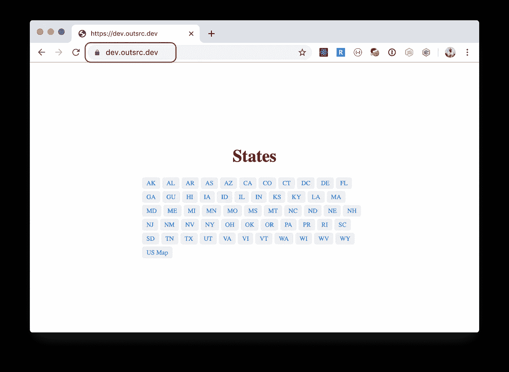
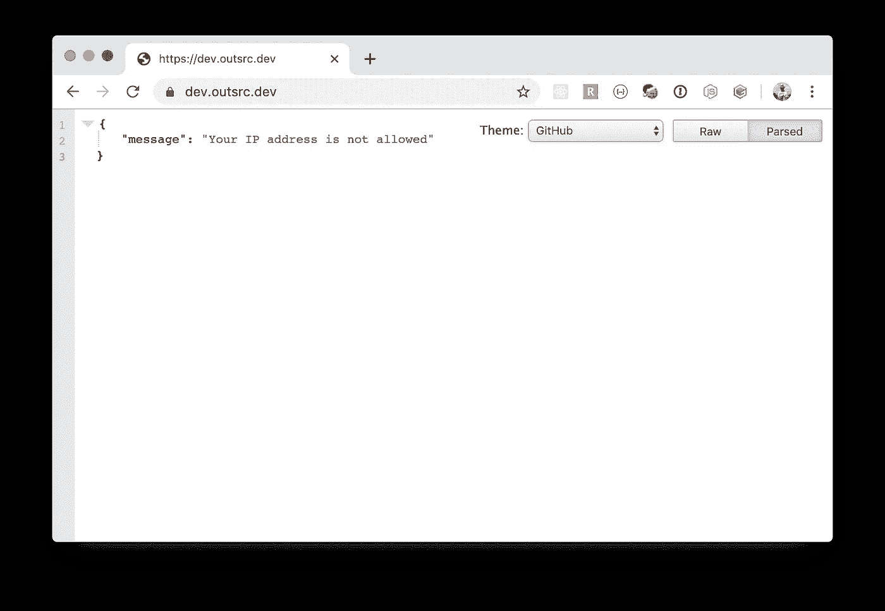

# Kubernetes 滚动更新、回滚和多环境

> 原文：<https://itnext.io/kubernetes-rolling-updates-rollbacks-and-multi-environments-4ff9912df5?source=collection_archive---------1----------------------->


照片由来自 [Pexels](https://www.pexels.com/photo/birds-eye-view-photo-of-freight-containers-2226458/?utm_content=attributionCopyText&utm_medium=referral&utm_source=pexels) 的[汤姆·菲斯克](https://www.pexels.com/@tomfisk?utm_content=attributionCopyText&utm_medium=referral&utm_source=pexels)拍摄

在之前的帖子([https://it next . io/deploy-an-app-on-kubernetes-gke-with-Kong-Ingress-letsencrypt-and-cloudflare-94913 e 127 c2b](/deploy-an-app-on-kubernetes-gke-with-kong-ingress-letsencrypt-and-cloudflare-94913e127c2b))中，我们学习了如何将一个具有 2 个微服务(前端和后端)的应用程序部署到 Kubernetes，使用 Kong Ingress、LetsEncrypt 提供 TLS 证书，使用 cloud flare 提供代理和额外的安全性。

在这篇文章中，我们希望对我们部署的应用程序进行一些更新，在出现错误时回滚它们，最后但同样重要的是使用多个环境，以便我们可以在部署到生产环境之前测试我们的应用程序。

首先，我将重新部署我的原始应用程序。(我总是删除不用的应用程序，不需要花钱托管它们)

`kubectl`的一个漂亮的特性是你可以连接所有的资源文件并批量应用它们。这是我的文件:

要应用它:

```
$ kubectl apply -f outsrc.yml
namespace/outsrc created
ingress.extensions/outsrc-dev-ingress created
service/service-frontend created
deployment.apps/deployment-frontend created
service/service-backend created
deployment.apps/deployment-backend created
```

几秒钟后(容器运行，TLS 证书发出),我们让应用程序重新联机:



outsrc.dev 部署到 Kubernetes

到目前为止一切顺利。现在，我们需要对应用程序进行一些更改。我们将添加一个包含美国地图的地图页面，我们将从主页和州页面链接地图。在添加了该特性的代码并将其归档后:

```
$ docker build -t outsrc-demo-front .
...$ docker tag outsrc-demo-front:latest gcr.io/outsrc/outsrc-demo-front:**1.1.0**$ docker push gcr.io/outsrc/outsrc-demo-front:**1.1.0
...**
```

注意版本是不同的，我们将使用 docker 图像标签来做滚动更新。

## 滚动更新

每次我们想要更新部署在 kubernetes 集群上的应用程序时，我们都会更改部署资源文件并更新它们。每次检测到更改时，将执行滚动更新。

为了避免停机，kubernetes 将逐个更新我们正在运行的容器的每个副本，并在顶层重新路由服务。

要检查更新历史记录:

```
$ kubectl rollout history deployment/deployment-frontend
deployment.extensions/deployment-frontend
REVISION  CHANGE-CAUSE
1         <none>
```

让我们更新前端容器图像标签:

```
$ kubectl set image deployment/deployment-frontend frontend-container=gcr.io/outsrc/outsrc-demo-front:**1.1.0**
deployment.extensions/deployment-frontend image updated
```

我们还可以修改部署资源文件，更改图像标签并通过`kubectl`应用它。这是我处理更新的首选方式，因为它保留了资源描述符文件的真实来源。

观看更新:

```
$ kubectl rollout status -w deployment/deployment-frontend Waiting for deployment "deployment-frontend" rollout to finish: 1 out of 2 new replicas have been updated...
Waiting for deployment "deployment-frontend" rollout to finish: 1 out of 2 new replicas have been updated...
Waiting for deployment "deployment-frontend" rollout to finish: 1 out of 2 new replicas have been updated...
Waiting for deployment "deployment-frontend" rollout to finish: 1 old replicas are pending termination...
Waiting for deployment "deployment-frontend" rollout to finish: 1 old replicas are pending termination...
deployment "deployment-frontend" successfully rolled out
```

现在是部署的首次展示历史:

```
$ kubectl rollout history deployment/deployment-frontend
deployment.extensions/deployment-frontend
REVISION  CHANGE-CAUSE
1         <none>
2         <none>
```

我们应用程序现在有了一个美国地图页面:



已部署新地图页面

哦不，我们有一个错误！反转..

一个用户在我们新部署的应用程序版本上发现了一个 bug。我们需要回滚到先前已知的工作版本。

让我们倒回去:

```
$ kubectl rollout undo deployment/deployment-frontend
deployment.extensions/deployment-frontend rolled back$ kubectl rollout status -w deployment/deployment-frontend
Waiting for deployment "deployment-frontend" rollout to finish: 1 old replicas are pending termination...
Waiting for deployment "deployment-frontend" rollout to finish: 1 old replicas are pending termination...
deployment "deployment-frontend" successfully rolled out
```

我们的应用程序被恢复到以前的版本。



应用程序版本 1.0.0

请注意历史记录，修订号仍在上升:

```
$ kubectl rollout history deployment/deployment-frontend
deployment.extensions/deployment-frontend
REVISION  CHANGE-CAUSE
2         <none>
3         <none>
```

我们随时可以回到任何修改。在这种情况下，修订#2 是我们的地图修订。让我们把它带回来。

```
$ kubectl rollout undo deployment/deployment-frontend --to-revision=2
deployment.extensions/deployment-frontend rolled back$ kubectl rollout status -w deployment/deployment-frontend
Waiting for deployment "deployment-frontend" rollout to finish: 1 old replicas are pending termination...
Waiting for deployment "deployment-frontend" rollout to finish: 1 old replicas are pending termination...
deployment "deployment-frontend" successfully rolled out
```



回到 1.1.0 版本(带美国地图)

到目前为止一切顺利。现在，在一个实时网站上来回寻找功能和缺陷并不是一件好事。如果我们推出一个特性，却发现它有缺陷，然后又退回去，我们的用户会感到沮丧。这是我们拥有不同**部署环境的原因之一。**

很常见的是发现这一套环境:

主|暂存|生产

*   **主**:或开发，通常是最新版本，匹配回购上的主分支。
*   **分级**:最接近生产，通常是最后一次 QA 执行的地方。
*   **生产**:就是你的用户看到的。

在这种设置下，任何新特性或错误修复都将从主版本进入试运行，然后进入生产版本。

在我们的美国州应用程序之外，让我们再创建一个环境:**开发**

首先我们需要选择一个子域，对于我当前的应用程序，我将选择:`dev.outsrc.dev` (master.outsrc.dev 也可以)

首先:DNS，让我们创建一个 DNS 注册表，使我们的子域指向集群代理 IP。这是:(记住我们上一篇文章中的 DNS 是托管在 Cloudflare 上的)



dev.outsrc.dev -> CNAME 代理

此后，将返回一个`dev.outsrc.dev`的 NSLOOKUP:

```
$ dig dev.outsrc.dev
; <<>> DiG 9.10.6 <<>> dev.outsrc.dev
;; global options: +cmd
;; Got answer:
;; ->>HEADER<<- opcode: QUERY, status: NOERROR, id: 38625
;; flags: qr rd ra; QUERY: 1, ANSWER: 2, AUTHORITY: 0, ADDITIONAL: 1;; OPT PSEUDOSECTION:
; EDNS: version: 0, flags:; udp: 4096
;; QUESTION SECTION:
;dev.outsrc.dev.   IN A ;; ANSWER SECTION:
dev.outsrc.dev.  300 IN CNAME proxy.outsrc.dev.
proxy.outsrc.dev. 300 IN A **35.209.76.89** ;; Query time: 66 msec
;; SERVER: 192.168.1.254#53(192.168.1.254)
;; WHEN: Sun Dec 15 14:48:42 EST 2019
;; MSG SIZE  rcvd: 79
```

`dev.outsrc.dev`指向我们的星团。

现在让我们在不同的名称空间上创建一组不同的资源文件:`outsrc-dev`

```
$ kubectl apply -f outsrc-dev.yml
namespace/outsrc-dev created
ingress.extensions/dev-outsrc-dev-ingress created
service/service-frontend created
deployment.apps/deployment-frontend created
service/service-backend created
deployment.apps/deployment-backend created
```

准备好了，我们现在可以访问`http://dev.outsrc.dev`



开发外包服务公司

现在，这是一个子域，我们不希望每个人都能访问它。这仅限于内部开发团队、产品经理和 QA 团队、设计师、测试工程师等。

我们需要限制谁可以访问这个子域。有几种方法可以实现这一点。一种解决方案是使用孔插件([、](https://docs.konghq.com/hub/))、更具体的 IP 限制插件([、](https://docs.konghq.com/hub/kong-inc/ip-restriction/))

现在你知道我为什么在上一篇文章中使用孔入口了。

## 用 Kong 插件限制 IP 访问

首先让我们创建一个插件资源描述符

首先应用它:

```
$ kubectl apply -f ip-restrict.yml
kongplugin.configuration.konghq.com/ip-restriction created
```

此后，我们可以修改入口资源文件，以表明所有路由都应该受到 IP 限制:

```
...
apiVersion: extensions/v1beta1
kind: Ingress
metadata:
  name: dev-outsrc-dev-ingress
  namespace: outsrc-dev
  annotations:
    kubernetes.io/ingress.class: kong
    kubernetes.io/tls-acme: 'true'
    cert-manager.io/cluster-issuer: letsencrypt-production
    **plugins.konghq.com: ip-restriction**
spec:
  tls:
    - secretName: dev-outsrc-dev-tls
      hosts:
        - dev.outsrc.dev
  rules:
    - host: dev.outsrc.dev
...
```

并更新它:

```
$ kubectl apply -f outsrc-dev.yml
namespace/outsrc-dev unchanged
ingress.extensions/dev-outsrc-dev-ingress configured
service/service-frontend unchanged
deployment.apps/deployment-frontend unchanged
service/service-backend unchanged
deployment.apps/deployment-backend unchanged
```

现在，如果您尝试从未列入白名单的 IP 地址访问，您将会看到:



拒绝！

注意:这个 IP 限制插件的一个好处是你可以将 IP 地址列入白名单，并且只更新插件资源。入口将使用更新的列表。

# 结论

*   滚动更新只需要对部署容器进行更改。
*   回滚实际上非常快。
*   我们可以回滚到任何以前部署的版本。(仍然不确定这里的限制是什么)
*   为了避免在生产环境中来回切换，请使用部署环境。
*   如果部署在同一个集群上，请为不同的环境使用不同的名称空间。
*   最好创建两个集群，将生产环境与试运行和开发分开。
*   查一下 Kong 插件，有些真的很不错或者你可以自己写(准备好学习 Lua 了？或者给我发短信，我可能会帮你写)

黑客快乐…