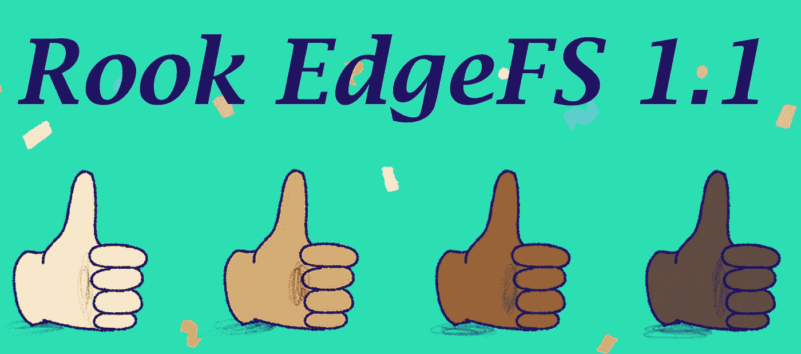
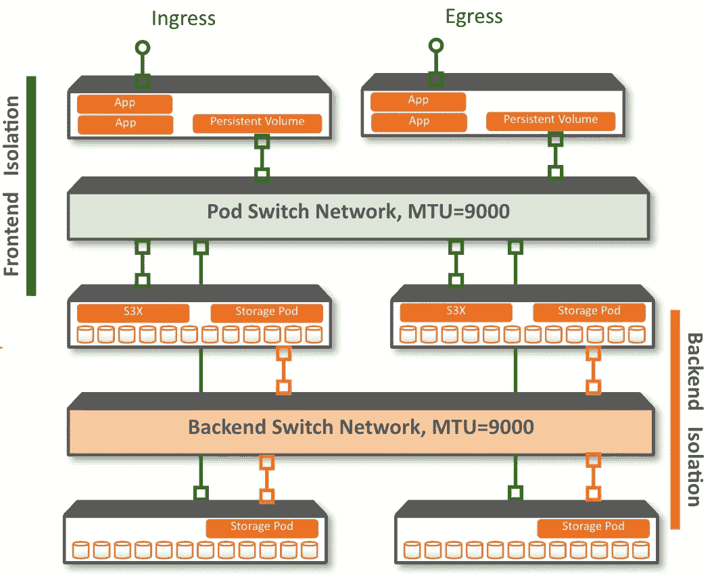
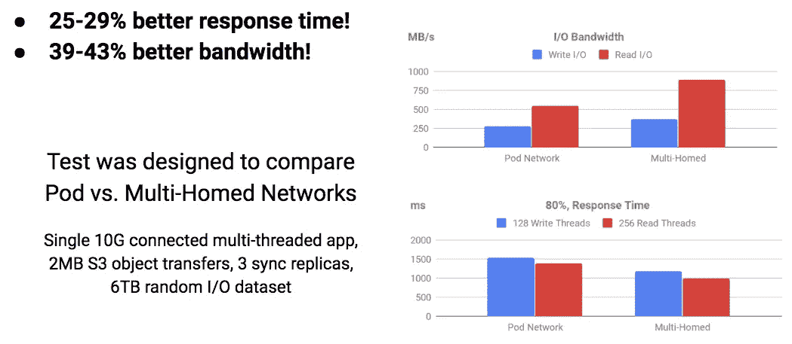

# Kubernetes Rook EdgeFS 1.1 发布

> 原文：<https://itnext.io/kubernetes-rook-edgefs-1-1-released-2e4359057849?source=collection_archive---------7----------------------->

## 借助全新的 Kubernetes Rook EdgeFS 稳定版，支持 Edge/IoT 和边缘本地分散计算使用案例。

在我的职业生涯中，我是许多协作小组和开源社区的成员，我不得不承认，Rook 社区是最开放、发展最快、最具包容性和最有效的社区！

Rook 社区是“包容性”的。这不再仅仅是 Ceph 的事了。其他 Kubernetes 车运营商正在蓬勃发展，社区正在迅速增长！

得益于包容性，Rook EdgeFS 社区在过去 6 个月增长了 230 %, EdgeFS 图像的 docker pulls 接近 100 万次！

# Rook EdgeFS CRDs 毕业于 V1

经过近一年的发展，这是一个重要的里程碑。我们从热衷于使用 Alpha1v1 的早期用户发展到拥有 Pb 级部署的大型用户，他们现在将从 Beta1v1 升级。提供了从 Beta1v1 升级的途径。

随着稳定的 CRD V1 API 的引入，Rook EdgeFS 运营商现已稳定，任何持续的变化将包括业务逻辑，以确保顺利升级路径。

# 多宿主网络

这项工作是由[赞助的谷歌代码之夏](https://www.cncf.io/blog/2019/08/23/cncf-joins-google-summer-of-code-2019-with-17-interns-projects-for-containerd-coredns-kubernetes-opa-prometheus-rook-and-more/) (GSoC)和@ [**giovanism**](https://app.slack.com/team/UHQJJL2MA) 已经完成了一项惊人的工作，将对多宿主网络的通用支持集成到 Rook 框架中！目前，Rook EdgeFS 操作符是唯一实现该功能的操作符。

多宿主网络的主要优势是增强了后端网络安全性和整体集群性能。

Rook 运营商现在可以灵活配置(初始集成包括 EdgeFS 对[英特尔 Multus](https://github.com/intel/multus-cni) 的支持)多宿主网络选择。

我强调网络隔离和安全优势是最重要的。隔离还提高了可靠性，即 pod 网络的暂时中断不会导致存储后端操作中断。

具有多宿主网络的 Rook EdgeFS 中前端与后端隔离的示例

我今年早些时候在上海的 KubeCon 上展示了以下对比结果，您可以看到延迟和带宽都有显著改善:

在多宿主网络中使用 Rook EdgeFS 的优势

你可以在这个 [youtube 视频](https://www.youtube.com/watch?v=h38FCAuOehc&amp=&index=76&amp=&t=0s)中了解更多关于多宿主网络的信息。

# 滚动升级支持

这是生产部署的必备功能。我很高兴地宣布，这一功能现已推出，任何后续版本都将支持无缝滚动升级，对数据服务可用性的影响极小。

# EdgeFS 目标窗格的动态添加和删除

EdgeFS 本身就支持这种功能。(*在生产中运行 EdgeFS 内核*)。然而，适当的 Kubernetes 集成需要时间。我很高兴地看到它现在已经登陆到 1.1 版本，我们已经有一些用户使用它的成功报告！

利用这一功能，用户可以轻松地增加集群配置，而无需重启全部服务。对于如何添加或删除配置有一定的限制。

参见如何[添加一个节点](https://github.com/rook/rook/blob/master/Documentation/edgefs-upgrade.md#1-add-node-example)的例子。

# 支持具有完整 ID 路径的设备规范

在 Linux 中，我们不能也不能使用块设备的内核表示，例如/dev/sda、/dev/sdb。服务器重新启动后，命名不再持续！1.1 现在支持完整的 id 路径规范，并且可以通过永久 ID 来寻址设备，例如/dev/disk/by-id/NAME

# 摘要

EdgeFS 的优势在于能够通过区块链级加密强大的安全保证和全局线内 WAN/LAN 重复数据删除，无缝连接数百个分布式位置。

> *EdgeFS 的主要用例是在分散的位置处理边缘产生的数据，而没有丢失副本和一致性的痛苦，同时显著降低云成本！*

Kubernetes 社区现在有一个稳定的、高性能的、分散的数据层来连接多个云和边缘位置，作为一个地理分布一致的名称空间。

Rook EdgeFS Kubernetes 社区欢迎新用户，并期待进一步提高 Kubernetes 本机存储解决方案的可用性、可靠性、可用性和易用性。

今天就试试吧！**星敝** [**GitHub 资源库**](https://github.com/Nexenta/edgefs) 告诉我们你的想法？

请加入我们日益壮大的社区，了解更多信息，网址为 [http://edgefs.io](http://edgefs.io/) 和 [http://rook.io](http://rook.io/)