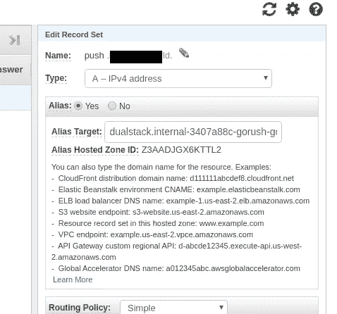

# Kubernetes:在 AWS 负载均衡器后面运行带有 Gorush 的推送服务器

> 原文：<https://itnext.io/kubernetes-running-a-push-server-with-gorush-behind-an-aws-loadbalancer-48563f9a0319?source=collection_archive---------7----------------------->


Gorush 是一个 Go-written 应用程序，我们计划用它向我们的移动客户端发送推送通知。

项目所在地—[https://github.com/appleboy/gorush](https://github.com/appleboy/gorush)

该服务将在我们的 Kubernetes 集群中的专用名称空间中运行，并且必须只能在集群的 VPC 中访问，因此我们将使用 AWS 的内部 ALB。

## 运行 Gorush 服务

## 命名空间

克隆存储库:

```
$ git clone [https://github.com/appleboy/gorush](https://github.com/appleboy/gorush)
$ cd gorush/k8s/
```

创建一个名称空间和一个`[confgiMap](https://kubernetes.io/docs/tasks/configure-pod-container/configure-pod-configmap/)`，用于配置对本地 Redis 服务的访问:

```
$ kubectl apply -f gorush-namespace.yaml
namespace/gorush created
$ kubectl apply -f gorush-configmap.yaml
configmap/gorush-config created
```

我们也可以稍后使用这个`configMap`为 Gorush 服务添加我们自己的配置文件。

检查资源:

```
$ kubectl -n gorush get cm
NAME DATA AGE
gorush-config 2 20s
```

## 雷迪斯

启动 Redis 服务:

```
$ kubectl apply -f gorush-redis-deployment.yaml
deployment.extensions/redis created
$ kubectl apply -f gorush-redis-service.yaml
service/redis created
```

## Gorush

我想在创建 Gorush 后用 Debian 添加一个额外的 pod 来运行测试，以确保它能正常工作，所以让我们用一个名为 *Bastion* 的新容器来更新部署文件`gorush-deployment.yaml`:

```
apiVersion: extensions/v1beta1
kind: Deployment
metadata:
  name: gorush
  namespace: gorush
spec:
  replicas: 3
  template:
    metadata:
      labels:
        app: gorush
        tier: frontend
    spec:
      containers:
      - image: appleboy/gorush
        name: gorush
        imagePullPolicy: Always
        ports:
        - containerPort: 8088
        livenessProbe:
          httpGet:
            path: /healthz
            port: 8088
          initialDelaySeconds: 3
          periodSeconds: 3
        env:
        - name: GORUSH_STAT_ENGINE
          valueFrom:
            configMapKeyRef:
              name: gorush-config
              key: stat.engine
        - name: GORUSH_STAT_REDIS_ADDR
          valueFrom:
            configMapKeyRef:
              name: gorush-config
              key: stat.redis.host
      - image: debian
        name: bastion
        command: ["sleep"]
        args: ["600"]
```

现在我们可以开始 Gorush 了:

```
$ kubectl apply -f gorush-deployment.yaml
deployment.extensions/gorush created
```

检查舱:

```
$ kubectl -n gorush get po
NAME READY STATUS RESTARTS AGE
gorush-59bd9dd4fc-dzm47 2/2 Running 0 8s
gorush-59bd9dd4fc-fkrhw 2/2 Running 0 8s
gorush-59bd9dd4fc-klsbz 2/2 Running 0 8s
redis-7d5844c58d-7j5jp 1/1 Running 0 3m1s
```

## AWS 内部应用程序负载平衡器

接下来要创建的是一个带有`[NodePort](https://rtfm.co.ua/en/kubernetes-part-1-architecture-and-main-components-overview/#NodePort)`的服务和一个`[Ingress](https://kubernetes.io/docs/concepts/services-networking/ingress/)`服务，后者将触发一个`[alb-ingress-controller](https://github.com/kubernetes-sigs/aws-alb-ingress-controller)`来在 AWS 帐户上创建一个新的负载平衡器。

更新`gorush-service.yaml`，取消`NodePort`的注释，并注释掉`LoadBalancer`行:

```
...
#type: LoadBalancer
type: NodePort
...
```

所以现在看起来像是:

```
apiVersion: v1
kind: Service
metadata:
  name: gorush
  namespace: gorush
  labels:
    app: gorush
    tier: frontend
spec:
  selector:
    app: gorush
    tier: frontend
  # if your cluster supports it, uncomment the following to automatically create
  # an external load-balanced IP for the frontend service.
  #type: LoadBalancer
  type: NodePort
  ports:
  - protocol: TCP
    port: 80
    targetPort: 8088
```

创建服务:

```
$ kubectl apply -f gorush-service.yaml
service/gorush created
```

让我们配置 ALB。更新`gorush-aws-alb-ingress.yaml`，添加`kubernetes.io/ingress.class: alb`以触发`alb-ingress-controller`，将*方案*更新为*内部*值，并设置子网和安全组的值。

另外，请注意这里的`servicePort`从原来的 *8088* 更改为 *80* ，因为我们使用了 ALB 和专用的`NodePort`服务:

```
apiVersion: extensions/v1beta1
kind: Ingress
metadata:
  name: gorush
  namespace: gorush
  annotations:
    # Kubernetes Ingress Controller for AWS ALB
    # [https://github.com/coreos/alb-ingress-controller](https://github.com/coreos/alb-ingress-controller)
    #alb.ingress.kubernetes.io/scheme: internet-facing
    kubernetes.io/ingress.class: alb
    alb.ingress.kubernetes.io/scheme: internal
    alb.ingress.kubernetes.io/subnets: subnet-010f9918532f52c6d, subnet-0f6dbde36b6669f48
    alb.ingress.kubernetes.io/security-groups: sg-0f1df776a767a2589
spec:
  rules:
  - http:
      paths:
      - path: /*
        backend:
          serviceName: gorush
          servicePort: 80
```

创建 ALB:

```
$ kubectl apply -f gorush-aws-alb-ingress.yaml
ingress.extensions/gorush created
```

查看`alb-ingress-controller`日志:

```
$ kubectl logs -f -n kube-system $(kubectl get po -n kube-system | egrep -o ‘alb-ingress[a-zA-Z0–9-]+’)
…
E0206 11:08:52.664554 1 controller.go:217] kubebuilder/controller “msg”=”Reconciler error” “error”=”no object matching key \”gorush/gorush\” in local store” “controller”=”alb-ingress-controller” “request”={“Namespace”:”gorush”,”Name”:”gorush”}
I0206 11:08:53.731420 1 loadbalancer.go:191] gorush/gorush: creating LoadBalancer 3407a88c-gorush-gorush-f66a
I0206 11:08:54.372743 1 loadbalancer.go:208] gorush/gorush: LoadBalancer 3407a88c-gorush-gorush-f66a created, ARN: arn:aws:elasticloadbalancing:us-east-2:534***385:loadbalancer/app/3407a88c-gorush-gorush-f66a/d31b461c65a278f0
I0206 11:08:54.516572 1 targetgroup.go:119] gorush/gorush: creating target group 3407a88c-e50bdf2f1d39b9db54c
…
I0206 11:08:57.215907 1 rules.go:98] gorush/gorush: rule 1 modified with conditions [{ Field: “path-pattern”, Values: [“/*”] }]
```

检查`Ingress`服务:

```
$ kubectl -n gorush get ingress
NAME HOSTS ADDRESS PORTS AGE
gorush * internal-3407a88c-gorush-gorush-f66a-***.us-east-2.elb.amazonaws.com 80 3m57s
```

## 测试 API

让我们连接到我们的 Bastion hos，安装`dnsutils`、`dnsping`和`curl`包。

要获得 Pod，我们可以使用以下命令:

```
$ kubectl -n gorush get pod | grep gorush | cut -d” “ -f 1 | tail -1
gorush-59bd9dd4fc-klsbz
```

并连接到*堡垒*:

```
$ kubectl -n gorush exec -ti $(kubectl -n gorush get pod | grep gorush | cut -d” “ -f 1 | tail -1) -c bastion bash
root@gorush-59bd9dd4fc-klsbz:/#
```

安装必要的实用程序，并检查我们的推送服务是否正常工作:

```
root@gorush-59bd9dd4fc-klsbz:/# apt update && apt -y install dnsutils curl dnsdiagroot@gorush-59bd9dd4fc-klsbz:/# curl dualstack.internal-3407a88c-gorush-gorush-f66a-***.us-east-2.elb.amazonaws.com
{“text”:”Welcome to notification server.”}
```

目前看来不错。

## 53 号公路

让我们检查一下我们的内部 ALB 是否被解析为私有 IP，因为它的类型被设置为 *Internal* :

```
root@gorush-59bd9dd4fc-klsbz:/# dig +short dualstack.internal-3407a88c-gorush-gorush-f66a-***.us-east-2.elb.amazonaws.com
10.0.15.167
10.0.23.138
```

很好。

我们希望使用自己的 URL 来访问上面创建的 ALB，所以让我们转到 AWS Route53，像往常一样添加一条指向 ALB 的新记录—通过一个`ALIAS`:



并从 *Bastion* 发出`GET`请求，使其在 VPS 内部运行，使用自己的 DNS 将域解析为 ALB 的私有 IP:

```
root@gorush-59bd9dd4fc-klsbz:/# dig push.example.com +short
10.0.23.138
10.0.15.167
```

该服务:

```
root@gorush-59bd9dd4fc-klsbz:/# curl push.example.com
{“text”:”Welcome to notification server.”}
```

完成了。

*最初发布于* [*RTFM: Linux、DevOps 和系统管理*](https://rtfm.co.ua/en/kubernetes-running-a-push-server-with-gorush-behind-an-aws-loadbalancer/) *。*