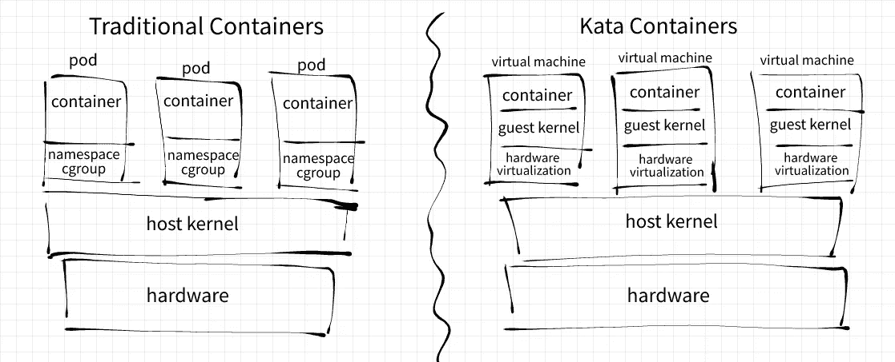
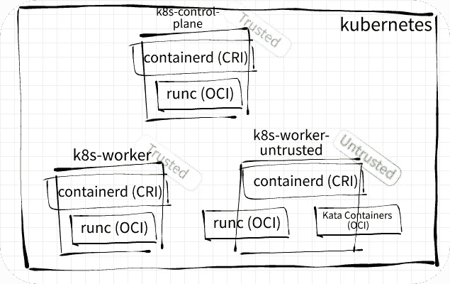

# Kubernetes —运行多个容器运行时

> 原文：<https://itnext.io/kubernetes-running-multiple-container-runtimes-65220b4f9ef4?source=collection_archive---------0----------------------->

在这篇文章中，我想向你展示如何在 Kubernetes 上运行多个 OCI 容器运行时。您将看到如何配置 containerd 来运行 runC 和 Kata 容器。然后我们将使用 Kubernetes `RuntimeClass` API 让工作负载选择不同的容器运行时。

# 为什么不同的容器运行时

当多个租户共享一个集群时，工作负载的异构性通常意味着不同的执行和数据信任边界。这样的集群拥有一组管理和操作集群所需的可信中央服务，同时还托管不同租户拥有的“不可信”工作负载，这种情况并不少见。虽然依赖于 Linux 名称空间和 cgroup 的通用容器化方法可能适合运行可信工作负载，但是使用基于管理程序的容器化技术的更强的工作负载隔离可能更好地减轻与支持不可信工作负载相关联的威胁模型。

另一个例子涉及 GPU 工作负载，其中基于虚拟机管理程序的容器运行时可用于支持 GPU 直通和 GPU 中介直通。[单根 I/O 虚拟化(SR-IOV)](https://github.com/kata-containers/kata-containers/blob/main/docs/use-cases/using-SRIOV-and-kata.md) 和[高性能用户模式应用](https://github.com/kata-containers/kata-containers/blob/main/docs/use-cases/using-SPDK-vhostuser-and-kata.md)也可以通过非传统容器运行时得到更好的服务。

Kubernetes 提供了`[RuntimeClass](https://kubernetes.io/docs/concepts/containers/runtime-class/)` [API](https://kubernetes.io/docs/concepts/containers/runtime-class/) ，允许工作负载选择最适合其需求的容器运行时。这个资源最初是在 Kubernetes 1.12 中作为自定义资源定义(CRD)引入的。后来在 Kubernetes 1.14 中，它被实现为内置的集群资源。

# 关于形容器

Kata Containers 是一个开源容器运行时，它在轻量级虚拟机上运行容器工作负载。它利用硬件虚拟化技术来实施强大的工作负载隔离。基于 [Clear Linux](https://clearlinux.org/) 的专用最小来宾 Linux 内核和来宾映像运行工作负载。这种部署模型确保容器化的流程不再能够访问主机内核。它简化了主机内核上防止容器利用所需的安全策略。

传统容器与形容器

Kata Containers 是 OCI 兼容的，通过一个 CRI 兼容的垫片与 containerd 一起工作。它利用 Linux 流量控制在容器的`veth`接口和虚拟机的`TAP`接口之间重定向流量。有关 Kata 容器架构的更多信息，请参见其文档[这里](https://github.com/kata-containers/kata-containers/blob/main/docs/design/architecture.md)。

至此，让我们继续设置和配置 Kubernetes 来使用 runC 和 Kata 容器🚢🚢🚢！

# 调配 Kubernetes 集群

在我的设置中，我使用`kubeadm`提供了一个 Kubernetes v1.22.0 集群。我的集群中使用的 containerd 版本是 1.4.9。

本节的剩余部分将只强调相关的安装和配置步骤。关于使用`kubeadm`供应 Kubernetes 的详细信息可以在 Kubernetes [文档](https://kubernetes.io/docs/setup/production-environment/tools/kubeadm/create-cluster-kubeadm/)中找到，以及关于 i [安装容器](https://kubernetes.io/docs/setup/production-environment/container-runtimes/#containerd)的重要信息。

👷*不需要* `*docker-ce*` *和* `*docker-ce-cli*` *软件包就可以安装* `*containerd.io*` *软件包。*

我的集群由 3 个 DigitalOcean droplets 组成，拥有 4GB 内存和 2 个 CPU，运行 Ubuntu 20.04:

*   托管 Kubernetes 控制平面
*   `k8s-worker`使用 runC 服务可信工作负载
*   `k8s-worker-untrusted`使用 runC 和 Kata 容器来服务工作负载，不可信的工作负载被指定给 Kata 容器

我使用 [Calico](https://docs.projectcalico.org/getting-started/kubernetes/quickstart) 作为 CNI 插件来支持 pod 网络。

在使用`kubeadm init`命令初始化控制平面之前，让我们在每个节点上的`/etc/containerd/config.toml`处修改容器的配置文件。

🔧*`*kata-deploy*`*工具是在 Kubernetes 上安装 Kata 容器的简单方法。出于演示的目的，我将在本文中手动配置 containerd 并安装 Kata 容器。**

# *用 Kata 容器配置 containerd*

*📝*所有后续代码示例都需要对集群节点的直接 SSH 访问，以及在节点上修改容器的配置文件的权限。**

*使用`containerd config default`命令在所有节点上重新生成 containerd 的默认配置:*

*重新生成 containerd 的默认配置*

*在将要安装 Kata 容器的`k8s-worker-untrusted`节点上，为容器的配置文件打补丁，如下所示:*

*修补 containerd 的配置文件以包含 kata shimv2*

*这个补丁用`kata`处理程序扩展了容器的`cri`插件。正如在 [Kubernetes 文档](https://kubernetes.io/docs/concepts/containers/runtime-class/#hahahugoshortcode-s3-hbhb)中所解释的，这个处理程序的名称将在后面的`RuntimeClass`资源规范中引用。*

*containerd 使用`runtime_type`属性来标识与底层 OCI 运行时交互所需的垫片。containerd 通过在句柄名称和版本前面加上前缀`containerd-shim`将`runtime_type`翻译成 shim 的二进制名称。比如`io.containerd.kata.v2`翻译成`containerd-shim-kata-v2`，`io.containerd.runc.v1`变成`containerd-shim-runc-v1`等等。*

*`containerd-shim-kata-v2`实现了[容器运行时 V2](https://github.com/containerd/containerd/blob/main/runtime/v2/README.md) API。通过这个垫片，Kubernetes 将能够指导卡塔推出吊舱和 OCI 兼容的容器。*

*将`privileged_without_host_devices`属性设置为`true`会将 containerd 配置为不允许特权 kata 容器直接访问主机设备。*

*📝*这个补丁没有故意禁用 runC，以显示一个节点能够托管多个容器运行时。**

*成功应用补丁后，使用`systemctl`重启 containerd:*

*使用 systemctl 重新启动 containerd*

# *在不受信任的节点上安装 Kata 容器*

*使用`snap`在`k8s-worker-untrusted`节点上安装 Kata 容器 2.1.1:*

*在不受信任的节点上安装 Kata 容器*

*使用`kata-containers.runtime` CLI 确保`k8s-worker-untrusted`节点可以运行 Kata 容器:*

*确保不受信任的节点可以运行 Kata 容器*

# *初始化 Kubernetes 控制平面*

*用`kubeadm init`命令初始化`k8s-control-plane`节点上的 Kubernetes 控制平面:*

*初始化 Kubernetes 控制平面*

*在`k8s-worker`和`k8s-worker-untrusted`节点上，使用`kubeadm join`命令将工作者加入控制平面:*

*将工人加入控制平面*

*确认所有节点都正常运行:*

*确认所有节点都正常*

*所有后续的`kubectl`命令都使用由`kubeadm`生成的默认 kubeconfig，它可以在`k8s-control-plane`节点的`/etc/kubernetes`文件夹中找到。*

# *调度不可信的工作负载*

*为了确保所有不可信的工作负载都将被调度到`k8s-worker-untrusted`节点上，我们将[用任意的`example.org/workload=untrusted`标签来标记](https://kubernetes.io/docs/concepts/scheduling-eviction/taint-and-toleration/)和[节点:](https://kubernetes.io/docs/concepts/scheduling-eviction/assign-pod-node/#nodeselector)*

*污染并标记 k8s-worker-不可信节点*

*创建 kata `RuntimeClass`资源:*

*创建 kata RuntimeClass 资源*

*创建“不受信任的”`Deployment`资源，其中 pod 由一个`curl`容器和一个`nginx`容器组成:*

*部署不受信任的工作负载*

*确认`nginx-untrusted`部署成功铺开:*

*确认不受信任的工作负载已成功转出*

## *检查 QEMU 流程*

*让我们检查一下`k8s-worker-untrusted`节点上 pod 的 QEMU 过程:*

*检查 pod 的 QEMU 流程*

*应该只有一个 QEMU 进程，即使 pod 运行 2 个容器。关于加载的设备和到`vmlinuz`内核的路径的信息可以在进程参数中看到。*

*在我的设置中，`vmlinuz-5.10.25.container`访客内核的大小约为 5.2MB。相比之下，同一个 droplet 上的`vmlinuz-5.4.0-80-generic`主机内核大约是 12MB。这种小内核使得它能够相对快速地旋转新的豆荚。*

## *访问来宾虚拟机控制台*

*`kata-containers.runtime` CLI 有一个`exec`命令，它提供了一种通过调试控制台进入客户虚拟机的机制。*

*⚠️ *默认* [*清除 Linux*](https://clearlinux.org/) *镜像可能不会返回一个* `*tty*` *带全 shell 访问。参见本* [*GitHub 一期*](https://github.com/kata-containers/kata-containers/issues/2010) *。**

*要使用此功能，请在`/etc/kata-runtime/configuration.toml`配置文件中启用 kata 代理的`debug_console_enabled` 属性:*

*启用 kata 代理的 debug_console_enabled 属性*

*在`k8s-worker-untrusted`节点上启动`kata-monitor`进程:*

*启动形监控程序*

*然后使用沙箱 ID 作为参数执行`kata-containers.runtime exec`命令:*

*使用“kata-containers.rutime exec”命令访问来宾虚拟机控制台*

*🤔*如果我们将* `*nginx-untrusted*` *工作负载扩展到 3 个副本，您认为最终会有多少台虚拟机？我们最终会有 3 台虚拟机吗？或者这 6 个容器最终会共享同一个虚拟机吗？你认为缩放操作需要多长时间？**

# *可信和不可信工作负载之间的差异*

*作为最后的测试，我们将使用相同的 pod 规范部署类似的`Deployment`资源。该工作负载将扮演我们的“可信”工作负载的角色:*

*部署可信工作负载*

*这是我的`default`名称空间在扩展不可信工作负载和部署可信工作负载后的样子:*

*包含可信和不可信工作负载的“默认”命名空间*

*请注意，所有受信任的 pod 都被安排在`k8s-worker`节点上运行，而不受信任的 pod 则在`k8s-worker-untrusted`节点上运行。*

*此时，在可信和不可信工作负载之间没有任何强制的网络边界。豆荚可以自由地互相交谈。*

*例如，我可以使用可信的`curl`来联系不可信的`nginx`:*

*可信的 curl 可以到达不可信的 nginx*

*我也可以使用不可信的`curl`联系可信的`nginx`:*

*不可信的 curl 可以到达可信的 nginx*

*部署`[NetworkPolicy](https://kubernetes.io/docs/concepts/services-networking/network-policies/)`资源来限制可信域和不可信域之间的流量的任务将留给读者来完成。*

# *结论*

*在本文中，我们使用`kubeadm`在 DigitalOcean 上提供了一个 Kubernetes v1.22.0 集群。我们指定一个节点为可信工作负载服务，而另一个节点为不可信工作负载服务。在初始化集群之前，我们手动修补 containerd 的配置文件，并在不受信任的节点上安装 Kata 容器。在实际设置中，`[kata-deploy](https://github.com/kata-containers/kata-containers/tree/main/tools/packaging/kata-deploy)`工具将是在 Kubernetes 上部署 Kata 容器的更好选择。*

*然后，我们将可信和不可信工作负载部署到集群上。通过使用适当的[污点](https://kubernetes.io/docs/concepts/scheduling-eviction/taint-and-toleration/)和[标签](https://kubernetes.io/docs/concepts/scheduling-eviction/assign-pod-node/#nodeselector)，所有不可信的工作负载都被调度到不可信的节点上运行。尽管可信和不可信工作负载由不同的容器运行时提供服务，但是它们能够相互通信。部署`[NetworkPolicy](https://kubernetes.io/docs/concepts/services-networking/network-policies/)`资源以加强可信域和不可信域之间的网络边界的任务留给读者来完成。*