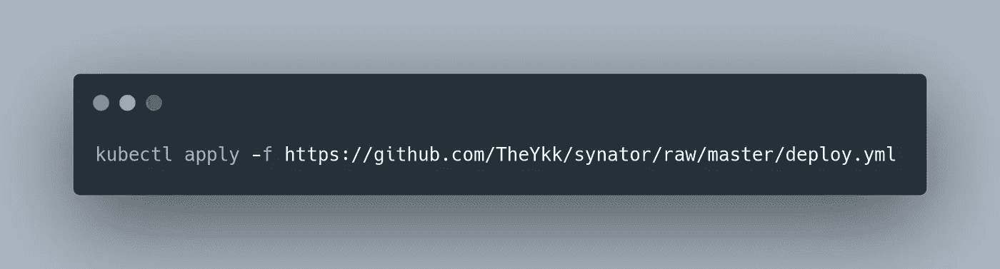
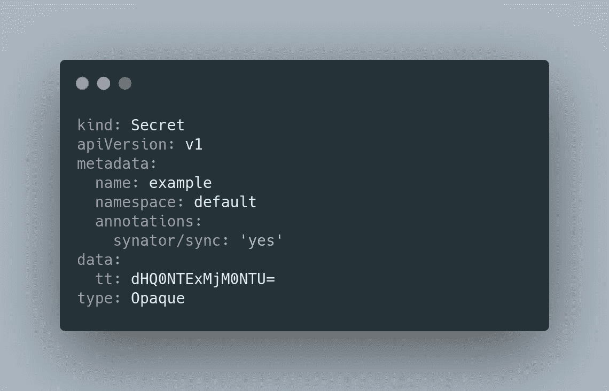
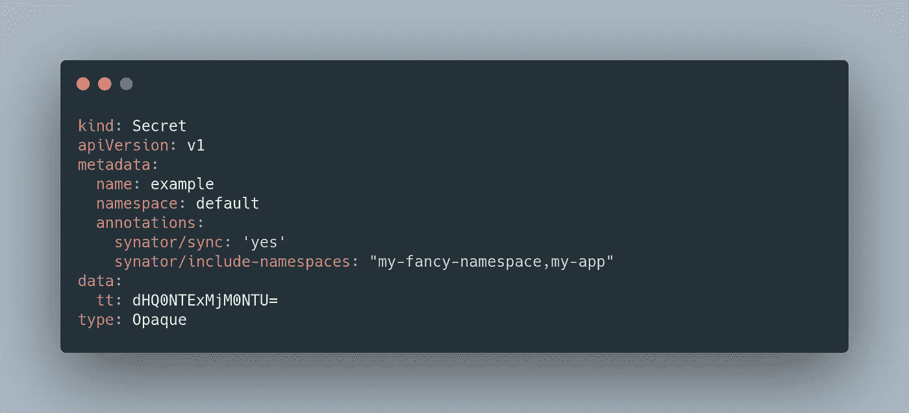
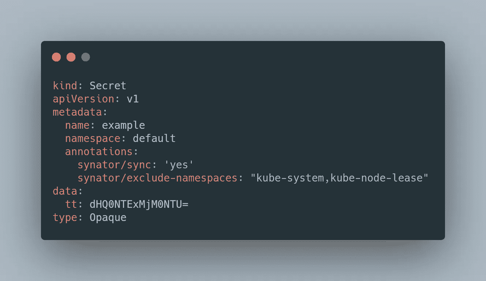
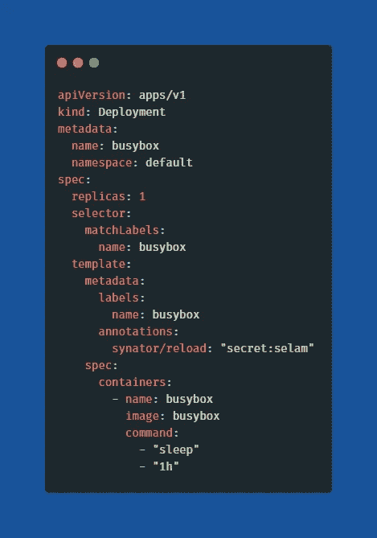

# Kubernetes Secret 和配置图同步

> 原文：<https://itnext.io/kubernetes-secret-and-configmap-sync-6c6b9f906b0d?source=collection_archive---------2----------------------->

清水久美子在 [Unsplash](https://unsplash.com?utm_source=medium&utm_medium=referral) 上的照片

嗨，

今天我想说说我为什么写 k8s secret sync operator，我是怎么编码的。

有时我们想在不同的名称空间中使用秘密，不幸的是，我们不能没有任何帮助操作符或手动复制，因为在 kubernetes 中秘密和配置映射是名称空间。当我们有一些名称空间和秘密时，我们可以复制秘密和配置映射。但是当我们有几十个名称空间时，这可能会非常复杂。正因为如此，我用 python 和 Kopf 编写了一个小的 Kubernetes 操作符。这个项目的名字是 Synator，我在 Github 上开源分享的，你可以在这里查看。

第一次编写 K8s 操作符，我想选择一个简单的框架。Kopf 非常适合这个。Helm [文档](https://kopf.readthedocs.io/)非常好，非常好用。我使用了 [Kubernetes Python 客户端](https://github.com/kubernetes-client/python)与 Kubernetes API 进行通信。

K8s 上的 synator 很好用。我们所要做的就是将 [deploy.yml](https://github.com/TheYkk/synator/blob/master/deploy.yml) 部署到 Kubernetes。

在此 YAML 中有 ServiceAccount、ClusterRole 和 Deployment。ServiceAccount 和 ClusterRole 需要与 Kubernetes API 进行通信，该 API 为我们生成令牌并将它们直接注入到 pod 中。

部署 synator 之后，我们可以通过向我们想要的 Secret 或 ConfigMap 添加 synator/sync=yes 注释来启动同步过程。

如果我们只想复制到特定的名称空间，synator/include-namespaces = ' namespace 1，namespace2 '可以用注释来完成。

如果我们不希望它被复制到特定的名称空间，我们可以使用 synator/exclude-namespaces = ' kube-system，kube-node-lease '注释。

最后，我想说一下我添加的功能。刷新密码或配置图时，重新启动 pod。

为此，我们只需将 synator/reload:“secret:example”添加到 pod 模板中。

感谢您阅读我的文章。祝你工作愉快。