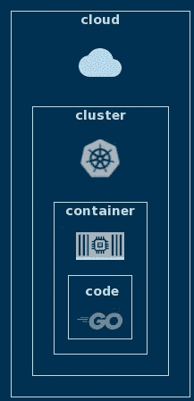
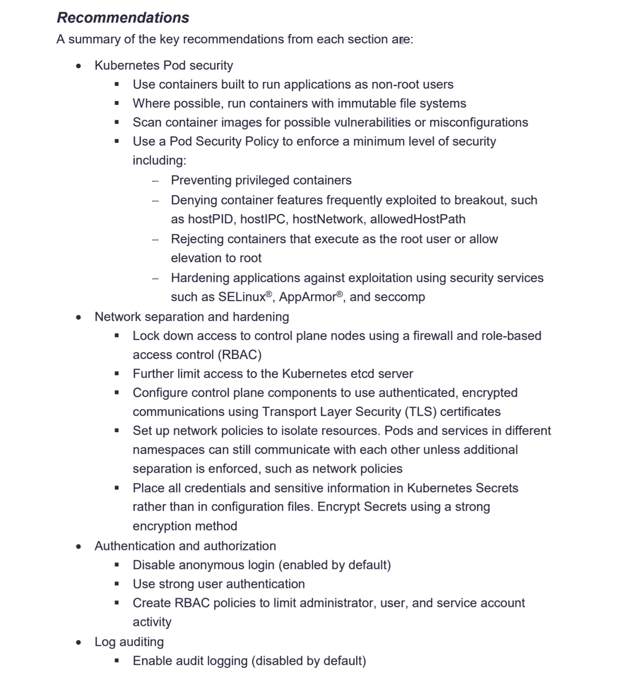
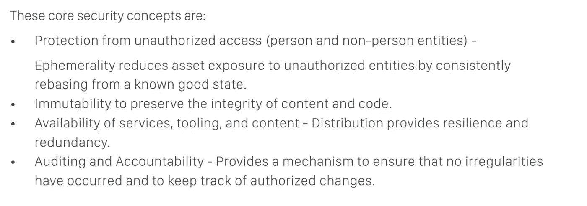

# Kubernetes 安全和强化指南

> 原文：<https://itnext.io/kubernetes-security-hardening-guidance-cf5fc48a9b3e?source=collection_archive---------1----------------------->

图片由来自[皮克斯拜](https://pixabay.com/?utm_source=link-attribution&utm_medium=referral&utm_campaign=image&utm_content=3400657)的[皮特·林福思](https://pixabay.com/users/thedigitalartist-202249/?utm_source=link-attribution&utm_medium=referral&utm_campaign=image&utm_content=3400657)拍摄

文档、工具、指南

## 介绍

> 在网络安全的世界里，你最不想看到的就是被人盯上。
> 
> [蒂姆·库克](https://en.wikipedia.org/wiki/Tim_Cook)

Kubernetes 是一个复杂的分布式系统，具有同样复杂的安全需求。加固和保护 Kubernetes 需要专业知识、经验和勤奋，这些在市场上很难找到。

每一点经过验证的指导，提高对安全或面向安全的工具的重要性的认识都是非常有价值的。

在本文中，我们将探讨云原生和 Kubernetes 安全性中的模式。这些模式基于两份有趣的安全相关出版物，一份来自美国国家安全局(NSA)，另一份来自云计算原生计算基金会(CNCF)。

## Kubernetes 强化和安全指南

有一些可靠的来源可以了解 Kubernetes 安全性和强化最佳实践。我不隶属于这些公司中的任何一家，我只是认为他们在安全领域的产品和内容是有用的，是经过深思熟虑的。

*   美国国家安全局(NSA)发布了 [Kubernetes 强化指南](https://media.defense.gov/2021/Aug/03/2002820425/-1/-1/1/CTR_KUBERNETES%20HARDENING%20GUIDANCE.PDF)。本文提供了强化 Kubernetes 集群的实用建议。
*   [云原生安全白皮书](https://github.com/cncf/tag-security/blob/main/security-whitepaper/CNCF_cloud-native-security-whitepaper-Nov2020.pdf)于去年 11 月发布。本文档描述了云原生应用和基础架构组件(如 Kubernetes)的整个生命周期中的云原生安全性。
*   [Sysdig](https://sysdig.com/) 是一家专门做 Kubernetes 安全的公司。他们创造了 [Falco](https://falco.org/) ，一个云原生运行时威胁检测引擎。他们的网页提供了许多关于安全的有用链接和材料。
*   [水上安全](https://www.aquasec.com/)。与 Sysdig 类似，大量开源工具，如 [trivy](https://github.com/aquasecurity/trivy) 、 [kube-bench](https://github.com/aquasecurity/kube-bench) 等。
*   [Synk](https://snyk.io/) 。开发者第一的云原生应用安全产品，用于监控和修复 Docker 和 Kubernetes 的安全问题。

## 基础知识:云原生系统的 4c

在我们继续深入了解出版物中的建议和发现之前，让我们提醒一下云原生安全性的基本心理模型。

想象一下由 4 个不同层组成的云原生安全边界。从外层到最内层:

*   **云**:公共、私有或本地，这是托管您所有基础设施的地方，包括 Kubernetes
*   **集群**:托管或自托管的 Kubernetes 集群
*   **容器**:运行时结构，比如托管应用和工作负载的容器或容器
*   **代码**:您的应用程序、服务器或其他自定义代码，通常执行业务逻辑或进行计算

来源:作者

## 国家安全局的报告摘要

为了更深入地了解 Kubernetes 安全性，让我们来看看 NSA 发布的 Kubernetes 强化指导文档中的关键建议摘要。

来源:[https://media . defense . gov/2021/Aug/03/2002820425/-1/-1/1/CTR _ KUBERNETES % 20 hardening % 20 guidance。PDF](https://media.defense.gov/2021/Aug/03/2002820425/-1/-1/1/CTR_KUBERNETES%20HARDENING%20GUIDANCE.PDF)

这些建议抓住了 Kubernetes 攻击面的关键方面:

*   **工作负载**:pods 的运行时安全性，映像的构建时安全性，pods 执行方式的错误配置，缺乏安全上下文。
*   **联网**:资源访问、流量加密、进程隔离、资源间的安全通信
*   **集群访问**:访问集群，集群操作，RBAC
*   **可观察性**:日志记录、实时监控和审计

## 云原生安全性白皮书核心概念

云原生安全白皮书总结了这些核心安全概念:

来源:[https://github . com/cncf/tag-security/blob/main/security-white paper/CNCF _ cloud-native-security-white paper-nov2020 . pdf](https://github.com/cncf/tag-security/blob/main/security-whitepaper/CNCF_cloud-native-security-whitepaper-Nov2020.pdf)

您可以看到 NSA 强化指南和本文档是如何从不同方面描述相同的安全问题的。

*   **工作负载**:强调工作负载的不变性
*   **集群接入和联网**:外部接入和进程间通信
*   **更高的服务可用性:**通过冗余和分布式架构
*   **可观察性**强调变更跟踪和审计

## 我想了解更多

如果您想将 Kubernetes 的安全和强化提升到一个新的水平，请考虑 [Kubernetes 认证安全专家认证(CKS)](https://github.com/cncf/curriculum/blob/master/CKS_Curriculum_%20v1.21.pdf) 。

您可以通过一项具有挑战性的考试来获得该证书，该考试将测试您在 Kubernetes 安全性各方面的知识。

## 结论

在过去，安全性可能被认为是不可避免的灾祸，是项目可交付性的障碍。那些日子已经一去不复返了，如今安全性很早就融入了现代软件开发实践中。

安全意识在增强，防御策略变得越来越复杂，但攻击和渗透方法也是如此。在这个不断发展的时代，保持专注并始终领先威胁一步至关重要。