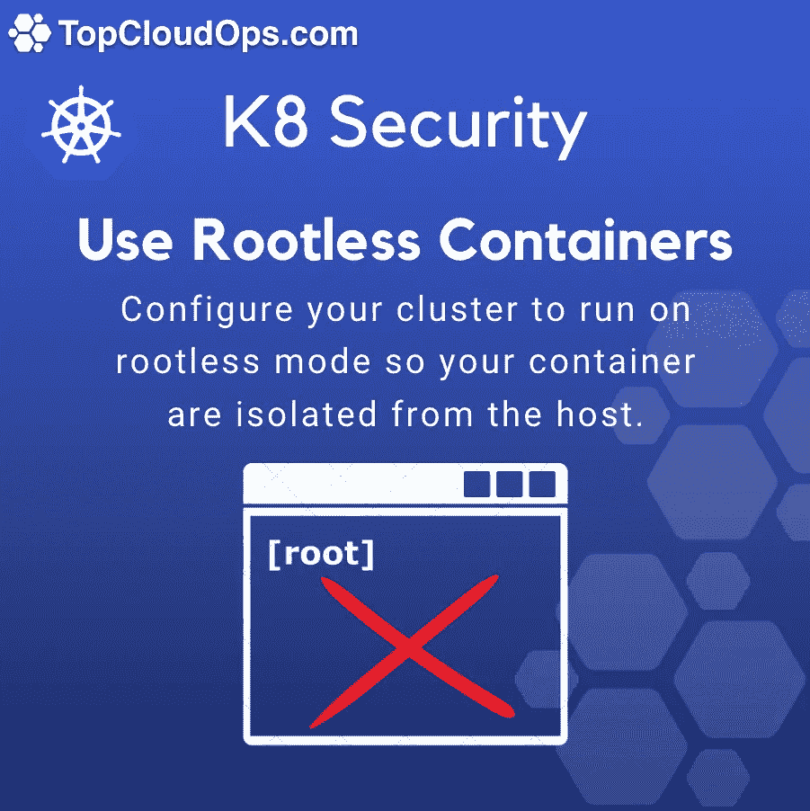

# Kubernetes 安全性:无根容器

> 原文：<https://itnext.io/kubernetes-security-rootless-containers-f5b6825cab53?source=collection_archive---------5----------------------->

我叫 Guillermo Quiros，是 topcloudops.com 的一名 AWS 解决方案架构师和 Kubernetes 专家。众所周知，我们生活在一个不确定的时代，现在我们比以往任何时候都更需要关注安全最佳实践。

许多人不知道的一件事是，当我们在 Kubernetes 下运行容器时，会发生两件事危及我们节点的安全性:

1.  容器与其余容器共享主机内核。
2.  当您运行容器时，默认模式是容器的用户拥有 root 权限，并且容器内的 root 与主机上的 root 相同。

这是一个安全风险，因为容器内的用户可以作为根用户访问主机，这意味着您可以访问整个主机节点。这有什么错呢？这意味着您可以访问主机文件系统和所有进程…

因此，这里的问题是，我们如何管理容器上的 root 权限，而不是主机上的权限，因为如果我们没有 root 权限，就很难使用容器，因为我们可能需要安装软件包，并更改配置文件…

这就是无根容器来拯救我们的地方。无根容器让我们可以在容器级别上做任何事情，只需在主机上拥有有限的特权。我们之所以能够做到这一点，是因为 Linux 使我们能够创建用户名称空间，用户名称空间允许我们在这些新的名称空间下作为根用户运行，但在主机名称空间下作为无特权用户运行。

要了解如何在无根模式下运行集群，请查看以下文档:

 [## 以非根用户身份运行 Kubernetes 节点组件

### 功能状态:Kubernetes v1.22 [alpha]这个文档描述了如何运行 Kubernetes 节点组件，比如 kubelet…

kubernetes.io](https://kubernetes.io/docs/tasks/administer-cluster/kubelet-in-userns/) 

https://rootlesscontaine.rs/getting-started/kubernetes/