# Kubernetes 无服务器简单直观地解释

> 原文：<https://itnext.io/kubernetes-serverless-simply-visually-explained-ccf7be05a689?source=collection_archive---------0----------------------->

## 我们以一种简单明了且与工具无关的方式探索使 Kubernetes 无服务器化的方法

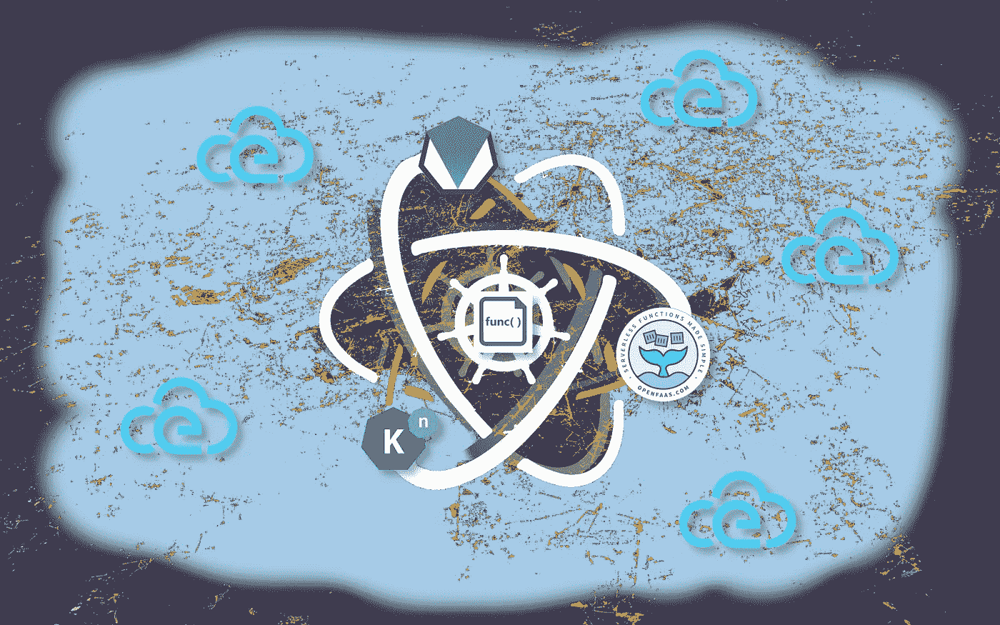

## 系列内容

*   第 1 部分: [Kubernetes 服务简单直观地解释了](https://medium.com/swlh/kubernetes-services-simply-visually-explained-2d84e58d70e5?source=friends_link&sk=49a5e832662a689111a6087e1fe1232a)
*   第二部分: [Kubernetes Ingress 简单直观讲解](https://codeburst.io/kubernetes-ingress-simply-visually-explained-d9cad44e4419?source=friends_link&sk=e8ca596700f5b58c7ab0d85d4dab6386)
*   第 3 部分: [Kubernetes Istio 简单直观讲解](https://medium.com/@wuestkamp/kubernetes-istio-simply-visually-explained-58a7d158b83f?source=friends_link&sk=378ed718d2d6cfd09e6d23c7616cba81)
*   第四部分:(本文)

## 这篇文章是关于什么的

*   你辛苦学到的 Kubernetes 知识会因为无服务器而变得过时吗，你浪费了 3 年的生命吗？
*   如何使用无服务器而不被云提供商锁定？
*   这不是具体工具的比较，而是一般的想法

## TL；速度三角形定位法(dead reckoning)

Kubernetes 上的无服务器以独立于云提供商的方式减少了重复配置。这只是不断自动化人工工作的结果。

当我们在 Kubernetes 上谈论无服务器时，我们需要考虑两个不同的领域:

1.  **在集群中部署无服务器应用**(减少每个应用+自动构建容器所需的 YAML 文件数量)
2.  **在不管理节点/虚拟机的情况下运行 pods 的容器无服务器**

# 无服务器

简而言之:您没有或很少与运行应用程序所必需的服务器和基础设施进行交互。当今天使用“无服务器”这个词时，它可以指两种不同的东西:CaaS 和 FaaS。

## CaaS —容器即服务

你创建(Docker)容器，把它扔给 CaaS，它就会自动运行、服务和扩展它。

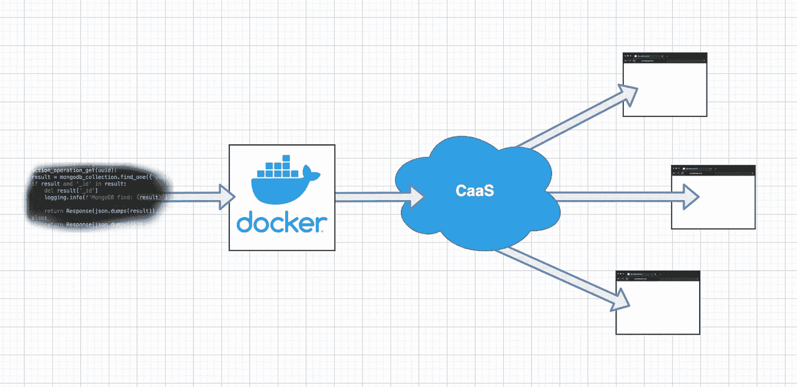

托管的例子有 Azure 容器实例、Google Cloud Run 或 AWS Fargate。

## FaaS —功能即服务

你编写代码，把它扔向 FaaS，它就会自动运行、服务和扩展它。

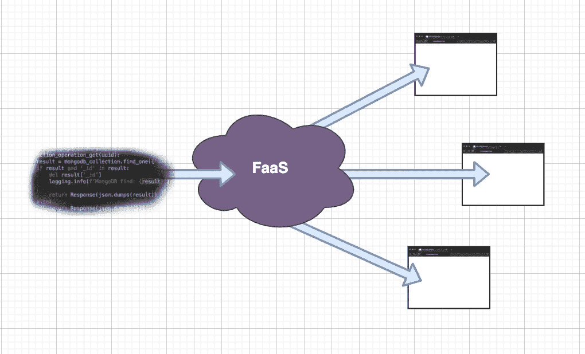

托管的例子有 Azure 函数、Google 函数或 AWS Lambda。

## FaaS 实施

FaaS 如何运行您的代码可以以不同的方式发生。**一种方式**可能是 FaaS 实际上为每个代码更改构建一个容器，然后像这样使用 CaaS:

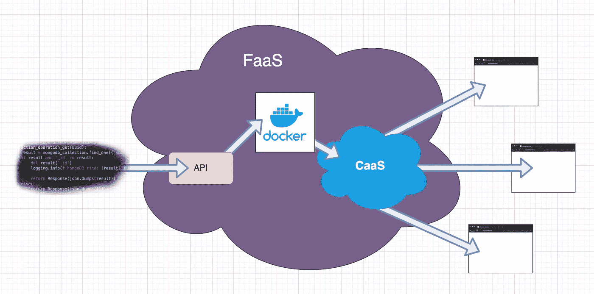

FaaS 建造了一个集装箱，并将其发送到民航局

**另一种方式**可以是 FaaS 在引导期间动态地将函数的源代码拉入预定义的环境(容器)中。环境将可用于不同的语言。当使用像 Go 这样必须编译的语言时，编译也必须在启动时完成。

# 事件/缩放

FaaS 大部分时间与触发函数实例化的事件系统一起使用。事件可以来自 API-Gateways、Github、Kafka、RabbitMQ、CronJobs 等。

FaaS 封装了与事件源的通信

对于每个事件，都会创建一个新的函数来处理它。如果有多个事件同时发生，将创建多个实例来处理这些事件。这样我们就有了自动缩放。

FaaS 与各种事件源进行通信，因此函数本身不需要这样做。他们只需处理 FaaS 使用的一种事件格式，如 CloudEvents 或通过 HTTP 的传输。

[https://cloudevents.io](https://cloudevents.io/)

有一个[云事件项目](http://cloudevents.io)，它将事件的结构和元数据描述为一个“标准”。它还包括数据和描述该数据的模式。云事件是包裹事件数据的信封。如果许多供应商都采用这种方法来获得互操作性，那就太好了。

# Kubernetes 应用

让我们看看在 Kubernetes 上开发一个传统的**非无服务器**应用程序的必要步骤:

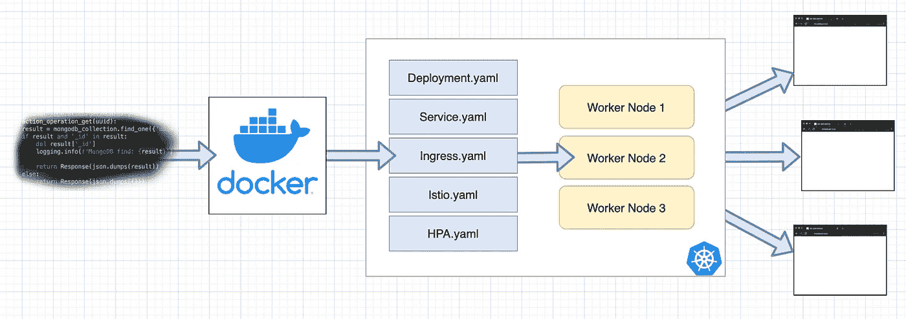

相当多的手动“服务器”交互是必要的

我们需要构建一个容器，创建各种 Kubernetes 资源(YAML 文件)，然后决定我们需要多少工作节点来运行我们的应用程序。

通过配置集群/节点自动缩放器，可以更动态地决定我们需要多少工作节点。尽管如此，我们仍然需要对其进行配置，并需要设置最小+最大节点数量。

我们使用这种传统方法与“服务器”进行大量的交互。首先创建/构建一个容器，然后编写 YAML 文件并定义节点的数量和资源。

# Kubernetes 无服务器应用程序

现在让我们探索一下为 Kubernetes 开发应用程序时的无服务器方法。

## CaaS —容器即服务

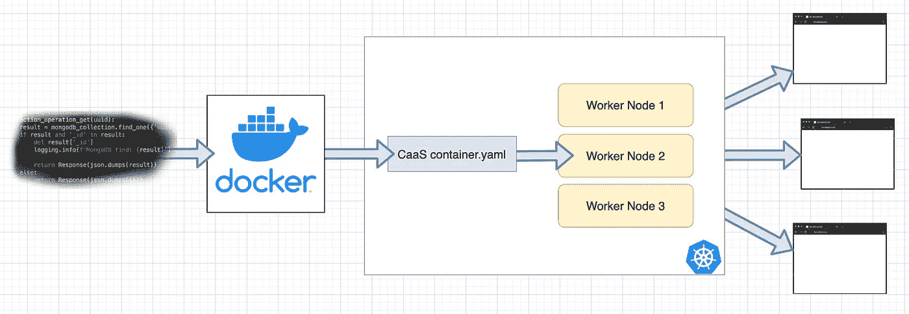

我们减少了大量 YAML 文件的创建

在这里，我们大大减少了要创建的 Kubernetes 资源(YAML 文件)的数量。CaaS 将为我们创建所有必要的子资源，如自动缩放、入口或 Istio 路由。

我们所做的就是提供一个(Docker)容器并创建一个单一的 k8s 资源，即通过 [CRD](https://kubernetes.io/docs/concepts/extend-kubernetes/api-extension/custom-resources/) 引入的 CaaS-container 资源。CaaS 决定何时启动我们的应用程序实例，以及启动多少个实例，可能基于事件或我们的定义。

我们必须确保我们构建的容器可以接收和处理来自 CaaS 的事件，例如可以通过 HTTP 或 CloudEvents。这可能需要容器中的某些库。

CaaS 示例: [Knative](https://knative.dev/) (Knative 提供了其他解决方案可以使用和依赖的灵活构件)。

## FaaS —功能即服务

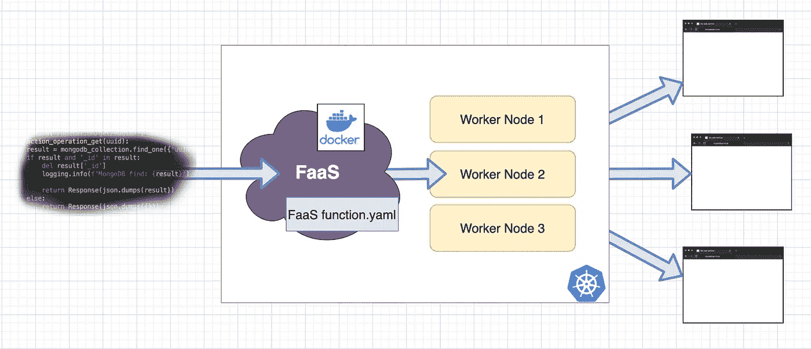

我们现在也自动化了构建过程，也许会有一个漂亮的 FaaS 网络界面

`FaaS function.yml`将包含一个来自 FaaS 系统的 K8s 资源，通过 [CRD](https://kubernetes.io/docs/concepts/extend-kubernetes/api-extension/custom-resources/) 引入。在该资源中，我们设置诸如函数名、源代码位置、语言运行时和触发事件等内容。

如果我们通过 web 界面上传代码，那么创建`FaaS function.yaml`就没有必要了。但是将函数作为代码应该是一个好的实践。web 界面适合于原型开发或测试修改。

有了 FaaS，我们还拥有 CaaS 解决方案提供的一切。但是现在我们进一步减少了工作，因为我们有工具运行在我们的 Kubernetes 集群中，可以直接执行/构建我们的应用程序源代码。

为我们构建的容器已经包含了必要的库，如 HTTP 或 CloudEvents，以接收来自 FaaS 的事件。我们不必担心这个。

源代码可能存储在 Git repo 中，通过 web 界面上传，或者在其他地方可用。FaaS 将访问代码，监听更改，构建容器，然后将其传递给 CaaS 以提供服务端事件。

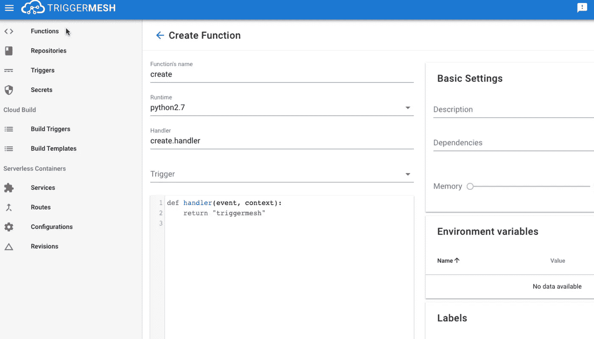

上传代码并作为功能部署的 TriggerMesh 示例 web 界面

FaaS 的例子:

*   [触发网格](https://triggermesh.com/)(使用 Knative 作为 CaaS)
*   [OpenFaaS](https://www.openfaas.com/) (可以使用 Knative)
*   [无底洞](https://kubeless.io/)
*   [裂变](https://fission.io/)(与环境一起工作，而不是不可变的函数容器，更进一步)
*   [open whish](https://openwhisk.apache.org/)
*   [各款 K8s FaaS 概述及对比](https://vshn.ch/en/blog/a-very-quick-comparison-of-kubernetes-serverless-frameworks)

## 冷启动和暖启动

一个**冷启动**意味着没有任何 pod 正在运行来处理一个事件，所以创建它需要一些时间。通常，这些豆荚在最后一次使用后会存活一段时间，并且可以重复使用。“已经运行”期间的调用将被称为**热启动**。热启动速度更快，但也耗费资源。

## 基于裂变/环境的 FaaS

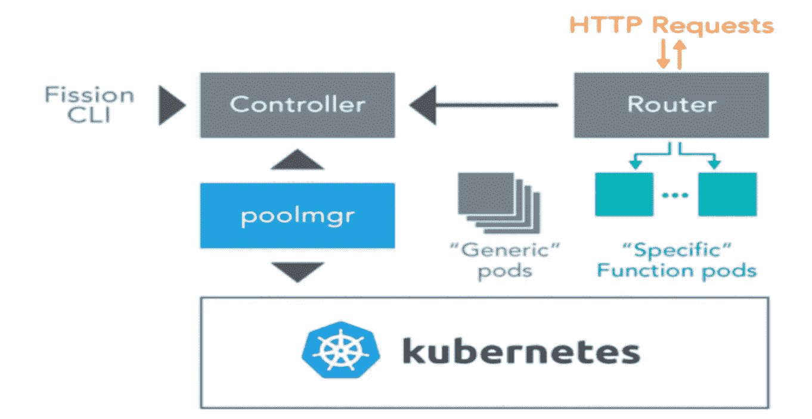

裂变架构([来源](https://hackernoon.com/what-is-serverless-part-4-fission-an-open-source-serverless-framework-for-kubernetes-7f025517774a))

K8s FaaS 的一个例子，[裂变](https://fission.io/)，实际上并没有为每个函数的代码变化构建不可变的容器，而是使用了可变环境容器(“通用容器”)的思想，它动态地拉入代码，然后将这些代码转换成“特定的函数容器”。我认为这也是他们利用 AWS 鞭炮的方式。

## 可观察性

从容器化的微服务转移到功能可能导致必须管理比以前更多更小的服务。这是因为创建只监听和处理一个事件的小函数很容易。当我创建与第 1 部分中的[容器微服务和第 2 部分](/scalable-microservice-demo-k8s-istio-kafka-344a2610eba3?source=friends_link&sk=7404e77f2a42d21261707794afaed58d)中的 [AWS 无服务器相同的演示应用时，我注意到了这一点。](/scalable-serverless-microservice-demo-aws-lambda-kinesis-terraform-cbe6036bf5ac?source=friends_link&sk=074614683a6641cab9b6067929bdc660)

为了管理更多的服务或功能，必须保持可观察性(度量、日志、跟踪)。这就是为什么大多数 Kubernetes FaaS 和 CaaS 已经与 Prometheus、Jaeger 和服务网格(如 Istio 或 Linkerd)集成。

# Kubernetes 无服务器节点

在上一节中，我们讨论了 K8s 无服务器应用程序，并看到了使用 CaaS 或 FaaS 时的工作流。这些简化了流程，减少了大量重复性工作。

但是开发者或操作者仍然与服务器交互:在集群中用作工作节点的虚拟机。他们仍然需要指定拥有多少节点及其资源(CPU/内存)。

现在我们更进一步，使用[虚拟 Kubelet](https://virtual-kubelet.io/) 使实际的底层 Kubernetes 节点无服务器化。

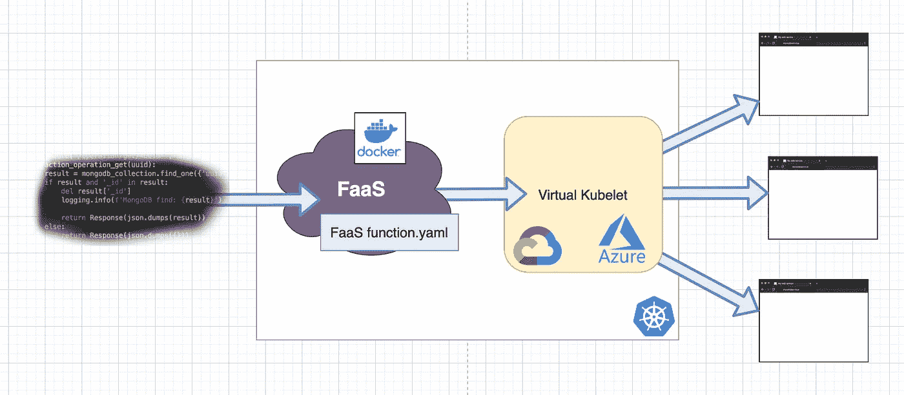

Kubernetes 之上的 FaaS，以虚拟的 Kubelet 为节点。终极设置？

虚拟 Kubelet 模拟了 Kubernetes 的一个 worker 节点，然后可以用来调度 pods，就像任何其他普通节点一样。虽然 pods 的容器不是在 VM 上运行，而是在 AWS Fargate、Google Cloud Run 或 Azure Container Instances 等云提供商的无服务器容器产品中运行。

请阅读我的[关于虚拟 Kubelet](https://medium.com/@wuestkamp/kubernetes-without-nodes-caedd172f940?source=friends_link&sk=a7cd94bbb7e8776fa4f0802de4e41094) 的详细文章。

Kubernetes 的 K8s 无服务器应用程序和 K8s 无服务器节点的组合可能是一个强大的组合。但是如果我们没有服务器，为什么还要使用 K8s 呢？

# 为什么还用 Kubernetes？

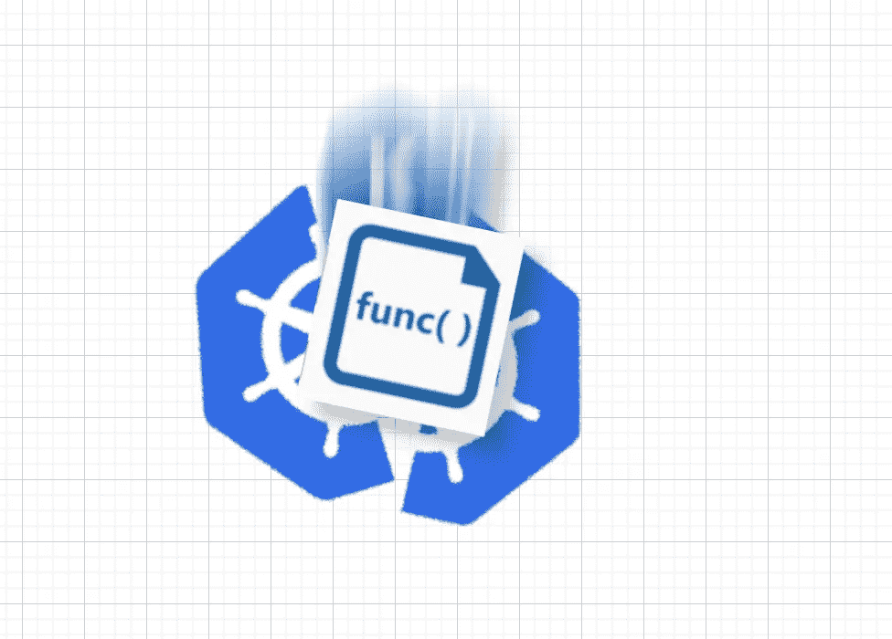

抱歉，我当时想拍一张傻乎乎的照片

Kubernetes 提供了强大而灵活的构建模块，而不是为方便交互和最终用户而制造的。这使得 K8s 很复杂，直接使用时需要大量的重复性工作。

Kubernetes 成为独立于云提供商的标准。在它的基础上使用无服务器框架，在走向无服务器时保持这种独立性是有意义的。如果有必要，我们总是可以更详细地定义我们的应用程序，因为它仍然只是在引擎盖下运行 K8s。

通过在 K8s 上使用无服务器，我们可以大大减少重复性工作，这样我们就可以花更多的时间来构建实际的应用程序。

# 概述

传统的

无服务器

# 结论

我认为现代的无服务器事件驱动架构已经证明了自己，并将在未来几年变得越来越流行。让我们在 K8s 等开放标准之上使用它，以确保更好的互操作性。

Kubernetes 上的无服务器只是不断自动化人工工作的结果。

# 来源

1.  互联网。
2.  [Kubernetes 无服务器框架的快速比较](https://vshn.ch/en/blog/a-very-quick-comparison-of-kubernetes-serverless-frameworks)
3.  [Gitlab 使用 Knative 和 Triggermesh 提供无服务器应用](https://docs.gitlab.com/ee/user/project/clusters/serverless/)
4.  [Google Cloud Run 在引擎盖下使用 Knative】](https://cloud.google.com/blog/products/serverless/knative-based-cloud-run-services-are-ga)
5.  Kubeless 和 TriggerMesh 的创作者制作了一个很棒的视频

6.另一个关于 Kubernetes，Serverless 和 OpenWhisk 的精彩视频

7.另一个视频展示了 OpenFaaS、Knative 和 Nuclio

# 成为 Kubernetes 认证

[https://killer.sh](https://killer.sh)