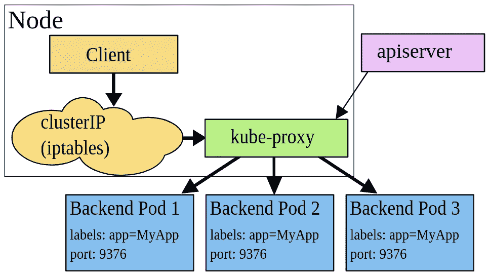
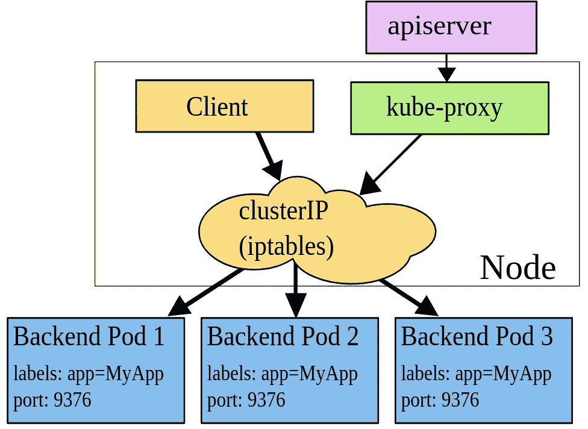
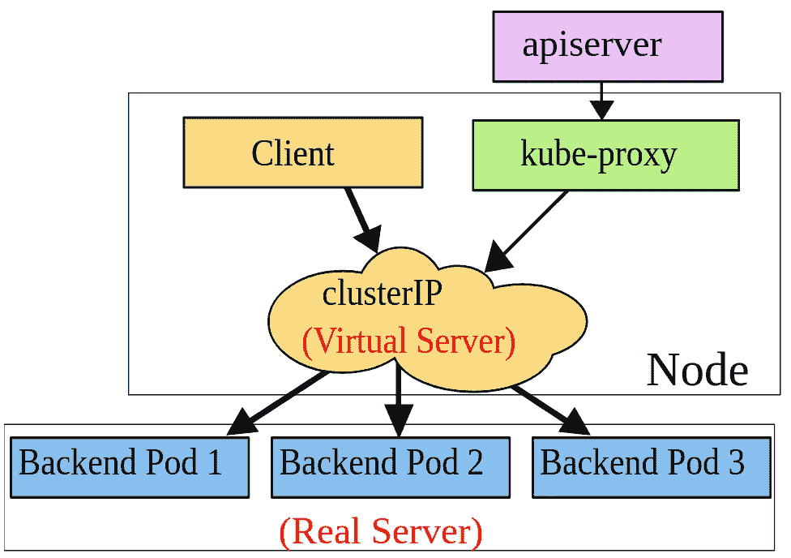
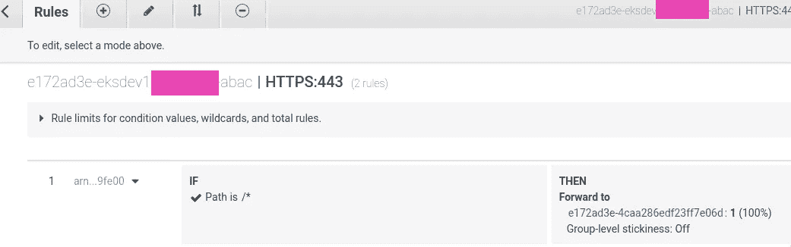
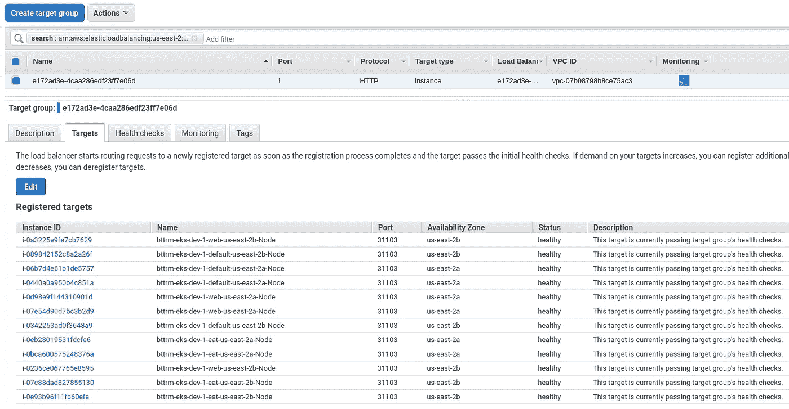
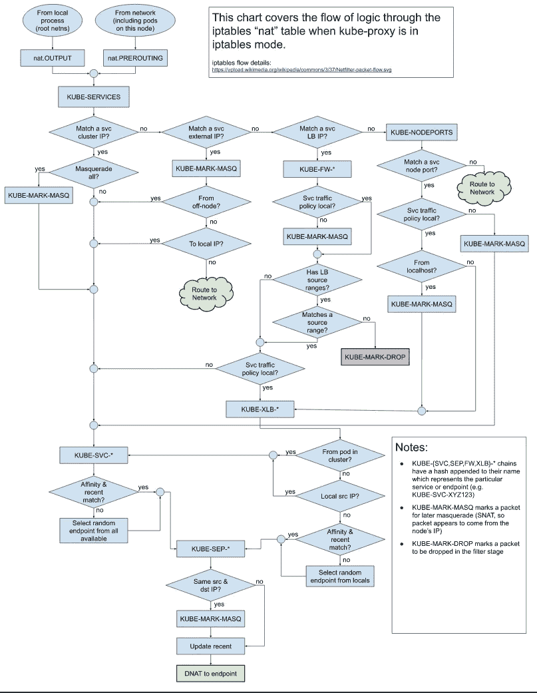

# Kubernetes:服务、负载平衡、kube 代理和 iptables

> 原文：<https://itnext.io/kubernetes-service-load-balancing-kube-proxy-and-iptables-da3ebf1c802a?source=collection_archive---------1----------------------->


有一天我想知道 Kubernetes 中的 pod 之间的负载平衡是如何工作的？

也就是说，我们有一个外部负载平衡器。然后是服务。在它的后面——豆荚。

当我们接收来自世界各地的网络数据包，并且我们有几个 pod 时会发生什么——流量将如何在它们之间分配？

*   [kube-proxy](https://rtfm.co.ua/en/kubernetes-service-load-balancing-kube-proxy-and-iptables/#kubeproxy)
*   [用户空间代理模式](https://rtfm.co.ua/en/kubernetes-service-load-balancing-kube-proxy-and-iptables/#User_space_proxy_mode)
*   [iptables 代理模式](https://rtfm.co.ua/en/kubernetes-service-load-balancing-kube-proxy-and-iptables/#iptables_proxy_mode)
*   [IPVS 代理模式](https://rtfm.co.ua/en/kubernetes-service-load-balancing-kube-proxy-and-iptables/#IPVS_proxy_mode)
*   [kube-代理配置](https://rtfm.co.ua/en/kubernetes-service-load-balancing-kube-proxy-and-iptables/#kubeproxy_config)
*   [Kubernetes Pod 负载平衡](https://rtfm.co.ua/en/kubernetes-service-load-balancing-kube-proxy-and-iptables/#Kubernetes_Pod_loadbalancing)
*   [AWS 负载平衡器流量模式](https://rtfm.co.ua/en/kubernetes-service-load-balancing-kube-proxy-and-iptables/#AWS_LoadBalancer_traffic_modes)
*   [kube-proxy 和 iptables](https://rtfm.co.ua/en/kubernetes-service-load-balancing-kube-proxy-and-iptables/#kubeproxy_and_iptables)
*   [iptables 规则](https://rtfm.co.ua/en/kubernetes-service-load-balancing-kube-proxy-and-iptables/#iptablesrules)

# `kube-proxy`

所以。服务与其 pod 之间的路由规则由`kube-proxy`服务控制，该服务可以工作在以下三种模式之一-****iptables 代理模式*******IPVS 代理模式*** 。**

## **用户空间代理模式**

**链接:**

*   **[用户空间代理模式](https://kubernetes.io/docs/concepts/services-networking/service/#proxy-mode-userspace)**
*   **[实现:通过用户空间套接字的代理](https://arthurchiao.art/blog/cracking-k8s-node-proxy/#ch_4)**

**不推荐使用的模式，以前是默认模式。**

**当使用此模式时，`kube-proxy`监视集群中的变化，对于每个新服务，将在 WorkerNode 上打开一个 TCP 端口。**

**然后，该工作节点上的`iptables`开始将流量从该端口路由到`kube-proxy`服务，该服务使用[循环](https://rtfm.co.ua/nginx-http-proksi-load-balancing-bufery-i-keshirovanie/#nginx_upstream_chg)方法充当代理服务，即通过将流量发送到其后端列表中的下一个 pod。在此期间，如果第一个 pod 没有响应，`kube-proxy`可以尝试向另一个 pod 发送数据包。**

****

## **iptables 代理模式**

**链接:**

*   **[iptables 代理模式](https://kubernetes.io/docs/concepts/services-networking/service/#proxy-mode-iptables)**
*   **[实现:通过 iptables 代理](https://arthurchiao.art/blog/cracking-k8s-node-proxy/#ch_5)**

**我们的情况，我们将在本帖中调查。目前，是默认选项。**

**当使用这种模式时，`kube-proxy`监视集群中的变化，并为每个新服务打开一个 WorkerNode 上的 TCP 端口。**

**然后，这个 WorkerNode 上的`iptables`将流量从这个端口发送到 Kubernetes 服务，这实际上是`iptables`规则中的一个链，通过这个链，流量直接到达这个服务的后端 pods。在此期间，随机选择一个目标吊舱。**

**由于所有必要的操作都由`[netfilter](https://www.netfilter.org/)`模块在内核中执行，这种模式对系统资源来说更便宜。此外，这种模式工作更快、更可靠，因为没有“中间件”——`kube-proxy`本身。**

**但是，如果发送数据包的第一个 pod 没有响应，则连接失败，而在*用户空间代理模式下* `kube-proxy`会尝试将数据包发送到另一个 pod。**

**这就是正确配置[准备就绪探测器](https://kubernetes.io/docs/tasks/configure-pod-container/configure-liveness-readiness-startup-probes/)如此重要的原因，这样 Kubernetes 就不会向没有准备好接受流量的 pod 发送流量。**

**此外，这种模式对于调试来说更加复杂，因为在*用户空间代理模式*中，`kube-proxy`将把它的日志写到`/var/log/kube-proxy`中，而使用`netfilter`时，你必须调试内核本身。**

****

## **IPVS 代理模式**

**链接:**

*   **[IPVS 代理模式](https://kubernetes.io/docs/concepts/services-networking/service/#proxy-mode-ipvs)**
*   **[实施:通过 IPVS 的代理](https://arthurchiao.art/blog/cracking-k8s-node-proxy/#ch_6)**
*   **[基于 IPVS 的集群内负载平衡深度探讨](https://kubernetes.io/blog/2018/07/09/ipvs-based-in-cluster-load-balancing-deep-dive/)**

**和最近的模式。它使用了`[netlink](https://man7.org/linux/man-pages/man7/netlink.7.html)`内核模块，并为新的 Kubernetes 服务创建了新的 IPVS 规则。**

**主要是负载平衡模式的多样性:**

*   **`rr`:循环赛**
*   **`lc`:最少连接数(打开的连接数最少)**
*   **`dh`:目的散列**
*   **`sh`:源哈希**
*   **`sed`:最短预期延迟**
*   **`nq`:从不排队**

****

## **`kube-proxy`配置**

**让我们检查一下在 AWS Lastic Kubernetes 服务集群中使用了哪种模式。**

**找到`kube-proxy`吊舱:**

```
**$ kubectl -n kube-system get pod -l k8s-app=kube-proxy -o wide
NAME READY STATUS RESTARTS AGE IP NODE NOMINATED NODE READINESS GATES
kube-proxy-4prtt 1/1 Running 1 158d 10.3.42.245 ip-10–3–42–245.us-east-2.compute.internal <none> <none>
kube-proxy-5b7pd 1/1 Running 0 60d 10.3.58.133 ip-10–3–58–133.us-east-2.compute.internal <none> <none>
…
kube-proxy-tgl52 1/1 Running 0 59d 10.3.59.159 ip-10–3–59–159.us-east-2.compute.internal <none> <none>**
```

**在集群的每个 WorkerNode 上，我们都有一个专用的`kube-proxy`实例，并附带了*kube-proxy-config*config map:**

```
**$ kubectl -n kube-system get pod kube-proxy-4prtt -o yaml
apiVersion: v1
kind: Pod
…
spec:
…
containers:
…
volumeMounts:
…
- mountPath: /var/lib/kube-proxy-config/
name: config
…
volumes:
…
- configMap:
defaultMode: 420
name: kube-proxy-config
name: config**
```

**检查此配置图内容:**

```
**$ kubectl -n kube-system get cm kube-proxy-config -o yaml
apiVersion: v1
data:
config: |-
…
mode: “iptables”
…**
```

**现在，当我们更熟悉`kube-proxy`模式时——让我们更深入地看看它是如何工作的，以及`iptables`在这里做什么。**

# **Kubernetes Pod 负载平衡**

**在我们的旅程中，让我们以一个带有入口(AWS 应用程序负载平衡器，ALB)的真实应用程序为例，它向 Kubernetes 服务发送流量:**

```
**$ kubectl -n eks-dev-1-appname-ns get ingress appname-backend-ingress -o yaml
…
- backend:
serviceName: appname-backend-svc
servicePort: 80
…**
```

**检查服务本身:**

```
**$ kubectl -n eks-dev-1-appname-ns get svc
NAME TYPE CLUSTER-IP EXTERNAL-IP PORT(S) AGE
appname-backend-svc NodePort 172.20.249.22 <none> 80:31103/TCP 63d**
```

**这里我们有`NodePort`类型——它监听 WorkerNode 上的 TCP 端口。**

**ALB*e 172 ad 3 e-eks dev 1 app name-ABAC*ALB 将流量从客户端路由到*e 172 ad 3 e-4c aa 286 EDF 23 ff 7 e 06d*AWS 目标组:**

****

**该目标组中的ес2 正在侦听我们在上面的服务详细信息中看到的 31103 端口:**

****

## **AWS 负载平衡器流量模式**

**[文档> > >](https://docs.aws.amazon.com/eks/latest/userguide/alb-ingress.html) 。**

**补充说明:AWS ALB 支持两种流量模式——IP 和实例模式。**

*   *****实例模式*** :默认模式，要求 Kubernetes 服务具有 NodePort 类型，并将流量路由到 WorkerNode 的 TCP 端口**
*   *****IP 模式*** :在此模式下，ALB 的目标直接是 Kubernetes Pods，而不是 Kubernetes Worker 节点。**

**现在，我们需要访问其中一个节点—连接到一个堡垒主机，然后连接到一个工作节点:**

```
**ubuntu@ip-10–3–29–14:~$ ssh ec2-user@10.3.49.200 -i .ssh/bttrm-eks-nodegroup-us-east-2.pem
Last login: Thu May 28 06:25:27 2020 from ip-10–3–29–32.us-east-2.compute.internal
__| __|_ )
_| ( / Amazon Linux 2 AMI
___|\___|___|
39 package(s) needed for security, out of 64 available
Run “sudo yum update” to apply all updates.
[ec2-user@ip-10–3–49–200 ~]$ sudo -s
[root@ip-10–3–49–200 ec2-user]#**
```

## **k `ube-proxy`和`iptables`**

**因此，一个来自客户端的数据包到达了 WorkerNode。**

**在该节点上，`kube-proxy`服务绑定在分配的端口上，因此没有其他服务会使用它，并且它还创建了一组`iptables`规则:**

```
**[root@ip-10–3–49–200 ec2-user]# netstat -anp | grep 31103
tcp6 0 0 :::31103 :::* LISTEN 4287/kube-proxy**
```

**数据包到达 *31107* 端口，在那里开始被`iptables`过滤器跟踪。**

## **`iptables`规则**

**链接:**

*   **[工作台和链条的移动](https://www.frozentux.net/iptables-tutorial/chunkyhtml/c962.html)**
*   **[网络过滤器和通用网络中的数据包流](https://upload.wikimedia.org/wikipedia/commons/3/37/Netfilter-packet-flow.svg)**
*   **[深入探究 Iptables 和 Netfilter 架构](https://www.digitalocean.com/community/tutorials/a-deep-dive-into-iptables-and-netfilter-architecture)**

**Linux 内核接受这个包，并将其发送到`nat`表的`PREROUTING`链:**

****

**参见[描述 kube-proxy iptables 规则](https://twitter.com/thockin/status/1191766983735296000)。**

**检查`nat`工作台及其`PREROUTING`链中的规则:**

```
**[root@ip-10–3–49–200 ec2-user]# iptables -t nat -L PREROUTING | column -t
Chain PREROUTING (policy ACCEPT)
target prot opt source destination
KUBE-SERVICES all — anywhere anywhere /* kubernetes service portals */**
```

**这里我们有一个`target`到下面的链-`KUBE-SERVICES`,它有下一个链- `KUBE-NODEPORTS`作为最后一个规则，它为类型为`NodePort`的服务捕获数据包:**

```
**[root@ip-10–3–49–200 ec2-user]# iptables -t nat -L KUBE-SERVICES -n | column -t
…
KUBE-NODEPORTS all — 0.0.0.0/0 0.0.0.0/0 /* kubernetes service nodeports; NOTE: this must be the last rule in th
is chain */ ADDRTYPE match dst-type LOCAL
…**
```

**检查此链中的规则:**

```
**[root@ip-10–3–49–200 ec2-user]# iptables -t nat -L KUBE-NODEPORTS -n | column -t | grep 31103
KUBE-MARK-MASQ tcp — 0.0.0.0/0 0.0.0.0/0 /* eks-dev-1-appname-ns/appnamed-backend-svc: */ tcp dpt:31103
KUBE-SVC-TII5GQPKXWC65SRC tcp — 0.0.0.0/0 0.0.0.0/0 /* eks-dev-1-appname-ns/appname-backend-svc: */ tcp dpt:31103**
```

**这里它正在拦截`dpt:31103` ( *目的端口 31103* )的数据包，并将它们发送到下一个链- `KUBE-SVC-TII5GQPKXWC65SRC`，现在检查:**

```
**[root@ip-10–3–49–200 ec2-user]# iptables -t nat -L KUBE-SVC-TII5GQPKXWC65SRC | column -t
Chain KUBE-SVC-TII5GQPKXWC65SRC (2 references)
target prot opt source destination
KUBE-SEP-N36I6W2ULZA2XU52 all — anywhere anywhere statistic mode random probability 0.50000000000
KUBE-SEP-4NFMB5GS6KDP7RHJ all — anywhere anywhere**
```

**在这里，我们可以看到接下来的两个链，这是“路由魔术”发生的地方——数据包将随机发送到这些链中的一个，每个链的“权重”为 0.5 到 1.0(T0)，根据 Kubernetes 的官方文档:**

> **默认情况下，iptables 模式下的 kube-proxy 随机选择一个后端。**

**另请参见[将 IPTables 转变为 TCP 负载平衡器以获得乐趣和利润](https://scalingo.com/blog/iptables)。**

**检查那些链条。**

**第一个:**

```
**[root@ip-10–3–49–200 ec2-user]# iptables -t nat -L KUBE-SEP-N36I6W2ULZA2XU52 -n | column -t
Chain KUBE-SEP-N36I6W2ULZA2XU52 (1 references)
target prot opt source destination
KUBE-MARK-MASQ all — 10.3.34.219 0.0.0.0/0
DNAT tcp — 0.0.0.0/0 0.0.0.0/0 tcp to:10.3.34.219:3001**
```

**第二个是:**

```
**[root@ip-10–3–49–200 ec2-user]# iptables -t nat -L KUBE-SEP-4NFMB5GS6KDP7RHJ -n | column -t
Chain KUBE-SEP-4NFMB5GS6KDP7RHJ (1 references)
target prot opt source destination
KUBE-MARK-MASQ all — 10.3.57.124 0.0.0.0/0
DNAT tcp — 0.0.0.0/0 0.0.0.0/0 tcp to:10.3.57.124:3001**
```

**这里我们可以看到`DNAT`(目的地 NAT)链正在将数据包发送到一个 IP 和 *3001* 端口，这实际上是我们的`ContainerPort`——检查部署:**

```
**$ kubectl -n eks-dev-1-appname-ns get deploy appname-backend -o json | jq ‘.spec.template.spec.containers[].ports[].containerPort’
3001**
```

**去看我们的豆荚 IP。**

**找到豆荚:**

```
**$ kubectl -n eks-dev-1-appname-ns get pod
NAME READY STATUS RESTARTS AGE
appname-backend-768ddf9f54–2nrp5 1/1 Running 0 3d
appname-backend-768ddf9f54-pm9bh 1/1 Running 0 3d**
```

**和第一个 pod 的 IP:**

```
**$ kubectl -n eks-dev-1-appname-ns get pod appname-backend-768ddf9f54–2nrp5 — template={{.status.podIP}}
10.3.34.219**
```

**第二个是:**

```
**$ kubectl -n eks-dev-1-appname-ns get pod appname-backend-768ddf9f54-pm9bh — template={{.status.podIP}}
10.3.57.124**
```

**是不是很棒？:-)如此简单——又如此伟大。**

**现在，让我们尝试扩展我们的部署，看看`KUBE-SVC-TII5GQPKXWC65SRC`将如何改变以反映扩展。**

**查找部署:**

```
**$ kubectl -n eks-dev-1-appname-ns get deploy
NAME READY UP-TO-DATE AVAILABLE AGE
appname-backend 2/2 2 2 64d**
```

**将其从两个扩展到三个:**

```
**$ kubectl -n eks-dev-1-appname-ns scale deploy appname-backend — replicas=3
deployment.extensions/appname-backend scaled**
```

**查看`iptables`规则:**

```
**[root@ip-10–3–49–200 ec2-user]# iptables -t nat -L KUBE-SVC-TII5GQPKXWC65SRC | column -t
Chain KUBE-SVC-TII5GQPKXWC65SRC (2 references)
target prot opt source destination
KUBE-SEP-N36I6W2ULZA2XU52 all — anywhere anywhere statistic mode random probability 0.33332999982
KUBE-SEP-HDIQCDRXRXBGRR55 all — anywhere anywhere statistic mode random probability 0.50000000000
KUBE-SEP-4NFMB5GS6KDP7RHJ all — anywhere anywhere**
```

**现在我们可以看到我们的`KUBE-SVC-TII5GQPKXWC65SRC`有三个规则:第一个是 0.33332999982 random，因为后面还有两个规则，然后第二个是 0.5 weight，最后一个没有任何规则。**

**检查 [iptables 统计模块](http://ipset.netfilter.org/iptables-extensions.man.html#lbCD)。**

**其实，“*那都是乡亲们！***

# **有用的链接**

*   **[Kubernetes:集群 IP vs 节点端口 vs 负载平衡器，服务и入口— обзор，примеры](https://rtfm.co.ua/kubernetes-clusterip-vs-nodeport-vs-loadbalancer-services-i-ingress-obzor-primery/)**
*   **[Kubernetes 网络揭秘:简要指南](https://www.stackrox.com/post/2020/01/kubernetes-networking-demystified/)**
*   **[深入探究 Iptables 和 Netfilter 架构](https://www.digitalocean.com/community/tutorials/a-deep-dive-into-iptables-and-netfilter-architecture)**
*   **[工作台和链条的移动](https://www.frozentux.net/iptables-tutorial/chunkyhtml/c962.html)**
*   **[将 IPTables 变成一个有趣的 TCP 负载均衡器](https://scalingo.com/blog/iptables)**
*   **[破解 kubernetes 节点代理(又名 kube-proxy)](https://arthurchiao.art/blog/cracking-k8s-node-proxy/)**
*   **[一个最小的 IPVS 负载平衡器演示](https://medium.com/@benmeier_/a-quick-minimal-ipvs-load-balancer-demo-d5cc42d0deb4)**
*   **[如何在 AWS EKS 上启用 IPVS 模式？](https://medium.com/@selfieblue/how-to-enable-ipvs-mode-on-aws-eks-7159ec676965)**
*   **[Kubernetes 中的负载平衡](https://rancher.com/load-balancing-in-kubernetes)**

***最初发布于* [*RTFM: Linux、DevOps 和系统管理*](https://rtfm.co.ua/en/jenkins-redis-deployment-and-helm-subchart-values/) *。***