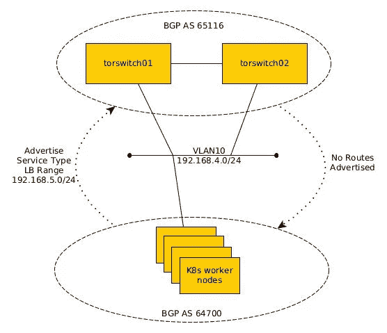

# 用于内部部署的 Kubernetes 服务类型 LB

> 原文：<https://itnext.io/kubernetes-service-type-lb-for-on-prem-deployments-89e9b2a73a0c?source=collection_archive---------0----------------------->

这篇文章的灵感来自于[这篇博文](https://projectcalico.docs.tigera.io/networking/advertise-service-ips)。

# 介绍

在公共云环境中部署负载平衡器类型的 Kubernetes 服务非常简单。类似下面的清单被应用到一个集群，然后“神奇地发生了”,服务前面有一个负载平衡器设置。

云环境中的应用服务

应用这个清单后，云提供商异步配置一个负载平衡器，然后将有关它的信息发布回服务定义(文档[这里是](https://kubernetes.io/docs/concepts/services-networking/service/#loadbalancer))。配置负载均衡器后，*ku bectl get SVC my-service-o YAML*的输出可能如下所示:

在云环境中配置 LB 后的服务

在这种情况下，负载平衡器的地址是服务 my-service 的前端 192.0.2.127。云提供商将该值写回到服务中。

# 内部部署— Calico + MetalLB

由于 Kubernetes 是一个大部分云原生开发都围绕其进行的项目，因此这一过程在公共云环境中是无缝的也就不足为奇了。对于本地集群又如何呢？有一些解决方案可以与负载平衡器供应商集成，其中之一是 [Citrix](https://www.citrix.com/blogs/2019/09/16/citrix-adc-for-kubernetes-service-of-type-loadbalancer/) 。

对于开源选项，还可以使用 Calico 和 MetalLB 的组合，以便为本地集群提供服务类型的负载平衡器功能，这将是本文剩余部分的重点。

## 白棉布

[Calico](https://www.tigera.io/tigera-products/calico/) 是 Kubernetes 生态系统中最流行的 CNI 解决方案之一。更一般地说，它是一个针对基于容器、虚拟机或主机的工作负载的网络和安全解决方案。

Calico 在 Kubernetes 环境中使用 BGP 对该解决方案至关重要，因此，该解决方案仅在本地集群北部的网络运行 BGP 且架顶式(TOR)交换机是 Kubernetes 节点的网关时有效。这些 TOR 交换机还必须启用动态对等。原因是能够支持集群中节点的水平扩展。本文的其余部分假设这些项目已经就绪，但不会提供任何交换机配置。网络侧必须支持的最后一项是[等价多径(ECMP)路由](https://en.wikipedia.org/wiki/Equal-cost_multi-path_routing)。网络将从潜在的数十个节点接收相同的路由。

## 金属 LB

[MetalLB](https://metallb.universe.tf/) 是一个用于裸机 Kubernetes 集群的负载均衡器实现，它本身可以为本地集群提供服务类型的负载均衡器功能…那么为什么不完全使用它呢？对于生产级部署，有一些严重的限制，记录在[这里](https://metallb.universe.tf/concepts/layer2/)。简而言之，缓慢的故障转移，L2 模式下的流量瓶颈，以及 L3 模式下与 CNI BGP 发言人的潜在冲突。

那么 MetalLB 在这个解决方案中起什么作用呢？MetalLB 控制器可以独立于扬声器使用。控制器可以为负载平衡器类型的服务执行地址分配，因此将只使用该组件。

# 解决方案

本节将介绍除 TOR 交换机配置之外的整个解决方案的各个部分。

## 逻辑拓扑



逻辑拓扑

Kubernetes 工作节点北面的 TOR 交换机位于 BGP 自治系统 65116 中，而工作节点本身位于 64700 中。这使得它们成为 eBGP 对等体，这意味着 TOR 交换机将自动告诉它们的邻居关于工作节点通告的任何路由。这些节点与 VLAN10 中的 TOR 交换机对等。交换机是该网络的默认网关，这是 Kubernetes 节点上的唯一接口。

虽然可以让 TOR 交换机向工作节点通告路由，但这种拓扑结构非常简单，节点使用静态默认路由来转发节点外的流量。同时，节点会公布一个 192.168.5.0/24 的范围，用于在集群内分配负载平衡器 IP。

集群中的每个节点都将通告此范围，无论它是否托管负载平衡器类型的服务后面的 pod，TOR 交换机上的 ECMP 路由将获取到节点的流量。这是一个可以优化的领域，但是这篇文章主要关注的是如何让流量先流动起来。

## 印花布结构

假设 TOR 交换机启用了对等方身份验证，第一步是为 Calico 对等方设置一个秘密。根据 [Calico 文档](https://projectcalico.docs.tigera.io/reference/resources/bgppeer)，该密码必须作为 Kubernetes 秘密创建在与 Calico/node pod 相同的名称空间中，并在对等配置中引用。

```
$ kubectl create -n kube-system secret generic tor-peer --from-literal=tor-pw=<<PASSWORD>>
```

下一步是配置 BGP 对等体，必须使用 [calicoctl 实用程序](https://projectcalico.docs.tigera.io/maintenance/clis/calicoctl/install)来完成。

Calico BGP 对等配置

nodeSelector 参数确保 BGP 对等体仅在工作节点上形成，而不在 ETCD 或主节点上形成。为了应用此配置，请使用如下所示的 calicoctl 实用程序:

```
$ ./calicoctl create -f bgppeer.yaml 
Successfully created 1 'BGPPeer' resource(s)
$
```

下一步是更新 Calico 的 BGP 配置。具体来说，集群需要配置更新的 BGP 策略，以便向 TOR 交换机通告负载平衡器 IP 范围。这是必需的，以便通知网络的其余部分如何到达该空间。

```
apiVersion: projectcalico.org/v3
kind: BGPConfiguration
metadata:
  name: default
spec:
  logSeverityScreen: Info
  nodeToNodeMeshEnabled: false
  asNumber: **64700** serviceClusterIPs:
  **-** cidr: 10.43.0.0/16
  serviceLoadBalancerIPs:
  **-** cidr: 192.168.5.0/24
  listenPort: **179** communities:
  **-** name: bgp-service-community
  value: 64700:300:100
  prefixAdvertisements:
  **-** cidr: 192.168.5.0/24
  communities:
  **-** bgp-service-community
  **-** 64700:120
```

使用 calicoctl 实用程序再次应用该配置。应用后，192.168.5.0/24 子网应该出现在 TOR 交换机的路由表中。

## MetalLB 配置

尽管 Calico 处理 BGP 部分，但当集群中请求负载平衡器地址时，仍然需要分发这些地址。MetalLB 控制器可以执行此功能。同样，不要安装 MetalLB 的扬声器组件，这一点很重要。这可能会与 Calico 发生冲突，因为它们都是 BGP 流程。

对于这个演示集群，[使用了清单](https://metallb.universe.tf/installation/)中的安装选项(原始清单[这里是](https://raw.githubusercontent.com/metallb/metallb/v0.12.1/manifests/metallb.yaml)),所有的扬声器组件都被注释掉了。

唯一需要的额外配置是一个配置图，MetalLB 将读取该配置图以了解它应该在群集中执行什么操作。

负载平衡器子网 192.168.5.0/24 位于 addresses 参数下。控制器将读入该配置并分发地址。

# 测试解决方案

部署好这个配置后，下一步是测试它。一个简单的 [HTTP echo server](https://code.mendhak.com/docker-http-https-echo/) 将与负载平衡器类型的服务配置一起用于部署，以在集群外部公开部署。

## 部署

注意，容器公开了 80 和 443，因此部署和服务也将这样做。测试将只关注 HTTP。

## 服务

一旦部署了服务，MetalLB 应该向服务分发一个地址。通过查看集群默认名称空间中的服务，可以很容易地确认这一点。

```
$ kubectl get svc -n default
NAME               TYPE           CLUSTER-IP      EXTERNAL-IP   PORT(S)          AGE
http-server-svc    LoadBalancer   10.43.236.6     192.168.5.0     80:32761/TCP     11d
kubernetes         ClusterIP      10.43.0.1       <none>        443/TCP          63d
$
```

果然，192.168.5.0 已被分配给此负载平衡器地址(注意，这是用于此目的的完全有效的地址，如果 192.168.5.0/24 范围改为用于提供对主机的网络访问，则 192.168.5.0 地址将是子网的网络地址)。

下一步是测试 echo 服务器。

```
$ curl -X PUT -H "Arbitrary:Header" -H "Host:test.example.com" -d aaa=bbb http://192.168.5.0
{
  "path": "/",
  "headers": {
    "user-agent": "curl/7.29.0",
    "host": "test.example.com",
    "accept": "*/*",
    "arbitrary": "Header",
    "content-length": "7",
    "content-type": "application/x-www-form-urlencoded"
  },
  "method": "PUT",
  "body": "aaa=bbb",
  "fresh": false,
  "hostname": "test.example.com",
  "ip": "::ffff:10.42.61.64",
  "ips": [],
  "protocol": "http",
  "query": {},
  "subdomains": [
  ],
  "xhr": false,
  "os": {
    "hostname": "http-echo-server-5c5877dfbb-8k7fs"
  },
  "connection": {}
}
$ 
```

成功！从现在开始，仍有工作要做，以使生产级部署正常工作。显然，需要为负载平衡器 IP 设置 DNS 记录。如果集群中公开的应用程序仅基于 HTTP(S ),则可以为入口控制器提供额外的负载平衡器服务。

# 感谢访问媒体

我希望这篇文章对你有用。感谢访问媒体。