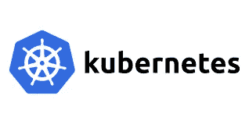
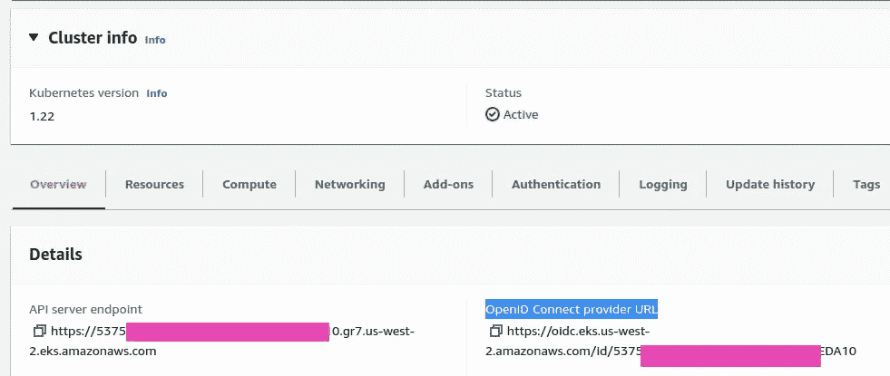
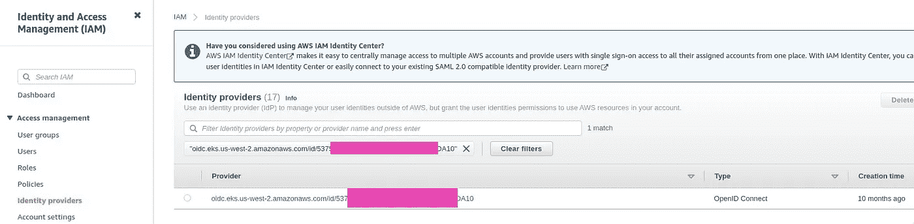
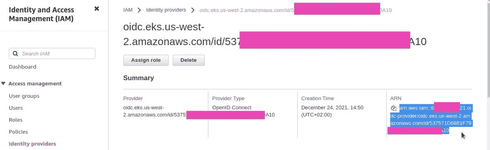
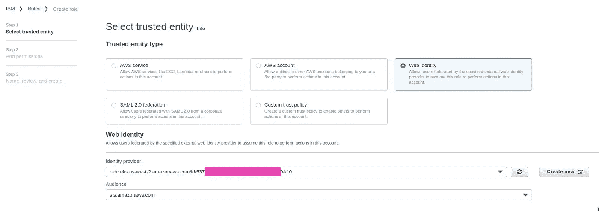
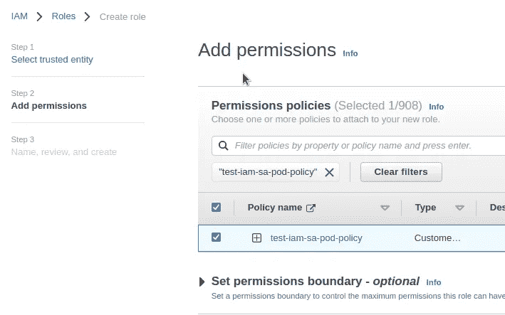
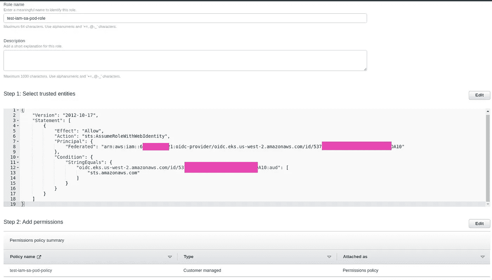
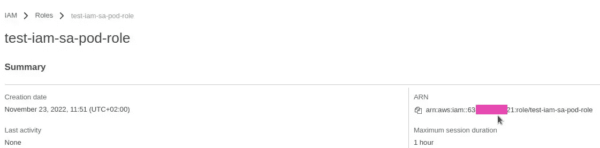

# Kubernetes:具有 Kubernetes Pod 的 AWS IAM 角色的服务帐户

> 原文：<https://itnext.io/kubernetes-serviceaccount-%D0%B7-aws-iam-role-%D0%B4%D0%BB%D1%8F-kubernetes-pod-d44a8e3b576f?source=collection_archive---------4----------------------->



我们有用于日志的 Grafana Loki，并且需要将一个 AWS IAM 角色与 AWS IAM 策略连接起来，这允许访问一个 AWS S3 存储桶，Loki 的块和索引将存储在这个存储桶中。

Kubernetes Pods 的 IAM 角色的工作方式与 EC2 实例的 IAM 角色相同:Pod 中的流程向 AWS API 发出请求，发出请求的 AWS SDK 或 AWS CLI 也发出使用 IAM 角色的`[AssumeRole](https://docs.aws.amazon.com/STS/latest/APIReference/API_AssumeRole.html)`请求(参见 [AWS:用户 IAM 密钥、EC2 IAM 角色和 Jenkins](https://rtfm.co.ua/en/aws-iam-users-keys-rotation-ec2-iam-roles-and-jenkins/) 的轮换)。

为了检查它在 Kubernetes 中是如何工作的，让我们创建一个测试 IAM 角色，一个带有该角色注释的 ServiceAccount，以及一个带有将使用该角色的 ServiceAccount 的 Pod。

展望未来——它在 Loki 中以某种*替代现实*工作，也就是说，即使你将一个已经测试过的 ServiceAccount 连接到 Loki Pod——它也会出错崩溃。但最终，我还是让它工作了(关于用 AWS S3 设置 Loki，稍后在另一篇文章中)。

文档— [服务帐户的 IAM 角色](https://docs.aws.amazon.com/eks/latest/userguide/iam-roles-for-service-accounts.html)。

# IAM OIDC 身份提供者验证

在我们的例子中，EKS 集群是使用 Terraform `[aws_eks_cluster](https://registry.terraform.io/providers/hashicorp/aws/latest/docs/resources/eks_cluster)`模块部署的，OpenID Connect (OIDC)提供者应该已经配置好了。

转到集群页面，找到*OpenID 连接提供者 URL* :



或者从终端:

```
$ aws -rofile development --egion us-west-2 eks describe-cluster --name dev_data_services --query “cluster.identity.oidc.issuer” --output text
https://oidc.eks.us-west-2.amazonaws.com/id/537***A10
```

复制没有`https://`的网址，在 *IAM >身份提供者*中找到:



好吧，就这样。

# 创建具有 AWS IAM 角色的 Kubernetes ServiceAccount

首先，让我们创建一个 IAM 策略，向 AWS S3 存储桶授予权限，然后创建一个带有`[TrustedPolicy](https://aws.amazon.com/ru/blogs/security/how-to-use-trust-policies-with-iam-roles/)`的 IAM 角色，允许您使用集群的 OIDC 身份提供者(IDP)执行`[AssumeRole](https://rtfm.co.ua/ru/aws-iam-assumerole-opisanie-primery/)`。

## AWS IAM 策略

创建测试策略:

```
{
    "Version": "2012-10-17",
    "Statement": [
        {
            "Effect": "Allow",
            "Action": [
                "s3:ListBucket",
                "s3:PutObject",
                "s3:GetObject",
                "s3:DeleteObject"
            ],
            "Resource": [
                "arn:aws:s3:::development-dev-loki-object-store",
                "arn:aws:s3:::development-dev-loki-object-store/*"
            ]
        }
    ]
}
```

将其添加到 AWS IAM:

```
$ aws — profile development iam create-policy --policy-name test-iam-sa-pod-policy --policy-document file://test-iam-sa-pod-policy.json
```

进入角色。

## AWS IAM 角色和可信策略

找到您的身份提供商的 **ARN** :



OIDC 身份提供者**的 URL** 已经在前面找到了:

```
$ aws --profile development --region us-west-2 eks describe-cluster --name dev_data_services --query “cluster.identity.oidc.issuer” --output text
https://oidc.eks.us-west-2.amazonaws.com/id/537***A10
```

## 使用 AWS CLI 创建 IAM 角色

用`TustedPolicy`创建一个文件，在其`Principal`字段中指定 IDP 的 **ARN** ，在集群的`Condition`-OIDC**URL**中，将允许执行对*sts.amazonaws.com*的请求:

```
{
    "Version": "2012-10-17",
    "Statement": [
        {
            "Effect": "Allow",
            "Principal": {
                "Federated": "arn:aws:iam::638***021:oidc-provider/oidc.eks.us-west-2.amazonaws.com/id/537***A10"
            },
            "Action": "sts:AssumeRoleWithWebIdentity",
            "Condition": {
                "StringEquals": {
                    "oidc.eks.us-west-2.amazonaws.com/id/537***A10:aud": "sts.amazonaws.com"
                }
            }
        }
    ]
}
```

使用此可信策略创建角色:

```
$ aws --profile development iam create-role --role-name test-iam-sa-pod-role --assume-role-policy-document file://test-iam-sa-role-trusted-policy.json
```

将我们在上面创建的具有 S3 权限的 IAM 策略连接到此 IAM 角色:

```
$ aws --profile development iam attach-role-policy --role-name test-iam-sa-pod-role --policy-arn=arn:aws:iam::638***021:policy/test-iam-sa-pod-policy
```

## 从 AWS 控制台创建 IAM 角色

或者我们也可以通过亚马逊控制台页面来完成—选择*网络身份*的类型，集群的*身份提供者*，以及*受众*:



添加 S3 的 IAM 策略:



保存它:



复制角色的 ARN:



## 创建 Kubernetes 服务帐户

创建一个 ServiceAccount 清单，在其`annotations`中设置所创建角色的 ARN:

```
---
apiVersion: v1
kind: ServiceAccount
metadata:
  name: test-iam-sa-pod-service-account
  annotations:
    eks.amazonaws.com/role-arn: arn:aws:iam::638***021:role/test-iam-sa-pod-role
```

我们去库伯内特斯豆荚吧。

# 使用服务帐户运行 Kubernetes Pod

使用 ServiceAccount 的`serviceAccountName`创建 Pod 的清单，因此完整的文件如下所示:

```
apiVersion: v1
kind: ServiceAccount
metadata:
  name: test-iam-sa-pod-service-account
  annotations:
    eks.amazonaws.com/role-arn: arn:aws:iam::638***021:role/test-iam-sa-pod-role
---
apiVersion: v1
kind: Pod
metadata:
  name: test-iam-sa-pod
  labels:
    app: test-iam-sa-app
spec:
  containers:
    - name: test-iam-sa
      image: amazon/aws-cli
      command: [ "/bin/bash", "-c", "--" ]
      args: [ "while true; do sleep 30; done;" ]
  serviceAccountName: test-iam-sa-pod-service-account
```

在 Pod 中，我们将使用带有 AWS CLI 和`sleep`命令的 Docker 映像，因此它将在启动后保持*运行*。

部署 ServiceAccount 和 Pod:

```
$ kubectl apply -f test-iam-sa-pod.yaml
serviceaccount/test-iam-sa-pod-service-account created
pod/test-iam-sa-pod created
```

深入了解:

```
$ kubectl exec -ti test-iam-sa-pod — bash
```

并检查篮子的入口:

```
bash-4.2# aws s3 ls development-dev-loki-object-store
PRE test/
```

完成了。

*最初发布于* [*RTFM: Linux、DevOps、系统管理*](https://rtfm.co.ua/en/kubernetes-serviceaccount-z-aws-iam-role-dlya-kubernetes-pod-2/) *。*