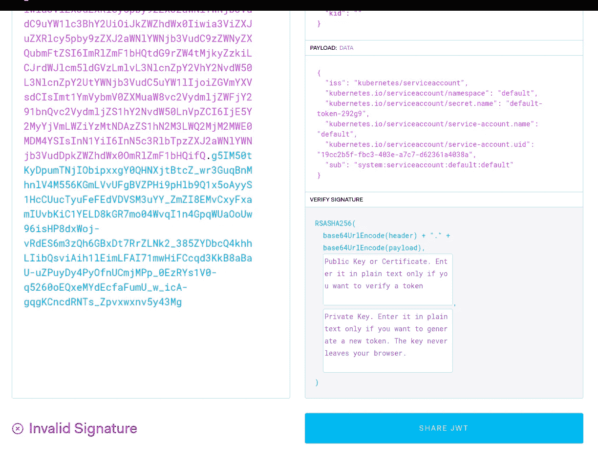
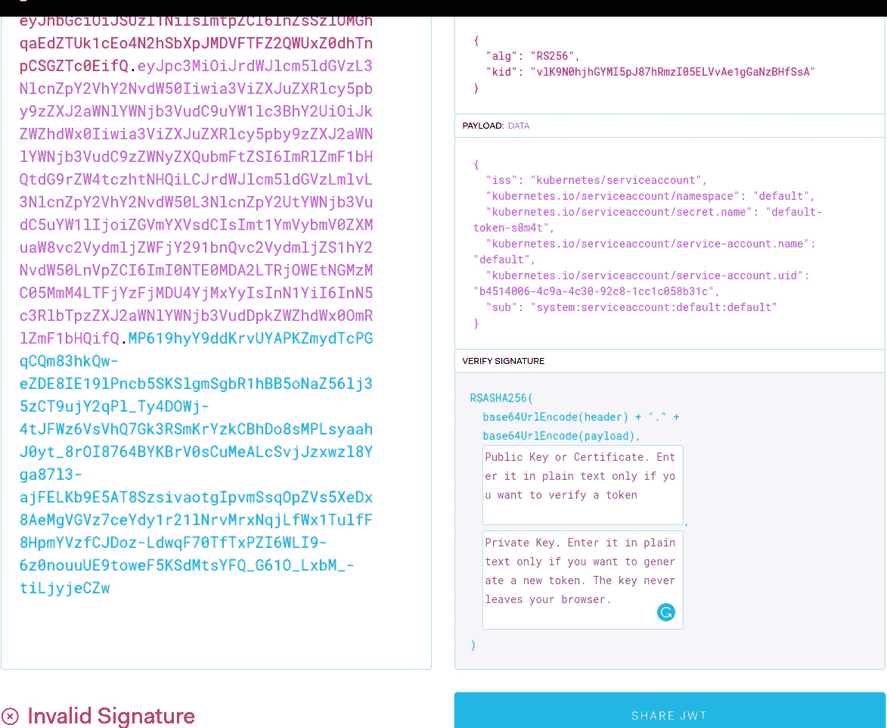
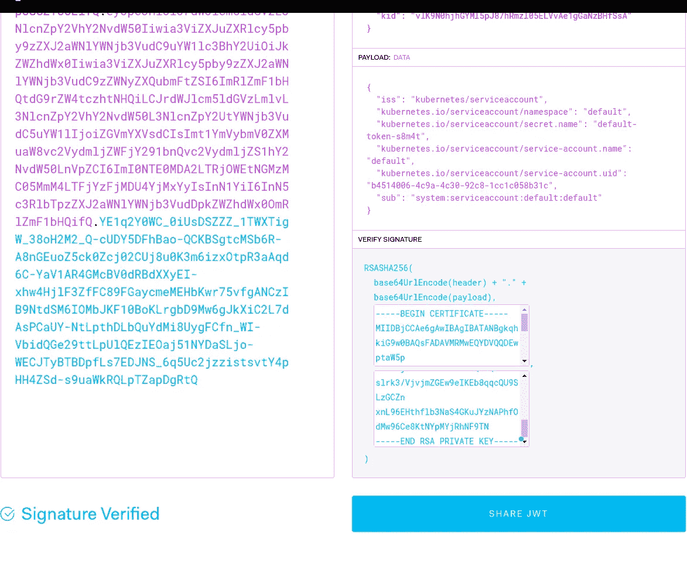

# Kubernetes:服务账户、JWT 令牌、认证和 RBAC 授权

> 原文：<https://itnext.io/kubernetes-serviceaccounts-jwt-tokens-authentication-and-rbac-authorization-e769f3d85a28?source=collection_archive---------2----------------------->


对于认证和授权，Kubernetes 有这样的概念:用户账户*和服务账户*。**

**用户帐户—用于从外部访问群集的常见用户配置文件，而服务帐户用于从群集内部授予访问权限。**

**ServiceAccounts 旨在为 Kubernetes Pod 提供一个身份，供其容器在对 Kubernetes API-server 执行 API 请求时对其进行身份验证和授权。**

# **内容**

*   **[默认服务账户](https://rtfm.co.ua/en/kubernetes-serviceaccounts-jwt-tokens-authentication-and-rbac-authorization/#Default_ServiceAccount)**
*   **[默认令牌](https://rtfm.co.ua/en/kubernetes-serviceaccounts-jwt-tokens-authentication-and-rbac-authorization/#default_token)**
*   **[JWT 令牌](https://rtfm.co.ua/en/kubernetes-serviceaccounts-jwt-tokens-authentication-and-rbac-authorization/#JWT_token)**
*   **[JWT 令牌和认证](https://rtfm.co.ua/en/kubernetes-serviceaccounts-jwt-tokens-authentication-and-rbac-authorization/#JWT_token_and_authentification)**
*   **[服务账户和 RBAC](https://rtfm.co.ua/en/kubernetes-serviceaccounts-jwt-tokens-authentication-and-rbac-authorization/#ServiceAccounts,_and_RBAC)**
*   **[服务帐户的 role bindig](https://rtfm.co.ua/en/kubernetes-serviceaccounts-jwt-tokens-authentication-and-rbac-authorization/#RoleBindig_for_ServiceAccount)**
*   **[服务账户和安全](https://rtfm.co.ua/en/kubernetes-serviceaccounts-jwt-tokens-authentication-and-rbac-authorization/#ServiceAccounts_and_security)**
*   **[有用链接](https://rtfm.co.ua/en/kubernetes-serviceaccounts-jwt-tokens-authentication-and-rbac-authorization/#Useful_links)**

# **默认服务帐户**

**每个 Kubernetes 名称空间都有自己的默认 ServiceAccount (SA ),它是在创建名称空间时创建的。**

**让我们检查一下*默认的*名称空间:**

```
**$ kubectl --namespace default get serviceaccount
NAME SECRETS AGE
default 1 176d**
```

**对于每个 ServiceAccount，都会生成一个令牌并存储为 Kubernetes 秘密。**

**检查默认服务协议:**

```
**$ kubectl --namespace default get serviceaccount default -o yaml
apiVersion: v1
kind: ServiceAccount
metadata:
creationTimestamp: “2020–05–25T12:04:49Z”
name: default
namespace: default
resourceVersion: “296”
selfLink: /api/v1/namespaces/default/serviceaccounts/default
uid: 19cc2b5f-fbc3–403e-a7c7-d62361a4038a
secrets:
- name: default-token-292g9**
```

**下面是这个 SA 的令牌——*默认令牌-292g9* 机密:**

```
**…
secrets:
- name: default-token-292g9**
```

## **默认令牌**

**现在，检查秘密的内容:**

```
**$ kubectl get secret default-token-292g9 -o yaml
apiVersion: v1
data:
ca.crt: LS0…sdA==
token: ZXl…TWc=
kind: Secret
metadata:
annotations:
kubernetes.io/service-account.name: default
kubernetes.io/service-account.uid: 19cc2b5f-fbc3–403e-a7c7-d62361a4038a
creationTimestamp: “2020–05–25T12:04:49Z”
name: default-token-292g9
namespace: default
resourceVersion: “294”
selfLink: /api/v1/namespaces/default/secrets/default-token-292g9
uid: 07a46645–0083–45a0-a640–6e6a78ebd9b1
type: kubernetes.io/service-account-token**
```

**起初，它的类型是`kubernetes.io/service-account-token`。**

**这里另一个有趣的部分是保存两个记录的`data`-`ca.cert`、и `token`。**

**如果某个令牌不是来自默认名称空间，将会有第三个字段指定该令牌所属的名称空间。**

**`ca.cert`由集群的主密钥签名，因此集群扮演认证机构的角色，并允许 pod 或应用程序验证 API-server。**

**而现在，让我们一起去调查`token`部分。**

## **JWT 代币**

**为了使从终端工作更容易—将`data.token`值保存到一个变量:**

```
**$ token=”ZXl…TWc=”**
```

**使用`base64`获取其内容:**

```
**$ echo $token | base64 -d
eyJ[…]iJ9.eyJ[…]ifQ.g5I[…]3Mg**
```

**在这里，我用[…]删除了一些数据，但是我们可以看到该值被用点分成了三个部分:**

*   ***标头* —描述令牌是如何签名的**
*   ***有效负载* —令牌的实际数据，如到期日期、颁发者等，参见 [RFC-7519](https://tools.ietf.org/html/rfc7519#section-4.1)**
*   ***签名* —用于验证令牌未被修改，并可用于验证发送者**

**参见[文档> > >](https://jwt.io/introduction/) 。**

**要检查令牌的内容，我们可以使用`jwt`实用程序或在 [jwt.io](https://jwt.io/) 网站上。**

**在我们的例子中，有效负载部分有以下几行:**

```
**{
  "iss": "kubernetes/serviceaccount",
  "kubernetes.io/serviceaccount/namespace": "default",
  "kubernetes.io/serviceaccount/secret.name": "default-token-s8m4t",
  "kubernetes.io/serviceaccount/service-account.name": "default",
  "kubernetes.io/serviceaccount/service-account.uid": "b4514006-4c9a-4c30-92c8-1cc1c058b31c",
  "sub": "system:serviceaccount:default:default"
}**
```

**在这里的`[sub](https://tools.ietf.org/html/rfc7519#section-4.1.2)`字段中，我们可以看到 ServiceAccount 名称，也就是谁向 Kubernetes API-server 提供了这个令牌，因此服务器将知道这个令牌来自谁。**

**好吧，那密码呢？在`sub`中有一个“登录名”——但是他的“密码”在哪里呢？**

**下面是正在播放的第三部分——签名。**

## **JWT 令牌和认证**

**我无法从谷歌搜索到的资料中看到这些细节，请参见本帖的[有用链接](https://rtfm.co.ua/en/?p=25299#Useful_links)部分，尽管对我来说——这是该计划最有趣的部分。**

**让我们回到令牌的第一部分——*报头*，在我们的例子中，它定义了 RS256 算法类型，即 RSA(*Rivest-sha mir-ad leman*)—具有私钥和公钥的非对称算法，并使用 SHA-256 算法进行签名。**

**让我们检查一下 [jwt.io](/jwt.io) 上的令牌:**

****

*****无效签名*** —因为我们没有提供私钥和公钥来验证令牌。**

**因为 AWS Elastic Kubernetes 服务上的主密钥存储在控制平面节点上，我们无法访问它们——让我们使用`[minikube](https://rtfm.co.ua/kubernetes-zapusk-minikube-na-arch-linux/)`进行测试。**

**运行本地集群:**

```
**$ minikube start**
```

**在它的默认命名空间中，我们可以看到已经存在的标记:**

```
**$ kubectl get secrets
NAME TYPE DATA AGE
default-token-s8m4t kubernetes.io/service-account-token 3 2m44s**
```

**抓取`token`字段并用`base64`解码:**

```
**$ kubectl get secrets -o jsonpath=’{.items[0].data.token}’ | base64 -d
eyJhbGciO[…]61O_LxbM_-tiLjyjeCZw**
```

**回到 jwt.io，粘贴上面收到的字符串:**

****

**仍然 ***无效签名***——但是去你的`minikube`拿它的公共证书—`~/.minikube/ca.crt`文件:**

```
**$ cat ~/.minikube/ca.crt
 — — -BEGIN CERTIFICATE — — -
MIIDBjCCAe6gAwIBAgIBATANBgkqhkiG9w0BAQsFADAVMRMwEQYDVQQDEwptaW5p
…
0g+FhVM92T+yV38vYLO/HaKeiOzIcgHHkAoLJZd/K/Mu7crwIuGlcCVhrjcHoa3p
Md34ZTeqxA4J3w==
 — — -END CERTIFICATE — — -**
```

**将其粘贴到*公钥或证书*字段。**

**找到`minikube`集群的私钥——实际上，它也用于调用`ca.crt`和令牌，即`~/.minikube/ca.key`文件:**

```
**$ cat ~/.minikube/ca.key
 — — -BEGIN RSA PRIVATE KEY — — -
MIIEowIBAAKCAQEAtDRDag2D7UBaBmWQwTKVLjuKTuat4eD/oThRgfi5bcCnwooG
…
xnL96EHthflb3NaS4GKuJYzNAPhfOdMw96Ce8KtNYpMYjRhNF9TN
 — — -END RSA PRIVATE KEY — — -**
```

**将其粘贴到*私钥*字段:**

****

*****签名验证*** —对，有效！令牌持有者的真实性得到验证。**

**所以，回到服务帐户:**

*   **对于服务帐户，会创建一个令牌来保存 SA 名称**
*   **令牌由 Kubernetes 集群的主密钥签名**
*   **一个 pod 使用这个令牌向 API 服务器发出一个请求来认证他**
*   **API 服务器通过使用其公钥来验证令牌，并验证令牌未被修改并且确实是由这个 Kubernetes clutser 发布的**

**现在，让我们来看看在实践中这是如何工作的，以及如何在这里使用 Kubernetes RBAC。**

# **服务帐户和 RBAC**

**对于每个没有指定 ServiceAccount 的 Pod，将附加*默认* ServiceAccount，并安装其*默认*令牌。**

**回到我们的 EKS 集群，运行一个 Pod:**

```
**$ kubectl run -i --tty --rm ca-test-pod --image=radial/busyboxplus:curl
kubectl run — generator=deployment/apps.v1 is DEPRECATED and will be removed in a future version. Use kubectl run — generator=run-pod/v1 or kubectl create instead.
If you don’t see a command prompt, try pressing enter.
[ root@ca-test-pod-5c96c78d7f-wqlsq:/ ]$**
```

**检查`volumeMounts`、`serviceAccount`和`volumes`:**

```
**$ kubectl get pod ca-test-pod-5c96c78d7f-wqlsq -o yaml
apiVersion: v1
kind: Pod
…
volumeMounts:
- mountPath: /var/run/secrets/kubernetes.io/serviceaccount
name: default-token-292g9
readOnly: true
…
serviceAccount: default
serviceAccountName: default
…
volumes:
- name: default-token-292g9
secret:
defaultMode: 420
secretName: default-token-292g**
```

**在 pod 内部检查`/var/run/secrets/kubernetes.io/serviceaccount`目录内容:**

```
**[ root@ca-test-pod-5c96c78d7f-wqlsq:/ ]$ ls -1 /var/run/secrets/kubernetes.io/serviceaccount
ca.crt
namespace
token**
```

**并回忆一下*default-token-292 g9*Secret 的`data`部分的内容:**

```
**$ kubectl get secret default-token-292g9 -o yaml
apiVersion: v1
data:
ca.crt: LS0t[…]
namespace: ZGVmYXVsdA==
token: ZXlKaGJ
…**
```

**尝试在没有认证的情况下执行对 API-server 的请求—使用特殊服务 *kubernetes* ，将`-k`或`--insecure`添加到`curl`以跳过服务器的证书验证**

```
**[ root@ca-test-pod-5c96c78d7f-wqlsq:/ ]$ curl -k [https://kubernetes](https://kubernetes)
{
“kind”: “Status”,
“apiVersion”: “v1”,
“metadata”: {
},
“status”: “Failure”,
“message”: “forbidden: User \”system:anonymous\” cannot get path \”/\””,
“reason”: “Forbidden”,
“details”: {
},
“code”: 403
}**
```

**酷——我们得到了 403，禁止。**

**现在，添加两个变量——一个带有`ca.crt`和令牌:**

```
**[ root@ca-test-pod-5c96c78d7f-wqlsq:/ ]$ CERT=/var/run/secrets/kubernetes.io/serviceaccount/ca.crt
[ root@ca-test-pod-5c96c78d7f-wqlsq:/ ]$ TOKEN=$(cat /var/run/secrets/kubernetes.io/serviceaccount/token)**
```

**再次运行`curl`——让我们尝试获取名称空间中的 pod 列表，这次没有使用`--insecure`,而是使用`Authorization`头进行授权:**

```
**[ root@ca-test-pod-5c96c78d7f-wqlsq:/ ]$ curl — cacert $CERT -H “Authorization: Bearer $TOKEN” “https://kubernetes/api/v1/namespaces/default/pods/"
{
“kind”: “Status”,
“apiVersion”: “v1”,
“metadata”: {
},
“status”: “Failure”,
“message”: “pods is forbidden: User \”system:serviceaccount:default:default\” cannot list resource \”pods\” in API group \”\” in the namespace \”default\””,
“reason”: “Forbidden”,
“details”: {
“kind”: “pods”
},
“code”: 403
}**
```

**此时，我们能够看到我们的用户——`User "system:serviceaccount:default:default"`,但是它没有执行请求的权限，因为默认情况下所有用户和服务帐户都没有权限(最小权限原则，POLP)。**

## **ServiceAccount 的 RoleBindig**

**为了赋予我们的服务帐户权限，我们需要为普通用户创建一个 [RoleBinding](https://rtfm.co.ua/kubernetes-znakomstvo-chast-5-rbac-avtorizaciya-i-primery-role-i-rolebinding/) 或 ClusterRoleBinding。**

**创建到默认 ClusterRole *视图*的 RoleBinding 映射，参见[面向用户的角色](https://kubernetes.io/docs/reference/access-authn-authz/rbac/#user-facing-roles):**

```
**$ kubectl create rolebinding ca-test-view --clusterrole=view --serviceaccount=default:default
rolebinding.rbac.authorization.k8s.io/ca-test-view created**
```

**并再次运行`curl`:**

```
**[ root@ca-test-pod-5c96c78d7f-wqlsq:/ ]$ curl — cacert $CERT -H “Authorization: Bearer $TOKEN” “https://kubernetes/api/v1/namespaces/default/pods/"
{
“kind”: “PodList”,
“apiVersion”: “v1”,
“metadata”: {
“selfLink”: “/api/v1/namespaces/default/pods/”,
“resourceVersion”: “66892356”
},
“items”: [
{
“metadata”: {
“name”: “ca-test-pod-5c96c78d7f-wqlsq”,
“generateName”: “ca-test-pod-5c96c78d7f-”,
“namespace”: “default”,
“selfLink”: “/api/v1/namespaces/default/pods/ca-test-pod-5c96c78d7f-wqlsq”,
“uid”: “f0d77cfe-38ab-48e9-aaf3-f344f1d343f3”,
“resourceVersion”: “66888089”,
“creationTimestamp”: “2020–11–17T16:08:09Z”,
“labels”: {
“pod-template-hash”: “5c96c78d7f”,
“run”: “ca-test-pod”
},
…
“qosClass”: “BestEffort”
}
}
]**
```

# **服务帐户和安全性**

**请记住，拥有对机密和服务帐户的访问权限的任何 pod 都可以附加任何令牌，因此能够执行此类令牌所允许的操作。**

**例如，通过使用 [ExternalDNS](https://rtfm.co.ua/en/kubernetes-update-aws-route53-dns-from-an-ingress/) 的 ServiceAccount 这样的 pod 会把我们的 AWS Route53 弄得一团糟。**

**这就是为什么使用 RBAC 规则和用户角色来划分对资源的访问非常重要，例如，只允许从一个命名空间访问资源。**

# **有用的链接**

*   **[通过 Kubernetes 中的服务账户使用 RBAC](https://dzone.com/articles/using-rbac-with-service-accounts-in-kubernetes)**
*   **[Kubernetes 访问控制:探索服务账户](https://thenewstack.io/kubernetes-access-control-exploring-service-accounts/)**
*   **[Kubernetes 提示:使用服务账户](https://medium.com/better-programming/k8s-tips-using-a-serviceaccount-801c433d0023)**
*   **[什么是 JSON Web Token？](https://jwt.io/introduction/)**
*   **[kubernetes.io:服务账户](https://jamesdefabia.github.io/docs/user-guide/service-accounts/)**
*   **[kubernetes.io:认证](https://kubernetes.io/docs/reference/access-authn-authz/authentication/)**
*   **[kubernetes.io:使用 RBAC 授权](https://kubernetes.io/docs/reference/access-authn-authz/rbac/#user-facing-roles)**
*   **[IAM 的黑魔法&RBAC——只读库伯内特访问](https://telegraphhillsoftware.com/the-dark-arts-of-iam-rbac-read-only-kubernetes-access/)**
*   **[Kubernetes 认证](https://www.magalix.com/blog/kubernetes-authentication)**
*   **[使用 JSON Web 令牌(JWT)和 Auth0 对 Kubernetes 进行 Istio 最终用户认证](/securing-kubernetes-withistio-end-user-authentication-using-json-web-tokens-jwt-97f4bb8e71c6)**
*   **[Kubernetes RBAC 101:认证](https://www.cncf.io/blog/2020/07/31/kubernetes-rbac-101-authentication/)**
*   **[如何在 K8s 集群上使用 Istio 授权非 Kubernetes 客户端](https://medium.com/better-programming/how-to-authorize-non-kubernetes-clients-with-istio-on-your-k8s-cluster-8a90fe95b137)**
*   **[亚马逊 EKS 上的 Kubernetes 客户端认证](/how-does-client-authentication-work-on-amazon-eks-c4f2b90d943b)**
*   **[验证 EKS 数字证书](https://www.nickaws.net/aws/kubernetes/2018/08/16/Verifying-digital-certificates.html)**
*   **三种现实的方法去了解库伯内特·RBAC**

***最初发布于* [*RTFM: Linux，devo PSисистемноеадмиитииииииованниде*](https://rtfm.co.ua/en/kubernetes-serviceaccounts-jwt-tokens-authentication-and-rbac-authorization/)*。***