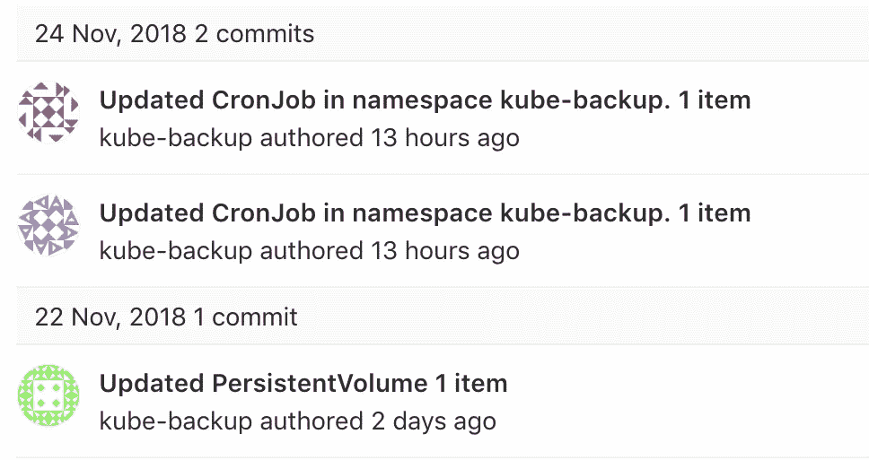

# Kubernetes 状态备份到 Git

> 原文：<https://itnext.io/kubernetes-state-backup-to-git-4f6ed096b7bb?source=collection_archive---------2----------------------->

如果 k8s 集群的某些组件被意外删除，会很难恢复吗？

我发现拥有变更历史和所有资源的备份很有用。这已经节省了我一些时间，但是安全感更重要。

我做了**kube-backup**([https://github.com/kuberhost/kube-backup](https://github.com/kuberhost/kube-backup))。它执行几个简单的步骤:

*   使用 CronJob 定期运行
*   对每种资源类型执行`kubectl get ...`
*   删除不必要的字段
*   将每个对象保存为文件，例如`kube-system/Deployment/metrics-server.yaml`
*   做`git commit`
*   将更改推送到存储库

没有自动恢复的功能，但是我们可以克隆存储库，并对我们想要恢复的对象执行`kubectl apply …`

提交消息在某种程度上是有意义的，并且提供了很好的变更历史。

我很想听听你对此的想法

*这是我围绕*[*kuber . host*](https://kuber.host/)*构建的工具之一——kubernetes cloud with free plan(仍是 beta 版)*