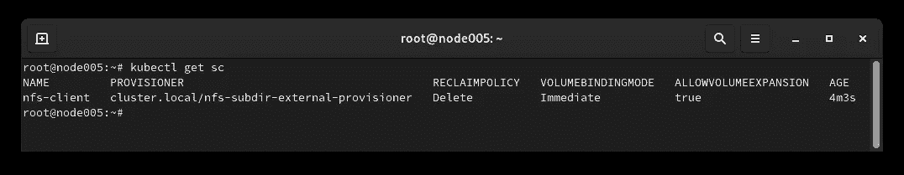
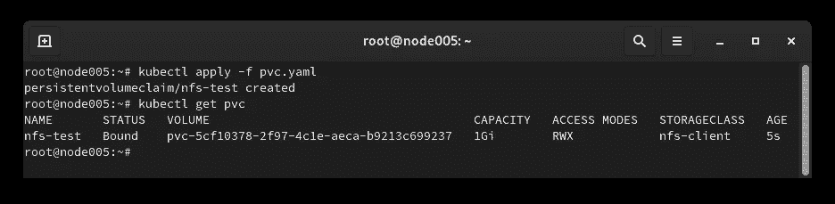

# Kubernetes 存储—第 1 部分— NFS 完整教程

> 原文：<https://itnext.io/kubernetes-storage-part-1-nfs-complete-tutorial-75e6ac2a1f77?source=collection_archive---------0----------------------->


在这一系列文章中，我打算讨论可用的 Kubernetes 存储解决方案，并提供完整的手册来将它们部署和连接到 Kubernetes。每件产品都包含不同的储物解决方案，可与 Kubernetes 搭配使用。这一系列教程对每个了解 Kubernetes 存储架构和概念的人都很有用。请注意，这一系列的教程不是一个关于库伯内特的概念，我也不是在谈论库伯内特的概念。那么，让我们从 NFS 仓库开始派对吧。

# 所需资源:

*   运行中的 Kubernetes 星团。建议 1.18+。
*   具有一些可用存储的运行节点。

我将在基于 Ubuntu 的系统上运行这些步骤。我建议你也这样做。

在本演示中，我使用两个节点，配置如下:

**作为 NFS 服务器的运行节点:**

```
OS: Ubuntu 20.04
FQDN: node004.b9tcluster.local
IP Address: 192.168.12.7
```

**单节点 Kubernetes 集群:**

```
OS: Ubuntu 20.04
Kubernetes: 1.21.5 (k3s distribution)
FQDN: node005.b9tcluster.local
IP Address: 192.168.12.8
```

# 1-部署和配置 NFS 服务器:

在您认为是 NFS 服务器的节点上运行以下命令。请注意，您可以用支持高可用性的集群方式部署 NFS 服务器。想搜就搜吧。

```
apt update && apt -y upgradeapt install -y nfs-servermkdir /datacat << EOF >> /etc/exports
/data 192.168.12.8(rw,no_subtree_check,no_root_squash)
EOFsystemctl enable --now nfs-serverexportfs -ar
```

该命令安装 NFS 服务器并导出可由 Kubernetes 集群访问的`/data`。在多节点 Kubernetes 集群的情况下，您应该允许所有 Kubernetes **worker** 节点。

# 2-准备 Kubernetes 工作节点:

现在，为了连接到 NFS 服务器，Kubernetes 节点需要一个 NFS 客户端包来连接到 NFS 服务器。您应该只在 Kubernetes 工作节点上运行以下命令。控制平面节点不需要它！只是工人。

```
apt install -y nfs-common
```

**重要提示！**每个存储解决方案可能需要客户端软件包来连接到存储服务器。您应该将它们安装在所有 Kubernetes worker 节点中。对于 NFS，需要 **nfs-common** 包。

# 3-在 Kubernetes 使用 NFS:

## 方法 1-通过 Pod 清单直接连接到 NFS:

要使用 Pod 清单直接连接到 NFS 卷，请使用 Pod 中的 NFSVolumeSource。这里有一个例子:

```
apiVersion: v1
kind: Pod
metadata:
  name: test
  labels:
    app.kubernetes.io/name: alpine
    app.kubernetes.io/part-of: kubernetes-complete-reference
    app.kubernetes.io/created-by: ssbostan
spec:
  containers:
    - name: alpine
      image: alpine:latest
      command:
        - touch
        - /data/test
      volumeMounts:
        - name: nfs-volume
          mountPath: /data
  volumes:
    - name: nfs-volume
      nfs:
        server: node004.b9tcluster.local
        path: /data
        readOnly: no
```

## 方法 2 —使用 PersistentVolume 资源进行连接:

要为 NFS 卷创建 PersistentVolume 对象，请使用以下清单。您应该注意，存储大小没有任何影响。

```
apiVersion: v1
kind: PersistentVolume
metadata:
  name: nfs-volume
  labels:
    storage.k8s.io/name: nfs
    storage.k8s.io/part-of: kubernetes-complete-reference
    storage.k8s.io/created-by: ssbostan
spec:
  accessModes:
    - ReadWriteOnce
    - ReadOnlyMany
    - ReadWriteMany
  capacity:
    storage: 10Gi
  storageClassName: ""
  persistentVolumeReclaimPolicy: Recycle
  volumeMode: Filesystem
  nfs:
    server: node004.b9tcluster.local
    path: /data
    readOnly: no
```

## 方法 3 —使用存储类进行动态资源调配:

要使用 StorageClass 动态配置 PersistentVolume，您需要安装 NFS 配置程序。我使用**NFS-subdir-external-provisioner**来实现这一点。以下命令通过使用 honey Helm 包管理器安装我们需要的所有东西。

```
helm repo add nfs-subdir-external-provisioner https://kubernetes-sigs.github.io/nfs-subdir-external-provisionerhelm install nfs-subdir-external-provisioner nfs-subdir-external-provisioner/nfs-subdir-external-provisioner \
  --create-namespace \
  --namespace nfs-provisioner \
  --set nfs.server=node004.b9tcluster.local \
  --set nfs.path=/data
```



Kubernetes 和 NFS 存储类。

若要创建 PersistentVolumeClaim，请使用以下清单:

```
apiVersion: v1
kind: PersistentVolumeClaim
metadata:
  name: nfs-test
  labels:
    storage.k8s.io/name: nfs
    storage.k8s.io/part-of: kubernetes-complete-reference
    storage.k8s.io/created-by: ssbostan
spec:
  accessModes:
    - ReadWriteMany
  storageClassName: nfs-client
  resources:
    requests:
      storage: 1Gi
```



Kubernetes NFS 卷动态预配置。

# 4-库伯内特和 NFS 储存规范:

NFS 在库伯内特世界有以下规格。在使用 NFS 储物件之前，您需要考虑这些因素。

*   **读写一次**、**只读一次**、**读写多次**访问模式。
*   存储大小没有任何影响！
*   在动态预配置的情况下，卷被分离到不同的目录中。但是没有任何访问控制！

# 最后一句话:

要了解关于 Kubernetes 的更多信息，请访问这个 GitHub 资源库。这个完整的 Kubernetes 参考将很快丰富。欢迎所有的贡献。如果您发现这篇文章有用，请查看项目 GitHub 资源库。祝你好运。

关注我的 LinkedIn[https://www.linkedin.com/in/ssbostan](https://www.linkedin.com/in/ssbostan)

[](https://github.com/ssbostan/kubernetes-complete-reference) [## GitHub-ssbo stan/Kubernetes-complete-reference:Kubernetes reference，awesome，cheatsheet…

### Kubernetes 容器编排引擎的最完整参考。由 ssbostan 和贡献者创建…

github.com](https://github.com/ssbostan/kubernetes-complete-reference)