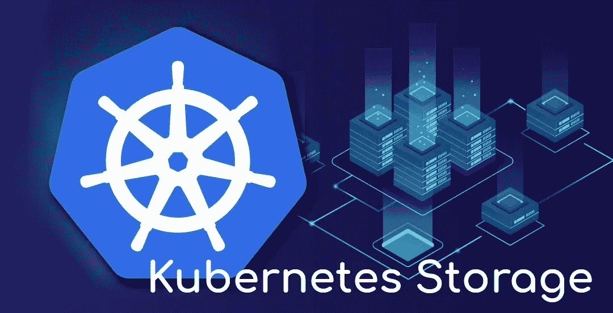

# Kubernetes 储物——第 2 部分——GlusterFS 完整教程

> 原文：<https://itnext.io/kubernetes-storage-part-2-glusterfs-complete-tutorial-77542c12a602?source=collection_archive---------0----------------------->



如果你对 Kubernetes 储物感兴趣，这一系列文章正适合你。在这一部分，我将解释如何启动和运行 GlusterFS 并在 Kubernetes 中使用它。那么，我们开始吧。

[Kubernetes 存储—第 1 部分— NFS 完整教程](/kubernetes-storage-part-1-nfs-complete-tutorial-75e6ac2a1f77)

# 所需资源:

*   运行中的 Kubernetes 星团。建议 1.18+。
*   三个节点用于启动和运行带复制的 GlusterFS。

我将在基于 **Ubuntu** 的系统上运行这些步骤。我建议你也这样做。

**提示:k3s 不支持 GlusterFS 卷。**

**三节点 Kubernetes 集群:**

```
Node1
OS: Ubuntu 20.04
Kubernetes: 1.20.7 (installed via kubespray)
FQDN: node001.b9tcluster.local
IP Address: 192.168.12.4Node2
OS: Ubuntu 20.04
Kubernetes: 1.20.7 (installed via kubespray)
FQDN: node002.b9tcluster.local
IP Address: 192.168.12.5Node3
OS: Ubuntu 20.04
Kubernetes: 1.20.7 (installed via kubespray)
FQDN: node003.b9tcluster.local
IP Address: 192.168.12.6
```

【GlusterFS 的三个节点:

```
Storage1
OS: Ubuntu 20.04
FQDN: node004.b9tcluster.local
IP Address: 192.168.12.7
Storage: /dev/sdb1 mounted on /gluster/volume
Storage: /dev/sdb2 mounted on /gluster/heketi (Heketi)
Role: ReplicaStorage2
OS: Ubuntu 20.04
FQDN: node005.b9tcluster.local
IP Address: 192.168.12.8
Storage: /dev/sdb1 mounted on /gluster/volume
Storage: /dev/sdb2 mounted on /gluster/heketi (Heketi)
Role: ReplicaStorage3
OS: Ubuntu 20.04
FQDN: node006.b9tcluster.local
IP Address: 192.168.12.9
Storage: /dev/sdb1 mounted on /gluster/volume
Storage: /dev/sdb2 mounted on /gluster/heketi (Heketi)
Role: Arbiter
```

在上面为 GlusterFS 集群考虑的配置中，**仲裁器**节点不是真正复制数据的节点！它保存的不是数据，而是文件的元数据。我们用它来防止存储**裂脑**正好只有两个副本。

# 1-启动并运行 GlusterFS 集群:

要安装和配置 GlusterFS，请执行以下步骤:

```
# Install GlusterFS server on all STORAGE nodes.apt install -y glusterfs-serversystemctl enable --now glusterd.service
```

用 2 个副本和 1 个仲裁器设置 Gluster 卷:

```
# Only on Node1 of STORAGE nodes.gluster peer probe node005.b9tcluster.localgluster peer probe node006.b9tcluster.localgluster volume create k8s-volume replica 2 arbiter 1 transport tcp \
  node004:/gluster/volume \
  node005:/gluster/volume \
  node006:/gluster/volumegluster volume start k8s-volume
```

要查看卷信息，请运行以下命令:

```
gluster volume info k8s-volumeVolume Name: k8s-volume
Type: Replicate
Volume ID: dd5aac80-b160-4281-9b22-00ae95f4bc0c
Status: Started
Snapshot Count: 0
Number of Bricks: 1 x (2 + 1) = 3
Transport-type: tcp
Bricks:
Brick1: node004:/gluster/volume
Brick2: node005:/gluster/volume
Brick3: node006:/gluster/volume (arbiter)
Options Reconfigured:
transport.address-family: inet
storage.fips-mode-rchecksum: on
nfs.disable: on
performance.client-io-threads: off
```

# 2-准备 Kubernetes 工作节点:

现在，为了使 Kubernetes workers 能够连接和使用 GlusterFS 卷，您需要在 WORKER 节点中安装 glusterfs-client。

```
apt install glusterfs-client
```

**重要提示！**每个存储解决方案可能需要客户端包来连接到存储服务器。您应该将它们安装在所有 Kubernetes worker 节点中。对于 GlusterFS，需要 **glusterfs-client** 包。

# 3-在 Kubernetes 发现 GlusterFS:

GlusterFS 星团应该在 Kubernetes 星团中被发现。为此，您需要添加一个指向 GlusterFS 集群服务器的端点对象。

```
apiVersion: v1
kind: Endpoints
metadata:
  name: glusterfs-cluster
  labels:
    storage.k8s.io/name: glusterfs
    storage.k8s.io/part-of: kubernetes-complete-reference
    storage.k8s.io/created-by: ssbostan
subsets:
  - addresses:
      - ip: 192.168.12.7
        hostname: node004
      - ip: 192.168.12.8
        hostname: node005
      - ip: 192.168.12.9
        hostname: node006
    ports:
      - port: 1
```

# 4-在 Kubernetes 中使用 GlusterFS:

## 方法 1 —通过 Pod 清单直接连接到 GlusterFS:

要使用 Pod 清单直接连接到 GlusterFS 卷，请在 Pod 中使用 GlusterfsVolumeSource。这里有一个例子:

```
apiVersion: v1
kind: Pod
metadata:
  name: test
  labels:
    app.kubernetes.io/name: alpine
    app.kubernetes.io/part-of: kubernetes-complete-reference
    app.kubernetes.io/created-by: ssbostan
spec:
  containers:
    - name: alpine
      image: alpine:latest
      command:
        - touch
        - /data/test
      volumeMounts:
        - name: glusterfs-volume
          mountPath: /data
  volumes:
    - name: glusterfs-volume
      glusterfs:
        endpoints: glusterfs-cluster
        path: k8s-volume
        readOnly: no
```

## 方法 2 —使用 PersistentVolume 资源进行连接:

要为 GlusterFS 卷创建 PersistentVolume 对象，请使用以下清单。存储大小没有任何影响。

```
apiVersion: v1
kind: PersistentVolume
metadata:
  name: glusterfs-volume
  labels:
    storage.k8s.io/name: glusterfs
    storage.k8s.io/part-of: kubernetes-complete-reference
    storage.k8s.io/created-by: ssbostan
spec:
  accessModes:
    - ReadWriteOnce
    - ReadOnlyMany
    - ReadWriteMany
  capacity:
    storage: 10Gi
  storageClassName: ""
  persistentVolumeReclaimPolicy: Recycle
  volumeMode: Filesystem
  glusterfs:
    endpoints: glusterfs-cluster
    path: k8s-volume
    readOnly: no
```

## 方法 3 —使用存储类进行动态资源调配:

是时候解释最难的部分了，GlusterFS 与 Kubernetes StorageClass 一起实现动态存储供应。为了实现这个模型，除了 GlusterFS 集群，我们还需要 Heketi。Heketi 是基于 RESTful 的 GlusterFS 卷管理。我们必须使用 Heketi，因为 Kubernetes 需要访问它来动态创建卷。

**要求:**

*   用于存储 Heketi 数据库的运行 GlusterFS。
*   GlusterFS 集群节点上可用的原始存储设备。
*   将 Heketi 连接到 GlusterFS 节点的 SSH 密钥。

**架构和场景:**

为了构建卷，Kubernetes 部署的 Heketi 必须与 GlusterFS 节点连接。这种通信应该使用 SSH 来完成。因此，我们需要一个在 GlusterFS 节点上授权的私钥。另一方面，Heketi 应该知道哪些原始设备可用于创建分区和 GlusterFS 块。拓扑文件应该包含一个群集节点列表以及一个可访问的原始存储列表。赫克提有自己的数据库来保存所有关于创造砖。为了保存 Heketi 数据，我使用了我们在前面几节中部署的现有 GlusterFS 集群。

让我们假设一些现有的材料:

*   通过 SSH 连接 GlusterFS 节点的私钥: **heketi-ssh-key**
*   所有 GlusterFS 节点上可用的原始设备: **/dev/sdc (100GB)**

**3.1:创建一个 GlusterFS 卷来存储 Heketi 数据库:**

```
gluster volume create **heketi-db-volume** replica 3 transport tcp \
  node004:/gluster/heketi \
  node005:/gluster/heketi \
  node006:/gluster/heketigluster volume start heketi-db-volume
```

**3.2:创建一个 Kubernetes 秘密来存储 SSH 私有密钥:**

```
kubectl create secret generic **heketi-ssh-key-file** \
  --from-file=**heketi-ssh-key**
```

**3.3:创建 heke ti“config . JSON”文件:**

```
{
  "_port_comment": "Heketi Server Port Number",
  "port": "8080",
  "_use_auth": "Enable JWT authorization.",
  "use_auth": true,
  "_jwt": "Private keys for access",
  "jwt": {
    "_admin": "Admin has access to all APIs",
    "admin": {
      "key": "**ADMIN-HARD-SECRET**"
    }
  },
  "_glusterfs_comment": "GlusterFS Configuration",
  "glusterfs": {
    "executor": "**ssh**",
    "_sshexec_comment": "SSH username and private key file",
    "sshexec": {
      "keyfile": "**/heketi/heketi-ssh-key**",
      "user": "root",
      "port": "22"
    },
    "_db_comment": "Database file name",
    "db": "**/var/lib/heketi/heketi.db**",
    "loglevel" : "debug"
  }
}
```

**3.4:创建集群“topology.json”文件:**

可以使用多个原始设备。赫克提人知道如何管理他们。此外，Heketi 可以同时管理几个集群。

```
{
  "clusters": [
    {
      "nodes": [
        {
          "node": {
            "hostnames": {
              "manage": [
                "node004.b9tcluster.local"
              ],
              "storage": [
                "192.168.12.7"
              ]
            },
            "zone": 1
          },
          "devices": [
            "**/dev/sdc**"
          ]
        },
        {
          "node": {
            "hostnames": {
              "manage": [
                "node005.b9tcluster.local"
              ],
              "storage": [
                "192.168.12.8"
              ]
            },
            "zone": 1
          },
          "devices": [
            "**/dev/sdc**"
          ]
        },
        {
          "node": {
            "hostnames": {
              "manage": [
                "node006.b9tcluster.local"
              ],
              "storage": [
                "192.168.12.9"
              ]
            },
            "zone": 1
          },
          "devices": [
            "**/dev/sdc**"
          ]
        }
      ]
    }
  ]
}
```

**3.5:创建 Heketi 配置和拓扑的 Kubernetes 配置图:**

```
kubectl create configmap **heketi-config** \
  --from-file=heketi.json \
  --from-file=topology.json
```

**3.6:启动并运行 Kubernetes 中的 heke ti:**

```
apiVersion: v1
kind: Service
metadata:
  name: heketi
  labels:
    app.kubernetes.io/name: heketi
    app.kubernetes.io/part-of: glusterfs
    app.kubernetes.io/origin: kubernetes-complete-reference
    app.kubernetes.io/created-by: ssbostan
spec:
  type: NodePort
  selector:
    app.kubernetes.io/name: heketi
    app.kubernetes.io/part-of: glusterfs
    app.kubernetes.io/origin: kubernetes-complete-reference
    app.kubernetes.io/created-by: ssbostan
  ports:
    - port: 8080
---
apiVersion: apps/v1
kind: Deployment
metadata:
  name: heketi
  labels:
    app.kubernetes.io/name: heketi
    app.kubernetes.io/part-of: glusterfs
    app.kubernetes.io/origin: kubernetes-complete-reference
    app.kubernetes.io/created-by: ssbostan
spec:
  replicas: 1
  selector:
    matchLabels:
      app.kubernetes.io/name: heketi
      app.kubernetes.io/part-of: glusterfs
      app.kubernetes.io/origin: kubernetes-complete-reference
      app.kubernetes.io/created-by: ssbostan
  template:
    metadata:
      labels:
        app.kubernetes.io/name: heketi
        app.kubernetes.io/part-of: glusterfs
        app.kubernetes.io/origin: kubernetes-complete-reference
        app.kubernetes.io/created-by: ssbostan
    spec:
      containers:
        - name: heketi
          image: heketi/heketi:10
          ports:
            - containerPort: 8080
          volumeMounts:
            - name: ssh-key-file
              mountPath: /heketi
            - name: config
              mountPath: /etc/heketi
            - name: data
              mountPath: /var/lib/heketi
      volumes:
        - name: ssh-key-file
          secret:
            secretName: **heketi-ssh-key-file**
        - name: config
          configMap:
            name: **heketi-config**
        - name: data
          glusterfs:
            endpoints: glusterfs-cluster
            path: **heketi-db-volume**
```

**3.7:将集群拓扑加载到 Heketi:**

```
kubectl exec **POD-NAME** -- heketi-cli \
  --user admin \
  --secret **ADMIN-HARD-SECRET** \
  topology load --json /etc/heketi/topology.json
```

将**POD-的名字**替换为你的赫克梯吊舱的名字。

如果一切顺利，您应该能够从 Heketi 获得集群 id。

```
kubectl exec **POD-NAME** -- heketi-cli \
  --user admin \
  --secret **ADMIN-HARD-SECRET** \
  cluster listClusters:
Id:**c63d60ee0ddf415097f4eb82d69f4e48** [file][block]
```

**3.8:获取赫克提节点端口信息:**

```
kubectl get svcheketi NodePort 10.233.29.206 <none> 8080:**31310**/TCP 41d
```

**3.9:创建赫克提“管理员”用户的秘密:**

```
kubectl create secret generic **heketi-admin-secret** \
  --type=kubernetes.io/glusterfs \
  --from-literal=key=**ADMIN-HARD-SECRET**
```

**3.10:为 GlusterFS 动态预配置创建存储类:**

用你自己的信息替换需要的信息。

```
apiVersion: storage.k8s.io/v1
kind: StorageClass
metadata:
  name: glusterfs
  labels:
    storage.k8s.io/name: glusterfs
    storage.k8s.io/provisioner: heketi
    storage.k8s.io/origin: kubernetes-complete-reference
    storage.k8s.io/created-by: ssbostan
provisioner: kubernetes.io/glusterfs
parameters:
  resturl: http://127.0.0.1:**31310**
  clusterid: **c63d60ee0ddf415097f4eb82d69f4e48**
  restauthenabled: !!str true
  restuser: admin
  secretNamespace: default
  secretName: **heketi-admin-secret**
  volumetype: replicate:3
```

**3.11:创建 PersistentVolumeClaim 以测试动态预配置:**

```
apiVersion: v1
kind: PersistentVolumeClaim
metadata:
  name: testvol
  labels:
    storage.k8s.io/name: glusterfs
    storage.k8s.io/provisioner: heketi
    storage.k8s.io/origin: kubernetes-complete-reference
    storage.k8s.io/created-by: ssbostan
spec:
  accessModes:
    - ReadWriteOnce
  storageClassName: **glusterfs**
  resources:
    requests:
      storage: 10Gi # Storage size takes effect.
```

# 4- Kubernetes 和 GlusterFS 存储规格:

使用 GlusterFS 前，请考虑以下提示:

*   **读写一次**、**只读多次**、**读写多次**访问模式。
*   GlusterFS 卷可以用隔板和砖块隔离。
*   GlusterFS 也可以像本地存储一样部署在 Kubernetes 上。

# 最后一句话:

恭喜你！你已经通过了所有关于 Kubernetes 和 GlusterFS。要了解关于 Kubernetes 的更多信息，请访问这个 GitHub 资源库。这个完整的 Kubernetes 参考将很快丰富。欢迎所有的贡献。如果您发现这篇文章有用，请查看项目 GitHub 资源库。

关注我的 LinkedIn[https://www.linkedin.com/in/ssbostan](https://www.linkedin.com/in/ssbostan)

[](https://github.com/ssbostan/kubernetes-complete-reference) [## GitHub-ssbo stan/Kubernetes-complete-reference:Kubernetes reference，awesome，cheatsheet…

### Kubernetes 容器编排引擎的最完整参考。由 ssbostan 和贡献者创建…

github.com](https://github.com/ssbostan/kubernetes-complete-reference)