# Kubernetes: Krew 插件管理器和有用的 kubectl 插件列表

> 原文：<https://itnext.io/kubernetes-the-krew-plugins-manager-and-useful-kubectl-plugins-list-8143d65c6c48?source=collection_archive---------0----------------------->


`kubectl`实用程序最有价值的特性之一是它的插件。

当然还有像[镜头](https://k8slens.dev/)这样的东西，被不喜欢在终端工作的开发者广泛使用，或者像 [k9s](https://k9scli.io/) 这样的工具，但是`kubectl`的插件值得一个专用的岗位。

因此，在这篇文章中，我们将安装 Krew — `kubectl`的插件管理器，并查看我在工作中使用的插件列表。

# krew——用于`kubectl`的插件管理器

最近，`kubectl`有了自己的插件管理器`[Krew](https://krew.sigs.k8s.io/)`。

它有一个插件库，用于安装和升级插件。

在 Arch 上可以从 AUR 安装 Linux `krew`:

Arch Linux:

```
$ yay -S krew
```

更新其软件包列表:

```
$ kubectl krew update
```

找一个插件，比如`topology`:

```
$ kubectl krew search topology
NAME DESCRIPTION INSTALLED
topology Explore region topology for nodes or pods no
```

安装它:

```
$ kubectl krew install topology
Updated the local copy of plugin index.
Upgrades available for installed plugins:
* rbac-tool v1.2.1 -> v1.3.0
Installing plugin: topology
Installed plugin: topology
\
| Use this plugin:
| kubectl topology
| Documentation:
| [https://github.com/bmcustodio/kubectl-topology](https://github.com/bmcustodio/kubectl-topology)
/
```

并检查:

```
$ kubectl topology help
Provides insight into the topology of a Kubernetes cluster.
Usage:
kubectl-topology [command]
Available Commands:
help Help about any command
node Provides insight into the distribution of nodes per region or zone.
pod Provides insight into the distribution of pods per region or zone.
```

# `kubectl` -有用插件列表

在这篇文章的最后，我会添加几个类似插件列表的链接，下面让我们来看看我在工作中使用的最好的插件。

## `kubectl-topology`

让我们从`[kubectl-topology](https://github.com/bmcustodio/kubectl-topology)`插件开始，它允许显示所有集群的 WorkerNodes、它们的区域以及位于每个节点上的 pod:

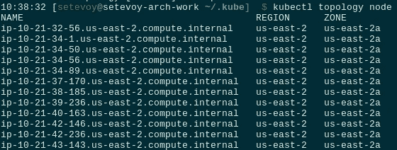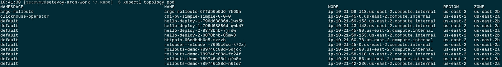

## `kubectl-resources`

`[kubectl-resources](https://github.com/howardjohn/kubectl-resources)`插件可以在 WorkerNodes 上显示关于 pods 使用的限制和资源的扩展信息。

使用 Go 安装:

```
$ go get github.com/howardjohn/kubectl-resources
```

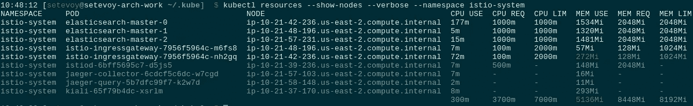

## `kubectl-free`

`[kubectl-free](https://github.com/makocchi-git/kubectl-free)`插件类似于 Linux 中的`free`实用程序——它将显示关于 WorkerNodes 上已用和可用资源的信息。

通过从发布页面下载一个归档文件来安装它，解压并复制到`/usr/local/bin`:

```
$ cd /tmp/
$ wget [https://github.com/makocchi-git/kubectl-free/releases/download/v0.2.0/kubectl-free_0.2.0_Linux_x86_64.zip](https://github.com/makocchi-git/kubectl-free/releases/download/v0.2.0/kubectl-free_0.2.0_Linux_x86_64.zip)
$ unzip kubectl-free_0.2.0_Linux_x86_64.zip
$ sudo cp kubectl-free_0.2.0_Linux_x86_64/kubectl-free /usr/local/bin/
```

并运行它:

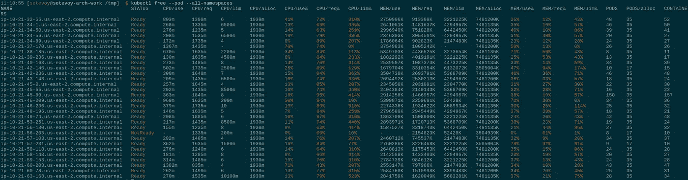

## `kubecolor`

`[kubecolor](https://github.com/dty1er/kubecolor)`非常有用，可以通过移植使`kubectl`的输出更具可读性。

使用 Go 安装:

```
$ go install github.com/dty1er/kubecolor/cmd/kubecolor@latest
```

给`~/.bashrc`添加别名:

```
alias kk="kubecolor"
```

和结果:

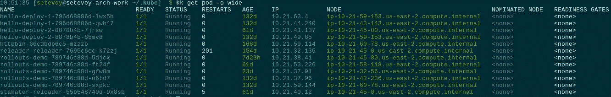

## `kubectl-watch`

`kubectl --watch`的改进型。项目的页面在这里是[>>>](https://github.com/lee0c/kubectl-watch)。

安装:

```
$ git clone [https://github.com/lee0c/kubectl-watch.git](https://github.com/lee0c/kubectl-watch.git)
$ cd kubectl-watch
$ chmod +x kubectl-watch
$ sudo mv kubectl-watch /usr/local/bin/
```

检查:

```
$ kubectl plugin list
The following kubectl-compatible plugins are available:
/usr/local/bin/kubectl-watch
…
```

并运行:

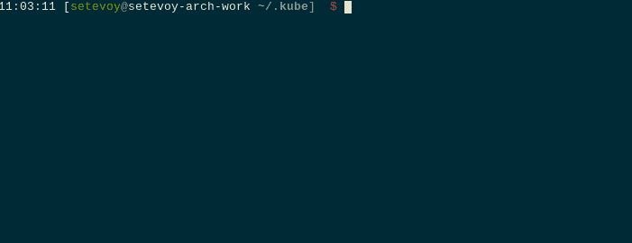

## `kubectl-clogs`

高级日志查看器。类似于`kubectl logs -f`，但是可以跟踪一个名称空间中所有 pod 的日志。更多详情[此处> > >](https://github.com/ivkalita/kubectl-clogs) 。

安装:

```
$ go install github.com/ivkalita/kubectl-clogs/cmd/kubectl-clogs@latest
```

并检查来自 *istio-system* 名称空间的日志:

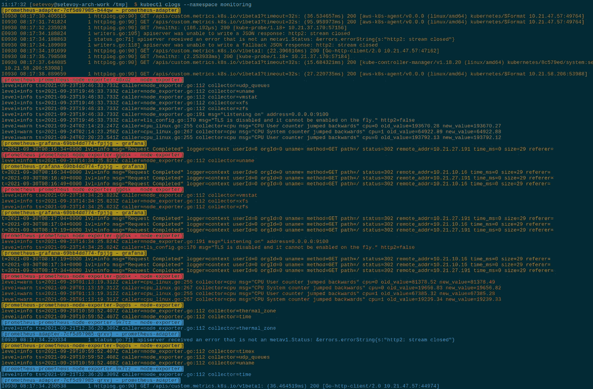

## `kubectl-who-can`

`[kubectl-who-can](https://github.com/aquasecurity/kubectl-who-can)`用于显示 RBAC 的权限和访问。

用 Krew 安装:

```
$ kubectl krew install who-can
```

并检查谁能够删除*默认*名称空间中的窗格:

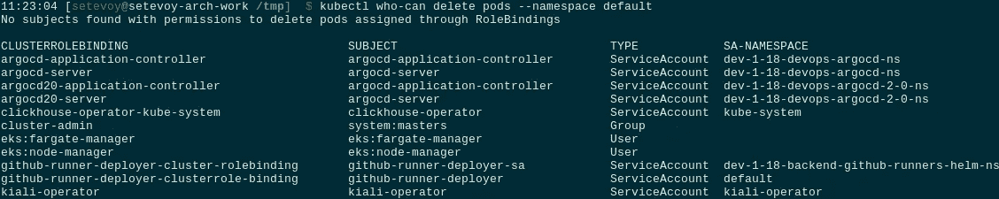

## `kubectl-rolesum`

`[kubectl-rolesum](https://awesomeopensource.com/project/Ladicle/kubectl-rolesum)`也用于与 Kubernetes RBAC 一起检查权限。

安装:

```
$ kubectl krew install rolesum
```

并检查 *istio-system* 名称空间中*kiali-service-account*service account 的权限:

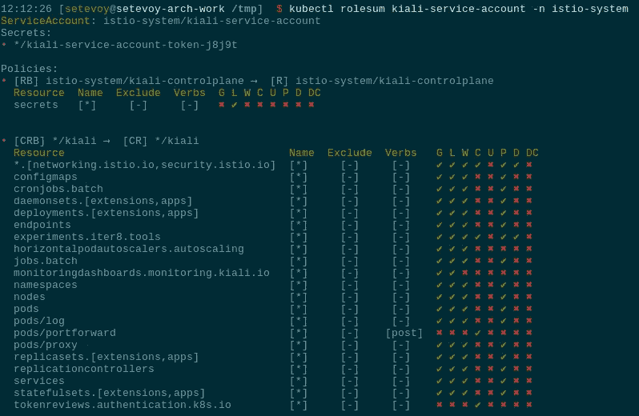

## `ketall`

`[ketall](https://github.com/corneliusweig/ketall)`将显示所有资源，包括机密、服务帐户、角色、绑定等等，而不仅仅是 pod、服务、守护进程、部署和复制集，就像使用`kubectl get all`时一样。

安装:

```
$ kubectl krew install get-all
```

`kubectl get all`命令的输出示例:

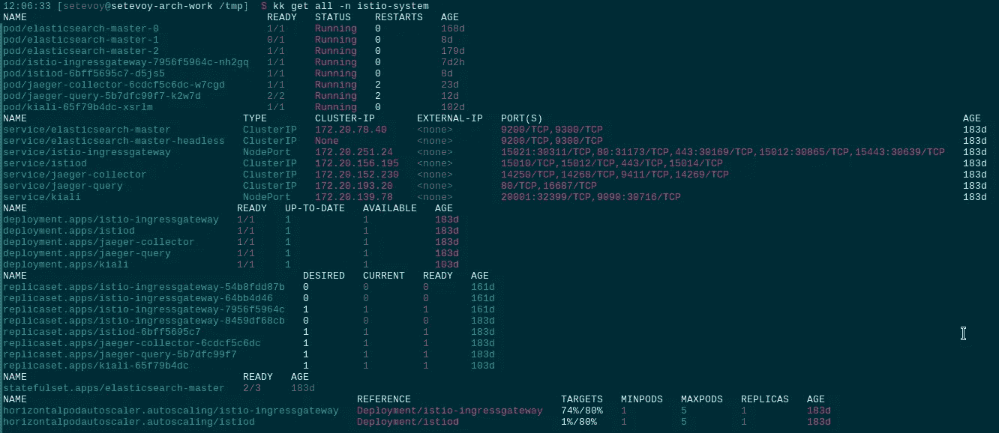

并用`ketall` - `kubectl get-all`:

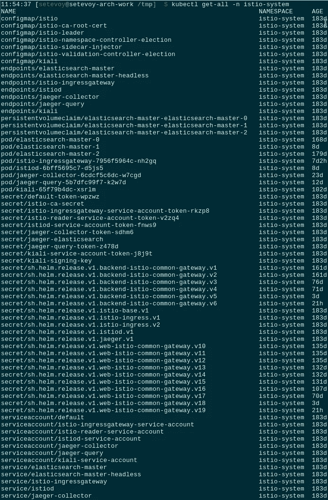

## `kubectl-status`

`[kubectl-status](https://awesomeopensource.com/project/bergerx/kubectl-status#usage)`可以显示关于 pod 状态、节点、部署、服务等的扩展信息。

安装:

```
$ kubectl krew install status
```

并使用标签集`role: data-workers`检查 Kubernetes WorkerNodes 状态:

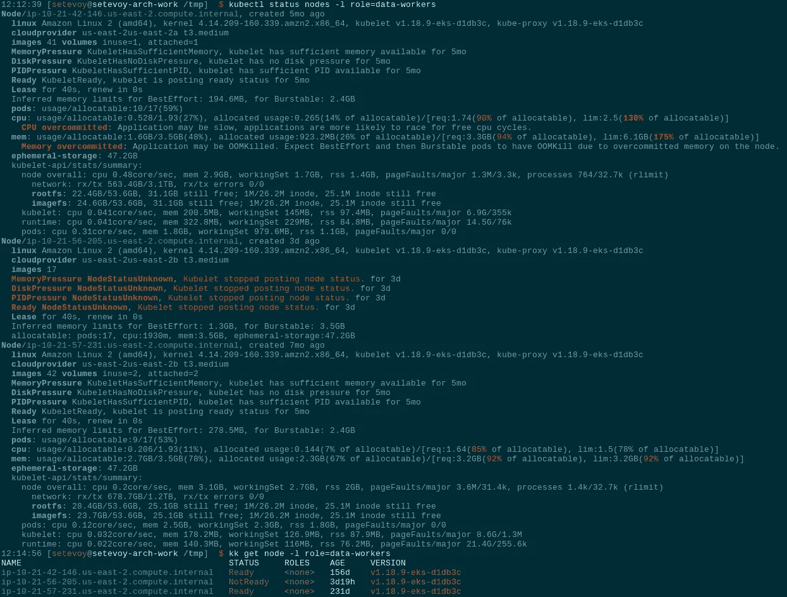

## `Pod-Dive`

[Pod-Dive](https://awesomeopensource.com/project/caiobegotti/Pod-Dive) 将显示关于 Kubernetes Pod 的信息——它的 WorkerNode、一个名称空间、该 Pod 中的容器，以及运行在同一个 WorkerNode 上的其他 Pod。

安装:

```
$ kubectl krew install pod-dive
```

并检查一个 Pod:

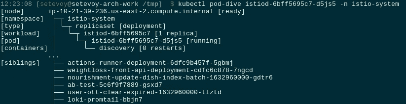

## `kubectl-janitor`

`[kubectl-janitor](https://awesomeopensource.com/project/dastergon/kubectl-janitor)`-Kubernetes 集群的“清洁工”。可以找到有问题的资源，如未计划的 pod、失败的作业、卷等。

安装:

```
$ kubectl krew install janitor
```

并查找所有未安排到工作节点的 pod:

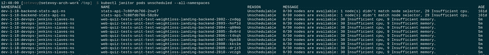

## `kubectl-cf`

还有今天最后一个插件——`[kubectl-cf](https://github.com/spongeprojects/kubectl-cf)`。

实际上，有很多插件可以简单地处理`kubectl`的上下文，但是我使用的是集群的专用文件，而不是专用上下文:

```
$ ls -1 ~/.kube/ | grep kubeconfig
dev-1–18.kubeconfig
prod-1–18.kubeconfig
stage-1–18.kubeconfig
test-1–18.kubeconfig
```

为了在它们之间更快地切换，我们可以使用`kubectl-cf`插件，它将通过创建到`~/.kube/config`文件的符号链接来工作。

注意，所有文件都必须有`.kubeconfig`扩展名。

安装它——克隆它的存储库，构建并复制到`/usr/local/bin`:

```
$ git clone [https://github.com/spongeprojects/kubectl-cf.git](https://github.com/spongeprojects/kubectl-cf.git)
$ cd kubectl-cf/
$ go build -o kubectl-cf
$ sudo cp kubectl-cf /usr/local/bin/
```

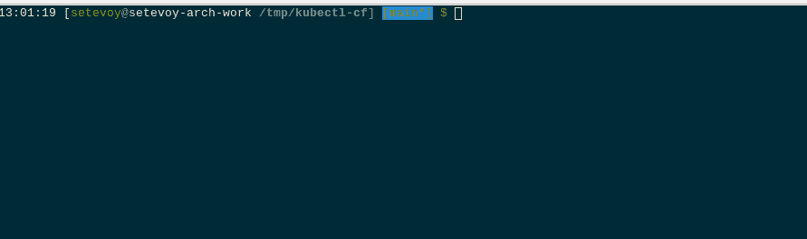

# 有用的链接

*   [awesome-ku bectl-plugins](https://github.com/ishantanu/awesome-kubectl-plugins)——一个精选的 awesome `kubectl`插件列表
*   [Github 上排名前 179 的 Kubectl 插件开源项目](https://awesomeopensource.com/projects/kubectl-plugins)

*最初发表于* [*RTFM: Linux、DevOps 和系统管理*](https://rtfm.co.ua/en/kubernetes-the-krew-plugins-manager-and-useful-kubectl-plugins-list/) *。*