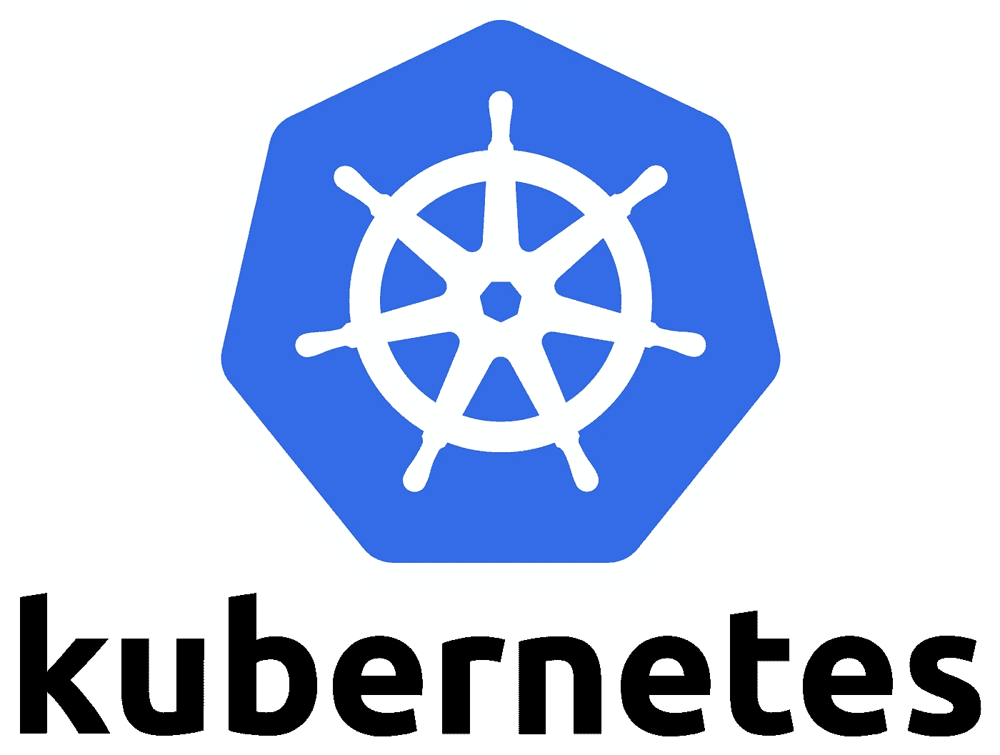

# Kubernetes 提示|暴露关于豆荚的信息

> 原文：<https://itnext.io/kubernetes-tips-exposing-information-about-pods-9e7cf45d8a9a?source=collection_archive---------1----------------------->



[https://cncf-branding.netlify.app/projects/kubernetes/](https://cncf-branding.netlify.app/projects/kubernetes/)

你是否曾经需要从当前正在运行的 pod 中获取信息，并在你的应用程序中使用这些信息？也许你需要获得你的应用程序运行所在的 pod 的名称，或者你想使用从[变异 webhook](https://kubernetes.io/docs/reference/access-authn-authz/extensible-admission-controllers/) 创建的某个标签，让你的应用程序做出关于将请求路由到哪里的某些决定。

幸运的是，通过使用来自[向下 API](https://kubernetes.io/docs/concepts/workloads/pods/downward-api/) 和向下 API 量的 Pod 字段，这非常简单。使用向下 API，我们能够将当前正在运行的 Pod 的 Pod 级字段信息作为环境变量或文件直接暴露给容器。

在这篇文章中，我们不会深入探讨向下的 API，但是我们将通过一个例子来演示如何将 pod 信息作为环境变量公开，以及如何将信息作为文件公开。

*对于我们的 K8s 环境，我们将使用* [*类*](https://kind.sigs.k8s.io/) *。有关 KiND 入门的更多信息，请参见文档。这是我比较喜欢的本土开发 K8s。*

## 作为环境变量公开

如果您以前曾经在 pod 中的容器中暴露过环境变量，那么这应该不是什么新鲜事。为了将 Pod 级别的字段作为环境变量公开，我们采用的方式与我们习惯于为硬编码的环境变量、配置映射或机密所采用的方式相同。这种情况下唯一的区别是我们需要在 [Pod](https://kubernetes.io/docs/reference/kubernetes-api/workload-resources/pod-v1/#Pod) 或 [PodSpec](https://kubernetes.io/docs/reference/kubernetes-api/workload-resources/pod-v1/#PodSpec) API 中定义字段的 *fieldRef* 和 *fieldValue* 。

示例:

```
apiVersion: v1
kind: Pod
metadata:
  name: env-var-example
  labels:
    envrionment: test
    zone: us-east-1a
    app: env-var-test
spec:
  containers:
    - name: env-test
      image: python
      command: [ "python", "-c"]
      args:
      - "import os; print(os.environ['LABEL_NAME'], os.environ['POD_NAME'], os.environ['POD_IP'])"
      env:
        - name: LABEL_NAME
          valueFrom:
            fieldRef:
              fieldPath: metadata.labels['zone']
        - name: POD_NAME
          valueFrom:
            fieldRef:
              fieldPath: metadata.name
        - name: POD_IP
          valueFrom:
            fieldRef:
              fieldPath: status.podIP
```

在上面的示例中，我们向容器公开了关于 Pod 的以下内容:

*   **标签名称** —标签区域的值。作为一个例子，这可能是从变异的 webhook 注入的东西。
*   **POD_NAME** —我们给 POD 起的名字。这里我们静态地定义了它，因为我们使用了 Pod 资源种类。但是，如果我们需要来自作为部署资源一部分的 Pod 的信息，名称将会自动生成，并且我们在发布之前不会知道。
*   **POD _ IP—**POD 的 IP。在这里，我们演示了甚至可以获取 Pod 的状态信息并公开它。

下面你可以看到环境变量是由 Python 打印的。

```
> kubectl logs -f env-var-example
us-east-1a env-var-example 10.244.0.25
```

自己试试上面的，看看还有哪些领域可以曝光。所有可用字段参见[官方文件](https://kubernetes.io/docs/concepts/workloads/pods/downward-api/#available-fields)。

**还要注意**，我们不会在这里展示相同的过程，你也可以使用向下 API 将容器字段公开为环境变量。见[官方 K8s 文档](https://kubernetes.io/docs/tasks/inject-data-application/environment-variable-expose-pod-information/#use-container-fields-as-values-for-environment-variables)上的教程。

# 作为文件公开

现在我们将展示一个如何使用向下 API volume 公开 Pod 字段的示例。这将获取 Pod 级别的字段，然后将它们公开为容器中的一个文件。如果您曾经将 pod 中的配置图或秘密作为卷公开过，这看起来应该也很熟悉。这里的主要区别是我们在卷资源中定义了向下 API。请参见下面的示例。

示例:

```
apiVersion: v1
kind: Pod
metadata:
  name: file-example
  labels:
    envrionment: test
    zone: us-east-1a
    app: file-test
spec:
  containers:
    - name: file-test
      image: python
      command: [ "python", "-c"]
      args:
      - "import time; f = open(‘/etc/labelinfo/labels.txt’, ‘r’); content = f.read(); print(content); f.close(); time.sleep(5)"
      volumeMounts:
        - name: labelinfo
          mountPath: /etc/labelinfo
  volumes:
    - name: labelinfo
      downwardAPI:
        items:
          - path: "labels.txt"
            fieldRef:
              fieldPath: metadata.labels
```

在示例中，我们使用 downwardAPI 创建了一个名为 *labelinfo* 的卷，并从我们的 pod 中为我们的 *fieldRef* 和 *fieldPath 选择标签。*然后我们使用 *labels.txt* 的路径，它告诉 Kubernetes 我们将调用文件名 labels.txt。在我们的容器中，我们将指向卷 *labelinfo 的 *volumeMount* 赋值。*然后我们将 *labels.txt* 挂载到*volume mount 中指定的*挂载路径下。

上面资源的 app 用 Python 读取 *"labels.txt"* 文件。下面是日志的输出:

```
> kubectl logs -f file-example
app="file-test"
envrionment="test"
zone="us-east-1a"
```

您可以在这里看到，Python 成功地打印了 Pod 资源中的所有标签，并将它们放在一个文件中，供我们在应用程序中使用。这不是一个真实世界的应用程序，但你可以看到这是多么简单，可以纳入您的用例。

**注意:**和上面的环境变量例子一样，使用这个方法也支持获取容器字段并将它们存储为文件。例如参见[正式文件](https://kubernetes.io/docs/tasks/inject-data-application/downward-api-volume-expose-pod-information/#store-container-fields)。

上面你可以看到向你的应用程序展示 Pod 信息是多么简单。这些年来，有好几次这两种方式都帮助我获得了我需要的信息。希望你喜欢它！