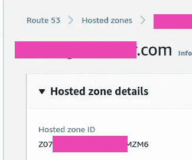
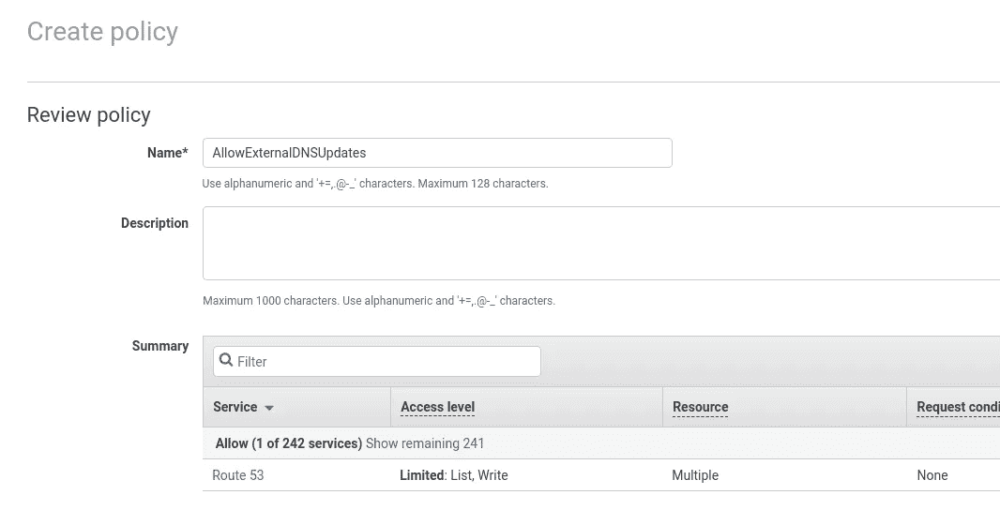
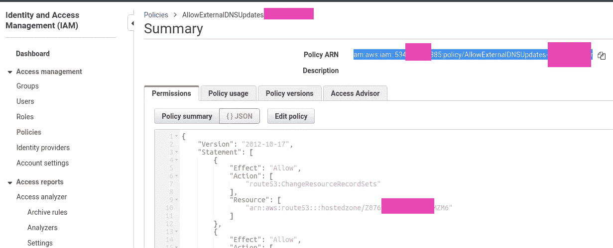
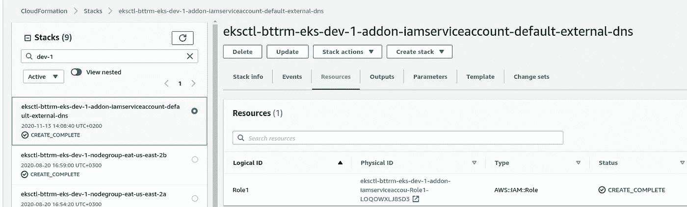
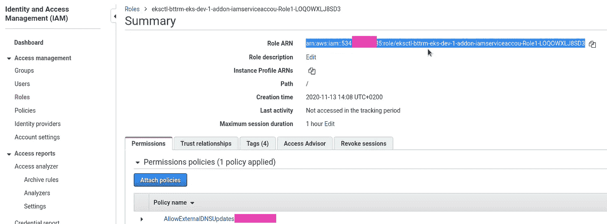
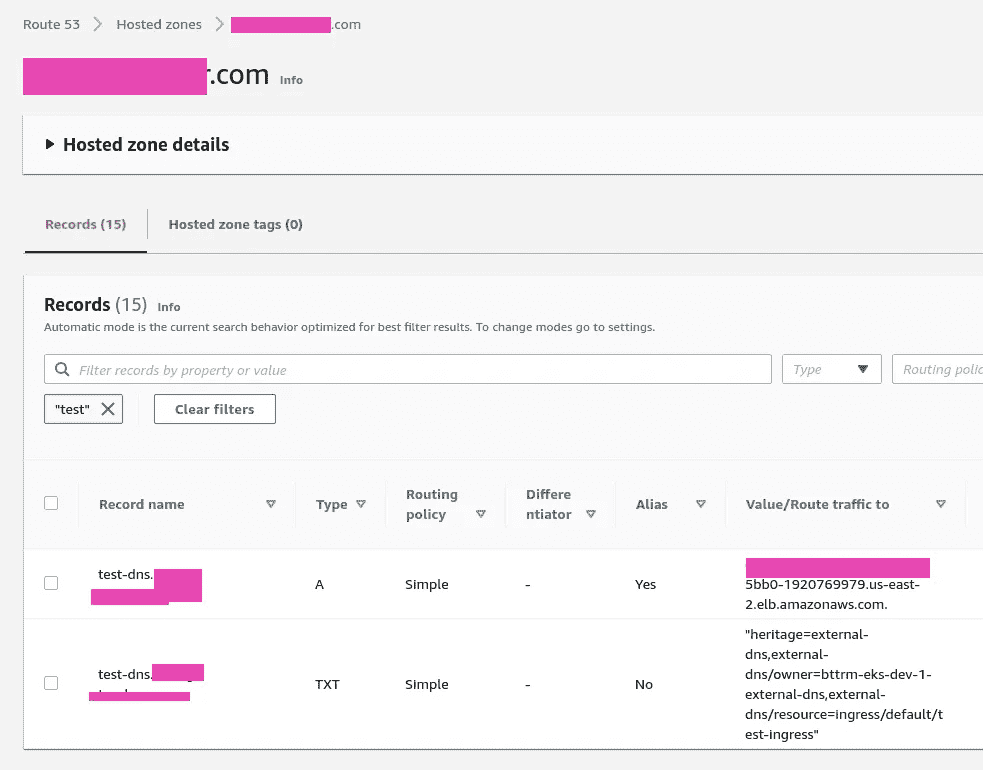
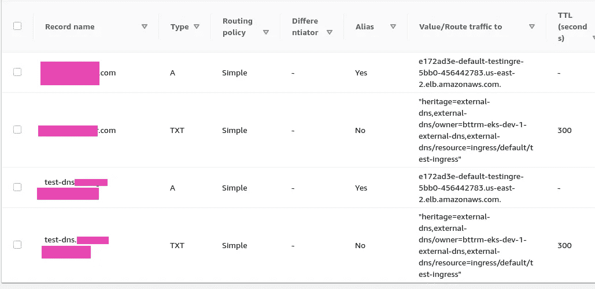
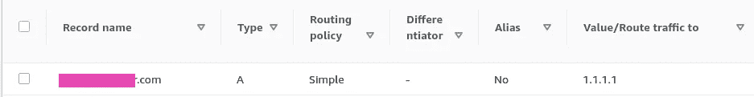
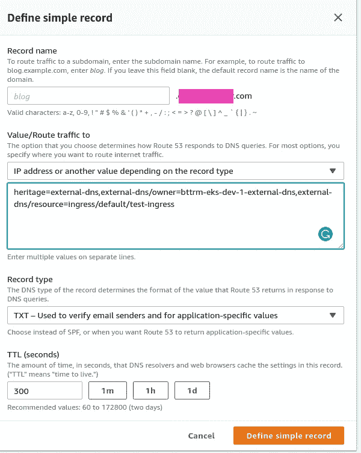
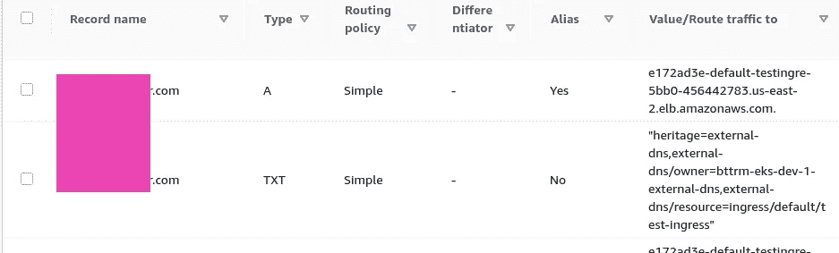

# Kubernetes:从入口更新 AWS Route53 DNS

> 原文：<https://itnext.io/kubernetes-update-aws-route53-dns-from-an-ingress-1c3a8068f9fe?source=collection_archive---------1----------------------->


我们希望能够在部署 Kubernetes 入口资源时在 AWS Route53 上添加 DNS 记录，并将该记录指向由 [ALB 入口控制器](https://rtfm.co.ua/kubernetes-zapusk-alb-ingress-controller-dlya-aws-elastic-kubernetes-service/)创建的 AWS 负载平衡器的 URL。

为了实现这一点，可以使用[外部 DNS](https://github.com/kubernetes-sigs/external-dns) ，它将向 AWS Route53 发出 API 请求，以添加适当的记录。

AWS 安装在其[文档> > >](https://github.com/kubernetes-sigs/external-dns/blob/master/docs/tutorials/aws.md) 中有描述。

# **内容**

*   [AWS 设置](https://rtfm.co.ua/en/kubernetes-update-aws-route53-dns-from-an-ingress/#AWS_set_up)
*   [IAM 策略](https://rtfm.co.ua/en/kubernetes-update-aws-route53-dns-from-an-ingress/#IAM_Policy)
*   [我的角色](https://rtfm.co.ua/en/kubernetes-update-aws-route53-dns-from-an-ingress/#IAM_Role)
*   [外部域名](https://rtfm.co.ua/en/kubernetes-update-aws-route53-dns-from-an-ingress/#ExternalDNS)
*   [Kubernetes Ingress 和 AWS 应用负载平衡器](https://rtfm.co.ua/en/kubernetes-update-aws-route53-dns-from-an-ingress/#Kubernetes_Ingress_and_AWS_Application_LoadBalancer)
*   [记录更新和 apex 域](https://rtfm.co.ua/en/kubernetes-update-aws-route53-dns-from-an-ingress/#Records_updates_and_apex_domains)
*   [更新现有的根级域名](https://rtfm.co.ua/en/kubernetes-update-aws-route53-dns-from-an-ingress/#Update_an_existing_rootleveldomain)

# AWS 设置

## IAM 策略

首先，需要创建一个 IAM 策略。出于测试目的，让我们创建一个只能访问一个托管域的站点。

转到 Route53，找到一个区域 ID:



转到 IAM >策略，添加新策略:

```
{
  "Version": "2012-10-17",
  "Statement": [
    {
      "Effect": "Allow",
      "Action": [
        "route53:ChangeResourceRecordSets"
      ],
      "Resource": [
        "arn:aws:route53:::hostedzone/Z07***ZM6"
      ]
    },
    {
      "Effect": "Allow",
      "Action": [
        "route53:ListHostedZones",
        "route53:ListResourceRecordSets"
      ],
      "Resource": [
        "*"
      ]
    }
  ]
}
```

保存它:



找到它，并复制它的 ARN:



## IAM 角色

我们的 AWS Elastic Kubernetes 服务集群是用`ekctl`创建的，参见 [AWS Elastic Kubernetes 服务:集群创建自动化，第 2 部分 Ansible，eksctl](https://rtfm.co.ua/en/aws-elastic-kubernetes-service-a-cluster-creation-automation-part-2-ansible-eksctl/) 帖子。

附上 [OIDC](https://docs.aws.amazon.com/IAM/latest/UserGuide/id_roles_providers_create_oidc.html) :

```
$ eksctl utils associate-iam-oidc-provider --region=us-east-2 --cluster=bttrm-eks-dev-1 --approve
```

创建服务帐户:

```
$ eksctl --profile arseniy create iamserviceaccount --name external-dns --cluster bttrm-eks-dev-1 --attach-policy-arn arn:aws:iam::534***385:policy/AllowExternalDNSUpdates --approve --override-existing-serviceaccounts
```

转到 AWS CloudFormation，找到由`eksctl`创建的堆栈，以及其中的一个新角色:



忸怩这个角色的 ARN:



# 外部 DNS

检查您的 clutser 中是否启用了 RBAC:

```
$ kubectl api-versions | grep rbac.authorization.k8s.io
rbac.authorization.k8s.io/v1
rbac.authorization.k8s.io/v1beta1
```

创建一个部署，请参见[清单(对于启用了 RBAC 的集群)](https://github.com/kubernetes-sigs/external-dns/blob/master/docs/tutorials/aws.md#manifest-for-clusters-with-rbac-enabled)，在其 ServiceAccount 注释中指定了上面创建的角色，并在`--domain-filter`-set your domain*example.com*中，因为我们仍然希望只使用一个域来测试 ExternalDNS，而不是授予它访问此 AWS 帐户中所有域的权限:

```
apiVersion: v1
kind: ServiceAccount
metadata:
  name: external-dns
  # If you're using Amazon EKS with IAM Roles for Service Accounts, specify the following annotation.
  # Otherwise, you may safely omit it.
  annotations:
    # Substitute your account ID and IAM service role name below.
    eks.amazonaws.com/role-arn: arn:aws:iam::534***385:role/eksctl-bttrm-eks-dev-1-addon-iamserviceaccou-Role1-LOQOWXLJ8SD3
---
apiVersion: rbac.authorization.k8s.io/v1beta1
kind: ClusterRole
metadata:
  name: external-dns
rules:
- apiGroups: [""]
  resources: ["services","endpoints","pods"]
  verbs: ["get","watch","list"]
- apiGroups: ["extensions","networking.k8s.io"]
  resources: ["ingresses"]
  verbs: ["get","watch","list"]
- apiGroups: [""]
  resources: ["nodes"]
  verbs: ["list","watch"]
---
apiVersion: rbac.authorization.k8s.io/v1beta1
kind: ClusterRoleBinding
metadata:
  name: external-dns-viewer
roleRef:
  apiGroup: rbac.authorization.k8s.io
  kind: ClusterRole
  name: external-dns
subjects:
- kind: ServiceAccount
  name: external-dns
  namespace: default
---
apiVersion: apps/v1
kind: Deployment
metadata:
  name: external-dns
spec:
  strategy:
    type: Recreate
  selector:
    matchLabels:
      app: external-dns
  template:
    metadata:
      labels:
        app: external-dns
    spec:
      serviceAccountName: external-dns
      containers:
      - name: external-dns
        image: k8s.gcr.io/external-dns/external-dns:v0.7.3
        args:
        - --source=service
        - --source=ingress
        - --domain-filter=example.com # will make ExternalDNS see only the hosted zones matching provided domain, omit to process all available hosted zones
        - --provider=aws
        - --policy=upsert-only # would prevent ExternalDNS from deleting any records, omit to enable full synchronization
        - --aws-zone-type=public # only look at public hosted zones (valid values are public, private or no value for both)
        - --registry=txt
        - --txt-owner-id=bttrm-eks-dev-1-external-dns
      securityContext:
        fsGroup: 65534 # For ExternalDNS to be able to read Kubernetes and AWS token files
```

文档没有描述这里的“`txt-owner-id`”选项到底是什么，所以它定义了一个 TXT-record 值，供 ExternalDNS 在创建新的 DNS 记录时使用，以将它们标记为“由 ExternalDNS 拥有”。

例如，如果我们已经有一个子域记录*subdomain.example.com*，并且它没有这样一个由 ExternalDNS 添加的 TXT 记录，那么当使用`host: subdomain.example.com`创建一个新的入口时，ExternalDNS 将不会对这样一个现有的记录做任何事情。

稍后我们将播放这些 TXT 记录。

现在，部署 ExternalDNS 资源:

```
$ kubectl apply -f ~/Work/Temp/EKS/external-dns-deployment.yaml
Warning: kubectl apply should be used on resource created by either kubectl create — save-config or kubectl apply
serviceaccount/external-dns configured
clusterrole.rbac.authorization.k8s.io/external-dns created
clusterrolebinding.rbac.authorization.k8s.io/external-dns-viewer created
deployment.apps/external-dns created
```

检查吊舱:

```
$ kubectl get pod -l app=external-dns
NAME READY STATUS RESTARTS AGE
external-dns-75894b84b-2qnr5 1/1 Running 0 2m2s
```

## Kubernetes 入口和 AWS 应用负载平衡器

让我们去检查我们的外部。

创建部署和服务:

```
apiVersion: apps/v1
kind: Deployment
metadata:
  name: test-deployment
  labels:
    app: test
spec:
  replicas: 1
  selector:
    matchLabels:
      app: test
  template:
    metadata:
      labels:
        app: test
    spec:
      containers:
      - name: nginx
        image: nginx:1.14.2
        ports:
        - containerPort: 80
      dnsPolicy: None
---
apiVersion: v1
kind: Service
metadata:
  name: test-svc
spec:
  type: NodePort
  selector:
    app: test
  ports:
    - protocol: TCP
      port: 80
      targetPort: 80
```

创建一个入口，在其注释`external-dns.alpha.kubernetes.io/hostname`中指定所需的域(或在`spec.rules.host`):

```
---
apiVersion: extensions/v1beta1
kind: Ingress
metadata:
  name: test-ingress
  annotations:
    kubernetes.io/ingress.class: alb
    alb.ingress.kubernetes.io/scheme: internet-facing
    alb.ingress.kubernetes.io/listen-ports: '[{"HTTP": 80}]'
    alb.ingress.kubernetes.io/inbound-cidrs: 0.0.0.0/0
    external-dns.alpha.kubernetes.io/hostname: test-dns.example.com
spec:
  rules:
  - http:
      paths:
      - backend:
          serviceName: test-svc
          servicePort: 80
```

部署它:

```
$ kubectl apply -f ~/Work/devops-kubernetes/tests/test-deployment.yaml
deployment.apps/test-deployment created
service/test-svc created
ingress.extensions/test-ingress created
```

检查入口:

```
$ kubectl get ingress test-ingress
NAME HOSTS ADDRESS PORTS AGE
test-ingress * e172ad3e-default-testingre-5bb0–1920769979.us-east-2.elb.amazonaws.com 80 28s
```

Pod 的日志:

```
$ kubectl logs external-dns-75894b84b-2qnr5
…
time=”2020–11–13T12:31:13Z” level=info msg=”Desired change: CREATE test-dns.example.com A [Id: /hostedzone/Z07***ZM6]”
time=”2020–11–13T12:31:13Z” level=info msg=”Desired change: CREATE test-dns.example.com TXT [Id: /hostedzone/Z07***ZM6]”
time=”2020–11–13T12:31:13Z” level=info msg=”2 record(s) in zone example.com. [Id: /hostedzone/Z07***ZM6] were successfully updated”
```

和 DNS:



注意带有“`heritage=external-dns,external-dns/owner=bttrm-eks-dev-1-external-dns,external-dns/resource=ingress/default/test-ingress`”值的 TXT 这里使用了`txt-owner-id`参数。

检查域:

```
$ dig test-dns.example.com +short
3.133.54.4
13.59.209.195$ curl -I test-dns.example.com.com
HTTP/1.1 200 OK
```

## 记录更新和 apex 域

要允许外部 DNS 更新和删除记录，请在其部署中删除`--policy=upsert-only`选项。

此外，根级别(apex)域必须没有任何 TXT 记录，否则，ExternalDNS 不会更新它。更重要的是，您必须根本没有根级域名的现有记录(但我们将在下面看到必须更新现有记录)。

在我们的例子中，我们有一个用于 Google 验证的 TXT 记录，我必须删除它。

更新入口指定一个子域和一个根域:

```
---
apiVersion: extensions/v1beta1
kind: Ingress
metadata:
  name: test-ingress
  annotations:
    kubernetes.io/ingress.class: alb
    alb.ingress.kubernetes.io/scheme: internet-facing
    alb.ingress.kubernetes.io/listen-ports: '[{"HTTP": 80}]'
    alb.ingress.kubernetes.io/inbound-cidrs: 0.0.0.0/0
    external-dns.alpha.kubernetes.io/hostname: test-dns.example.com, example.com
spec:
  rules:
  - http:
      paths:
      - backend:
          serviceName: test-svc
          servicePort: 80
```

更新并检查入口:

```
$ kubectl get ingress test-ingress
NAME HOSTS ADDRESS PORTS AGE
test-ingress * e172ad3e-default-testingre-5bb0–456442783.us-east-2.elb.amazonaws.com 80 30m
```

检查日志:

```
time=”2020–11–14T12:47:16Z” level=info msg=”Desired change: CREATE example.com A [Id: /hostedzone/Z07***ZM6]”
time=”2020–11–14T12:47:16Z” level=info msg=”Desired change: CREATE example.comm TXT [Id: /hostedzone/Z07***ZM6]”
time=”2020–11–14T12:47:16Z” level=info msg=”2 record(s) in zone example.com. [Id: /hostedzone/Z07***ZM6] were successfully updated”
```

和域本身:



## 更新现有的根级别域

我想尝试更新现有域名的第一件事是添加一个 TXT-record。

例如，假设我们在 1.1.1.1 记录中有一个*example.com*域，我们不想删除它，而是需要在部署新入口时进行更新。

此时，如果只是将*example.com*添加到入口，则 ExternalDNS 不会更新现有记录，因为没有合适的 TXT-record 向 ExternalDNS 表明该记录是他“拥有”的。

因此，我们的想法是添加带有`txt-owner-id`的 TXT，即`heritage=external-dns,external-dns/owner=bttrm-eks-dev-1-external-dns,external-dns/resource=ingress/default/test-ingress`，然后部署带有`host`设置的入口。

但是在这种情况下，ExternalDNS 在我能够部署入口之前删除了现有的记录。

因此，流程可以是下一步:

1.  我们有域*example.com*与在一个 1.1.1.1 在路由 53
2.  将使用指定的域部署新入口
3.  ExternalDNS 不会更新现有的记录 1.1.1.1，因为没有“绑定”TXT 记录
4.  然后，我们将手动创建 TXT，在下一次检查时，ExternalDNS 将看到它，并认为该记录由他管理，他有权限管理它，并将使用入口 URL 的适当值更新它

让我们检查一下。

删除之前测试中 ExternalDNS 已经创建的所有记录，在 1.1.1.1 中手动添加*example.com*，部署带有*example.com*集合的入口——external DNS 会说“ ***所有记录都已经是最新的*** ”因为没有绑定 TXT。

Route53 中的记录现在看起来是这样的:



现在，添加 TXT:



并检查日志:

```
time=”2020–11–14T13:39:44Z” level=info msg=”Desired change: UPSERT example.com A [Id: /hostedzone/Z07***ZM6]”
time=”2020–11–14T13:39:44Z” level=info msg=”Desired change: UPSERT example.com TXT [Id: /hostedzone/Z07***ZM6]”
time=”2020–11–14T13:39:45Z” level=info msg=”2 record(s) in zone example.com. [Id: /hostedzone/Z07***ZM6] were successfully updated”
```

ExternalDNS 现在执行了`[UPSERT](https://docs.aws.amazon.com/Route53/latest/APIReference/API_ChangeResourceRecordSets.html)`调用，而不是`DELETE`或`CREATE`，并且记录按照我们的计划进行了更新:



完成了。

*最初发表于* [*RTFM: Linux，devo PSисистемноеадмииитиованиииованиде*T25*。*](https://rtfm.co.ua/en/kubernetes-update-aws-route53-dns-from-an-ingress/)