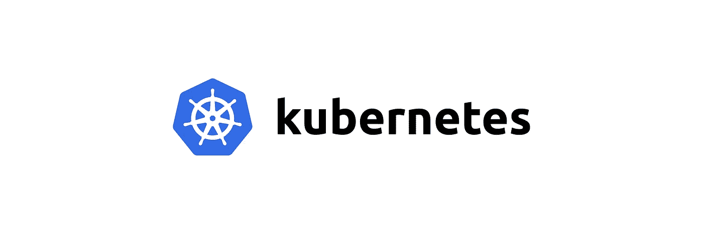

# Kubernetes:什么是端点

> 原文：<https://itnext.io/kubernetes-what-are-endpoints-3cc9e769b614?source=collection_archive---------0----------------------->



通常，当使用 Kubernetes 服务时，我们看不到端点对象，因为它们在幕后工作，类似于“隐藏”在 Kubernetes 部署后面的[复制集](https://kubernetes.io/docs/concepts/workloads/controllers/replicaset/)。

# Kubernetes 服务

因此，[服务](https://kubernetes.io/docs/concepts/services-networking/service/)是一个 Kubernetes 抽象，它使用*标签*来选择将流量路由到的 pods，请参见[Kubernetes:cluster IP vs node port vs load balancer，Services and Ingress—概述示例](https://rtfm.co.ua/en/kubernetes-clusterip-vs-nodeport-vs-loadbalancer-services-and-ingress-an-overview-with-examples/)和 [Kubernetes:服务、负载平衡、kube-proxy 和 iptables](https://rtfm.co.ua/en/kubernetes-service-load-balancing-kube-proxy-and-iptables/) :

```
apiVersion: v1
kind: Service
metadata:
  name: my-service
spec:
  selector:
    app: MyApp
  ports:
    - protocol: TCP
      port: 80
      targetPort: 9376
```

一旦一个新的 pod 出现在集群中，标签与服务的`selector`相匹配，上面示例中的`app=MyApp`服务将开始向它发送流量。

这是通过将该 Pod 的 IP 地址添加到该服务的*端点*列表中来实现的。

让我们创建一个简单的例子:

```
---
apiVersion: v1
kind: Pod
metadata:
  name: nginx-pod
  labels:
    app: nginx
spec:
  containers:
    - name: nginx-container
      image: nginx
      ports:
        - name: web
          containerPort: 80
          protocol: TCP
---
apiVersion: v1
kind: Service
metadata:
  name: nginx-svc
spec:
  selector:
    app: nginx
  ports:
    - protocol: TCP
      port: 80
      targetPort: 80
```

这里，我们用 NGINX 创建了一个 Pod，以及一个默认类型为`ClusterIP`的服务。

应用清单:

```
$ kubectl apply -f svc-example.yaml
pod/nginx-pod created
service/nginx-svc created
```

检查服务:

```
$ kubectl get service nginx-svc
NAME TYPE CLUSTER-IP EXTERNAL-IP PORT(S) AGE
nginx-svc ClusterIP 172.20.69.253 <none> 80/TCP 26s
```

# Kubernetes 端点

现在，让我们仔细看看它:

```
$ kubectl describe service nginx-svc
Name: nginx-svc
Namespace: default
Labels: <none>
Annotations: <none>
Selector: app=nginx
Type: ClusterIP
IP Families: <none>
IP: 172.20.69.253
IPs: <none>
Port: <unset> 80/TCP
TargetPort: 80/TCP
Endpoints: 10.21.56.143:80
```

最后，我们可以看到这个服务的端点 pod 的 IP。

检查此 Pod:

```
$ kubectl describe pod nginx-pod
Name: nginx-pod
Namespace: default
Priority: 0
Node: ip-10–21–49–33.us-east-2.compute.internal/10.21.49.33
Start Time: Sat, 13 Mar 2021 08:37:55 +0200
Labels: app=nginx
Annotations: kubernetes.io/psp: eks.privileged
Status: Running
IP: 10.21.56.143
…
```

这里是上面提到的 IP。

现在，让我们检查端点，它们是专用的 API 对象，可以像服务和 pod 一样进行观察:

```
$ kubectl get endpoints nginx-svc
NAME ENDPOINTS AGE
nginx-svc 10.21.56.143:80 18m
```

如果我们通过在清单文件中将其描述为附加对象或通过创建部署来添加具有相同标签的其他 pod，则这些 pod 将被添加为服务的端点:

```
---
apiVersion: apps/v1
kind: Deployment
metadata:
  name: nginx-deploy
  labels:
    app: nginx
spec:
  replicas: 2
  selector:
    matchLabels:
      app: nginx
  template:
    metadata:
      labels:
        app: nginx
    spec:
      containers:
      - name: nginx-container
        image: nginx
        ports:
          - name: web
            containerPort: 80
            protocol: TCP
---
apiVersion: v1
kind: Service
metadata:
  name: nginx-svc
spec:
  selector:
    app: nginx
  ports:
    - protocol: TCP
      port: 80
      targetPort: 80
```

创建部署:

```
$ kubectl apply -f svc-example.yaml
deployment.apps/nginx-deploy created
service/nginx-svc unchanged
```

并检查端点:

```
$ kubectl get endpoints nginx-svc
NAME ENDPOINTS AGE
nginx-svc 10.21.37.55:80,10.21.54.174:80,10.21.56.143:80 21m
```

在这里，我们可以看到上一个 pod 中的 *10.21.56.143:80* ，以及两个新的——来自上面部署的`replicas`中指定的 pod。

通过使用`--selector`找到这些 pod，类似地，当服务寻找 pod 以将它们添加到其端点时:

```
$ kubectl get pod --selector=app=nginx -o wide
NAME READY STATUS RESTARTS AGE IP
nginx-deploy-7fcd954c94-gbm6d 1/1 Running 0 2m28s 10.21.54.174
nginx-deploy-7fcd954c94-mg8kr 1/1 Running 0 2m28s 10.21.37.55
nginx-pod 1/1 Running 0 23m 10.21.56.143
```

## 自定义端点

我们还可以创建一个自定义端点，它将指向任何所需的资源。

例如，描述一项新服务:

```
kind: Service
apiVersion: v1
metadata:
  name: external-svc
spec:
  ports:
    - name: web
      protocol: TCP
      port: 80
      targetPort: 80
```

注意，在这种情况下，我们没有添加`selector`字段。

和描述端点对象:

```
kind: Endpoints
apiVersion: v1
metadata:
  name: external-svc
subsets: 
  - addresses:
        - ip: 139.59.205.180
    ports:
      - port: 80
        name: web
```

这里:

1.  `name`:必须与服务相同
2.  `addresses`:向其发送流量的地址，在本例中，这是[rtfm.co.ua](https://rtfm.co.ua/)所在的数字海洋云中的一个服务器的 IP 地址，但是您可以设置多个地址，这样服务将在它们之间进行负载平衡，如 [Kubernetes: Service、load balancing、kube-proxy 和 iptables](https://rtfm.co.ua/en/kubernetes-service-load-balancing-kube-proxy-and-iptables/) 中所述
3.  `ports.port`和`ports.name`也必须与相应的服务相同

创建它们:

```
$ kubectl apply -f external-endpoint.yaml
service/external-svc created
endpoints/external-svc created
Check the Service and its Endpoints:
kubectl describe svc external-svc
Name: external-svc
Namespace: default
Labels: <none>
Annotations: <none>
Selector: <none>
Type: ClusterIP
IP Families: <none>
IP: 172.20.45.77
IPs: <none>
Port: web 80/TCP
TargetPort: 80/TCP
Endpoints: 139.59.205.180:80
```

运行 Pod 以检查此服务是否工作:

```
$ kubectl run pod — rm -i — tty — image ubuntu — bash
```

将`curl`安装在该吊舱中:

```
root@pod:/# apt update && apt -y install curl
```

并按名称检查服务:

```
root@pod:/# curl -Ls external-svc | grep \<title\>
<title>RTFM: Linux, DevOps, and system administration</title>
```

或者通过使用它的 FQDN:

```
root@pod:/# curl -Ls external-svc.default.svc.cluster.local | grep \<title\>
<title>RTFM: Linux, DevOps, and system administration</title>
```

# `externalName`

访问外部资源的另一个解决方案是使用`[externalName](https://rtfm.co.ua/kubernetes-clusterip-vs-nodeport-vs-loadbalancer-services-i-ingress-obzor-primery/#ExternalName)`类型的服务:

```
---
apiVersion: v1
kind: Service
metadata:
  name: rtfm-service
spec:
  ports:
    - port: 80
  type: ExternalName
  externalName: rtfm.co.ua
```

应用并检查:

```
$ root@pod:/# curl -Ls rtfm-service | grep \<title\>
<title>RTFM: Linux, DevOps, and system administration</title>
```

完成了。

*最初发布于* [*RTFM: Linux，devo PSисистемноеадммиитиииииованниое*](https://rtfm.co.ua/en/kubernetes-what-is-endpoints/)*。*