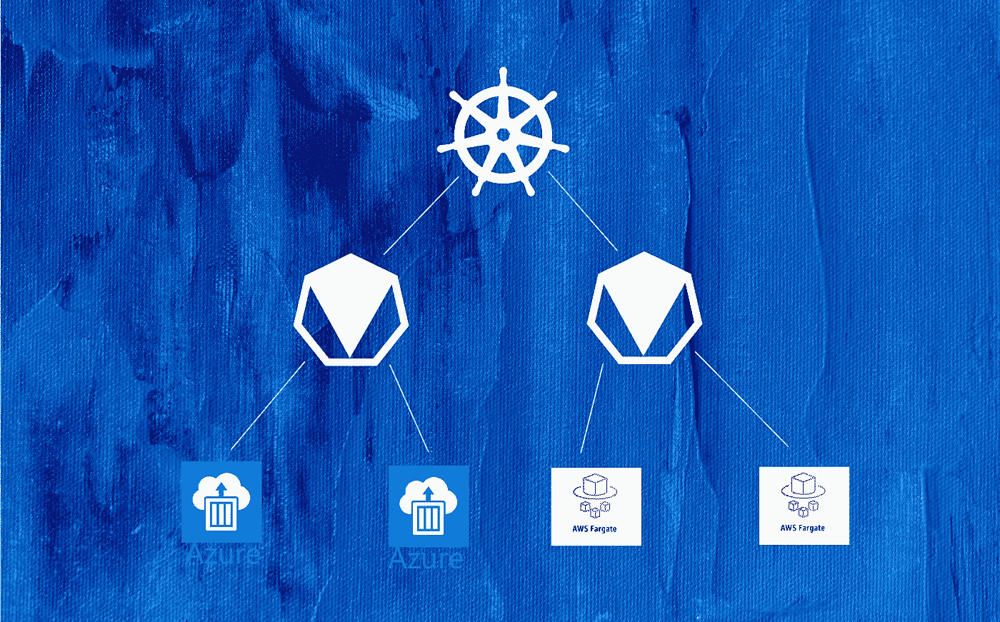
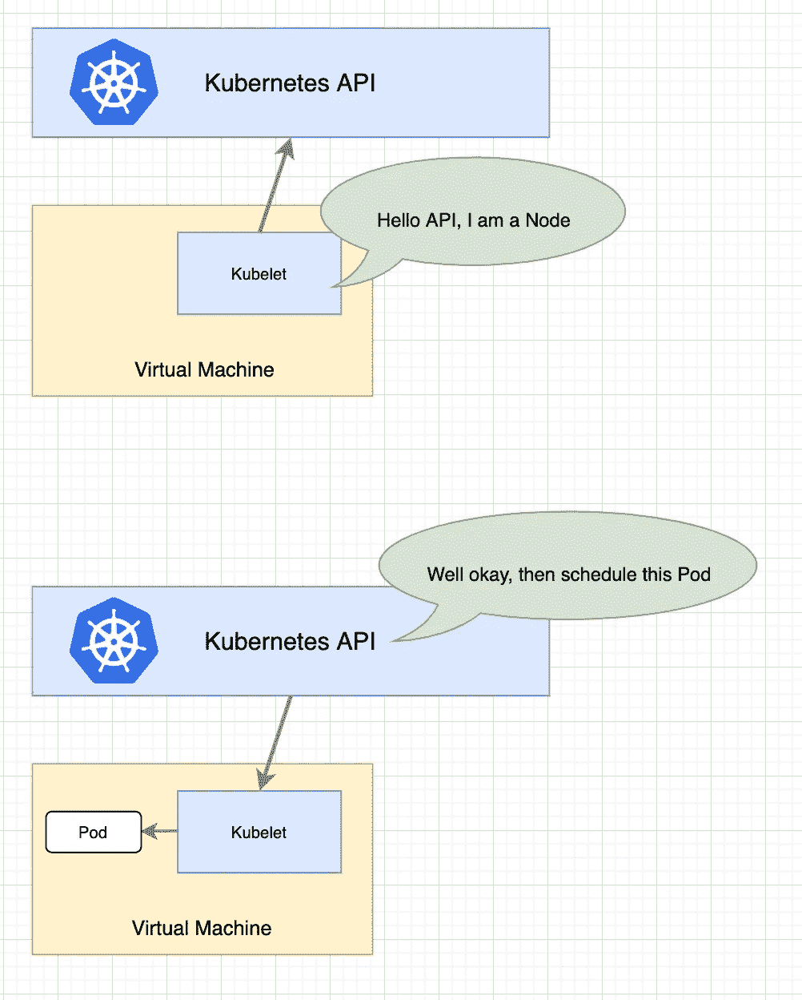
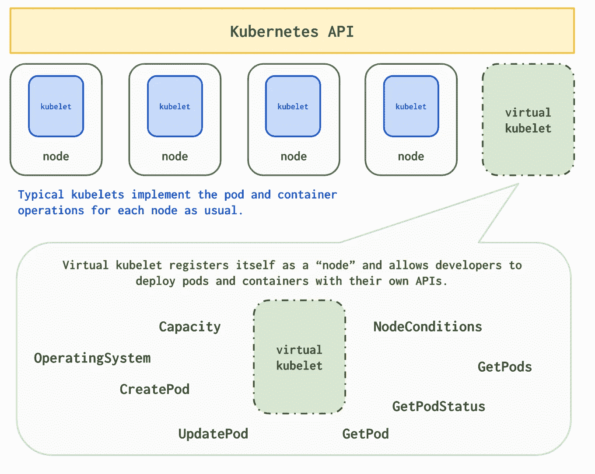
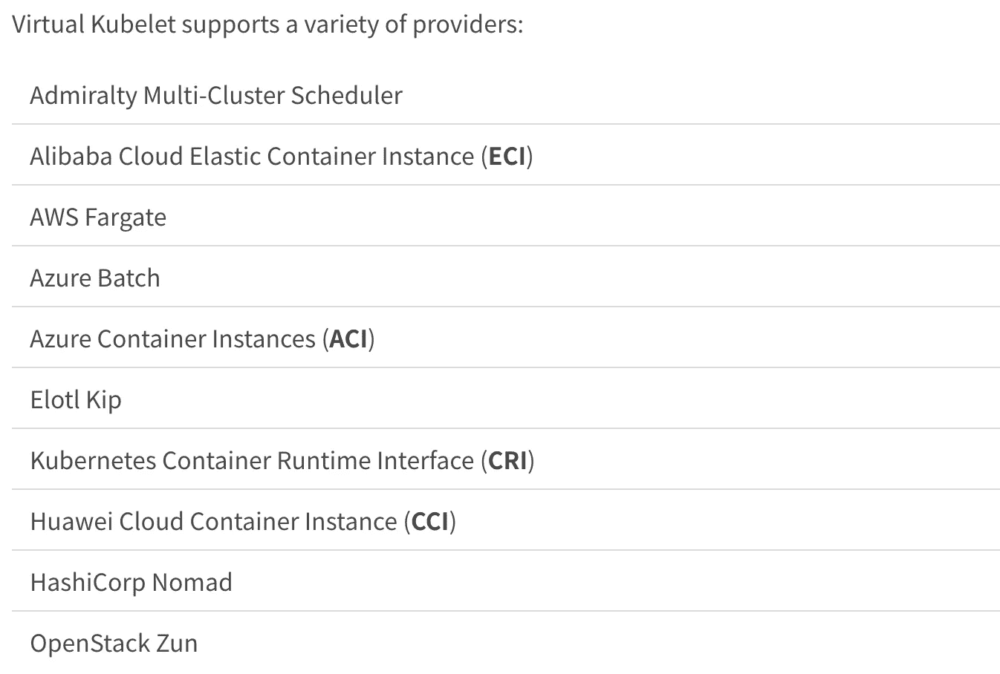
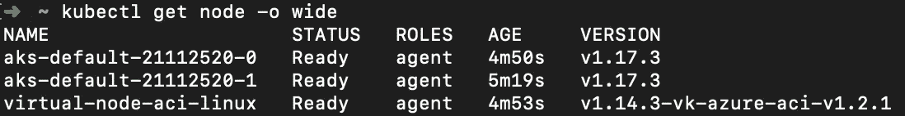
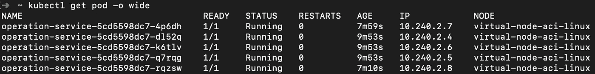
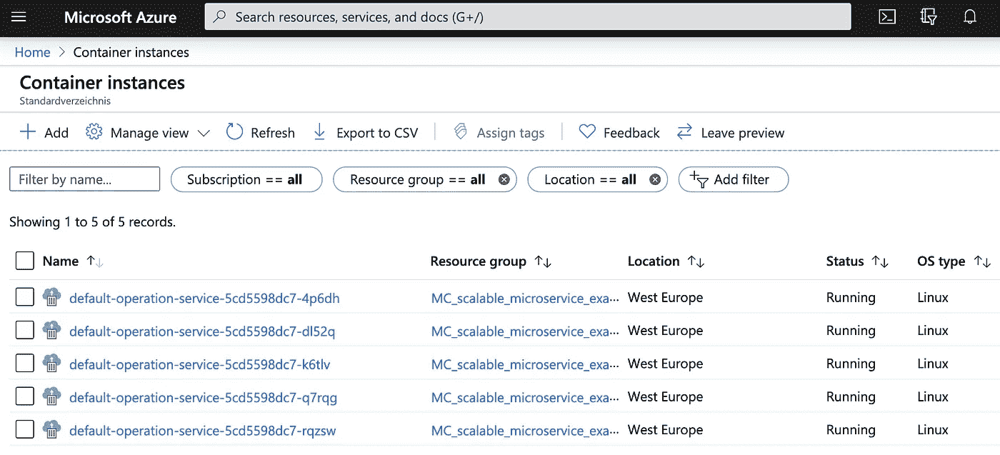
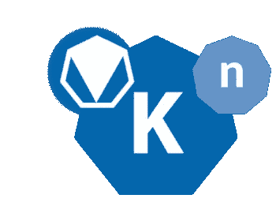

# 没有节点的 Kubernetes

> 原文：<https://itnext.io/kubernetes-without-nodes-caedd172f940?source=collection_archive---------3----------------------->

## 使用虚拟 Kubelet 探索无服务器节点

[https://unsplash.com/photos/dVRD8E3XUGs](https://unsplash.com/photos/dVRD8E3XUGs)

虚拟 Kubelet 模拟 Kubernetes API 的一个节点。它允许在例如无服务器容器服务上调度 pod。

无服务器容器服务在 [Azure](https://azure.microsoft.com/en-us/services/container-instances/) 、 [GCE](https://cloud.google.com/run) 、 [AWS](https://aws.amazon.com/fargate/) 上可用，并允许创建、运行和缩放容器。它们提供了很多很棒的东西，比如无限的伸缩性、快速的启动时间和每秒计费。我们能否利用这些优势，同时仍然像过去一样与 Kubernetes 互动？

## 有关系的

*   [Kubernetes 无服务器简单直观解释](https://medium.com/@wuestkamp/kubernetes-serverless-simply-visually-explained-ccf7be05a689?sk=142c4725e110bcd9ad67f93bd2b37ede)

# 库伯莱到底是什么？

这张图应该能说明一切。

`kubelet`是节点的入口点。Kubernetes 中的一个节点通常是一个虚拟机，但也可能是一个物理服务器。一个节点唯一需要的就是所谓的`kubelet`(以及`kubelet`需要的任何工具)。这个 CLI 程序在虚拟机上运行，可以做一件主要的事情:**管理 pod**。

## 库伯莱

`kubelet`是一个 HTTPS 服务器和客户端。它连接到 Kubernetes API 并被其连接。这样它就能接收到指令来安排或杀死哪一个吊舱。

`kubelet`可以管理 pod，这意味着它可以根据收到的 PodSpec 创建、维护和删除 pod。它通过与容器运行时引擎(通常是 Docker)通信来实现这一点。

一旦`kubelet`在一个虚拟机上运行并连接到 Kubernetes API 服务器，该虚拟机就被注册为一个节点，并可用于调度 pods。

## 调度程序

Kubernetes 中的调度程序负责决定在哪个节点上调度一个 pod。做出决策时要考虑各种因素，如节点状态、空闲资源或自定义节点选择器。

## 结节

简单地说，Kubernetes 节点就是一个可以调度 pod 的东西。Kubernetes API 知道它的存在、状态、各种度量和信息。API 从运行在每个节点上的`kubelet`获取这些数据。

那么，为什么不欺骗 Kubernetes API，让它相信自己在与一个节点对话，而不是与它对话呢？没错。

# 虚拟库伯勒

虚拟的 Kubelet 欺骗 Kubernetes API，让它相信自己在与一个实际的节点对话。嗯，这并不是欺骗，因为 API 想要的只是一些它可以调度 pods 并从中接收度量和信息的东西。考虑到这一点，措辞“欺骗”可能有点太苛刻，我们仍然给 API 它想要的。

[https://virtual-kube let . io](https://virtual-kubelet.io/)

## 混合节点设置

如上图所示，一个集群可以同时包含真实节点和虚拟 Kubelet 节点。调度可以像往常一样用节点标签、标签选择器、污点、容忍度等来控制。

## 无限的资源

虚拟的 Kubelet 可以告诉 K8s API，它有无限的或者至少是非常大量的可用免费资源。通过这种方式，至少在考虑空闲资源时，总是会考虑调度。

## 用例

当使用云提供商的无服务器容器产品作为虚拟 Kubelet 的提供商/后端时，我们可以获得:

*   无限制缩放
*   无需集群自动扩展(无需等待添加新节点)
*   快速启动时间
*   每秒计费
*   更细粒度的云资源使用

## 提供商/后端

https://virtual-kubelet.io/docs/providers/

## 在集群内部或外部运行

虚拟 Kubelet 可以在任何地方运行，只要它可以与 Kubernetes API 通信。因此，这也可以作为同一个集群内的 pod 中的容器。还有掌舵图:【https://virtual-kubelet.io/docs/usage】T4

虚拟 Kubelet 有点像 K8s API 和可以运行容器的东西之间的代理。

# 没有节点的 Kubernetes？

所以我们正在运行一个没有节点的 Kubernetes 集群？不完全是，仍然有节点，但这些节点不再受虚拟机或物理机支持。所以也许就像“有演技没演技”(Seinfeld @ Curb)；)

# 它看起来怎么样

开始使用 Azure 很容易，因为他们已经将虚拟 Kubelet 作为一个选项集成到他们的托管 Kubernetes 解决方案中。在这里阅读如何设置它。

上面我们看到两个普通节点(由虚拟机支持)和一个虚拟节点(由 Azure ACI 支持)。默认情况下，虚拟节点有一个污点，以防止不必要的调度。

我们通过向 PodSpec 添加一个容差，计划在虚拟节点上部署 5 个 pod

这 5 个实例由 Azure 容器实例运行

# 虚拟 Kubelet + Knative / OpenFaaS

Virtual Kubelet 和 Knative 或 OpenFaaS 联合起来可能是一个强大的组合。基于事件创建 pods 无服务器，并通过 Virtual Kubelet 在无服务器的云后端执行这些操作。我将在接下来的另一篇文章中更深入地探讨这种组合。

# 概述

虚拟 Kubelet 允许更精确的资源使用。使用计算实例(虚拟机)时，您可能总是会分配比所需更多的资源(CPU/内存)。

如果您向群集添加一个新的 2 GB 节点，以便可以计划另一个 100MB Pod，那么这不是最佳选择。有了像 on [Azure](https://azure.microsoft.com/en-us/services/container-instances/) 、 [GCE](https://cloud.google.com/run) 、 [AWS](https://aws.amazon.com/fargate/) 这样的无服务器容器服务，我们可以像一个大集体一样共享资源，从而实现更优化的使用。

看来无服务器不会这么快取代 Kubernetes？激动人心的时刻。

# 来源

[https://github.com/virtual-kubelet/virtual-kubelet](https://github.com/virtual-kubelet/virtual-kubelet)

# 成为 Kubernetes 认证

[https://killer.sh](https://killer.sh)