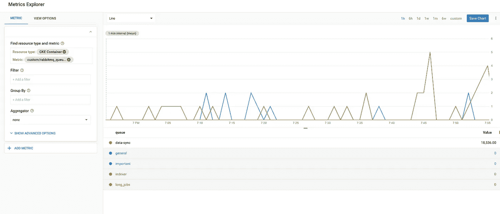

# Kubernetes Workers 基于 RabbitMQ 队列大小进行自动伸缩

> 原文：<https://itnext.io/kubernetes-workers-autoscaling-based-on-rabbitmq-queue-size-cb0803193cdf?source=collection_archive---------1----------------------->

Kubernetes **卧式自动秤** ( **HPA** )绝对能帮你省下一大笔钱。基于 CPU 利用率的 HPA 基本设置您可以轻松启动，但如果您希望基于外部服务或外部指标进行扩展，该怎么办呢？本文将帮助您正确设置它，并根据 GKE 环境的实际需要进行扩展。以下设置在 kubernetes 1.10 中运行良好，但在低于 1.12 的版本中，公制标签可能会有一些问题

# 1.部署**定制度量堆栈驱动**适配器

```
kubectl create clusterrolebinding cluster-admin-binding --clusterrole cluster-admin --user "$(gcloud config get-value account)"kubectl create -f https://raw.githubusercontent.com/GoogleCloudPlatform/k8s-stackdriver/master/custom-metrics-stackdriver-adapter/deploy/production/adapter.yaml
```

# 2.普罗米修斯和斯塔克德瑞出口商

现在我们需要使用[**kbudde/RabbitMQ-exporter**](https://github.com/kbudde/rabbitmq_exporter)容器来部署 rabbitmq 指标导出器，它将使用 prometheus 和[**prometheus-to-SD**](gcr.io/google-containers/prometheus-to-sd:v0.2.3)来提供 rabbit MQ 指标，这两个工具会自动将 Prometheus 指标导出到 stackdriver 指标。我们可以将两者合并到一个部署中:

```
**apiVersion**: extensions/v1beta1
**kind**: Deployment
**metadata**:
  **name**: amqp-metrics
**spec**:
  **replicas**: 1
  **template**:
    **metadata**:
      **labels**:
        **app**: amqp-metrics
    **spec**:
      **containers**:
      - **name**: prometheus
        **image**: kbudde/rabbitmq-exporter:v0.29.0
        **env**:
        - **name**: RABBIT_URL
          **value**: http://SOMERABBITMQHOST:15672
        - **name**: RABBIT_USER
          **value**: SOMEUSERNAME
        - **name**: RABBIT_PASSWORD
          **value**: SOMEPASSWORD
        - **name**: PUBLISH_PORT
          **value**: **"9419"**
        *# amqp 3.6.9++* - **name**: RABBIT_CAPABILITIES
          **value**: **"bert,no_sort"
        resources**:
          **requests**:
            **cpu**: 100m
            **memory**: 100Mi
      - **name**: prometheus-to-sd
        **image**: gcr.io/google-containers/prometheus-to-sd:v0.2.3
        **command**:
        - /monitor
        - --source=:http://localhost:9419
        - --stackdriver-prefix=custom.googleapis.com
        - --pod-id=$(POD_ID)
        - --namespace-id=$(POD_NAMESPACE)
        **env**:
        - **name**: POD_ID
          **valueFrom**:
            **fieldRef**:
              **apiVersion**: v1
              **fieldPath**: metadata.uid
        - **name**: POD_NAMESPACE
          **valueFrom**:
            **fieldRef**:
              **fieldPath**: metadata.namespace
        **resources**:
          **requests**:
            **cpu**: 100m
            **memory**: 100Mi
```

# 3.验证导出的指标并部署 HPA

最后，我们能够在[Google stack driver metrics explorer](https://app.google.stackdriver.com/metrics-explorer)中看到我们的指标



现在，我们准备使用导出的指标设置自动缩放器:

```
**apiVersion**: autoscaling/v2beta1
**kind**: HorizontalPodAutoscaler
**metadata**:
  **name**: workers-hpa
**spec**:
  **scaleTargetRef**:
    **apiVersion**: apps/v1beta1
    **kind**: Deployment
    **name**: my-workers
  **minReplicas**: 1
  **maxReplicas**: 10
  **metrics**:
  - **type**: External
    **external**:
      **metricName**: **"custom.googleapis.com|rabbitmq_queue_messages_ready"
      metricSelector**:
        **matchLabels**:
          **metric.labels.queue**: myqueue
      **targetValue**: 20
```

您可以在这里找到 RabbitMQ 的所有可用指标[https://github.com/kbudde/rabbitmq_exporter,](https://github.com/kbudde/rabbitmq_exporter)您也可以使用以下标签作为过滤器:集群、vhost、队列、持久性、策略、自我(在 1.10 和 1.11 的部分版本中可能无法正常工作)

现在，如果 RabbitMQ queue *myqueue* 总共有超过 20 个未处理的作业，我们的部署 *my-workers* 将会增加

使用 **metricSelector** 您可以为不同的队列和工作部署创建不同的自动缩放器

# 4.验证 HPA 和部署

为了验证我们的 HPA，我们可以使用 **kubectl describe hpa** 命令

```
kubectl describe hpa workers-hpa
Name:                                                                    workers-hpa
Namespace:                                                               default
Labels:                                                                  <none>
Annotations:                                                             kubectl.kubernetes.io/last-applied-configuration:
                                                                           {"apiVersion":"autoscaling/v2beta1","kind":"HorizontalPodAutoscaler","metadata":{"annotations":{},"name":"workers-hpa","namespace":"defaul...
CreationTimestamp:                                                       Thu, 20 Dec 2018 12:20:26 -0500
Reference:                                                               Deployment/my-workers
Metrics:                                                                 ( current / target )
  "custom.googleapis.com|rabbitmq_queue_messages_ready" (target value):  0 / 20
Min replicas:                                                            1
Max replicas:                                                            10
Deployment pods:                                                         1 current / 1 desired
Conditions:
  Type            Status  Reason               Message
  ----            ------  ------               -------
  AbleToScale     True    ScaleDownStabilized  recent recommendations were higher than current one, applying the highest recent recommendation
  ScalingActive   True    ValidMetricFound     the HPA was able to successfully calculate a replica count from external metric custom.googleapis.com|rabbitmq_queue_messages_ready(&LabelSelector{MatchLabels:map[string]string{metric.labels.queue: viral_marketing,resource.labels.cluster_name: apps-cloud,},MatchExpressions:[],})
  ScalingLimited  False   DesiredWithinRange   the desired count is within the acceptable range
```

# 结论

外部指标开辟了一条将集群和应用效率提升到新水平的途径。尝试用其他指标进行实验，或者制定自己的指标。感谢您的阅读