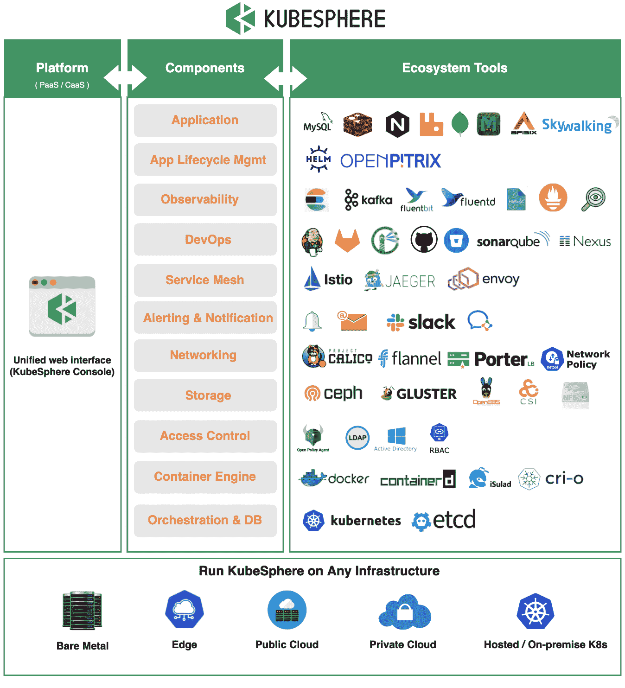
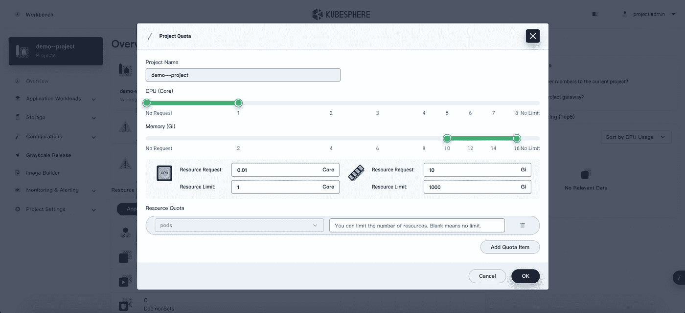
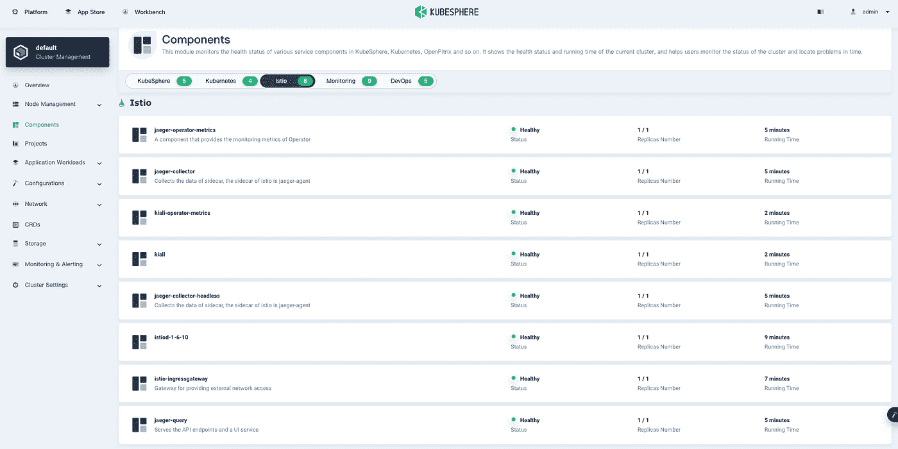
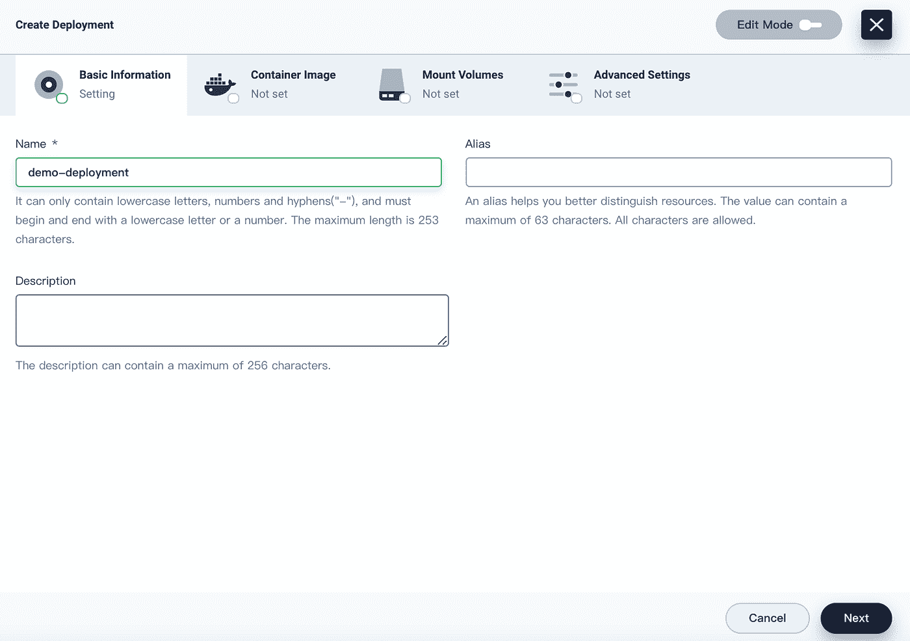
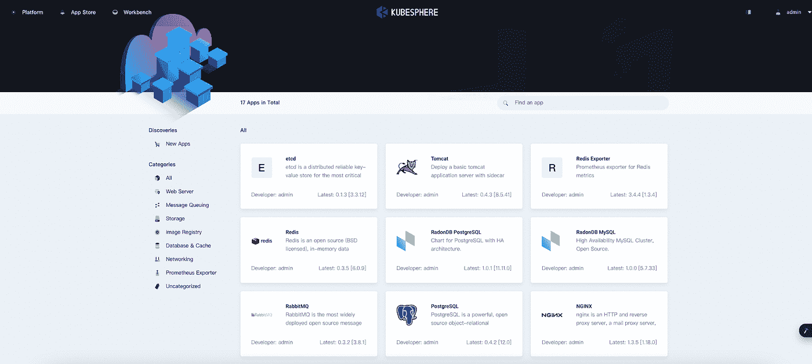
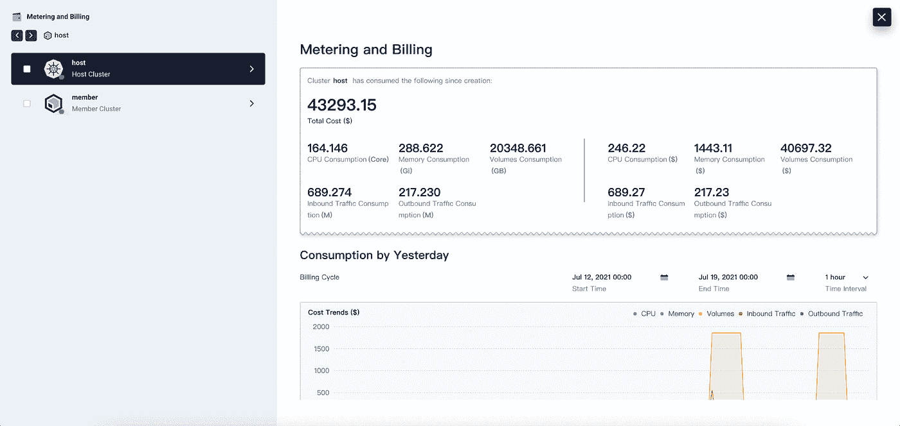

# KubeSphere:一个新的可插拔的 Kubernetes 应用管理平台

> 原文：<https://itnext.io/kubesphere-a-new-pluggable-kubernetes-application-management-platform-bf078b9f3330?source=collection_archive---------2----------------------->

一个全面的、自以为是的平台，通过与熟悉的工具集成来帮助企业采用 Kubernetes。

今年早些时候，我投资了流行的多集群 Kubernetes 管理解决方案，包括 Rancher、Google Anthos、Azure Arc 和 Volterra。后来，一位读者向我推荐了 KubeSphere，这是一个开源的 Kubernetes 平台，它使用 Kubernetes 来管理不同云提供商的多个 Kubernetes 集群。在学习了关于如何管理部署到 DigitalOcean 和亚马逊 EKS 的集群的[教程后，我很快意识到 KubeSphere 不仅仅是一个多集群 Kubernetes 管理工具。事实上，它更像是一个 Kubernetes 应用程序管理平台，具有针对可观察性、成本管理、服务网格、外部认证和 CI/CD 插件的本地集成。](https://thenewstack.io/tutorial-use-kubesphere-to-manage-digitalocean-kubernetes-and-amazon-eks/)

那么 KubeSphere 与生产级集群的自我管理各种开源工具相比如何呢？让我们深入了解 KubeSphere 的每个特性。

# KubeSphere 生态系统

在高层次上，KubeSphere 通过工作区和项目来组织应用程序。一个工作区可以跨越多个集群，包含项目和其他插件(例如 Jenkins)以及 RBAC 角色，以管理资源和访问。在每个工作区内，多租户由项目控制，项目只是 Kubernetes 名称空间。这一点很重要，因为项目隔离受制于相同的 Kubernetes 名称空间特性，而不是像 [vclusters](https://www.vcluster.com/) 这样更强大的特性。尽管如此，每个项目内置的用户管理比本地配置 Kubernetes 角色和角色绑定更好。项目还强制实施资源配额和默认入口控制器(NGINX)。

对于想要使用服务网格的用户，当`servicemesh.enabled`设置为 true 时，KubeSphere 为 Istio 提供了一个内置插件。这将安装典型的 istio 组件(如 istio、ingress gateway)以及监控工具(如 Kiali、Jaeger)。

为了将微服务部署到我们连接的集群，KubeSphere 提供了一个完善的 UI 来定义 Kubernetes 清单。KubeSphere 将这些清单归在“服务”下，不要与 Kubernetes 服务混淆。KubeSphere 服务基本上相当于一个舵图。

对于大多数现有的 Kubernetes 用户来说，基于 GUI 的部署可能不是标准实践。典型的设置包括一些打包工具，如 Helm 或 kustomize，以及一些 Gitops 工具，如 ArgoCD 或 Flux。然而，像这样的仪表板可能对应用程序开发人员的内部开发有用，他们可以快速部署现有的 Docker 映像，而不必从头开始构建舵图。另一个不错的部分是嵌入式应用商店，它围绕着 [OpenPitrix](https://github.com/openpitrix/openpitrix) 。对于那些不熟悉 OpenPitrix 的人来说，这是一个工具，可以轻松地部署类似于 [Kubeapps](https://kubeapps.com/) 或 [Ahoy](https://github.com/oslabs-beta/Ahoy) 的舵图。App Store 可用于安装各种监控和日志工具(如 prometheus、grafana、fluentd、elasticsearch、kibana 等)。

同样，KubeSphere 还为 DevOps 系统(Jenkins)、日志系统(Elasticsearch 和自定义仪表板)、网络策略(Calico)以及事件和警报提供插件。

最后，KubeSphere 还提供了一个资源消耗仪表板来跟踪所有集群的不同资源。目前，计费信息是通过 ConfigMap 手动输入的，因此不像 [kubecost](https://www.kubecost.com/) 那样实时，但仍然有助于跨多个集群整合不同的使用。

# 用例

通过关注可插拔架构和 Kubernetes 多集群管理，Kubernetes 旨在抽象出 Kubernetes 的底层细节和配置生产级集群所需的大量工作。从这个镜头，我可以看到两个主要的使用案例:

## 寻求提升和转移型迁移到 Kubernetes 的企业

如果您检查 KubeSphere 的日志，大多数操作都是由 Ansible 控制的。此外，KubeSphere 决定与 first 集成的工具是企业使用的知名工具(例如 Jenkins、ELK stack、NGINX)。这对于那些希望迁移到 Kubernetes 的公司来说是个好兆头，因为他们不必替换现有的工具链，也不必从头开始重新发明 CI/CD 和管理体验。

## 开发者沙盒

另一个用例可能是建立一个开发人员沙箱，让应用程序开发人员使用 Kubernetes。使用云原生工具设置适当的集群需要花费时间和大量资源来维护。使用 KubeSphere 作为用户友好的抽象层可以降低开发人员快速部署应用程序的门槛，而不必配置 ingresses 或弄清楚如何在 Kubernetes 上部署 PostgreSQL 或 Redis 进行集成测试。

# 最后的想法

学习 Kubernetes 在 2021 年仍然是一个挑战。虽然云原生解决方案是在 Kubernetes 的基础上构建的，以解决 DevOps 的挑战，但需要像 KubeSphere 这样的工具来改善开发人员的体验。如果你想迁移到 Kubernetes 并重用现有的 Jenkins 管道，或者想建立一个内部开发者沙盒帐户，那么试试 KubeSphere 吧。