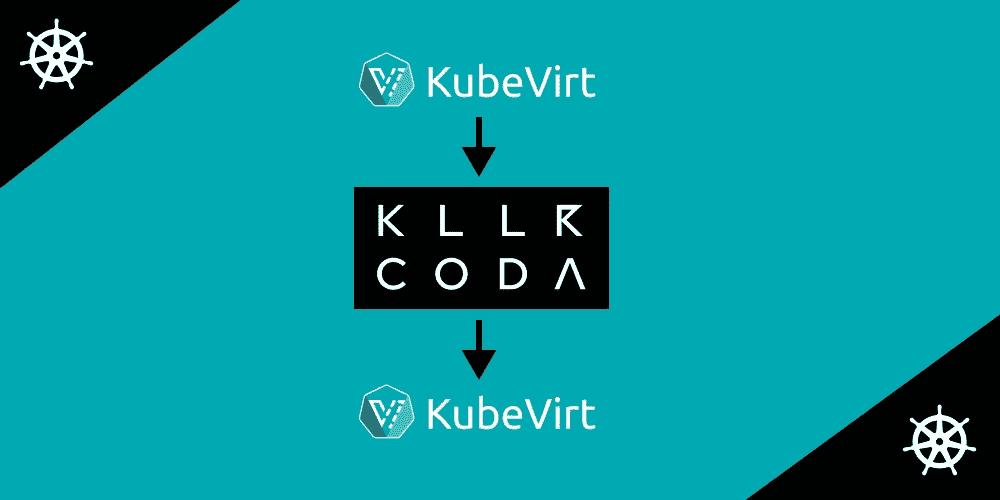
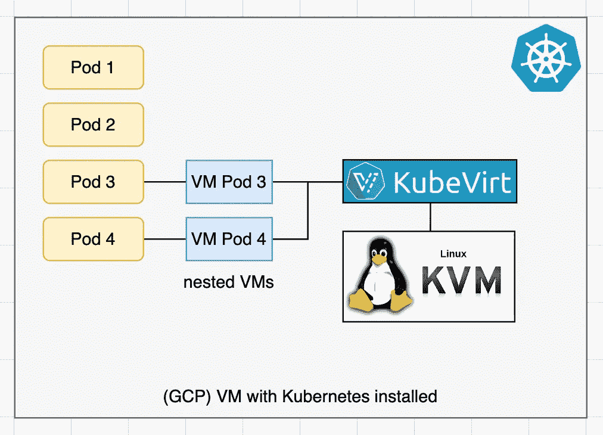
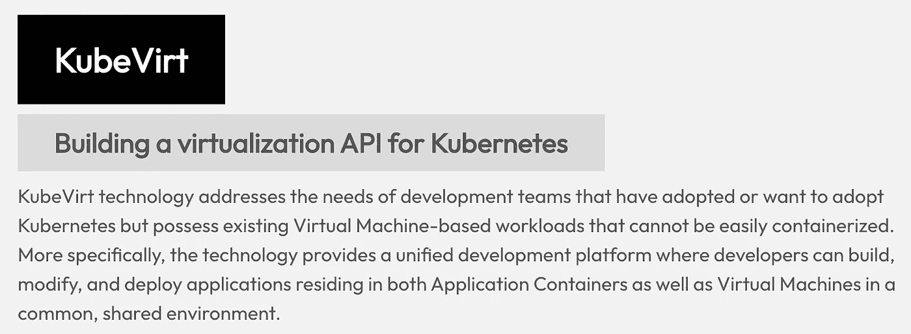

# 库伯维特上杀手科达上库伯维特

> 原文：<https://itnext.io/kubevirt-on-killercoda-on-kubevirt-3bc02f7eac7f?source=collection_archive---------2----------------------->

## KubeVirt 如何在 Killercoda 上运行

本文提供了 Killercoda 如何使用 KubeVirt 来安排可任意使用的学习环境的高级概述。我们还讨论了 KubeVirt 如何在 Killercoda 上以某种“嵌套三明治”架构运行。

# 基勒科达

[killer corda](https://killercoda.com)是一个交互式学习平台，允许每个人只需在浏览器中访问基于 Linux|Kubernetes 的环境。[阅读更多](https://wuestkamp.medium.com/katacoda-alternative-1d33599af75f?source=friends_link&sk=853df1e3537cdd19dfcf4cfc0bcd1bff)

# 库伯维特

KubeVirt 允许在 Kubernetes 上运行实际的 VM(虚拟机)而不是最常用的容器。KubeVirt 这样描述自己:

> KubeVirt 技术解决了已经采用或想要采用 Kubernetes 的开发团队的需求，但他们拥有现有的基于虚拟机的工作负载，无法轻松地进行容器化。([来源](https://kubevirt.io))

我们实际上会比上面的陈述更进一步，因为在 Killercoda 上我们使用了 KubeVirt 作为一个全新的软件架构。使用容器并不能解决所有问题，能够像 K8s 中的 pod 一样管理虚拟机是非常好的！

[**> > >测试 kube virt on killer coda<<<**](https://killercoda.com/kubevirt)

# 为什么使用虚拟机而不是容器？

Killercoda 将容器用于其主要基础设施，但不用于用户可以访问的交互式学习环境。

容器非常适合可信工作负载，因为它们非常快，并且可以共享宝贵的资源，如内存。但是在同一台主机上运行的两个容器仍然共享同一个 Linux 内核，并且总是有不同的内核 CVE。

虚拟机提供了更好的安全性和封装，但速度较慢，而且占用更多资源。如果您允许不受信任的用户在您的基础架构内运行应用程序，那么您需要(在许多其他措施中)一个硬封装层，也就是虚拟机。

# 虚拟机如何与 KubeVirt 协同工作

KubeVirt 提供类似`VirtualMachineInstance`的 K8s 资源。创建此资源将导致自动创建一个 Pod 和连接的虚拟机。这太棒了，因为这意味着我们可以像对待普通的 pod 一样对待虚拟机(大多数情况下)。

但是这是怎么做到的呢？因为假设我们有虚拟机，我们在这些虚拟机上安装 Kubernetes。在 Kubernetes 内部，我们安装了 KubeVirt。然后，KubeVirt 将在哪里创建像 pod 一样的新虚拟机？让我们来看看下图:

在上图中，我们看到一个单节点 Kubernetes 集群。`Pod 1`和`Pod 2`是正常的豆荚。`Pod 3`和`Pod 4`是库贝维特吊舱。`VM Pod 3`和`VM Pod 4`是嵌套的虚拟机，KubeVirt 将与 KVM 通信来创建这些虚拟机。

KubeVirt 需要硬件虚拟化支持，这样就可以在虚拟机上创建嵌套的虚拟机。嵌套虚拟化可以在大多数专用服务器上实现，也可以在像 GCP 这样的云提供商上实现。

# Killercoda 如何使用 KubeVirt

定制的**killercoda-operator**(Golang)通过*普通的* K8s 方式与 KubeVirt 通信，在集群内部创建和删除资源。

例如，如果你打开了 [Ubuntu Playground](https://killercoda.com/playgrounds/scenario/ubuntu) ，那么一个请求将被发送到你所在位置附近的 Kubernetes 集群。在 K8s 集群内部运行 KubeVirt 和定制应用程序。

**killercoda-operator** 接收到请求“new Ubuntu VM”并创建一个新的`VirtualMachineInstance`资源。一旦安装了 KubeVirt，就可以使用这个资源。这将使 KubeVirt 创建一个嵌套的 VM。

当用户关闭浏览器选项卡时，连接中止被发送到**killer code-operator**，它简单地删除`VirtualMachineInstance`资源。这将导致 KubeVirt 实际上删除所有底层资源和嵌套的 VM。

# KubeVirt 如何在 Killercoda 上运行

***kube virt****运行于****killer corda****运行于****kube virt***

答案相对简单:Killercoda 提供完全隔离的虚拟机。一般来说，不管你是使用 GCP、AWS 还是 Killercoda 虚拟机，你只需要在上面安装 K3s，然后再安装 KubeVirt。

**但是**在 Killercoda 虚拟机上，不支持嵌套虚拟化。对于这些情况，KubeVirt 提供了[软件模拟](https://github.com/kubevirt/kubevirt/blob/main/docs/software-emulation.md)，这对于测试来说很棒，但是对于生产应用来说可能太慢了。

# 为什么 Killercoda 的速度如此惊人？

*(抱歉自爱标题)*

Killercoda 总是保持一定数量的虚拟机运行，例如 Ubuntu 或 Kubernetes。我们称之为预热。如果你打开一个 Killercoda 场景，并且有一个预热的虚拟机可用，它会直接分配给你，没有等待时间。

如果没有预热的虚拟机可用，则会按需创建一个新的虚拟机。创建一个新的 running+ready Ubuntu 环境大约需要 20 秒，创建一个新的 running+ready 双节点 Kubernetes 集群大约需要 30 秒。

最大的速度和可靠性因素可能是我们远离体积(PV/PVC)。卷创建可能会很慢，而且通常不可靠。如果您需要在短时间内创建和删除数以千计的虚拟机，您需要消除任何制造组件的麻烦。

KubeVirt 与 [CDI](https://kubevirt.io/user-guide/operations/containerized_data_importer) (容器化数据导入器)配合得非常好，如果你开始你的旅程，你肯定应该使用它。它也可能在您的生产用例中工作得很好。但是在 Killercoda 上，我们决定完全不使用 CDI 或 volumes。为了实现这一点，我们实际上运行了一个定制的 KubeVirt 版本。

# Kustomized KubeVirt 版本

为了速度(不使用卷)和更深层次的集成，我们维护了一个定制的 KubeVirt 版本。此外，我们的定制版本允许我们在虚拟机之间创建 VPN。例如，在像 [Kubernetes 游乐场](https://killercoda.com/playgrounds/scenario/kubernetes)这样的多节点环境中，我们希望虚拟机能够相互通信。更多关于如何建造 KubeVirt [的信息请点击这里](https://github.com/kubevirt/kubevirt/blob/main/docs/getting-started.md)。

# 在 Killercoda 上测试 KubeVirt！

KubeVirt 是一个了不起的项目，有很棒的架构和代码库。现在在 [Killercoda](https://killercoda.com/kubevirt) 上测试一下:

[https://killercoda.com/kubevirt](https://killercoda.com/kubevirt)

# 结束了

感谢阅读！