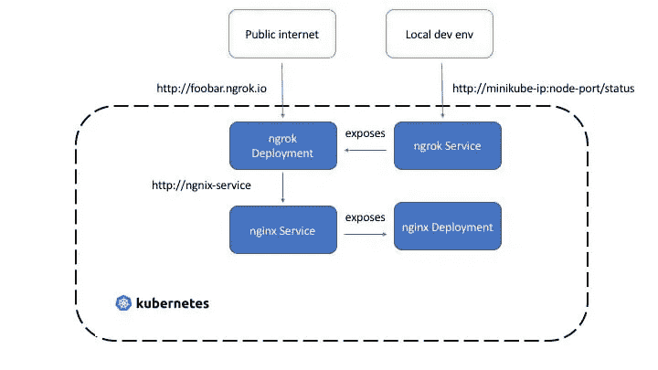

# Kubexpose:一个 Kubernetes 运营商，为了乐趣和利润！

> 原文：<https://itnext.io/kubexpose-a-kubernetes-operator-for-fun-and-profit-f528586eee07?source=collection_archive---------3----------------------->

## 通过互联网访问您的 Kubernetes 部署

假设您有一个作为 Kubernetes `Deployment`运行的 web 服务。有很多方法可以通过公共 URL 访问它，但是 Kubexpose 使这变得很容易。这是一个由[自定义资源定义](https://kubernetes.io/docs/concepts/extend-kubernetes/api-extension/custom-resources/)和相应的控制器实现支持的 [Kubernetes 操作符](https://kubernetes.io/docs/concepts/extend-kubernetes/operator/)。

> `*Kubexpose*` *是使用*[*kubebuilder*](https://kubebuilder.io/)*和* [*构建的，可在 GitHub*](https://github.com/abhirockzz/kubexpose-operator) *上获得。*


[托马斯·詹森](https://unsplash.com/@thomasjsn?utm_source=medium&utm_medium=referral)在 [Unsplash](https://unsplash.com?utm_source=medium&utm_medium=referral) 上拍摄的照片

要试用它，请跳到下一部分或向下滚动到**它是如何工作的？**了解更多

# 快速启动

任何 Kubernetes 集群都可以工作(`minikube`、`kind`、Docker 桌面、云等等)...).

部署操作员和其他组件(CRD 等。):

```
kubectl apply -f [https://raw.githubusercontent.com/abhirockzz/kubexpose-operator/master/kubexpose-all-in-one.yaml](https://raw.githubusercontent.com/abhirockzz/kubexpose-operator/master/kubexpose-all-in-one.yaml)
```

确保操作员已启动并正在运行:

```
export OPERATOR_NAMESPACE=kubexpose-operator-system# check Pods
kubectl get pods -n $OPERATOR_NAMESPACE# check logs
kubectl logs -f $(kubectl get pods --namespace $OPERATOR_NAMESPACE -o=jsonpath='{.items[0].metadata.name}') -c manager -n $OPERATOR_NAMESPACE
```

创建一个`nginx`部署来进行测试——这是您希望通过公共 URL 在互联网上公开的部署。

与此同时，创建一个`kubexpose`资源——它将帮助您通过互联网访问`ngnix`部署！

```
kubectl apply -f https://raw.githubusercontent.com/abhirockzz/kubexpose-operator/master/quickstart/nginx.yamlkubectl apply -f [https://raw.githubusercontent.com/abhirockzz/kubexpose-operator/master/quickstart/kubexpose.yaml](https://raw.githubusercontent.com/abhirockzz/kubexpose-operator/master/quickstart/kubexpose.yaml)
```

等待几秒钟，检查可以访问 nginx `Deployment`的公共 URL:

```
kubectl get kubexpose/kubexpose-test -o=jsonpath='{.status.url}'
```

> *使用浏览器访问公共 URL 或使用* `*curl*`进行测试

确认相应的`Service`和`Deployment`也已创建:

```
kubectl get svc/nginx-test-svc-kubexpose-test
kubectl get deployment/nginx-test-expose-kubexpose-test
```

> *您可以尝试其他场景，例如尝试* `*Deployment*` *和/或*`*Service*`*——操作员将协调或使事物回到资源中指定的状态。*

要删除`kubexpose`资源:

```
kubectl delete kubexpose/kubexpose-test
```

> *这也将删除为此资源*创建的 `*Service*` *和* `*Deployment*`

*要卸载操作员:*

```
*kubectl delete -f [https://raw.githubusercontent.com/abhirockzz/kubexpose-operator/master/kubexpose-all-in-one.yaml](https://raw.githubusercontent.com/abhirockzz/kubexpose-operator/master/kubexpose-all-in-one.yaml)*
```

> **这将删除【CRD】、*、`*kubexpose*`、*运算符等资源。**

# *它是如何工作的？*

*在幕后，`Kubexpose`使用令人敬畏的 [ngrok](https://ngrok.com/) 项目来完成工作！当您创建一个`kubexpose`资源时，操作员:*

*   *为您想要访问的`Deployment`创建一个`ClusterIP`类型`Service`(命名格式:`<deployment name>-svc-<kubexpose resource name>`)*
*   *创建一个运行`ngrok`的`Deployment`(使用这个 [ngrok Docker 映像](https://hub.docker.com/r/wernight/ngrok/))，它被配置为指向`Service`(命名格式:`<deployment name>-expose-<kubexpose resource name>`)。这样相当于启动`ngrok`:`ngrok http foo-svc-bar 80`*

**

> **`*Deployment*`*和* `*Service*` *由 Kubexpose 资源实例拥有和管理。***

**尽情享受吧！**