# 使用 dbt、Amazon 红移、红移光谱和 AWS Glue 的 Lakehouse 数据建模

> 原文：<https://itnext.io/lakehouse-data-modeling-using-dbt-amazon-redshift-redshift-spectrum-and-aws-glue-fdc5629c3df8?source=collection_archive---------0----------------------->

## 了解 dbt 如何在基于 AWS 构建的现代云数据湖中简化数据转换和模型具体化

*【帖子更新于 2022 年 12 月 30 日，以反映 dbt 的最新版本】*

由于风投支持的分析初创公司和营销资金过多，数据湖近年来吸引了分析界的大量注意力。尽管如此，数据仓库，特别是现代云数据仓库，继续获得市场份额，由[雪花](https://www.snowflake.com/)、[亚马逊红移](https://aws.amazon.com/redshift)、[谷歌云 BigQuery](https://cloud.google.com/bigquery) 和微软的 [Azure Synapse Analytics](https://azure.microsoft.com/en-us/services/synapse-analytics/#overview) 引领。

有几个因素引起了人们对数据仓库的兴趣和兴趣，包括数据仓库体系结构。根据 [Databricks](https://www.databricks.com/blog/2020/01/30/what-is-a-data-lakehouse.html) ，“*lake house 是一种新的开放架构，结合了数据湖和数据仓库的最佳元素。Lakehouses 是通过一种新的系统设计实现的:在开放格式的低成本云存储上直接实现与数据仓库中类似的数据结构和数据管理功能。*"类似地， [Snowflake](https://www.snowflake.com/guides/what-data-lakehouse) 将 lakehouse 描述为"*一种将数据仓库的元素与数据湖的元素相结合的数据解决方案概念。数据湖库实现了数据仓库的数据结构和数据湖的管理特性，这对于数据存储来说通常更具成本效益。*

在下面的帖子中，我们将探索使用 dbt 实验室开发的 dbt(数据构建工具)来转换基于 AWS 的数据湖库的数据，该数据湖库由 Amazon Redshift(预配或无服务器)、Amazon Redshift Spectrum、AWS Glue Data Catalog 和 Amazon S3 构建。

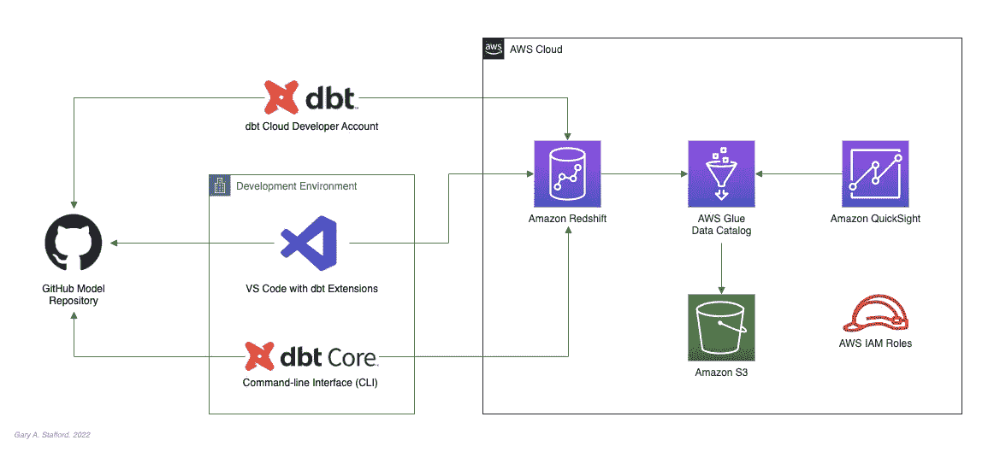

这篇博文演示了高级架构

# dbt

根据 [dbt Labs](https://docs.getdbt.com/docs/introduction) 的说法，“ *dbt 使分析工程师能够通过简单地编写 select 语句来转换他们仓库中的数据。dbt 负责将这些 select 语句转换成表和视图。*【更进一步】 *dbt 执行* ***T*** *中的*[*ELT*](https://docs.getdbt.com/terms/elt)*(提取、加载、转换)过程——它不提取或加载数据，但是它非常擅长转换已经加载到您的仓库中的数据。*

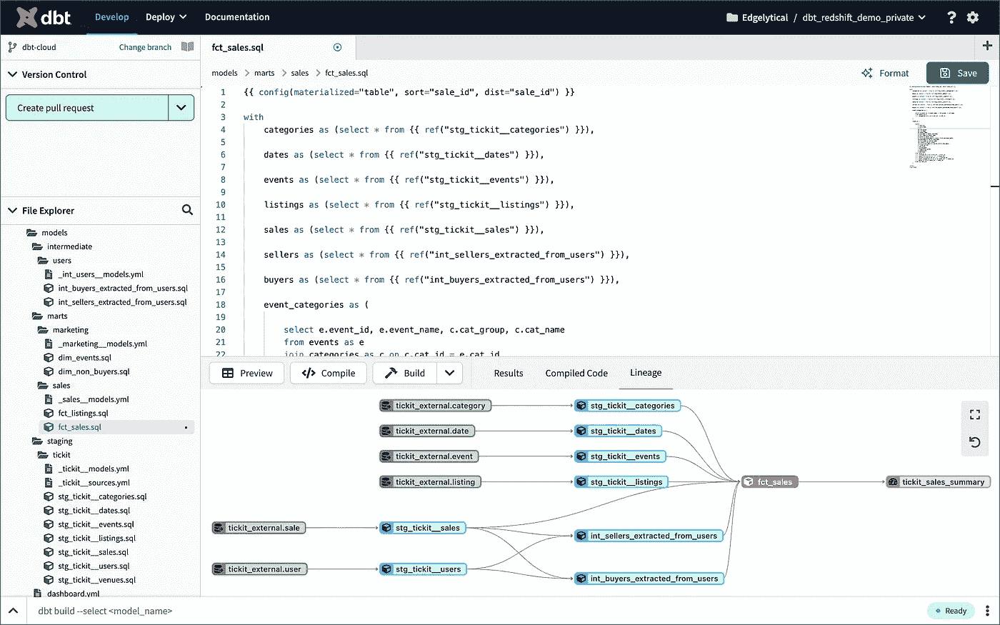

这个帖子的项目，显示在 dbt 云

# 亚马逊红移

据 [AWS](https://aws.amazon.com/redshift/) ，“*亚马逊红移使用 SQL 来分析数据仓库、运营数据库和数据湖中的结构化和半结构化数据，使用 AWS 设计的硬件和机器学习来提供任何规模的最佳性价比。*“AWS 宣称亚马逊红移是应用最广泛的云数据仓库。

# 亚马逊红移光谱

根据 [AWS](https://docs.aws.amazon.com/redshift/latest/dg/c-using-spectrum.html) ，“ *Redshift Spectrum 允许你从亚马逊 S3 的文件中高效地查询和检索结构化和半结构化数据，而不必将数据加载到亚马逊红移表中。*“红移光谱表定义了亚马逊 S3 中文件的数据结构。外部表存在于一个外部数据目录中，它可以是 [AWS Glue](https://aws.amazon.com/glue/) ，Amazon Athena 附带的数据目录，或者 Apache Hive metastore。

dbt 可以与 Amazon Redshift Spectrum 交互来创建外部表，刷新外部表分区，并从数据仓库访问基于 Amazon S3 的数据湖中的原始数据。我们将使用 dbt 和 dbt 包`[dbt_external_tables](https://hub.getdbt.com/dbt-labs/dbt_external_tables/0.8.0/)`，在 AWS 粘合数据目录中创建外部表。

# 先决条件

本文演示的先决条件包括:

*   亚马逊 S3 桶存储原始数据；
*   Amazon Redshift 配置集群或 Amazon Redshift 无服务器；
*   拥有亚马逊红移、亚马逊 S3 和 AWS Glue 权限的 AWS IAM 角色；
*   [dbt 云](https://www.getdbt.com/)账号；
*   [本地安装的 dbt CLI](https://docs.getdbt.com/dbt-cli/cli-overview) (dbt Core)和 dbt Amazon 红移适配器；
*   [安装了](https://code.visualstudio.com/) [dbt Power User](https://marketplace.visualstudio.com/items?itemName=innoverio.vscode-dbt-power-user) 扩展的微软 Visual Studio 代码 (VS 代码)；

这篇文章的演示使用了 dbt Cloud、VS Code 和 dbt CLI，并把项目的 GitHub 库作为源代码。使用这三个 dbt 选项中的任意一个或所有选项进行演示。

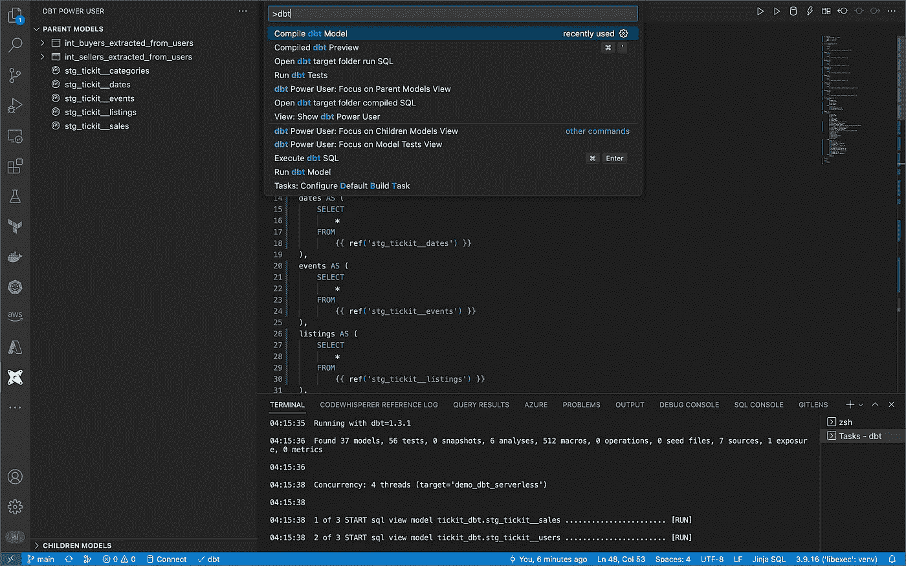

安装了 dbt 超级用户扩展的 VS 代码中的项目

## 成本预警！

在为本演示创建一个新的、已调配的 Amazon Redshift 集群时要小心。建议的默认生产集群启用了两个`ra3.4xlarge`按需计算节点和 [AQUA](https://aws.amazon.com/redshift/features/aqua/) (Redshift 的高级查询加速器)，估计价格为 4694 美元/月(3.26 美元/节点/小时)。对于本演示，选择一个`dc2.large`按需计算节点的最小配置红移群集配置，估计成本为 180 美元/月(0.25 美元/节点/小时)。演示完成后，请务必删除群集。

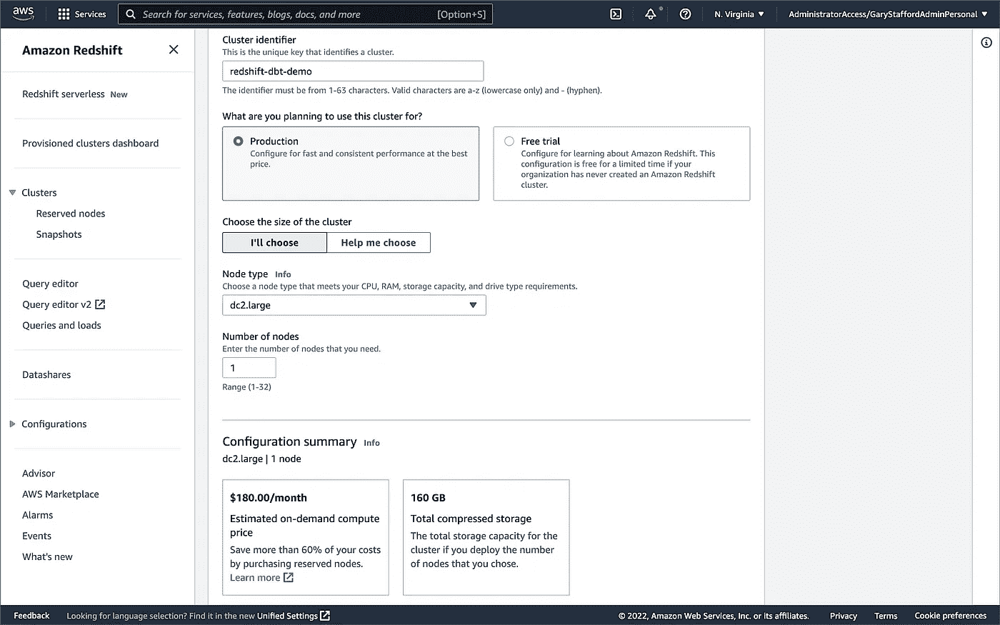

创建一个新的亚马逊红移星团

## 亚马逊红移无服务器选项

AWS 最近[宣布](https://aws.amazon.com/about-aws/whats-new/2022/07/amazon-redshift-serverless-generally-available/)亚马逊红移无服务器将于 2022 年 7 月 12 日全面上市(GA)。Amazon Redshift Serverless 允许数据分析师、开发人员和数据科学家运行和扩展分析，而无需供应和管理数据仓库集群。dbt 与 Amazon Redshift Serverless 完全兼容，是本次演示中调配的 Redshift 的替代产品。根据 [AWS](https://aws.amazon.com/redshift/pricing/#Amazon_Redshift_Serverless) 的说法，亚马逊红移无服务器以红移处理单元(rpu)来衡量数据仓库容量。您需要为在 RPU 运行的工作负载支付费用，这些工作负载以每秒小时为单位(最低收费为 60 秒)，包括在亚马逊 S3 以开放文件格式访问数据的查询。

# 源代码

这篇文章中展示的所有源代码都是开源的，可以在 [GitHub](https://github.com/garystafford/emr-msk-serverless-demo/tree/main) 上获得。

# 抽样资料

这个演示使用了 AWS 提供的 [TICKIT 样本数据库](https://docs.aws.amazon.com/redshift/latest/dg/c_sampledb.html)，它是为配合 Amazon Redshift 使用而设计的。这个示例数据库应用程序跟踪虚构的在线 ticket 网站的销售活动，用户在这个网站上买卖体育赛事、演出和音乐会的门票。该数据库由星型模式中的七个表组成:五个维度表和两个事实表。这个 [GitHub 项目](https://github.com/garystafford/dbt-redshift-demo/tree/main/raw_tickit_data)中包含原始 TICKIT 数据的一个干净的压缩副本，格式为管道分隔的文本文件。使用项目中包含的以下 shell 命令将原始数据复制到亚马逊 S3:

# 为 dbt 准备亚马逊红移

下面所有的 SQL 命令也可以在 GitHub 项目库中找到，[这里](https://github.com/garystafford/dbt-redshift-demo/blob/main/setup_redshift.sql)。

## 创建新数据库

创建一个新的红移数据库用于演示，`demo`。

## 创建数据库模式

在新的红移数据库`demo`中，使用`[CREATE EXTERNAL SCHEMA](https://docs.aws.amazon.com/redshift/latest/dg/r_CREATE_EXTERNAL_SCHEMA.html)`红移 SQL 命令创建外部模式`tickit_external`，以及相应的外部 [AWS 粘合数据目录](https://docs.aws.amazon.com/glue/latest/dg/components-overview.html#data-catalog-intro)、`tickit_dbt`。确保更新命令以反映您的 IAM 角色的 ARN。接下来，创建保存我们的 dbt 模型的模式，`tickit_dbt`。最后，作为安全最佳实践，放弃默认的`public`模式。

从 AWS Glue 控制台，我们应该观察到一个新的`tickit_dbt` AWS Glue 数据目录。

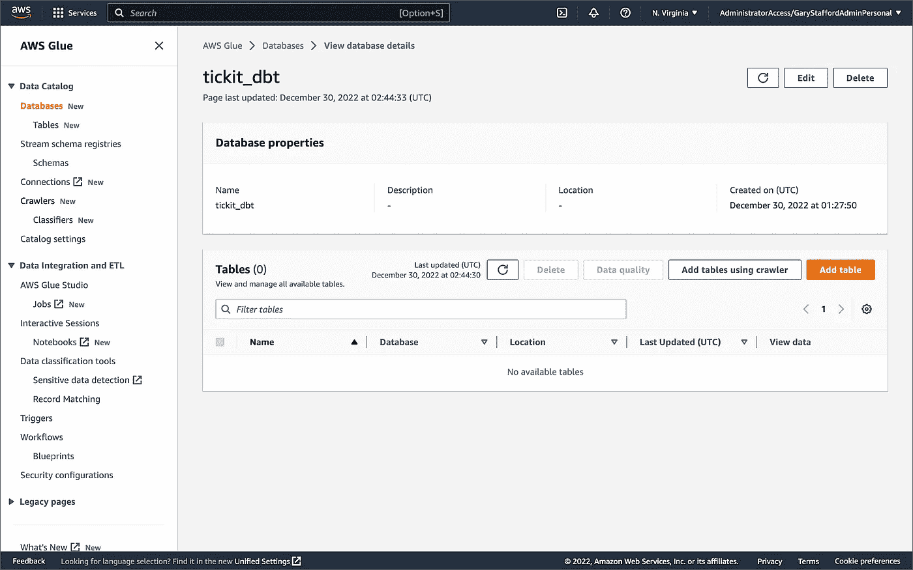

新创建的 AWS 粘合数据目录

## 创建 dbt 数据库用户和组

作为安全最佳实践，创建一个单独的数据库`dbt`用户和`dbt`组。我们指定了一个完全任意的连接限制 10。然后，应用授权来允许`dbt`组访问新的数据库和模式。最后，将两个模式的所有者更改为`dbt`。

[或者](https://docs.aws.amazon.com/redshift/latest/mgmt/generating-iam-credentials-overview.html)，我们可以使用符合 SAML 2.0 的 IdP 的 IAM 角色。

# 为红移初始化和配置 dbt

接下来，[使用](https://docs.getdbt.com/reference/warehouse-profiles/redshift-profile)`[dbt init](https://docs.getdbt.com/reference/commands/init)`命令使用您的 Amazon Redshift 连接信息在本地配置您的 dbt 云帐户和 dbt。在 Mac 上，该配置存储在`~/.dbt/profiles.yml`文件中。您将需要您的红移集群主机 URL、端口、数据库、用户名和密码。

示例 dbt `profiles.yml file`

对于本地安装的 dbt，我们可以使用`[dbt debug](https://docs.getdbt.com/reference/commands/debug)`命令来确认新的配置。

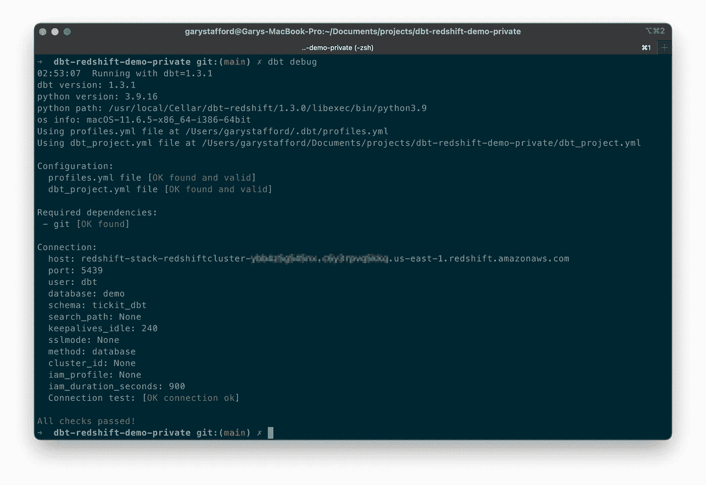

使用`[dbt debug](https://docs.getdbt.com/reference/commands/debug)`确认新配置

# 项目结构

GitHub 项目结构遵循 dbt 实验室的[最佳实践指南](https://docs.getdbt.com/guides/best-practices)中概述的许多最佳实践。`models`目录中的数据模型被组织成推荐的`staging`、`intermediate`和`marts`子目录(也称为层)。

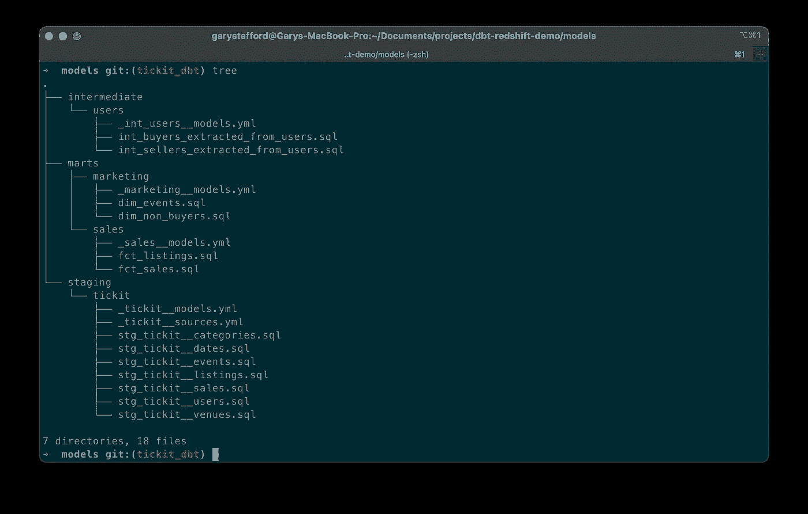

数据模型的项目结构

从数据沿袭的角度来看，暂存层的七个数据模型依赖于 AWS 粘合数据目录中定义的七个外部表。中间层的两个数据模型依赖于分段模型。marts 层的四个数据模型依赖于阶段模型和中间模型。

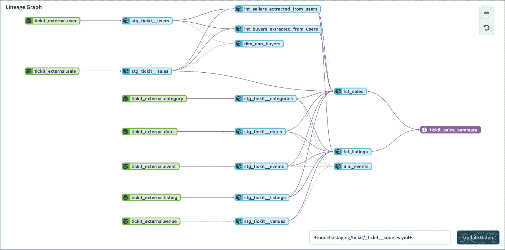

dbt 云的谱系图显示了数据模型关系的示例

## 安装 dbt 包

GitHub 项目的`packages.yml`包含了一些常用的推荐包。这个职位唯一需要的是`[dbt-labs/dbt_external_tables](https://hub.getdbt.com/dbt-labs/dbt_external_tables/0.8.0/)`包。确保您的项目引用了最新版本的包。

使用`[dbt deps](https://docs.getdbt.com/reference/commands/deps)`命令在本地安装软件包。

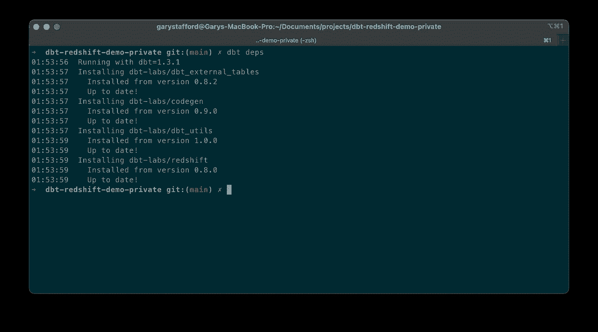

安装 dbt 包

# 外部表格

`models/staging/tickit/`模型子目录中的`_tickit__sources.yml`文件定义了七个外部 TICKIT 数据库表的模式和 S3 位置:类别、日期、事件、列表、销售、用户和地点。您需要更新该文件，以在七个地方反映您的亚马逊 S3 存储桶的名称。

执行命令`dbt run-operation stage_external_sources`，在 AWS 粘合数据目录中创建七个外部表。这个命令是我们之前安装的`[dbt_external_tables](https://hub.getdbt.com/dbt-labs/dbt_external_tables/latest/)`包的一部分。它遍历所有源节点，创建缺失的表，并刷新元数据。

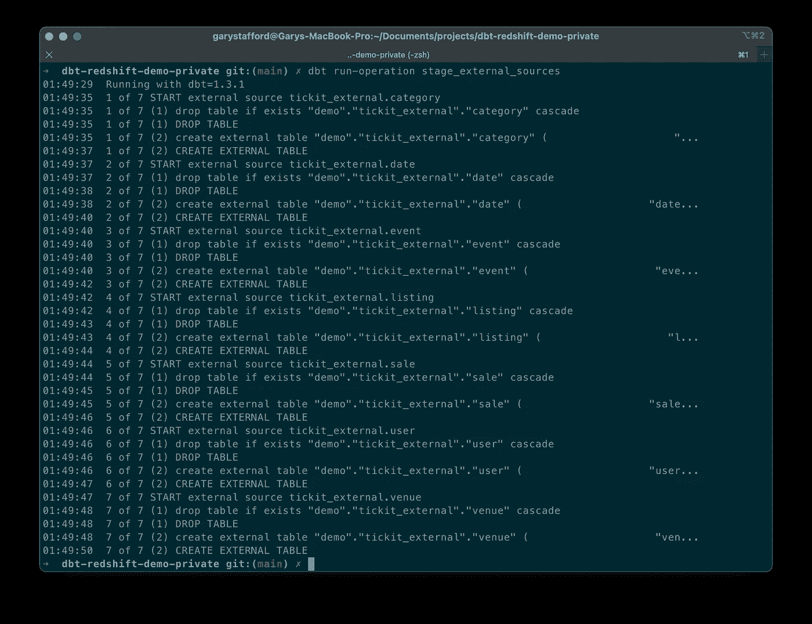

在 AWS 粘附数据目录中创建外部表

如果出现类似如下所示的错误，当您运行上面的 dbt 命令时，请确保您正确地将`external_table`模式所有权设置为`dbt`用户。

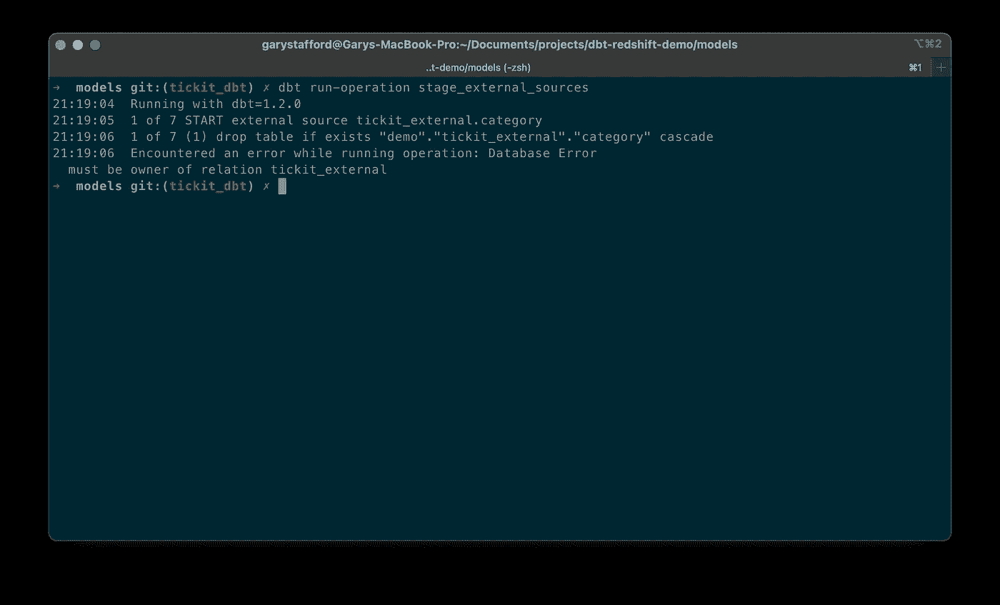

由 external_table 模式的不正确所有权导致的典型错误

一旦命令完成，我们应该在 AWS 粘合数据目录中观察到七个新表。

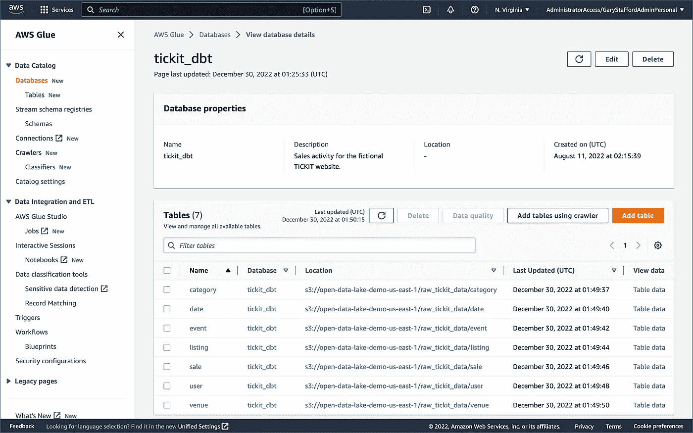

AWS 粘合数据目录中的七个新表

检查其中一个 AWS 粘合数据目录表，我们可以观察到`_tickit__sources.yml`文件中的配置是如何用于定义表的属性和模式的。注意`Location`字段指示底层数据在我们的亚马逊 S3 存储桶中的位置。

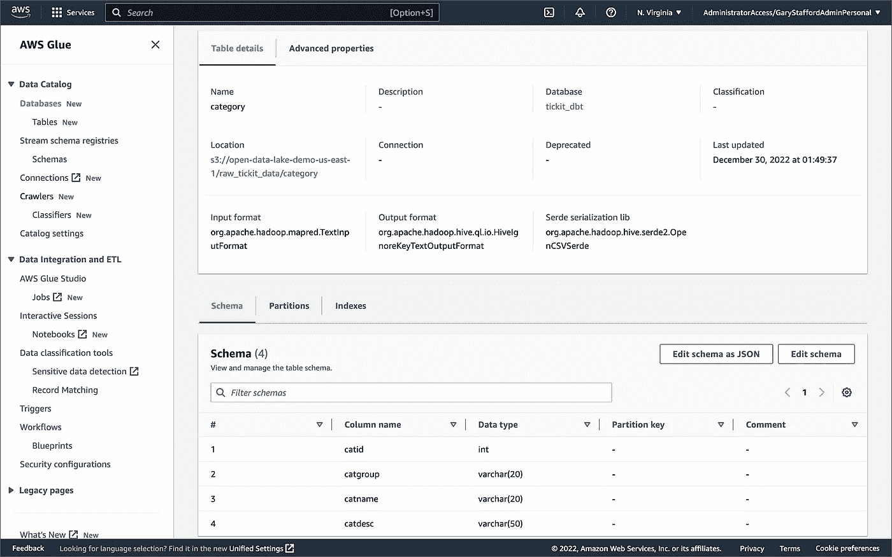

AWS 粘合数据目录中的“类别”表

# 后期绑定视图

本演示使用[后期绑定视图](https://docs.getdbt.com/reference/resource-configs/redshift-configs#late-binding-views)用于暂存和中间层模型。根据 dbt 的说法，“*在 dbt 的生产部署中使用后期绑定视图可以极大地提高仓库中数据的可用性，特别是对于具体化为后期绑定视图并由最终用户查询的模型，因为它们不会在上游模型更新时被删除。此外，后期绑定视图可以通过红移谱与* [*外部表*](https://docs.aws.amazon.com/redshift/latest/dg/r_CREATE_EXTERNAL_TABLE.html) *一起使用。*

或者，我们可以将七个阶段模型定义为表，而不是后期绑定视图。一旦创建为表，依赖的中间视图和 marts 视图将不再需要后期绑定引用，就像它们当前在这个项目中所做的那样。

# 暂存层

在他们的最佳实践指南中，dbt 以如下方式描述了[暂存层](https://docs.getdbt.com/guides/best-practices/how-we-structure/2-staging):“*你可以认为暂存层是将这种材料浓缩和提炼为单个原子，我们稍后将使用这些原子构建更复杂和有用的结构。*“暂存数据模型是基础表和视图，我们将使用它们在 Redshift 中构建更复杂的聚合和分析查询。`schema.yml`文件也在`models/staging/tickit/`模型的子目录中，它定义了七个[后期绑定视图](https://docs.getdbt.com/reference/resource-configs/redshift-configs#late-binding-views)，由 dbt 建模，将在 Amazon Redshift 中创建。

暂存模型的 SQL 语句也遵循了许多 dbt 的[最佳实践](https://docs.getdbt.com/guides/best-practices/how-we-structure/2-staging#staging-models)。下面，我们来看一个`stg_tickit__sales`模型的例子(`stg_tickit__sales.sql`)。这个模型从`external_table`模式中的外部`sale`表执行一个`SELECT`。该模型执行列重命名和基本计算。

`[dbt run](https://docs.getdbt.com/reference/commands/run)`命令，根据 [dbt](https://docs.getdbt.com/reference/commands/run) ，*对当前* `*target*` *数据库执行编译后的 SQL 模型文件。dbt 连接到目标数据库并运行相关的 SQL，需要使用指定的* [*物化*](https://docs.getdbt.com/terms/materialization) *策略来物化所有的数据模型。*“现在，我们没有使用`dbt run`命令一次创建所有项目的表和视图，而是使用`--select`可选参数将命令限制在`./models/staging/tickit/`目录中的模型。执行`dbt run --select staging`命令，在 Amazon Redshift 中物化七个对应的 staging 视图。

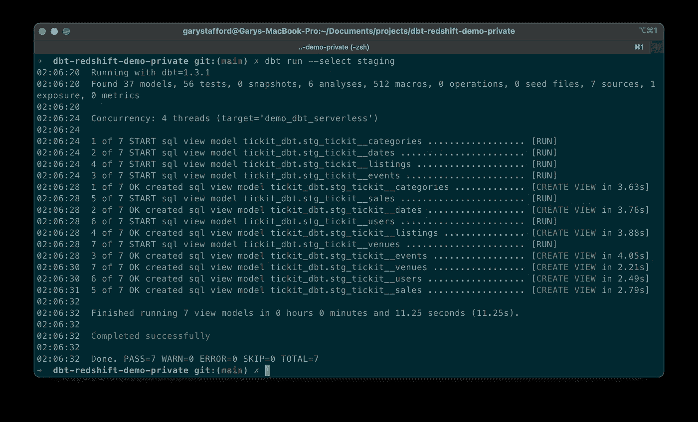

临时层的数据模型在 Redshift 中成功实现

一旦该命令完成，我们应该在 Amazon Redshift `demo`数据库的`tickit_dbt`模式中观察到带有`stg_`前缀的七个新视图。

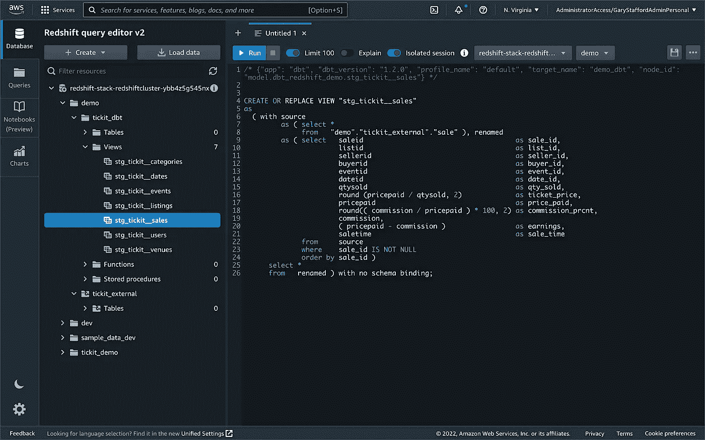

亚马逊红移查询编辑器 v2 控制台

从任何视图中进行选择都应该会返回数据。

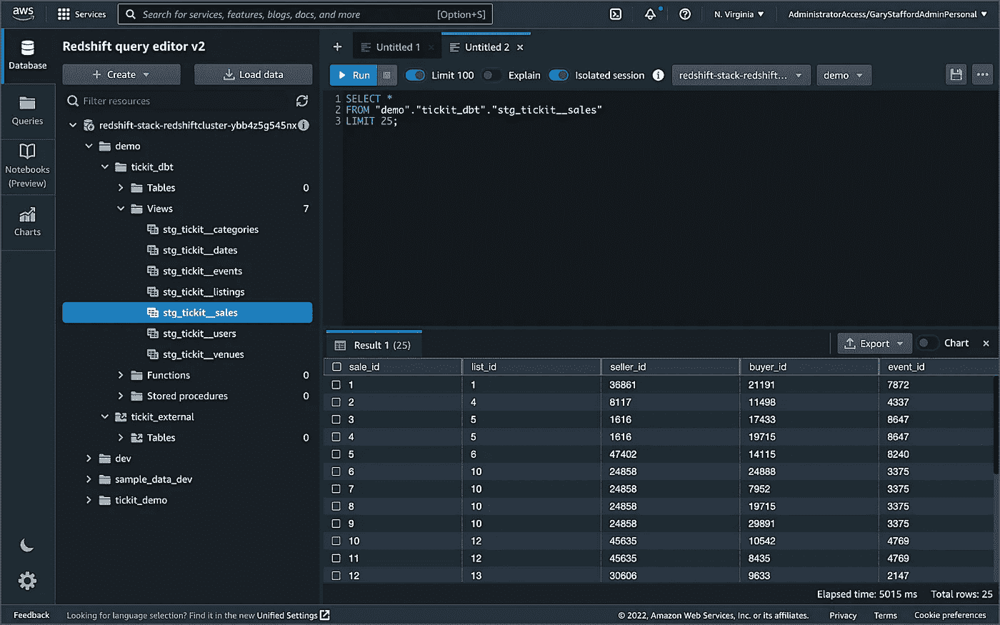

亚马逊红移查询编辑器 v2 控制台

# 中间层

在他们的最佳实践指南中，dbt 将[中间层](https://docs.getdbt.com/guides/best-practices/how-we-structure/3-intermediate)描述为*专门构建的转换步骤。*【更进一步】*最好的指导原则是思考动词(如*`*pivoted*`*`*aggregated_to_user*`*`*joined*`*`*fanned_out_by_quanity*`*`*funnel_created*`*等)。)在中间层。*****

**项目的中间层由两个与用户相关的模型组成。示例 TICKIT 数据库将所有用户集中到一个表中。然而，出于分析的目的，不同的用户角色可能会引起营销团队的兴趣，例如购买者、销售者、也购买的销售者和非购买者(从未购买过门票的用户)。项目中间层的两个模型过滤了买家和卖家，产生了用户角色的不同视图。**

**要将中间层的两个数据模型具体化为视图，请执行命令`dbt run --select intermediate`。**

**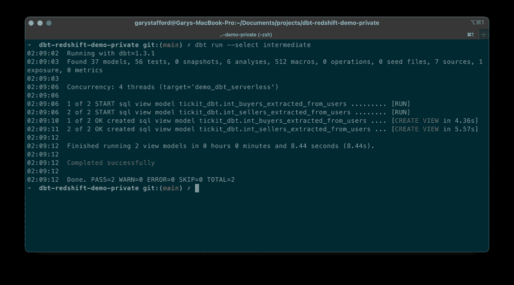**

**中间层的数据模型成功地在红移中具体化了**

**一旦命令完成，我们应该在 Amazon Redshift `demo`数据库的`tickit_dbt`模式中观察到总共 9 个视图，7 个 staging 用`stg_`前缀标识，2 个 intermediate 用`int_`前缀标识。**

**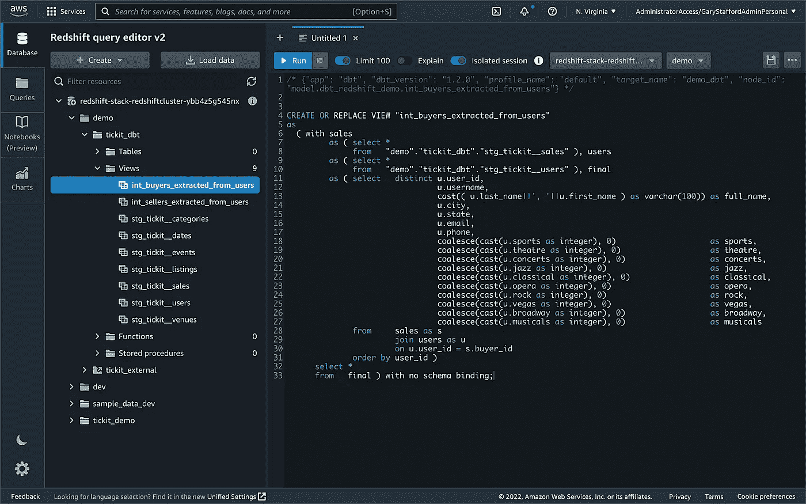**

**亚马逊红移查询编辑器 v2 控制台**

# **超市层**

**在他们的最佳实践指南中，dbt 将[集市层](https://docs.getdbt.com/guides/best-practices/how-we-structure/4-marts)描述为"*业务定义的实体。*【进一步】*在这一层，一切都汇集在一起，我们开始将我们所有的原子(分级模型)和分子(中间模型)排列成具有身份和目的的成熟细胞。我们有时喜欢称之为实体层或概念层，以强调我们所有的集市都是为了以其独特的粒度来表示特定的实体或概念。***

**该项目的 marts 层由跨市场营销和销售的四个数据模型组成。这些模型被具体化为两个维度表和两个事实表。通常将这些表描述和标记为传统的星型模式维度(`dim_`)或事实(`fct_`)表。实际上，本演示中的事实表是扁平的、非规范化的宽表。根据 [Fivetran](https://www.fivetran.com/blog/star-schema-vs-obt) 和 [others](https://hightouch.com/blog/data-warehouse-modelling-part-2/) 的说法，宽表在现代数据仓库中通常具有更好的分析性能。**

**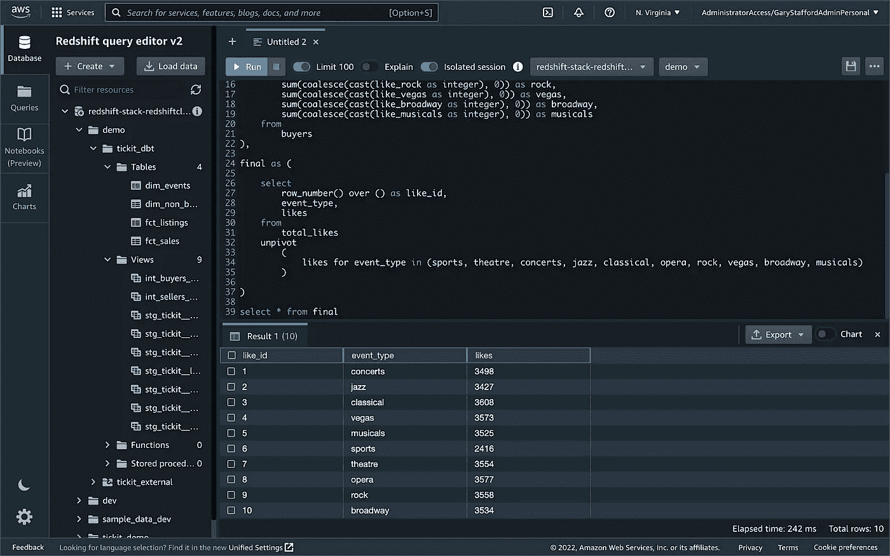**

**在 Amazon Redshift 中执行的已编译分析 SQL**

**marts 层的模型通过连接阶段模型和中间模型来获取各种依赖关系。上面的数据模型`fct_sales`依赖于多个阶段模型和中间模型。**

****

**数据模型的沿袭图(依赖图)，显示在 dbt 云中**

**要将 marts 层的四个数据模型具体化为表，请执行命令`dbt run --select marts`。**

**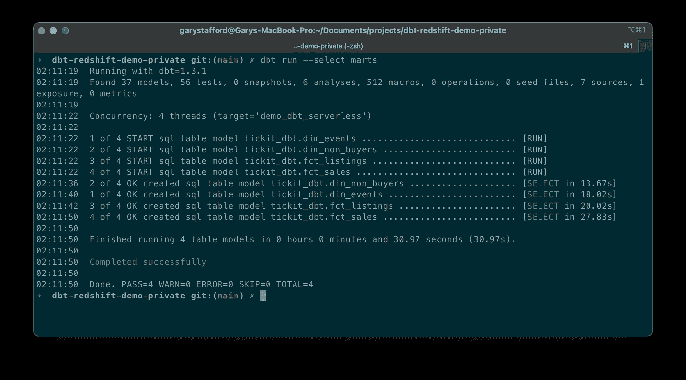**

**Marts 层的数据模型成功地在 Redshift 中具体化为表**

**一旦命令完成，我们应该在红移数据库的`tickit_dbt`模式中观察到四个表和九个视图。请注意`fct_sales`(如上图所示的*)的 dbt 模型及其 Jinja 模板和多个公共表表达式(CTE)是如何被编译成 Redshift 中的结果表的；这才是 dbt 真正的魔力！***

**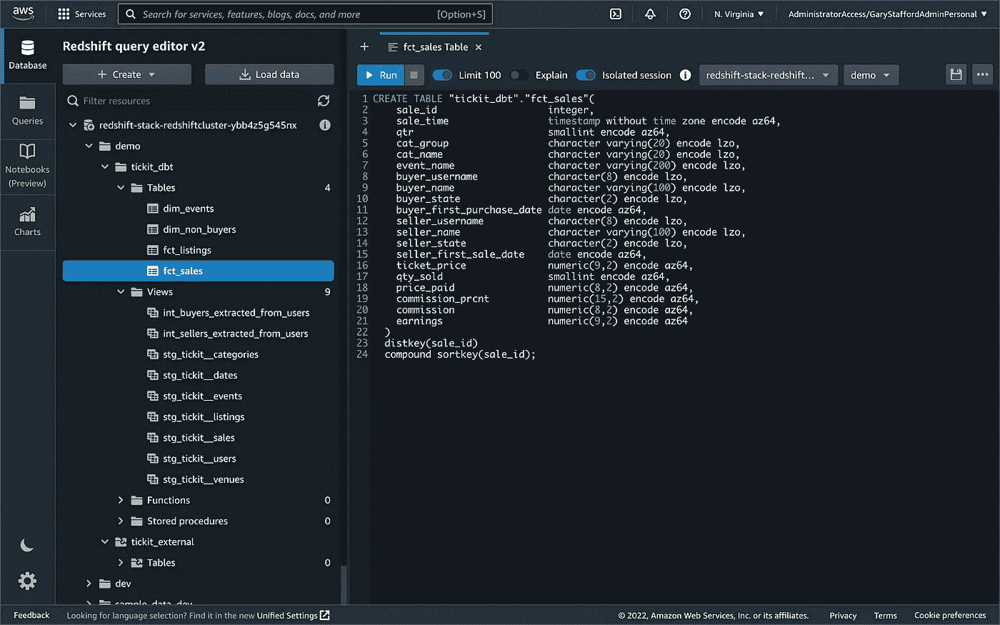**

**显示 fct_sales 表的 Amazon Redshift 查询编辑器 v2 控制台**

**此时，dbt 已经在红移`demo`数据库中编译并创建了该项目的所有模型。**

# **分析**

**本演示的 GitHub 项目也包含示例分析。dbt 允许我们使用 dbt 的`[analyses](https://docs.getdbt.com/docs/building-a-dbt-project/analyses)`功能在 dbt 项目中对更多面向分析的 SQL 文件进行版本控制。这些分析不符合相当固执己见的 dbt 模型定义。我们可以使用`dbt compile`命令编译分析 SQL 文件，然后将结果 SQL 语句从`target/compiled/`子目录中复制并粘贴到我们选择的数据仓库查询工具中。**

**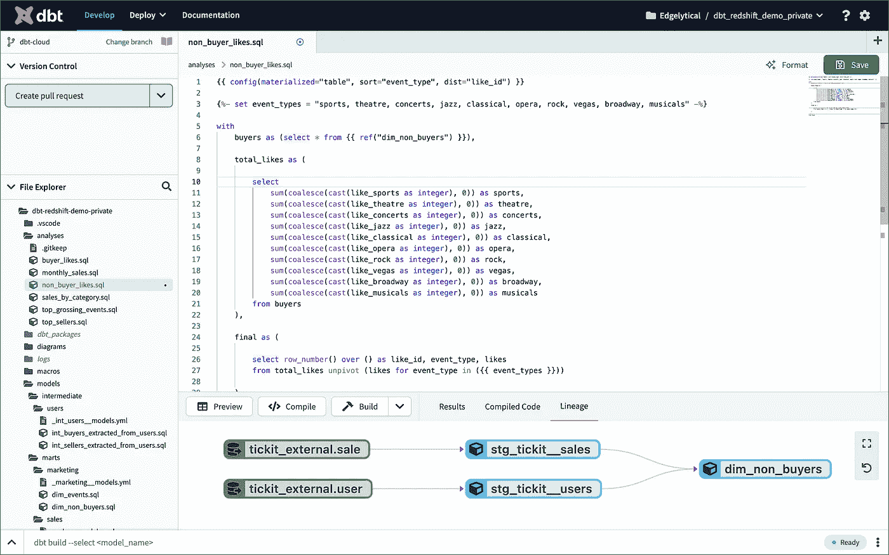**

**dbt 云界面中显示的分析**

# **项目文件**

**使用`[dbt docs generate](https://docs.getdbt.com/reference/commands/cmd-docs)`命令将从 SQL 和 YAML 文件自动生成项目的文档网站。文档可以从您的 dbt 云帐户生成和显示，或者使用`dbt docs serve`命令在本地托管。**

**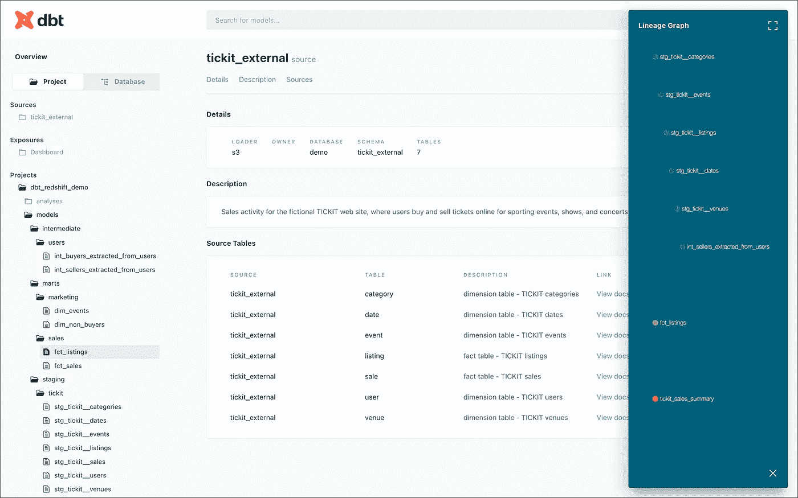**

**项目的文档网站**

# **测试**

**根据 dbt，“*测试是你对你的模型和你的 dbt 项目中的其他资源(例如，源代码、种子和快照)做出的断言。当您运行* `*dbt test*` *时，dbt 会告诉您项目中的每个测试是通过还是失败。*“该项目包含 50 多个测试，在`_tickit__sources.yml`文件和`test/`目录中的单个测试之间进行划分。典型的 dbt 测试检查非空值和唯一值、预期数值范围内的值以及已知字符串列表中的值。任何用 SQL 写的`SELECT`语句都可以测试。**

**`_tickit__sources.sql file`中的测试片段**

**使用`dbt test`命令执行项目的测试。我们可以使用`--select`可选参数(例如`dbt test --select assert_all_sale_amounts_are_positive`)来执行单独的测试。我们还可以在大多数 dbt 命令中使用`--threads`可选参数，包括`dbt test`，增加并行性并减少执行时间。下面的例子使用了十个线程，这是为 Amazon Redshift `dbt`用户配置的任意最大值。**

**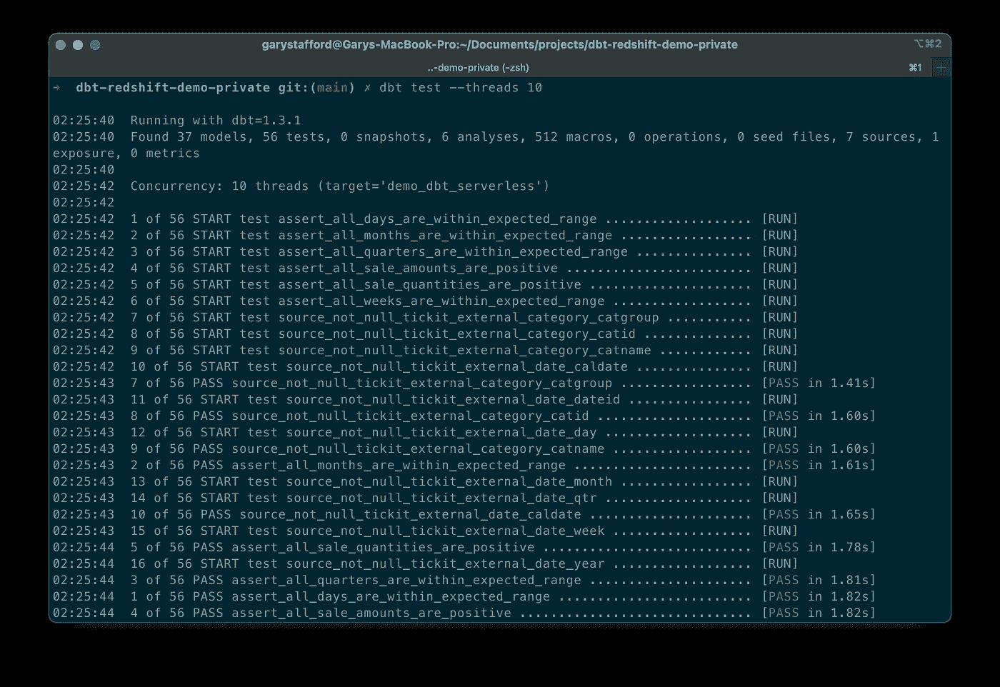**

**运行 dbt 测试**

**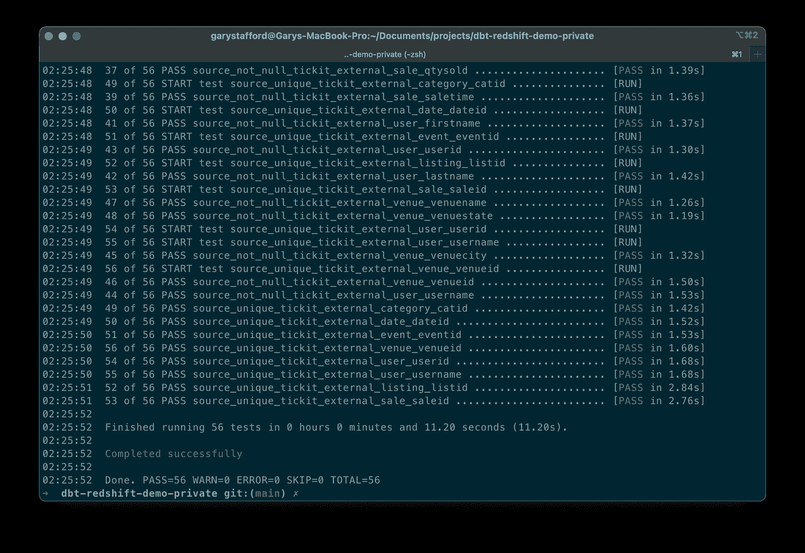**

**成功的测试运行**

# **乔布斯**

**根据 [dbt](https://docs.getdbt.com/guides/getting-started/building-your-first-project/schedule-a-job) 的说法，作业是您想要按计划运行的一组 dbt 命令。比如`dbt run`和`dbt test`。作业可以加载包、运行测试、具体化模型、检查[源代码的新鲜度](https://docs.getdbt.com/docs/dbt-cloud/using-dbt-cloud/cloud-snapshotting-source-freshness) ( `dbt source freshness`)以及重新生成文档。下面，我们创建了一个日常工作，随着数据湖中数据的更新，测试、刷新和记录我们的项目。**

**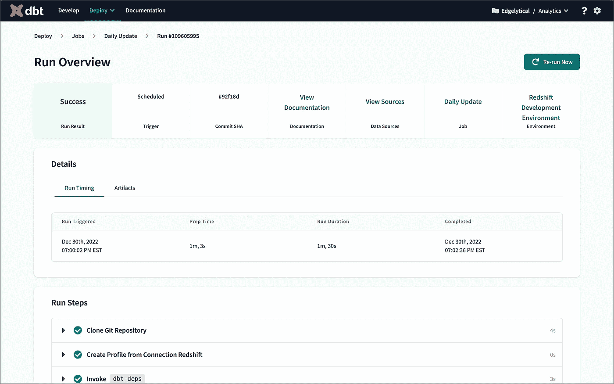**

**dbt 云的作业运行概述**

# **通知**

**根据 [dbt](https://docs.getdbt.com/docs/dbt-cloud/using-dbt-cloud/cloud-notifications) 的说法，在 dbt Cloud 中设置通知将允许您在作业运行成功、失败或取消时通过电子邮件或所选的空闲通道接收警报。**

**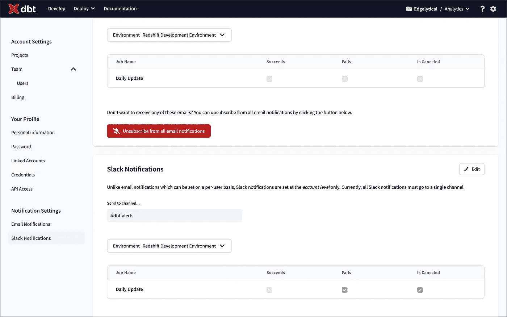**

**用于配置电子邮件和 Slack 的 dbt Cloud 通知界面**

**Slack 通知包括运行状态、计时和在 dbt Cloud 中打开作业的链接。下面，我们看到一个关于我们项目日常工作运行的通知。**

**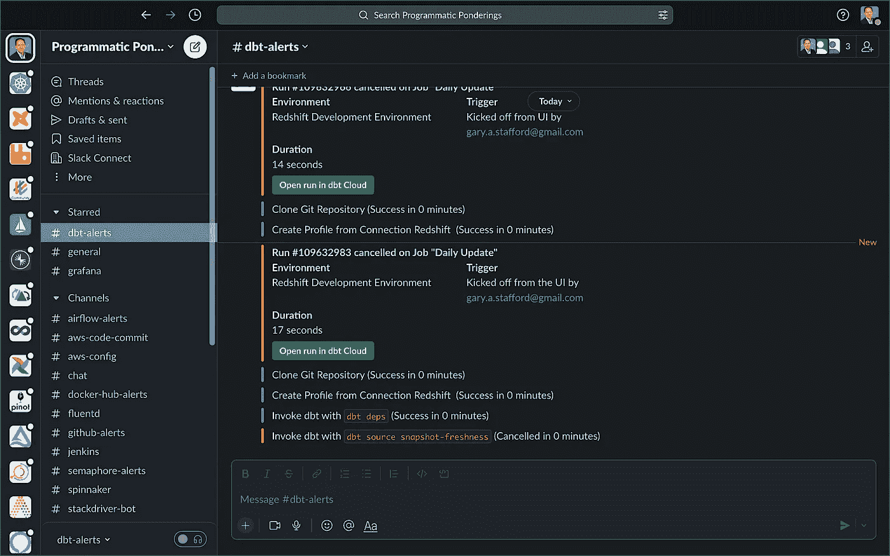**

**从 dbt Cloud 通知取消在空闲时间运行的作业**

# **暴露**

**风险敞口是 dbt 的新增内容。[暴露](https://docs.getdbt.com/docs/building-a-dbt-project/exposures)使得定义和描述我们的 dbt 项目的下游使用成为可能，例如在仪表板、应用程序或数据科学管道中。下面是一个曝光的例子，描述了在 [Amazon QuickSight](https://aws.amazon.com/quicksight) 中创建的销售仪表板。**

**上面显示的曝光 YAML 文件描述了下面显示的 Amazon QuickSight 仪表盘。**

**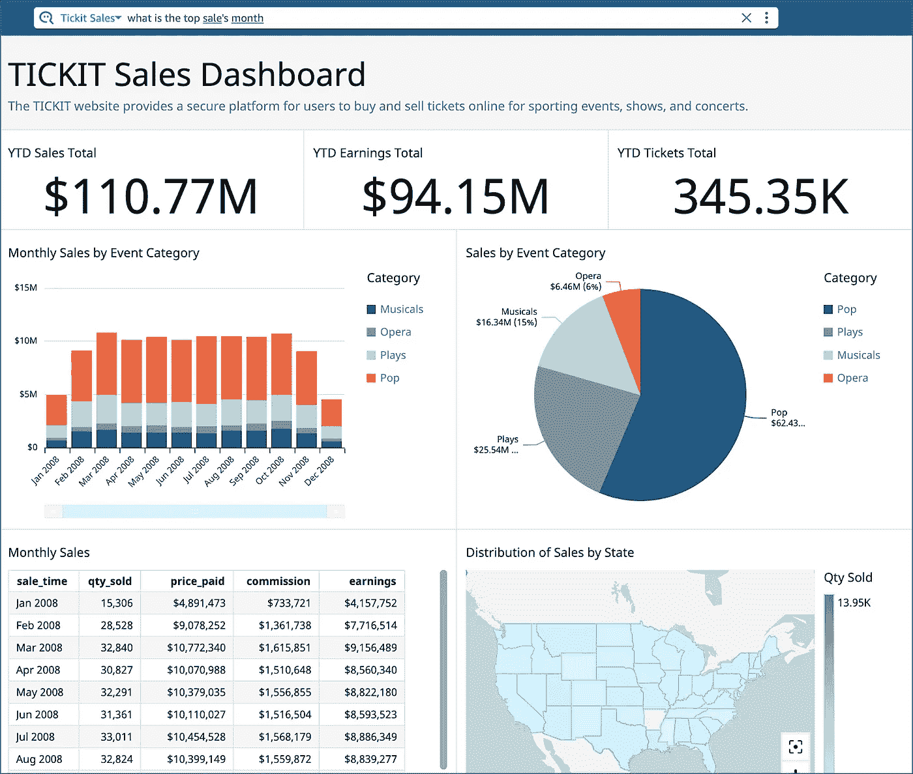**

**亚马逊 QuickSight 仪表盘**

**曝光与 dbt 的自动记录功能一起工作。dbt 用与数据消费者相关的上下文填充自动生成的文档站点中的专用页面。**

**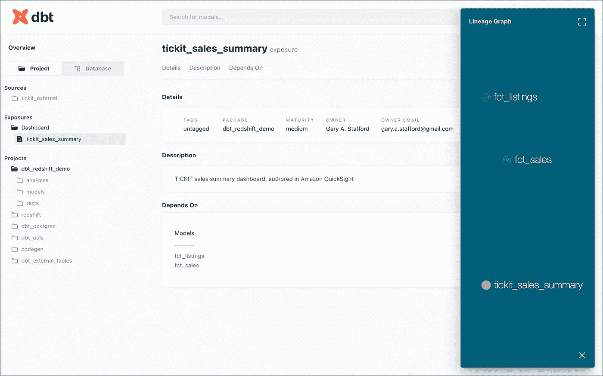**

**项目的文档网站，显示仪表板曝光**

**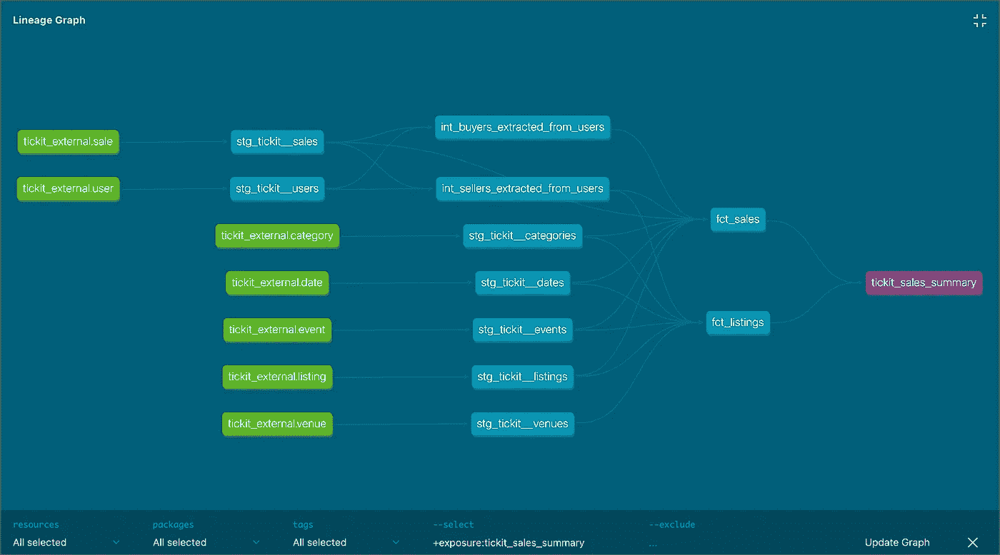**

**项目的文档网站，显示仪表板曝光的谱系图**

# **结论**

**在本文中，我们介绍了 dbt 的一些基本功能。我们了解了 dbt 如何使分析师更像软件工程师一样工作。我们还了解了 dbt 如何简化 SQL 中数据模型的编码，如何使用 git 将数据模型作为代码进行版本控制和管理，以及如何与其他数据团队成员就数据模型进行协作。**

**本文没有探讨但对大多数大规模 [dbt 管理的生产环境](https://docs.getdbt.com/docs/running-a-dbt-project/running-dbt-in-production)至关重要的主题包括[高级 Jinja 模板和宏](https://docs.getdbt.com/guides/getting-started/learning-more/using-jinja)、[模型新鲜度](https://docs.getdbt.com/reference/resource-properties/freshness)、[编排](https://docs.getdbt.com/guides/orchestration/airflow-and-dbt-cloud/1-airflow-and-dbt-cloud)、[作业调度](https://docs.getdbt.com/guides/getting-started/building-your-first-project/schedule-a-job)、[持续集成](https://docs.getdbt.com/guides/orchestration/custom-cicd-pipelines/1-cicd-background)、[和 GitOps](https://docs.getdbt.com/guides/orchestration/custom-cicd-pipelines/1-cicd-background) 、[通知](https://docs.getdbt.com/docs/dbt-cloud/using-dbt-cloud/cloud-notifications)、[环境变量](https://docs.getdbt.com/docs/dbt-cloud/using-dbt-cloud/cloud-environment-variables)和[增量模型](https://docs.getdbt.com/docs/building-a-dbt-project/building-models/configuring-incremental-models)。我们将在以后的文章中探索这些额外的 dbt 功能。**

**这篇博客代表我的观点，而不是我的雇主亚马逊网络服务公司的观点。所有产品名称、徽标和品牌都是其各自所有者的财产。除非另有说明，所有图表和插图都是作者的财产。**