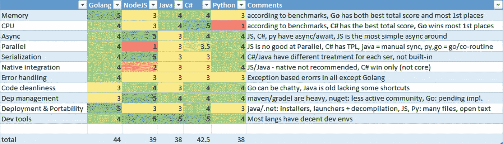
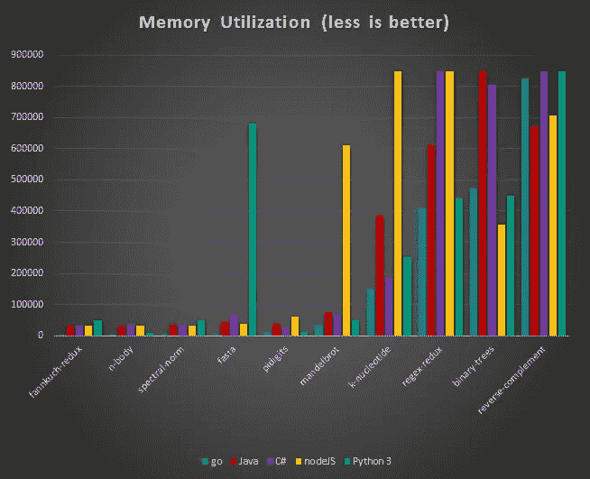
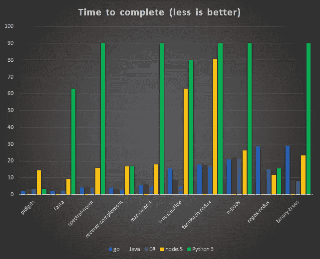
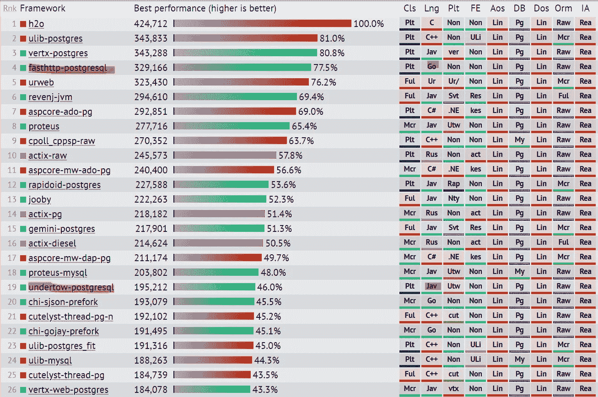

# 语言奖:代码之战

> 原文：<https://itnext.io/language-awards-war-of-codes-d751eb386184?source=collection_archive---------3----------------------->

哪种语言最适合你？TS，Javascript，Go，Java，Py，C#让我们深入了解一下！


在最初的 TS 与 Go 比较之后的一段时间，我认为我应该重新进行语言比较，以做一些更大的事情，我想更深入和更广泛地进行比较，找出一些难点，比较语法和功能以及生态系统，并在混合中加入更多的语言，以查看新语言与旧语言的对比情况。为什么不在一个大的表格里比较所有的东西，看看谁得分最高？好的。它会很乱，你可能不喜欢我的评分，但我保证我会努力做到公平；)

**TL；博士:**考虑一下下表，在评论中随意一决雌雄:



我的语言对比成绩

既然你已经得到了你的剧透，让我们继续比较。我不会深入 Java / C# / Py **并行**代码示例，因为我想在这方面重点关注 TS & Go，但是这样的示例并不难找到。

# 资源消耗

## 内存占用

当使用不同的语言时，内存利用率会有很大的不同，这乍听起来可能令人惊讶，因为您可能会认为代码应该用完大约算法所需的内存，但是由于数据可以在内存语言中以许多不同的方式表示，所以基本库实现在内存使用方面会有很大的不同。例如:对象可以表示为指针网络(C#/Java)、顺序结构(Go)或哈希映射(JS)。

下面的图表显示了不同代码任务期间的内存消耗，引入了 850MB 的临界值以保留图形细节，防止过度缩放。净核心绩效。



内存基准(数据:基准游戏)

当谈到**垃圾收集**语言时， **Golang 是你最好的内存利用**，这也可以在基准中看到[:](https://benchmarksgame-team.pages.debian.net/benchmarksgame/faster/go-node.html)

*   **内存顺序结构**:与大多数语言(包括 JS)相比，Go 没有类，只有结构。这意味着 Golang 对象被鼓励更像二进制数据块，而不是指针树，我说“鼓励”是因为如果你愿意，你可以在 Go 中的任何事情上使用指针。
*   **纯代码编译** vs 链接(动态&静态)意味着不需要加载整个*。dll/*。sa/*。js 文件加载到内存中进行一些函数调用，考虑使用 lodash，加载和使用了多少代码行。
*   **强类型**:精确控制内存使用，例如 int16 只使用 16 位。
*   **无继承** : Golang 不需要虚拟表，这意味着你减少了几乎所有创建对象的开销，因为在 Java/C#中继承是标准。
*   **多线程**:使用 JS，你将需要创建新的进程，以利用额外的 CPU 内核，这意味着你要加载基类和库代码的副本。

## CPU 利用率

我们程序员都有一个爱好，就是问哪种语言更擅长挤出汁液，我也不例外。每学完一门新语言，我总会想:“这一门是不是比前几门快多了？”，在这个类别中挑选一个明确的赢家将永远是一个骗局，但我可以就此事提供一些想法。

我们可以求助于[基准](https://benchmarksgame-team.pages.debian.net/benchmarksgame/faster/go-node.html)，它向我们展示了 Golang 最有可能胜过 JS，这并不奇怪，因为可以使用更多的内核，但是当它与 [Java](https://benchmarksgame-team.pages.debian.net/benchmarksgame/faster/go.html) & C#相比时，情况就不同了。

下面的图表显示了完成不同基准测试的时间，我必须引入 90 秒的截止时间，以避免 python 时间冲刷掉更重要的结果。



CPU 基准(数据:基准游戏)

我知道基准是“人造的”，统计是骗人的，X 没有查 gcc-go 等等。我对此事的想法是，像生活中的大多数事情一样，这是一种权衡。Golang 面向服务器，它有一个快速的单代 GC，牺牲对象创建/删除速度来实现亚毫秒级的“停止世界”暂停，这意味着服务将会很快，并且没有奇怪的 GC hickups，如[服务器基准](https://www.techempower.com/benchmarks/#section=data-r16&hw=ph&test=fortune)所示，其中 go-fasthttp 在 307 个中排名第 4，而 nodeJS 排名第 77，而 java 出现在第 3，vert.x 还不是编写 Java 服务器的流行方法，undertow 排名第 19，要找到 jetty 需要下到第 77



来源:[techempower.com/benchmarks](https://www.techempower.com/benchmarks)

Golang 中的这种 GC 策略也意味着，当创建**大量**短期实例时，Golang 将会变慢，如 [bin-tree 基准测试](https://benchmarksgame-team.pages.debian.net/benchmarksgame/performance/binarytrees.html)所示，其中创建了大量节点来构建大型树结构:Golang 比 C 慢 11 倍，而 C#。netCore (3.1 倍)，Java(慢 3.4 倍)，NodeJS (9.2 倍)。这个问题的证据可以在[这里](https://blog.kowalczyk.info/article/u5o7/speeding-up-go-with-custom-allocators.html)看到，通过使用自定义分配，避免了垃圾收集，从而修复了性能问题，我不相信大多数正常的用例会产生类似的情况，所以 Golang 应该可以处理您的服务器工作流。

在大多数情况下，代码实现细节比任何语言细节对真实世界的性能更重要，但如果你想挑剔(我们确实如此)，Golang 是高性能代码的可靠赌注，因为它在 10 个基准测试中获得了 5 个第一，4 个第一，1 个第一。

## **异步&并行编程**

**Java:旧的线程池范例，**使用操作系统线程，允许自我管理和一些池功能，提供同步原语，如互斥和信号量，以及对函数的同步访问。Async IO 是在最近的版本中引入的，但是 Java 缺乏一些现代的方法，这些方法应该使这个混乱的领域易于实现，并使您远离线程泄漏、死锁和许多其他并行编码的恐惧。

**C#** : **一些很好的同步和并行方法，有时有点混乱** C#拥有所有可以提供的并行方法，操作系统线程、线程池、同步原语和高级同步对象以及任务调度(TPL)，但这并不十分直接:任务可以通过使用 continueWith， 这为代码的并行执行提供了更方便的方法，但任务抢占并不总是由框架来处理，因此 http 请求仍然可以占用 OS 线程，直到超时或收到响应，为了确保异步，应该使用较新的 http 客户端的 async/await 方法，这意味着您的代码的其余部分也应该是异步的…正确的用法并不像应该的那样清楚或简单，因为框架中有许多不同的 async &并行选项。 对于异步编程，我们有 Async/Await 功能，当您不将它与需要同步 UI 线程的胖客户端混合时，它工作得很好。正如你所理解的，C#非常努力地给我们提供一切…但是它缺乏事后诸葛亮从头开始构建的平滑度。

**TS:简单、无并行、始终异步代码** NodeJS 采用 JS 方法，其中有一个线程用于处理 JS 命令，并将所有 IO 工作卸载到由操作系统管理的异步 IO 线程，以执行与磁盘/网络的任何事务。主线程由任务队列管理，这意味着最终在 NodeJS 进程中任何时候都只有一个 JS 命令被处理。这意味着您的代码总是异步的，消除了解决同步代码和粘性异步代码的问题，这些代码往往会以其异步的方式感染所有相邻的代码。

当我第一次听说这种“单线程”操作模式时，我感到非常惊讶，因为服务器都是高效地使用所有内核来最大化每秒处理的呼叫。但是如果你把它想得更长远一点，一些著名的数据库在很长一段时间内使用多进程架构，所以如果每个进程的开销不大，那么拥有一个好的“每个进程单线程”管理方案是有意义的，NodeJS 成功地提供了这一点。

缺点是你的代码完全是以异步方式编写的，回调和承诺都有一个学习曲线，使用 async/await 要好得多，但你仍然需要记住你的代码是暂停的，并相应地计划。

**go:并行供电，同步代码直到被请求** Golang 让您对并行和异步流有了更多的控制，您可能会认为以前的语言如 java/C#已经是这样了，但是当您看到一百万个 GO 例程可以同时运行而不影响系统性能时，您会意识到这里有一些新的东西(我刚才谈到的自动抢占)……
GO routine 不是线程[它们只占用 2k 个堆栈并保存在 GO 的托管内存池中，因此创建它们和 go 还为您提供了作为生产者-消费者队列的通道，用于将 go 例程联系在一起，并为大多数同步问题提供了简化的解决方案，引导您远离那些讨厌的同步灾难。](https://codeburst.io/why-goroutines-are-not-lightweight-threads-7c460c1f155f)

谈过权力之后，我们仍然应该想到简单；在 golang 中，编写 sync 很简单，但当进行 async 时，有一个学习曲线，你需要考虑“Go 方式”:如何正确地创建 Go 例程，传递通道，执行 select 语句，并检查例程在完成后是否正确关闭。简而言之，尽管 Golang 拥有优越的并行设施，但你仍然不希望将异步/并行代码设计留给你最弱的程序员。

看看这个展示 Golang 力量的很酷的例子:

```
**100K-long goroutine chain: (~600 Milisecs on my machine)**package main
import "fmt"func f(left, right chan int) { left <- 1 + <-right }func main() {
  leftmost := make(chan int);
  var left, right chan int = nil, leftmost;
  for i:= 0; i< 100000; i++ {
    left, right = right, make(chan int);
    go f(left, right);
  }
  right <- 0;  // bang!
  x := <-leftmost;  // wait for completion
  fmt.Println(x);   // 1000000
}
```

# 代码编写经验

## 序列化

TS 中的序列化支持只使用 JS，具有定义接口的额外能力，这些接口概述了序列化的对象，允许容易的代码完成支持。这是迄今为止我在任何语言中体验过的最简单的序列化。GO 序列化支持也不错，但是它需要定义和填充结构以及一些序列化符号来指示 json 字段名，或者使用 Goalng 的未知类型“interface{}”:

*   **map[string]interface { }**//未知类型的地图
*   **【接口】**//一个未知类型的数组

```
**Using Object Definitions:****TS:** class ChildStruct {
    Text: string;
    SomeField: string;
}
class SomeStruct {
    isAFoo: boolean;
    someField: string;
    children Array<ChildStruct>;
}
var p0 = new SomeStruct(true, "blah", [{"aa","bb"},{"cc","dd"}]);
var s = JSON.stringify(p0);**GO:**
type ChildStruct struct {
 Text     string         `json:"text,omitempty"`
 SomeField string        `json:"someField,omitempty"`
}
type SomeStruct struct {
   IsAFoo   bool           `json:"isAFoo"`
   Text     string         `json:"text,omitempty"`
   Children []*ChildStruct `json:"children,omitempty"`
}jstr, _ := json.Marshal(SomeStruct{
    IsAFoo: true,
    Text: "blah",
    Children: []*ChildStruct{
        &ChildStruct{
            Text:      "aa",
            SomeField: "bb",
        },
        &ChildStruct{
            Text:      "cc",
            SomeField: "dd",
        },
    },
})**Inline Serialization:****TS:** let obj= {
    "isAFoo": true,
    "text":   "blah",
    "children": [
       {
            "text": "aa",
            "someField": "bb",
        },
        {
            "text": "cc",
            "someField": "dd",
        },
    ],
}
let str = JSON.serialize(ob);**GO:**
obj := map[string]interface{}{
    "isAFoo": true,
    "text":   "blah",
    "children": []interface{}{
        map[string]interface{}{
            "text": "aa",
            "someField": "bb",
        },
        map[string]interface{}{
            "text": "cc",
            "someField": "dd",
        },
    },
}jstr, _ := json.Marshal(obj)
```

但这是真正强打字的代价。

## 网络协议操作:

**JS** 拥有创建服务器&代理的所有标准机制，因此在大多数情况下，如 REST 服务、Websockets &您运行的工厂代理这就足够了，但当需要改变低级 http 服务器调用或创建一些特殊的协议适配时，基本库不允许足够的控制，您最终会求助于黑客&变通办法。

Go 是深度协议编程的自然选择，因为它提供了极大的灵活性。在 http 处理中，它提供了一种劫持底层 TCP 通道的方法，它是简单的 io。读取器/写入器接口允许完全控制，没有流的抽象。我对这种机制唯一的不满是，由于某种原因，http 基本库直接使用缓冲 io，而不仅仅是实现 io.reader。

## 本机集成:

JavaScript/TS 不会让你在这方面走得太远，通常只是调用一些二进制可执行文件，这些文件是你在几个操作系统版本中与模块打包在一起的，总会有 Gyp，但我绝不会推荐它。

*Go* 有几种机制，包括:

*   不安全的 Go 代码
*   CGo:在注释中编写 c 语言，然后编译(也可以包括 cpp 或 ObjectiveC 语法和文件)
*   “syscall”模块内置于语言中，在加载和调用 windows dlls 时非常方便。

对于编写跨平台的边缘案例，我更喜欢 Golang，但如果你问我，大多数时候我会选择 cmdline 集成(一个小的 exe 来完成这项工作),并坚持为我的大部分解决方案使用 100%的跨操作系统代码，为一些小的卫星二进制文件使用 100%的本地代码进行一些本地操作(这里不讨论移动，这完全是另一回事)。

## 错误处理:

**Java/C#/Python** :通过异常处理错误，在这些语言中，大多数错误，下至基本库，都被视为异常，包括像“找不到文件”这样的琐碎事情，Java 是迄今为止最糟糕的，迫使程序员声明哪些异常可以抛出，这就引出了一个问题:“如果你期望它们，为什么它们被称为**异常**？”…

在 **JS/TS** 中的错误处理取决于你是否使用了承诺，如果没有，那么错误通常作为回调参数返回，对于承诺错误，它们与异常处理非常相似，我们可以说错误通常是通过应用程序抛出的，除非被显式处理。此外，像大多数以前的语言一样，空值或未定义的值容易产生臭名昭著的空指针错误，这通常占代码错误的 90%。

在 Golang 中，错误有点不同，尽管存在异常机制(称为恐慌)，但不鼓励这样做。框架库很少会死机，而且从来不会出现在常规的东西上，相反，有一个 **err** 返回值需要你的注意，即使只是用下划线“_”来忽略它。

通过将接收器对象传递给函数(在大多数语言中接收器= the " **this" object** ，有时在 JS 中也是如此)，可以减少空指针错误，因此在运行函数之前可以在接收器上进行空检查，这意味着 foo。RunMe()不必自动抛出“foo 未定义”错误。

## 代码清洁度:

我们讨论的大多数语言都是 C 语法，因此有些相似，JS、TS、Java、C#语法在编码时感觉是一样的。python 和 Go 都打破了传统，Python 力求更好的可读性，而 Go 则追求简化的语言和更好的性能。

Go 是一种经过深思熟虑的语言，但它有时会在基本情况下强制执行较长的代码，从而妨碍了流畅的代码编写:

*   比特运算(Go 中没有三元运算符)

```
**JS/TS (+Java/C#):** 
res = (aa%2 == 0)?"even":"odd";**Py3:** res = "even" if (aa%2 == 0)  else "odd"**Go:**
var res string
if aa%2 == 0 {
    res = "even"
}
res = "odd"
```

*   基本字符串操作

```
**JS/TS (similarly Java/C#):** ("stUff"+1).toLowerCase().startsWith("stu");**Py3:** ("stUff"+str(1)).lower().startswith("stu")**Go:** strings.HasPrefix(strings.ToLower("stUff")+strconv.Itoa(1),"stu")
```

*   追加到数组

```
**JS/TS:** arr.push("Hola");**Py3**:
arr.append("Hola");**Go:** arr=append(arr,"Hola")
```

# **生态系统(工具、开发运维&社区)**:

## **模块&副管理**

Java : Maven/Gradel:很好的 dep 管理，但是下载需要很长时间，并且当它失败时很难理解。

**C#** : Nuget 还可以，但绝对没有其他社区组件生态系统丰富。

**Python** : Pip 比大多数版本好得多，但是 Py 2.7 和 3 之间的混淆，以及大多数人使用 virtual-env 来避免冲突的事实，表明它并不完美。

**TS/JS:** 在我看来，NPM 是目前市场上最好的包管理器&模块库，它处理深度依赖树、多个依赖版本、语义版本化和收缩包装，以实现深度依赖版本的稳定性，并拥有本地 dep 库和全局 dep 代理的解决方案。这既是一件好事也是一件坏事，因为它创造了一个生态系统，在这个生态系统中，导入一个依赖项可以将 50 个或更多的子依赖项拖到您的项目中。

Golang 有一种非常新颖的依赖方法，它使用 git repos 获得所有依赖项作为代码，并在最后编译一切，这种方法解决了编译语言的几个典型问题:依赖链接和操作系统特定的二进制格式。但是当继续构建企业级项目时，它也产生了模块版本化、不同版本的依赖性重复等问题。有大量不同的社区项目试图定义处理这个问题的正确方法，还有一些官方项目。目前有两个官方工具和一个正在开发中的工具:

*   **go get** :获得依赖关系的内置工具，没有版本控制的解决方案，不能与 TFS/stash/其他非 github git 服务器一起工作，(但是如果你真的想让它工作，有一个 [hack](http://ppanyukov.github.io/2017/02/01/golang-with-vsts-repos.html)
*   [**dep**](https://github.com/golang/dep) :自我定义为 go 1.9+的“官方实验”，并通过保留一个文件来提供一些问题的解决方案，该文件映射您的代码导入的版本并将它们锁定到相应 git repos 中的特定提交。

简而言之，Golang 的 CI/CD 故事仍在发展，您采用的任何工具链都可能在不久的将来被修改，但我们应该记住，就在几年前，许多打字工具(如打字)也是如此。

## **部署、二进制大小、签名、混淆**

NodeJS 二进制文件只是 JS 代码的一个缝合堆，包括你递归导入的所有依赖项。对于一个中等规模的项目来说，它通常可以达到 300Mb 甚至更多。

这是 Go 真正闪耀的地方:

*   二进制文件是独立的，特定于操作系统，一切都是可移植的，只需下载并运行即可。
*   可以对本机二进制文件进行签名，签名将在运行它们时由操作系统进行验证。
*   二进制文件很难理解，即使与 cpp 二进制文件相比也是如此，因为它们增加了垃圾收集机制来混淆 IDA 调试/破解。

## 调试/ IDE 环境

我们都习惯于由专业人员精心调整的非常高级的调试器环境，这适用于 JS / TS，以及 C#、Java 和我编写的大多数其他语言， **C#** 在 VsCode 中拥有最好的微软支持& VStudio，具有闪亮的功能，如编辑并继续，支持在调试时移动指令指针，以及 jetbrains resharper 的高级重构支持。 **Java** 显然拥有最多的 ide， **JavaScript** 拥有一些最好的支持，以及 Jetbrains 支持和 VsCode，以及各种编辑器和浏览器内调试。 **Typescript** 在 JS 支持 map 文件的地方支持调试，同时也有很好的 VsCode 支持和 IntelliJ/WebStorm 支持。

Python 没有太多的 IDE 选择，许多使用高级文本编辑器，它有很好的 VsCode 支持和 PyCharm/IntelliJ，但是它没有这里的其他语言那么多的选项和深度集成。

**Golang** 调试尚未完善。delve 调试器在大约 6 个多月前才达到 1.0 的状态，它还没有完全的特性和调整。IDE 环境也在迎头赶上: **VSCode** 有基本的 Go 支持，但它在进行基本的重构(如重命名变量)时遇到了麻烦，在控制台或观察器中没有函数调用支持，在调试时没有新的断点设置，并且对变量引用树和大型数组的可见性有限。Goland / IntelliJ 插件更好，据说有谷歌的支持，快速重构，更快的响应时间和更好的变量可见性，但这是一个付费选项。

# 底线是:

虽然 C#和 Java 显然受到了遗留代码驱动的惰性的推动，但 TS、Py 和 Go 在这里是有原因的，NodeJS/TS 在一些类别中胜出，如:"**最快的上市时间**"和"**最佳工具链**"，Python 胜出"**最容易的集合操作和数字处理**，这解释了它在 DataSciense 中的受欢迎程度，Golang 会认为:"**最佳内存消耗**"，**在压力下保持稳定**"和**Golang 是一个比 NodeJS 更强大的平台，允许更多的篡改协议通道的能力，并以相对简化的方式运用并行计算的力量，大多数高级程序员都会喜欢使用它，尽管一般的开发人员可能更喜欢 JS。**

对我来说，Golang 带我回到了“one exe”是一个有价值的目标的时代，最专业的软件是极其便携的，紧密包装和防篡改的。我喜欢这一点…不知何故，我仍然认为有些类型的软件应该带着闪亮的硬壳出厂，而不是作为一堆一千个松散连接的部件，在正确组装时运行良好。