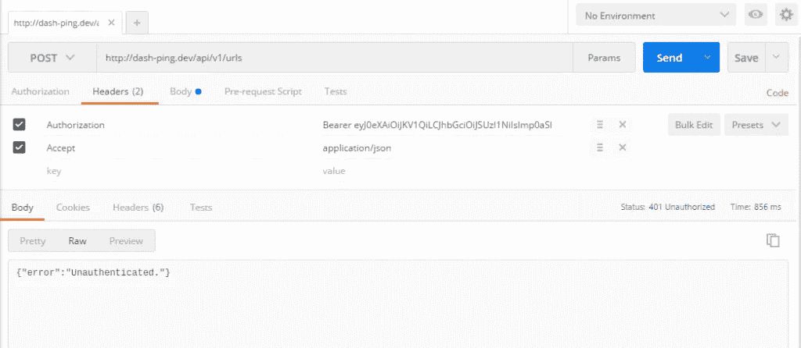
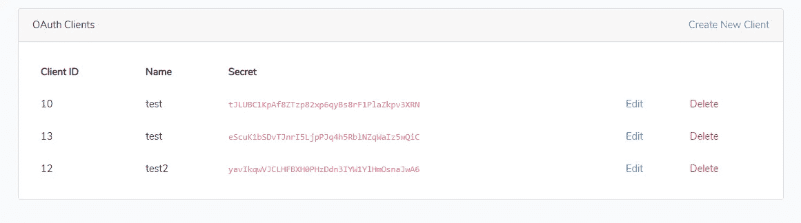

# Laravel 5.8 Passport oAuth 2.0 的使用和实施

> 原文：<https://itnext.io/laravel-5-8-passport-oauth-2-0-usage-and-implementation-5e5d92aeab42?source=collection_archive---------1----------------------->

> 免责声明:本教程假设您熟悉 Laravel、中间件、路由、get/post 请求和浏览文档。本教程解释 grant_type Client_credentials 的实现

# 步骤 1:实施

您必须遵循 [***文档***](https://laravel.com/docs/5.8/passport) 中说明的步骤。
它提供了以下现成的授权类型。

**1-** [**隐式授予**](https://laravel.com/docs/5.8/passport#implicit-grant-tokens) **令牌:**当你的 app/网站需要使用来自客户端的个人资料或账户的数据时使用(大部分)。比如用 facebook 注册。或者在 facebook 上发布来自第三方的内容。

**2-** [**客户端凭证授予**](https://laravel.com/docs/5.8/passport#client-credentials-grant-tokens) **令牌:**客户端凭证授予适用于机器对机器的认证。只能从命令行生成。

**3-** [**个人访问**](https://laravel.com/docs/5.8/passport#personal-access-tokens) **令牌:**有时，您的用户可能希望向自己颁发访问令牌，而不经过(1)中提到的典型授权码重定向流程。

**4-修改的 Client_Credentials 令牌:**我希望用户注册并在机器之间进行通信，而不涉及任何中介，并进行可能的订阅，同时保持原始设置不变，避免[问题](https://stackoverflow.com/questions/39833897/laravel-5-3-passport-api-unauthenticated-in-postman-using-personal-access-tokens)并解决错误。



错误:未经验证

# 第二步:需要的修改

现在，将与客户端凭据关联的所有 api.php 路由移出:

```
/routes/api.php
```

并将它们移动到一个 ***新的*** 路线文件中，命名为:

```
/routes/client_credentials.php
```

这样做可以确保核心功能不受影响。

接下来，我们需要使用这个新的路由文件(client_credentials.php)。为此，请更新:

```
/app/Providers/RouteServiceProvider.php
```

通过添加一个新方法并在现有的“map”方法中调用它，如下面的 RouteServiceProvider.php 文件所示

```
<?phpclass RouteServiceProvider extends ServiceProvider
{// existing map method
    public function map()
    {
        $this->mapApiRoutes();$this->mapWebRoutes();

        // ref new method for adding client credentials
        $this->mapClientCredentialRoutes();
    }// new client credentials method
    protected function mapClientCredentialRoutes()
    {
        Route::prefix('api') // I still want /api/ urls
            ->middleware('client_credentials') // new middleware I'll set up in a bit
            ->namespace($this->namespace)
            ->group(base_path('routes/client_credentials.php')); // referencing my new routes file
    }
}
```

现在修改内核文件，使上述文件成为路由系统的一部分。

```
/app/Http/Kernel.php
```

在这里，为我们的新中间件的 client_credentials 创建一个新的中间件组。

```
<?phpclass Kernel extends HttpKernel
{
    protected $middlewareGroups = [
        'web' => [
            \App\Http\Middleware\EncryptCookies::class,
            \Illuminate\Cookie\Middleware\AddQueuedCookiesToResponse::class,
            \Illuminate\Session\Middleware\StartSession::class,
            // \Illuminate\Session\Middleware\AuthenticateSession::class,
            \Illuminate\View\Middleware\ShareErrorsFromSession::class,
            \App\Http\Middleware\VerifyCsrfToken::class,
            \Illuminate\Routing\Middleware\SubstituteBindings::class,
        ],'api' => [
            'throttle:60,1',
            'bindings',
        ],

        // NEW LINE
        'client_credentials' => [
            \Laravel\Passport\Http\Middleware\CheckClientCredentials::class,
            'throttle:60,1',
            'bindings',
        ]
    ];
}
```

# 第三步:用法

现在是用法部分。

从默认 vue 组件创建新的客户端凭据

```
<passport-client></passport-client>
```



仅在 PHP 服务器端脚本中使用的密钥

按如下方式实现函数。

```
**<?php

use** App\User;
**use** Illuminate\Http\Request;

Route::*middleware*('client_credentials')->get('/user', **function** (Request $request) {
   **return** response()->json(["data"=>**true**]);
});
Route::*middleware*('client_credentials')->get('/user/get', **function**(Request $request){
   $user_id = $request->get("uid");
   $user = User::*where*('id','=',$user_id)->get()->first();
   **return** response()->json($user);
});
```

您可以下载并导入 postman 集合来测试基本用法