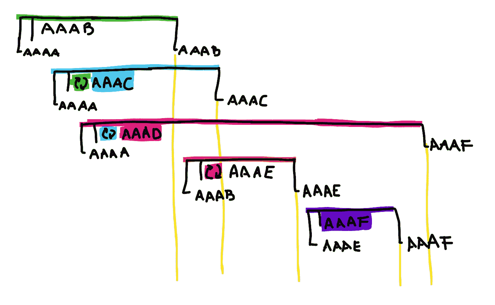

# Laravel:一个避免排队作业竞争的包

> 原文：<https://itnext.io/laravel-a-package-to-avoid-race-conditions-on-queued-jobs-41e618e7caa7?source=collection_archive---------3----------------------->

## 从 1 数到 10，但是以任何顺序，并且仍然以 10 结尾。

[雷灿](https://unsplash.com/@wx1993?utm_source=medium&utm_medium=referral)在 [Unsplash](https://unsplash.com?utm_source=medium&utm_medium=referral) 上的照片

> 如果你想要代码，[跳转到 Laralocker 包](https://coveralls.io/github/DarkGhostHunter/Laralocker)。

几天前，我被指派处理一个售票系统，这个系统处理起来**非常慢**。整个逻辑很慢:用户必须打开浏览器，直到支付完成，即使这样也不能保证他们支付的机票被正确创建并发送给他们——有时整个过程出错，并返回一个“*稍后再试，因为有太多的用户在做和你一样的事情*”。

正如您所猜测的，**所有事情都在同一个请求-响应生命周期**中处理:创建票证、与不可靠/缓慢的票证 API 通信，以及发送电子邮件。所以要做的第一件事是将所有这些[推送到两个排队的作业](https://laravel.com/docs/5.8/queues):一个创建票证并与 API 通信，另一个[在第一个完成后发送电子邮件通知](https://laravel.com/docs/5.8/notifications)。请求-响应生命周期减少到只处理检查可购买性、付款，告诉用户他们的票“正在路上”。

几秒钟(在某些情况下甚至是一分钟)被缩短到仅仅一眨眼的时间。

> 在本文中，我将把侦听器和作业仅仅视为作业，因为它们都可以使用 Laravel 中的队列。

将通知放在一边，我创建了一个队列工作器来处理票证创建队列。一旦作业被推到队列中，工人将处理它。乔布斯是这样的:

解释一下这个作业的作用:它检查最后售出的票是什么，创建下一个序列，联系票务 API 以获取票序列的外部 ID，然后在数据库中创建票，并通知用户。

# 在某种程度上，它是有效的。

几天后不久，我接到一个电话:当一群疯狂的用户出现在系统中时，发现了一个问题。

事情是这样的:大量用户在活动开始前几小时或几分钟购买门票，由于处理过程是连续的，**门票需要很长时间才能发送**:第一批用户只需几秒钟或几分钟就能拿到门票，**最后一批用户会在音乐会开始后到达，甚至是在音乐会结束后**。

这是一个巨大的打击。在这种情况下，售出的门票没有资格使用，**企业不得不手动处理退款，或者更糟的是，** [**退款**](https://www.chargebee.com/blog/protect-business-from-chargebacks/) 。当然，作为一个客户，如果我买了票却没有拿到，我可以打电话给商家——如果我非常生气或者他们让我等了太长时间，我会和我的银行谈谈。

单个队列工作人员是不够的。由于每个票证序列号都是由一个特殊的处理器按顺序处理的，**不可能提供更多的队列工作进程**。下一个票证序列号只能在保存上一个票证后生成，因为它们是连续的。同时执行该作业的两个或更多队列工作机会创建多个具有相同“下一个”序列号的票据。

这就是所谓的**竞争条件**。

## 处理竞态条件

“竞争条件”是一个两个或多个进程不能同时处理某事的概念，因为一个进程的结果依赖于另一个进程。

换句话说，在并发进程中，最先完成的一个获得奖励，其余的得到一个错误，因此必须一个接一个地处理它们。如果你想深入了解，维基百科中有更多关于比赛条件的信息[。](https://en.wikipedia.org/wiki/Race_condition)

在 Reddit 上快速的[求求你帮帮我之后，一个用户给了我一个好主意:*虚拟*预订。](https://www.reddit.com/r/laravel/comments/cl97to/concurrency_on_serial_jobs/)

我结束了自己的解决方案。

# 去储物柜，使用你的插槽，并释放插槽

我做了 Laralocker ，这是一个允许处理作业中竞争情况的包，只需要让作业从最后使用的槽中“保留”一个槽。

 [## 黑暗幽灵/拉拉洛克

### 使用这个简单的储物柜预订系统，避免您的作业、侦听器和通知中的竞争条件。接下来…

github.com](https://github.com/DarkGhostHunter/Laralocker) 

一旦预订，您就可以访问这个插槽来使用它，例如，作为我的票务系统中的序列号。这个槽可以是一个数字，也可以是一个字符串，或者是一个可以用字符串表示的对象。

一旦作业结束，您就“释放”了该插槽，下一个作业就可以从它停止的地方开始，即使它是在上一个作业结束之前开始的。

因此，避免与*拉拉洛克*竞争的工作看起来是这样的:

新增加的内容很清楚:我们在任何逻辑之前“保留”槽，我们在结尾“释放”它。我们添加了一个方法来告诉队列从哪里开始，以及队列中的下一个槽应该是什么。

# 介意解释一下这是怎么回事吗？

有时我们需要画出面纱后面到底发生了什么，以便更好地理解它。我们将这样做:

假设我们有五个队列工作器可用于我们的“tickets”队列，其中三个已经在仅仅几毫秒之外开始处理这些作业。

1.  第一个**进程会看到最后一个序列号是“AAAA”。在检查“AAAB”没有被任何人使用后，它将保留它。**
2.  **的第二个**进程到达并得出相同的结论，但是在检查到“AAAB”正在被使用之后，它将退回到“AAAC”。
3.  一个**第三个**进程到来并使用“AAAD”结束，因为其他进程已经被使用。
4.  **第一个**进程结束其主逻辑，现在询问最后一个串行代码是什么。最后一个序列号仍然是“AAAA ”,因为还没有人完成，所以它会轻轻地更新为“AAAB”。
5.  一个新的**第四个**进程产生，检查最后一个序列是“AAAB”，但是“AAAC”和“AAAD”仍然被保留，所以它将使用“AAAE”。
6.  **第二个**进程结束其主逻辑，检查最后一个串行代码为“AAAB”，并更新为“AAAC”。
7.  第三个进程**花费的时间稍长，因为 API 处于高负载状态。开始对着云大喊大叫(字面意思),因为在 API 返回响应之前，他仍然无法完成“AAAD”。**
8.  第四个进程**是幸运的，结束它的主逻辑，检查最后一个串行代码是“AAAC”，并将其更新为“AAAE”。**
9.  一个**第五个**进程产生，检查最后一个序列号是“AAAE”，所以它从“AAAF”开始，因为没有人使用它。
10.  第五个过程很快结束，检查最后一个序列号是“AAAE”，所以它更新为“AAAF”。
11.  第三个进程最终结束它的逻辑，检查最后一个结束的序列是“AAAF”，它在它自己的“AAAD”之上，所以它不更新它。

这种情况并不准确，因为一旦队列工作线程上的作业完成，下一个作业将由空闲的队列工作线程而不是下一个队列工作线程来完成，但结果是一样的。有一种方法告诉其他队列工作人员您已经预留了一个位置，这可能是不让其他进程踩在其他进程后面的最好方法。

这就够了。无论如何，如果你有更好的想法，请在评论中告诉我，特别是关于[悲观锁定](https://laravel.com/docs/5.8/queries#pessimistic-locking)。我花了半天时间来处理这个问题，结果成功了。