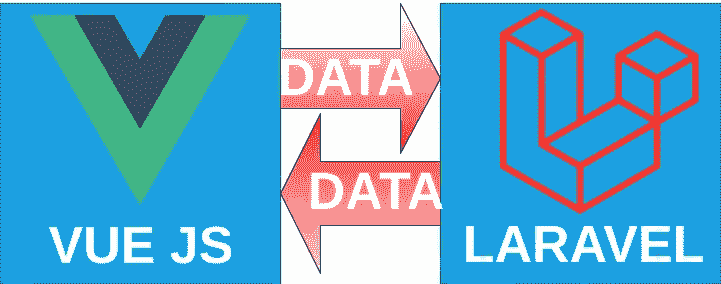

# Laravel 和 Vue:用 CRUD 管理面板创建作品集网站——第二章

> 原文：<https://itnext.io/laravel-and-vue-creating-a-portfolio-website-with-a-crud-admin-panel-92b4017df57e?source=collection_archive---------0----------------------->

## 图像上传和显示

**回顾:**在第一章中，我们能够从数据库中获取一个名称，并将其显示在 vue 组件中。这意味着我们有一种方法来检索数据，然后将其呈现到 vue 组件中。vue 组件显示为网页的一个元素。

**在**之前，我们继续创建图像上传功能。我们需要在现有代码变得太混乱和难以查看之前清理它们。

# **让我们做一些清洁和整理工作**


杰夫·谢尔登在 [Unsplash](https://unsplash.com?utm_source=medium&utm_medium=referral) 上的照片

像 Vue JS 这样的框架的一个优点是，你可以在组件中拥有**组件，**举例来说，你可以拥有:

```
<template>
    <div>
        **<first-component></first-component>
        <second-component></second-component>**
    </div>
</template>
```

您可以在不同的 vue 文件中构建网站的不同部分，并将它们编译为最终的单页应用程序，因此让我们来构建子组件。

## **构建子组件**

我们目前 App.vue 的模板标签是这样的:

```
<template>
    <div>
        **{{name}}**
    </div>
</template>
```

在完成的网站，我想有一个标题元素的名称。

我们需要创建一个名为 **masthead.vue** 的新 vue 组件

```
<template>
    <header>
        **<h1>{{name}}</h1>**
    </header>
</template>
```

并更改 App.vue 的模板标签以反映:

```
<template>
    <div>
        **<masthead></masthead>**
    </div>
</template>
```

报头组件**将**出现在 Vue Devtools 中，但**不会**出现在 Inspect 元素中，也不会呈现在页面上。

您将在浏览器控制台中看到以下消息:

> 属性或方法“name”不是在实例上定义的，而是在呈现过程中引用的。

这意味着模板标签试图呈现 **{{name}}** ，但是这在脚本标签中是不可用的。

{{name}}数据在主组件中，但这是一个**子组件(组件中的组件)。**

子组件通过 **props** 访问父组件的数据，所以让我们将 props 引入 masthead.vue 的脚本标签

```
<script>
    *export default* {
        name: "masthead",
        **props: {
            name: String
        }**
    }
</script>
```

在 Vue Devtools 中，您会发现:

> **名称:未定义**

要解决此问题，请将 App.vue 更改为:

```
<template>
    <div>
        **<masthead *:name*="name"></masthead>**
    </div>
</template>
```

代码解释:

> **:name** 表示当报头组件请求 **{{name}}** 时，提供双引号中的内容
> 
> 双引号内有 ***名称*** ，是 App.vue 中 **data()** 的数据

# 图像上传

## **准备好图像上传组件**

在 App.vue 中，在模板标签内添加**<></image-uploader>**。在脚本标签中，**导入图像上传器**，并在组件对象中注册**图像上传器**。

```
<template>
    <div>
        <masthead *:name*="name"></masthead>
        **<image-uploader></image-uploader>**
    </div>
</template>

<script>
    *import* masthead *from* './masthead';
    ***import* imageUploader *from* './ImageUploader';**
    *export default* {
        name: "App",
        components: {
            masthead,
            **imageUploader**
        },
        data() {
          *return* {
              name: '',
          }
        },
        mounted() {
            *this*.getBasicInfo();
        },
        methods: {
            getBasicInfo() {
                axios.get('/api/basicinfo')
                    .then(response => {
                        console.log(response.data);
                        *this*.name = response.data.name;
                    })
                    .catch(error => {
                        console.log(error);
                    });
            },
        },
    }
</script>
```

## 创建图像上传组件

```
<template>
    <section>
        Upload Images Here:
    </section>
</template>

<script>
    *export default* {
        name: "ImageUploader"
    }
</script>
```

在浏览器中，您将找到您的姓名(来自报头组件)和文本**上传图像到此处**(来自图像上传组件)。

在文本旁边，我们将构建一个表单。上传表单有一个**文件选择字段**(输入类型=文件)和一个按钮，让我们创建这样一个表单:

```
<section *id*="upload-image-component">
    Upload Images Here:
    **<form>
        <input *type*="file">
        <button>Upload!</button>
    </form>**
</section>
```

在这一点上，选择一个文件并点击上传按钮不会做任何事情，除了一个无意义的页面刷新。

我们想要做的是**上传一个选定的文件**，所以让我们为此创建一个方法

```
uploadFile(**event**) {

},
```

> 让我们来理解一下**事件的**位

**事件** —当你与一个页面交互时，那是一个 **HTML 事件**。Javascript 和 Javascript 框架(在这种情况下，Vue JS)可以用来**处理**在这些事件中发生的事情。在我们的例子中，当我们更改文件输入时，我们希望运行 uploadFile 方法。

```
**<**input *type*="file" **@change="uploadFile">**
```

如果我们 console.log 事件，我们可以在浏览器控制台中看到一个 json 对象，标记为 Event(chrome)或 change(Firefox)。

```
uploadFile(event) {
    console.log(event)
},
```

在这个事件的 json 中有一个名为 **target 的部分。**看看那个

```
uploadFile(event) {
    console.log(event.**target**)
},
```

您将发现一个 json，其中包含我们的输入文件字段的详细信息。在这个 json 中，您会发现另一个名为**的文件**。

```
uploadFile(event) {
    console.log(event.target.**files**)
},
```

现在您可以在控制台中看到 FileList。**这就是我们需要上传的选定文件。**然而，由于我们只需要第一个，我们需要添加**【0】**

```
uploadFile(event) {
    console.log(event.target.files**[0]**)
},
```

现在您将在 json 中看到关于该文件的信息。

## 我们如何发送文件？

我们将使用 **FormData()** 发送文件。

> 在通常的形式中，有**字段**和**值**。例如，可以有一个输入文本字段(**字段**)询问您的姓名(**值**)。
> 
> 在 FormData()中，字段和值变成**键和值**。

使用 FormData()，您**将一个键和值附加到**上。我们的键是 **userpic，**，值是 **file。**

```
uploadFile(event) {
    *let* **file** = event.target.files[0];
    *let* fd = *new* FormData();
    fd.**append**('**userpic**', **file**);
},
```

检查文件是否被附加:

```
uploadFile(event) {
    *let* file = event.target.files[0];
    *let* fd = *new* FormData();
    fd.append('userpic', file);
    ***for* (*const* value *of* fd.values()) {
        console.log(value);
    }**
},
```

将表单数据发布到路线:

```
uploadFile(event) {
    *let* file = event.target.files[0];
    *let* fd = *new* FormData();
    fd.append('userpic', file);
    *for* (*const* value *of* fd.values()) {
        console.log(value);
    }
    **axios.post('/api/uploadimage', fd);**
},
```

> 代码解释:
> 
> axios.post 由**发布到哪里、**后跟**发布什么**组成
> 
> 我们正在张贴到 **/api/uploadimage** 路线，
> 
> 贴的是 **fd (** userpic 附后)
> 
> 另一种看待这个问题的方式是:

```
*let* where = '/api/uploadimage';
*let* what = fd;
axios.post(where, what);
```

增加以下**岗位**路线到 api.php

```
Route::***post***('/uploadimage', 'UploadController@UploadImage');
```

现在创建并打开控制器文件。

```
php artisan make:controller UploadController
```

在我们开始编写控制器函数之前，让我们了解一下当我们发布一些东西时会发生什么。

## **当你发布**时会发生什么


照片由 [Siora 摄影](https://unsplash.com/@siora18?utm_source=medium&utm_medium=referral)在 [Unsplash](https://unsplash.com?utm_source=medium&utm_medium=referral) 上拍摄

当我们在邮局寄东西时，我们是在把**东西**装在**信封**里寄给**人**。我们可能**请求**我们要发送的人做一些**动作**(读、写回信、付钱给我们等等。).

> 材料📩▶️PERSON ▶️ACTION

当我们在网站上发布内容时，我们会将**请求数据**发送到**服务器**。我们希望服务器对请求数据做出反应。这种反应称为**响应**(例如，存储文件)。

> 请求数据📩服务器响应

## 规划响应

我们正在 UploadController 中对响应进行编程。让**将**请求**数据返回**到前端(Vue JS)。

```
*public function* UploadImage() {
        ***return*****request()**;}
```



数据在前端(VueJS)和后端(Laravel)之间来回传输

此时，Laravel 控制器将查看请求()。但是，您不会知道控制器在看什么，除非您修改 ImageUploader 组件的脚本标记，如下所示:

```
axios.post(where, what)**.then(response => console.log(response));**
```

> 代码解释:
> 
> 发布数据，**然后**获取**响应**数据并**记录**到浏览器**控制台**

查看您的浏览器控制台，您可以看到 Laravel 看到的内容。

要查看它是否看到一个**文件**，将 UploadImage 函数改为:

```
*public function* UploadImage() {
        *return* request()**->file()**;}
```

如果我们试图存储文件

```
*public function* UploadImage() {
        *return* request()**->file()**->store('userpics');}
```

它会给你这个错误:

> 对数组上的成员函数存储()的调用

我们需要使用括号()中文件的**键**。我们在 vue 组件中设置的键是 **userpic**

让我们把带有密钥 userpic 的文件存储在一个名为 **userpics** 的文件夹中

```
*public function* UploadImage() {
        *return* request()**->**file**('userpic')**->store('**userpics**');}
```

您将在 **storage/app/userpics** 文件夹中找到您上传的图像，并随机命名。

> 重要事项:匹配您的钥匙

如果您更改文件()中的键，您将得到以下错误

> 对空成员函数存储()的调用

所以你**必须使用正确的键**，也就是附加在 vue 组件中的那个。

图像上传已完成，但未显示。让我们转到图像显示。

# 图像显示

图像显示的方法与第一章“显示您的姓名”相似。然而，我们必须理解这些差异。

**的主要区别**是我们将不会在数据库中存储数据本身，而是存储数据库中数据的路径。

> 本例中的数据是我们上传的图像。

所以我们的步骤是:

1.  将图像的路径存储在数据库表中
2.  使路径数据在路线上可用
3.  接收脚本标签中的路径
4.  使用路径在模板标签中显示图像


## 1.将图像的路径存储在数据库表中

在第一章中，当我们想要显示一个名字时，我们使用了一个**迁移**，一个**模型**和**修补程序**。

> 修补的使用是暂时的。

这一次我们可以做同样的事情，但这并不理想。我们需要使用适当的程序。理想的流程是**迁移+模型+控制器**

**注意:我们将使用现有的控制器，不制作新的控制器**

> **新**迁移+ **新**型号+ **现有**控制器

迁移:——

进行迁移。

```
php artisan make:migration **CreateImageTable**
```

修改 up 函数以包含一个**路径**列。

```
*public function* up()
{
    Schema::create('image', *function* (Blueprint $table) {
        $table->bigIncrements('id');
        **$table->string('path');**
        $table->timestamps();
    });
}
```

运行迁移。

```
php artisan migrate
```

看数据库；您有一个名为**图像**的表格，其中有一个名为**路径**的列。

**型号:——**

制作模型。

```
php artisan make:model **Image**
```

在模型中有一个可填充的数组。

```
*protected* $fillable = ['path'];
```

**控制器:——**

打开现有的控制器(**UploadController.php)**和**使用**镜像模式

```
*namespace* App\Http\Controllers;

*use* Illuminate\Http\Request;
***use* App\Image;**
```

**我们想要的**:上传图像时，将路径存储在数据库中。

为此，我们必须使用与上传相同的函数来存储路径。

**让我们测试编辑上传图像功能**

我们这里写的代码和 tinker 里面写的差不多。

```
*public function* UploadImage() {
    **$image = *new* Image();
    $image->path = 'foo';
    $image->save();**
    *return* request()->file('userpic')->store('userpics');
}
```

我们将在数据库表中找到文本为 **foo 的列 **path** 。**

**让我们适当地编辑一下功能**

上传图像时，您正在使用存储功能。store 函数本身包含一个 hashName()函数。hashName()是创建随机文件名的函数。

我们可以直接在我们的文件上使用 hashName()函数，并在浏览器**控制台**和**网络**选项卡**检查元素**中查看散列文件名。

**注意:当一条返回线结束时，功能停止运行。**

```
*public function* UploadImage() {
    ***return* request()->file('userpic')->hashName();**
    $image = *new* Image();
    $image->path = 'foo';
    $image->save();
    *return* request()->file('userpic')->store('userpics');
}
```

您将在浏览器控制台和网络选项卡中找到随机文件名。

让我们将随机文件名存储在 path 列中。

```
*public function* UploadImage() {
    $image = *new* Image();$image->path = **request()->file('userpic')->hashName();** $image->save();
    *return* request()->file('userpic')->store('userpics');
}
```

检查四个地方—

**a.)** 控制台

**b.)** 网络选项卡

**c.)** 数据库

**d.)** 用户照片文件夹

如果可以在控制台、网络选项卡和数据库中看到文件名；并且您可以在 userpics 文件夹中看到文件本身，您已经成功地创建了 UploadImage 函数。👏 🎆

> T 他**迁移+模型+控制器**的过程已经填充到数据库中


## 2.使路径数据在路线上可用

向 api.php 文件添加一个 **get** route。

```
Route::**get**('/image', 'ImageController@getImage');
```

制作控制器。

```
php artisan make:controller ImageController
```

在控制器中编写相应的函数。

```
*public function* getImage() {
    $image = Image::*all*()[0];
    *return* $image;
}
```

当你在浏览器中访问 **/api/image** 时，你会看到一个 json 对象。


## 3.接收脚本标签中的路径

打开 **App.vue** 并添加一个 getImagePath 方法到 mounted()

```
mounted() {
    *this*.getBasicInfo();
    ***this*.getImagePath();**
},
```

编写一个 **getImagePath** 方法来获取**路径**。

```
**getImagePath**() {
    axios.get('/api/image')
        .then(response => {
            ***this*.imagepath** = response.data.**path**;
        })
        .catch(error => {
            console.log(error);
        });
},
```

更改数据()以显示**图像路径**

```
data() {
  *return* {
      name: '',
      **imagepath: '',**
  }
},
```

在 Vue Devtools 扩展中查找，点击 App，在右手边，你会找到 imagepath。


## 4.使用路径在模板标签中显示图像

App.vue 应该更改为使用 **{{ }}** 括号显示图像路径

```
<masthead *:name*="name"></masthead>
**{{imagepath}}**
<image-uploader></image-uploader>
```

上 **/** 路线，看名字下面。您会发现页面上显示的图像路径。哒哒！

不要担心。第四步还没完成。我们还有一点工作要做。

在第一章中，我们想要显示数据。这一次，我们不想显示数据。我们想要将 **imagepath** 数据绑定到图像标签的 src 属性。

```

```

有一个更简短的版本:

```

```

在这两种情况下，当您在浏览器中加载页面时，这将获取在 data()中找到的 **imagepath** 并将其插入 img 标签中。

```
<div>
    <masthead *:name*="name"></masthead>
    ****
    {{imagepath}}
    <image-uploader></image-uploader>
</div>
```

**您还不会在浏览器中看到该图像**，但是当您查看 inspect 元素时，您会发现一个 img 标签，其 src 属性填充在 imagepath 中。

你看不到图片的原因是通常网络资产(这些是，CSS 文件，图片等。)是从公共文件夹提供的，但图像正在上载到存储文件夹。

我们不需要将存储位置更改为公共位置。我们可以只做一个**符号链接。前往您的终端并键入:**

```
php artisan **storage:link**
```

现在如果你打开公共文件夹，你会发现一个标签为**存储的文件夹图标。**这是一个**文件夹链接**而不是文件夹本身。链接到**存储/app/public。**

在**存储/应用/公共**中的任何东西都将是公开可用的，就像它在**公共/存储**中一样。

我们需要更改控制器，以便上传的文件存储在**存储/app/public/userpics** 中

```
*return* request()->file('userpic')->store('**/public/userpics**');
```

如果你现在上传，你会在**存储/app/public/userpics** 以及**公共/存储**中看到一个文件。它没有被上传到两个不同的位置。之所以会这样，是因为有了**的符号链接**。

我们可以删除原来的 userpics 文件夹( **storage/app/userpics** )

让我们转到 Vue 组件并相应地更改 img 标签

```
<div>
    <masthead *:name*="name"></masthead>
    
    {{imagepath}}
    <image-uploader></image-uploader>
</div>**Code Explanation
'storage/userpics' -** The symbolic location of our file in the public folder**+ -** This is required by VueJS if you want to concantenate. If you remove the plus sign, you will get an error in the compilation and nothing will be shown on the page in the browser.**imagepath -** The imagepath data taken from data()
```

在数据库程序中运行此查询

```
TRUNCATE TABLE image;
```

它将清空图像表。现在再次上传一张图片，并检查页面以查看图片。


> **在第一章中，我们已经创建了显示数据库中文本的功能。**
> 
> **在第二章中，我们已经创建了上传和显示图像的能力。**

在第三章中，我们将把这两种能力结合起来。

[](/laravel-and-vue-creating-a-portfolio-website-with-a-crud-admin-panel-chapter-3-566cf0ddc83a) [## Laravel 和 Vue:用 CRUD 管理面板创建作品集网站——第 3 章

### 创建并阅读报头

itnext.io](/laravel-and-vue-creating-a-portfolio-website-with-a-crud-admin-panel-chapter-3-566cf0ddc83a)