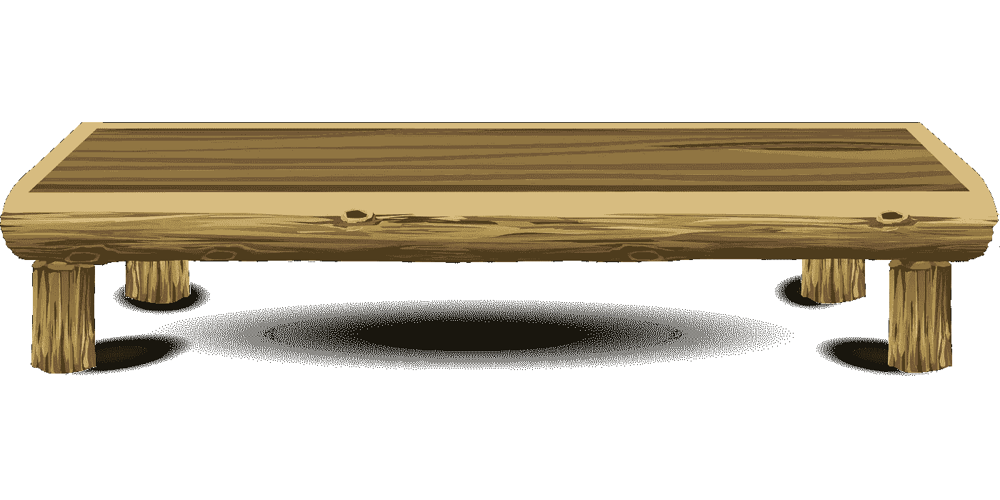
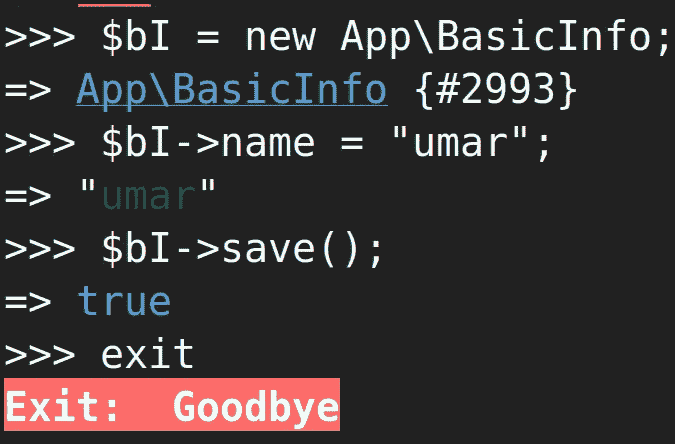

# Laravel 和 Vue:用 CRUD 管理面板创建作品集网站——第一章

> 原文：<https://itnext.io/laravel-and-vue-creating-a-portfolio-website-with-a-crud-admin-panel-ccc18409d5c2?source=collection_archive---------1----------------------->

如果你不知道 crud 是什么，请阅读 CRUD 介绍，否则跳到**第一章**。

 [## Web 开发:CRUD 基础介绍

### 什么是 CRUD？

medium.com](https://medium.com/@UmarCodes/web-development-basic-intro-to-crud-98bedf7ef46d) 

# 第一章:显示你的名字

想象创建一个文件夹或简历，你可以选择把你的名字放在文件夹中。你的名字是你投资组合中至关重要的**数据**。让我们从这里开始。

我要使用的方法包括以下四个步骤:

1.  你的名字在数据库表中
2.  路线上可用的名称数据
3.  接收 Vue 组件的脚本标签中的名称
4.  在 Vue 组件的模板标记中呈现名称


我们的数据将如何传播

## **1。你的名字在数据库表中**

这就是你要做的我们要把你的名字输入数据库。

我们需要一个**迁移**，一个**模型**和**修补程序**。迁移将**创建一个表**。该模型将声明表格的哪一列是**可填充的**。Tinker 将**将数据插入**可填充列。

**创建表格**


Paul Trienekens 在 [Unsplash](https://unsplash.com?utm_source=medium&utm_medium=referral) 上拍摄的照片

在 linux 终端或命令提示符下键入以下命令

```
php artisan make:migration **CreateBasicInfoTable**
```

在终端/ cmd 中键入上述命令将在 migrations 文件夹中生成一个文件。该文件的名称将以**create _ basic _ info _ table . PHP**结尾

该文件将有一个 **up** 功能，我们需要调整这个功能。

```
public function up()
 {
    Schema::create('basic_info', function (Blueprint $table) {
       $table->bigIncrements(‘id’);
       $table->timestamps();
    });
 }
```

在 up 函数中，您会发现:

```
Schema::**create**('basic_info', function (Blueprint $table)
```

该代码可用于**创建**一个名为 **basic_info 的数据库表。**

表中的列是这样创建的:

```
{
    $table->**bigIncrements**('**id**');
    $table->timestamps();
}
```

> **解释:**
> 
> ***big increments***是列的**数据类型***，而 ***id*** 是该列的**名称**；*将被创建的*。*
> 
> **timestamps()** 创建两列:`created_at`和`updated_at`

因为我们想在数据库中插入一个名字。我们应该加一栏一栏叫名字像这样:

```
$table->**string**('**name**');
```

我们最终会得到这样的结果:

```
{
    $table->bigIncrements('id');
    $table->string('name');$table->timestamps();
}
```

现在我们有了基本的信息迁移，我们可以在终端中运行:

```
php artisan migrate
```

如果你现在查看你的数据库程序(phpMyAdmin，sequeler 等)。)，您会发现一个名为 basic_info 的**表，包含这四列**

`*id*`**

> *表创建已完成。*

**

*空桌子*

*虽然已经创建了表，但是如果我们没有任何数据，它就没有任何用处。我们需要把数据放入这个表格。*

## *声明可以填充哪些列*

*是时候创建一个模型文件了*

```
*php artisan make:model BasicInfo*
```

*在 **app 文件夹里，**你会找到**BasicInfo.php**文件*

*这个文件需要一个**$可填充数组**。我们的**可填充数组**代码是*

```
*protected $fillable = ['name'];*
```

> ***说明:***
> 
> *我们要填充的列在$fillable 数组中。*
> 
> *在我们的例子中，我们只有一个想要自己填写的列。我们的其他三列是在我们填写姓名列时自动填写的。*

*对于$fillable 数组，模型是:*

*具有受保护的$fillable 数组的模型类*

## ***通过修补程序插入数据***

*Tinker 是一个命令行程序(基本上就是你可以在终端中输入更多的命令)。*

*在终端中键入以下内容以启动 tinker*

```
*php artisan tinker*
```

> *我们正在使用 php 工匠修补程序，因为我们处于基础阶段，还没有建立网站的管理方面*

**

*使用 php artisan tinker 插入数据*

***代码解释:***

```
***$bI = new App\BasicInfo;**This is to shorten **new App\BasicInfo;** to **$bI** for human convenience.**$bI->name = "umar"** This inserts **umar** into the name column**"umar" in green (or whichever colour is used in your system)** This is tinker replying to us meaning that it has recognised that you want to fill in the 'name column' with the text **umar****$bI->save()** Exactly what it says on the tin; it saves. If you dont use the save() function, anything you have done will be discarded.**"true" in blue** Data has been inserted without any problems**exit** This is used to exit tinker*
```

> ***迁移+模型+修补**过程已经填充到数据库中*

**

# *2.路线上可用的名称数据*

*我们需要创建一条路线，并确保它为我们提供数据。这意味着如果我在浏览器(chrome，firefox 等)中访问这条路线。)，我应该会看到我们之前通过 tinker 插入的数据。我们需要键入以下内容:*

**

```
*Route::get('/basicinfo', 'BasicInfoController@getBasicInfo');*
```

> *重要提示:api.php 中的路线会自动以/api 为前缀*

*让我们打开 **routes/api.php，**并输入上面的代码**。***

***路线代码解释:***

```
*We are going to get some information using a **function**. 
That function is contained in a **controller.** When we go to a **route**,the function contained in the controller should execute.
We will see data in our browser (chrome, firefox etc.).**/basicinfo**
The route where you want the information available**BasicInfoController** The file that contains the function we want to use**getBasicInfo** the function we want to use*
```

*让我们制作控制器。在终端中键入以下内容:*

```
*php artisan make:controller **BasicInfoController***
```

*我们现在在**app/Http/Controllers/basicinfocontroller . PHP**中有一个控制器文件*

*让我们在类中创建 **getBasicInfo** 函数:*

```
***public function getBasicInfo() {
      $BI = BasicInfo::all(); 
      return $BI;
}***
```

***代码解释:***

```
***$BI =** We have created a variable. It will Shorten **BasicInfo::all()****BasicInfo** BasicInfo is the model. The model is tied to our database table.**::all** gets an array made up of all the data.**return** Gives us what we want. In our case, give us whatever $BI equals. If $BI was equal to the number 42 ($BI = 42), we would get 42.* 
```

***排除可能的错误:***

> *找不到类“App\Http\Controllers\BasicInfo”*

*尝试转到路由，如果您得到这个错误，这意味着 Laravel 认为我们想要使用控制器目录中的文件。*

*在表示**的那一行之后使用 Illuminate \ Http \ Request**，我们需要输入 ***使用 App \ BasicInfo****

*这意味着我们将控制器链接到我们的模型。如果没有这一行，Laravel 会认为我们链接的是同一个目录中的文件。*

***简化***

*如果觉得函数太短不需要变量。您可以像这样直接返回数据:*

```
***return BasicInfo::all();***
```

> *无论你选择哪种方式，你都会得到一个数组。数组[]将包含一个对象{}。*

```
*<?phpnamespace App\Http\Controllers;use Illuminate\Http\Request;
**use App\BasicInfo;**
class basicInformationController extends Controller
{
 **public function getBasicInfo(Request $request) {
           return BasicInfo::all();** 
    **}**
}*
```

## ***我们走路线***

*我们的路线是 **/api/basicinfo** 我们现在将看到的是*

```
*[
  {
    "id": 1,
    "name": "umar",
    "created_at": "2019-10-11 08:38:51",
    "updated_at": "2019-10-11 08:38:51"
  }
]*
```

*是时候进入第三步了。在我们这样做之前，让我们通过添加**【0】**来确保我们只得到内部对象。*

```
*return BasicInfo::all()**[0];***
```

*我们得到:*

```
*{
    "id": 1,
    "name": "umar",
    "created_at": "2019-10-11 08:38:51",
    "updated_at": "2019-10-11 08:38:51"
}*
```

***附注:** [0]获取数组中的第一个对象，因为计算机从 0 开始计数。*

> *我们在这个表中只需要一个对象，在接下来的章节中我们将限制这个表只有一行。*
> 
> *该名称现在可作为路线上的数据使用。*

**

## *3.接收 Vue 组件的脚本标签中的数据*

*我们需要创建一个普通的路由(也就是没有 **/api** 前缀的路由)。让我们打开**web.php**(从 routes 文件夹)**，**我们可以看到在访问/ route 时，欢迎视图被返回(在 **resources/views** 文件夹中找到)*

```
*Route::*get*('/', *function* () {
    **return view('welcome');**
});*
```

*这里我们需要创建一个刀片文件(或者只使用 welcome.blade.php ),并在和标签之间输入以下代码*

```
*<div id="app"></div>
<script *src*="{{ asset('js/app.js') }}"></script>*
```

> *上面的脚本标记引用了公共文件夹中的一个文件。 **public/js/app.js** 是在 **resources/js/** 中找到的 app.js 的编译。*

*所以我们编写 **resources/js/app.js** 文件，然后**编译器**就会运行。这将产生 **public/js/app.js** ，这就是我们的刀片文件所链接的内容。*

## ***让我们试写文件***

*打开 **resources/js/app.js，**注释掉第一行，键入 console.log("something ")*

```
**// require('./bootstrap');* console.log("something");*
```

*通过在终端中运行来编译它，如下所示:*

```
*npm run watch*
```

*去你的浏览器控制台，如果你在控制台发现**的东西**，你的编译器正在工作。*

## ***我们好好写吧***

```
*require('./bootstrap');

window.Vue = require('vue');*const* app = *new* Vue({
    el: '#app',
});*
```

*检查您的浏览器控制台。如果你收到的 vue 消息是这样的，说明事情进展顺利*

> *您正在开发模式下运行 Vue。*

*创建一个组件文件(App.vue)。导入并渲染它。*

```
*require('./bootstrap');

window.Vue = require('vue');***import* App *from* './App.vue';***const* app = *new* Vue({
    el: '#app',
    **render: h => h(App),**
});*
```

*App.vue:*

```
*<template>
    <div>

    </div>
</template>

<script>
    *export default* {
        name: "App",

        **mounted() {** *this*.getBasicInfo(); **},
        methods: {** getBasicInfo() {
                axios.get('/api/basicinfo')
                    .then(response => {
                        console.log(response.data);
                    })
                    .catch(error => {
                        console.log(error);
                    });
            }, **},**
    }
</script>

<style *scoped*>

</style>*
```

*您将在浏览器控制台中找到一个返回给您的 json 对象。*

## *将数据放入 Data()*

*在 App.vue 的脚本标签中，在**导出默认**内:*

```
*data() {
  return{
      name: ''
  }
},*
```

*在 Vue Devtools 扩展中查找，点击应用程序，在右边，你会找到**名称:“***

*将 getBasicInfo()方法更改为:*

```
*getBasicInfo() {
    axios.get('/api/basicinfo')
        .then(response => {
            console.log(response.data);
            **this.name = response.data.name;**
        })
        .catch(error => {
            console.log(error);
        });
},*
```

*现在查看 vue devtools 扩展，您会发现:*

***名称:【乌玛】***

**

## *4.在 Vue 组件的模板标签中呈现数据*

*将模板标签更改为*

```
*<template>
    <div>
        **{{name}}**
    </div>
</template>*
```

## ***{{data}}将呈现在 data()** 中找到的匹配数据*

*进入 **/** 路线，你会在页面上找到你的名字。*

*查看 inspect 元素，您会发现来自 vue 组件的 div 出现在代码中。*

*既然我们已经了解了如何渲染基本数据，我们可以在第二章的**中继续上传图像。***

***[](/laravel-and-vue-creating-a-portfolio-website-with-a-crud-admin-panel-92b4017df57e) [## Laravel 和 Vue:用 CRUD 管理面板创建作品集网站

### 第二章—图像上传和显示

itnext.io](/laravel-and-vue-creating-a-portfolio-website-with-a-crud-admin-panel-92b4017df57e)*