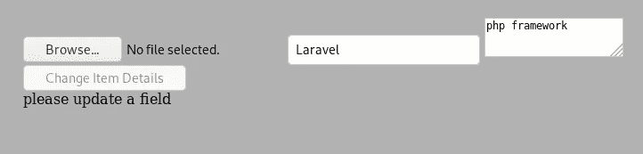
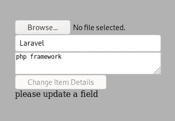
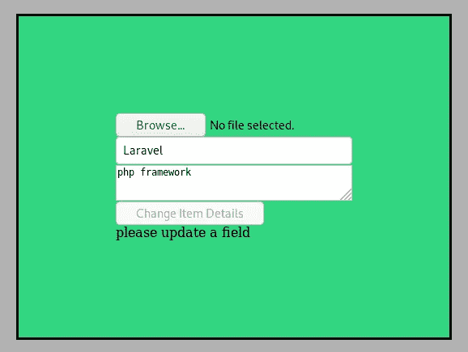
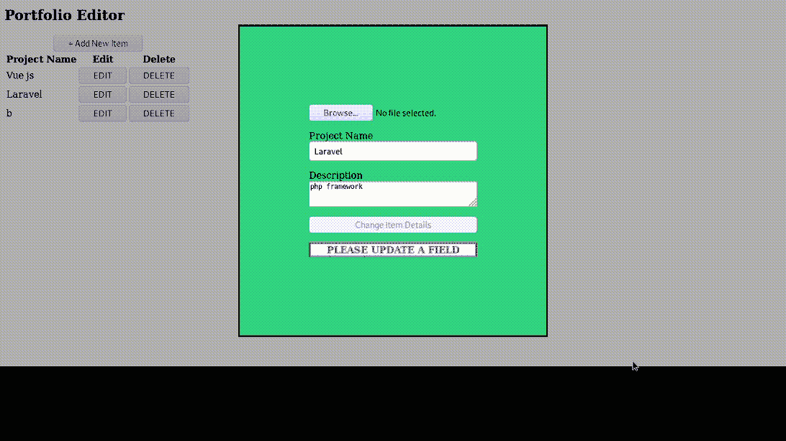
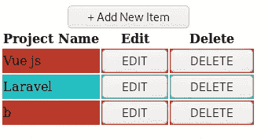
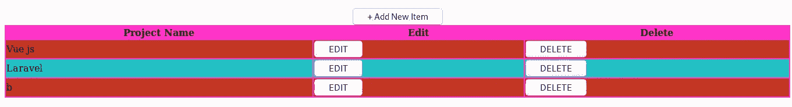
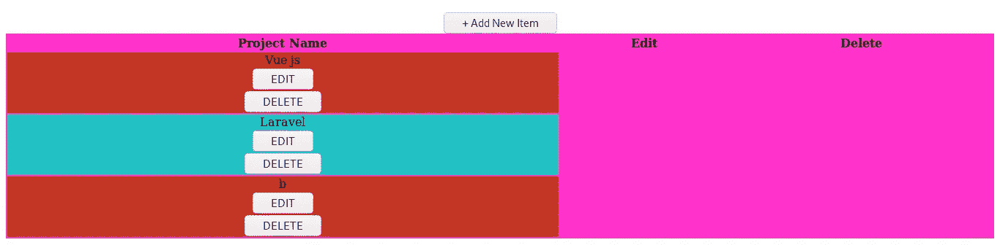
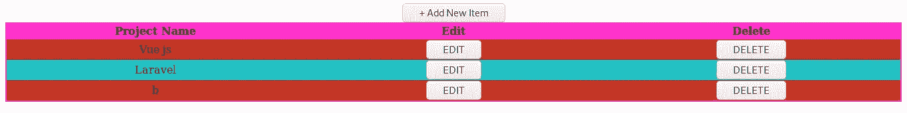
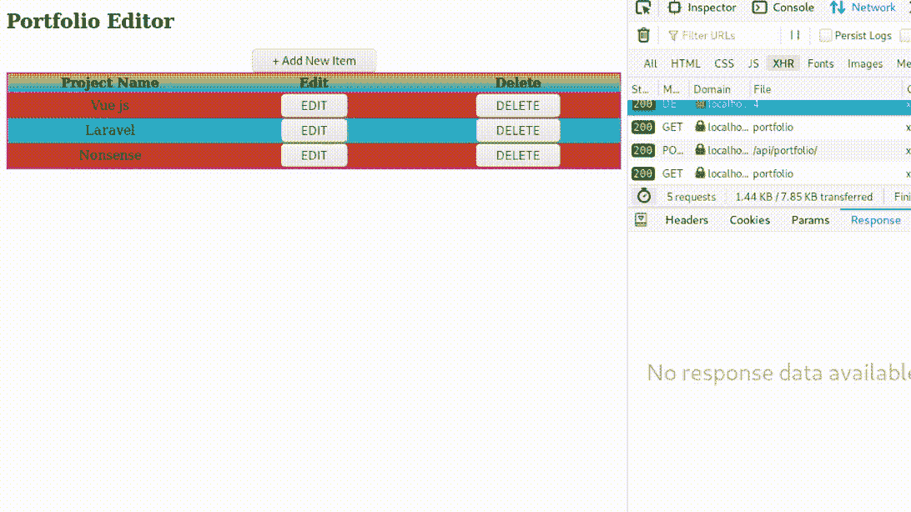

# Laravel 和 Vue:用 CRUD 管理面板创建作品集网站——第 11 章

> 原文：<https://itnext.io/laravel-and-vue-creating-a-portfolio-website-with-a-crud-admin-panel-chapter-11-20445acf83bb?source=collection_archive---------3----------------------->

## PortfolioEditor —添加模板，完成更新功能和实现删除功能

# Building AddItemModal.vue

## 点击后弹出

现在，当您单击“添加”按钮时没有任何反应，我们需要调用一个方法来显示单击“添加”按钮时的 addItemModal。

```
<caption><button ***@click*="p.addItemPopup()"**>+ Add New Item</button></caption>
```

在 PortfolioEditor.vue 方法中:

```
addItemPopup() {
    *if* (*this*.addItemModal === *false*) {
        *this*.addItemModal = *true*;
    }
    *else if* (*this*.addItemModal === *true*) {
        *this*.addItemModal = *false*;
    }
},
```

应在 PortfolioEditor.vue 脚本数据()中将 addItemModal 设置为`**false**`

```
data() {
    *return* {
        items: '',
        updateItemModal: *false*,
        **addItemModal: *false*,**
        item: ''
    }
},
```

我们需要创建 addItemModal 组件并使用`**v-if**`

```
<section>
    <h1>Portfolio Editor</h1>
    <update-item-modal *v-if*="updateItemModal" *:item*="item"/>
    **<add-item-modal *v-if*="addItemModal"/>**
    <portfolio-editor-table *:items*="items"/>
</section>
```

在 PortfolioEditor 的脚本中导入它

```
*import* addItemModal *from* './addItemModal';
```

在组件中注册它

```
components: {
    portfolioEditorTable, updateItemModal, addItemModal
},
```

现在我们已经导入并注册了组件，我们可以开始构建组件本身了

## addItemModal.vue 组件👇

模板标签:

```
<template>
    <transition *name*="fade">
        <div *id*="my-modal" *@click*="closeModal" *class*="modal">
            <div *class*="modal-body">
                <modal-form>

                </modal-form>
            </div>
        </div>
    </transition>
</template>
```

导入并注册模式表单

```
<script>
    *import* modalForm *from* "./modalForm";
    *export default* {
        name: 'addItemModal',
        components: {
            modalForm
        },
      }
</script>
```

我们需要使用类似于 updateItemModal 的 closeModal 的方法来关闭这个 modal

```
//updateItemModal.vue closeModalcloseModal(event) {
    *if* (event.target.matches('.modal')) {
        *this*.$parent.updateItemModal = *false*;
    }
},//addItemModal.vue closeModal
closeModal(event) {
    *if* (event.target.matches('.modal')) {
        *this*.$parent.**addItemModal** = *false*;
    }
},
```

表单本身在父组件中调用`**selectFile()**`。这次父方法是 **addItemModal.vue** ，所以我们需要 addItemModal.vue 中的`**selectFile**`方法

```
//addItemModal methods
selectFile(event) {
    *this*.file = event.target.files[0];
},
```

addItemModal()数据中的`**name**`、`**description**`、`**file**`和`**disabled**`

```
data() {
    *return* {
        **disabled**: *true*,
        **name**: '',
        **file**: '',
        **description**: ''
    }
},
```

为了填充**提交**和**验证**的槽，我们需要一个添加按钮和一个 div。

```
<template>
    <transition *name*="fade">
        <div *id*="my-modal" *@click*="closeModal" *class*="modal">
            <div *class*="modal-body">
                <modal-form>
                    **<button *slot*="submit" *@click.prevent*="add" *:disabled*="disabled">add</button>
                    <div *slot*="validation">{{validation}}</div>**
                </modal-form>
            </div>
        </div>
    </transition>
</template>
```

添加按钮应该运行`**add()**`方法

```
appendFormData() {
    *let* fd = *new* FormData();
    fd.append('itempic', *this*.file);
    fd.append('name', *this*.name);
    fd.append('description', *this*.description);
    *return* fd;
},
add() {
    *let* fd = *this*.appendFormData();
    axios.post('api/portfolio/',fd)
},
```

`**validation()**`计算方法可以从 PortfolioEditor.vue 中剪切并粘贴

```
computed: {
    validation(){
        *this*.disabled = *true*;
        *if* (*this*.name === '') {
            *return* 'please fill in the project name';
        }
        *if* (!*this*.file) {
            *return* 'please select an image';
        }
        *if* (*this*.file && !*this*.file.type.startsWith("image/")) {
            *return* 'file must be an image';
        }
        *else* {
            *this*.disabled = *false*;
            *return* ':)'
        }
    }
},
```

# 完成更新功能

我们需要添加验证消息，设计表单，并使更改后的数据立即出现在页面上。

## 添加验证消息

我们需要数据()返回中的`message`，它应该是一个空字符串( **''** )

```
data() {
    *return* {
        name: *this*.item.name,
        description: *this*.item.description,
        disabled: *true*,
        file: '',
        **message: ''**
    }
},
```

此消息应根据添加按钮是否被禁用而变化。

```
computed: {
    validation(){
        *let* i = *this*.item;
        *this*.disabled = !(*this*.name !== i.name || *this*.description !== i.description);
        ***if* (*this*.disabled === *false*) {
            *this*.message = 'you may now submit'
        }
        *else if* (*this*.disabled === *true*) {
            *this*.message = 'please update a field'
        }**
    }
},
```

将`**{{message}}**` 添加到验证槽的`**{{validation}}**`之后。

```
<div *slot*="validation">{{validation}}**{{message}}**</div>
```

现在让我们来设计表单。

## 设计表单

当前表单如下所示:



我们需要改进表单的外观。当前外观的第一个问题是布局不一致。不一致的布局来自**。form-input** div 因为包含了`**<textarea>**`和 textarea 元素，所以会产生不一致的布局。

为了具有一致的布局，我们应该向 updateItemModal.vue 添加以下样式

```
.form-inputs {
    display: flex;
    flex-direction: column;
}
```



在`**.modal-body**`外单击关闭模态(正如它应该做的那样)，但是模态体太小了(正如我们可以看到的，如果我们添加一个边框)。

```
.modal-body {
    border:solid;
}
```


我们现在需要将`**padding**`和`**background**`添加到`**.modal-body**`中

```
.modal-body {
    border:solid;
    **padding:120px;**
    **background: #31D581;**
}
```



让我们给每个输入一个标签，并用同一个类将它们分组到 div 中，这样 modalform.vue 的形式应该是这样的:👇

```
<form *enctype*="multipart/form-data">
    <div ***class*="form-group"**>
        <input *type*="file" *@change*="p.selectFile" *name*="itempic">
    </div>

    <div ***class*="form-group"**>
        **<label *for*="project-name">Project Name</label>**
        <input *id*="project-name" *type*="text" *@change*="disabled = *false*" *v-model*="p.name">
    </div>

    <div ***class*="form-group"**>
        **<label *for*="description">Description</label>**
        <textarea *id*="description" *placeholder*="description" *v-model*="p.description"/>
    </div> <div ***class*="form-group"**>
        <slot *name*="submit"/>
    </div> <div ***class*="form-group"**>
        <slot *name*="validation"/>
    </div>
</form>
```

让我们给表单组`**margin**` s，并使用`**grid**`堆叠表单组

```
.form-group {
    display:**grid**;
    **margin**: 1em 0;
}
```

条件样式——现在我们需要根据前面的验证是否通过来样式化误差条。

将`<div class=”errorBar”`更改为以下内容:

```
<div ***:class*="[ formIsValid ? 'errorBarValid' : 'errorBarInvalid' ]**" *slot*="validation">{{validation}}{{message}}</div>
```

这意味着如果`**formIsValid**`是`**true**`，那么从 style 元素中应用`**errorBarValid**`。如果`**formIsValid**`为假，则应用`**errorBarInvalid**`。

```
TrueOrFalse ? 'TRUE STYLE' : 'FALSE STYLE' 
```

在 updateItemModal.vue 的 data()中将 formIsValid 设置为 false

```
data() {
    *return* {
        name: *this*.item.name,
        description: *this*.item.description,
        disabled: *true*,
        file: '',
        message: '',
        **formIsValid: *false*,**
    }
},
```

修改验证方法以包括 formIsValid

```
validation(){
    *let* i = *this*.item;
    *this*.disabled = !(*this*.name !== i.name || *this*.description !== i.description);
    *if* (*this*.disabled === *false*) {
        *this*.message = 'you may now submit';
        ***this*.formIsValid = *true***}
    *else if* (*this*.disabled === *true*) {
        *this*.message = 'please update a field';
        ***this*.formIsValid = *false***}
}
```

让我们写风格

```
.errorBarInvalid {
    color:red;
    background: white;
    border: red solid;
    text-align: center;
    text-transform: uppercase;
    font-weight: bolder;
}.errorBarValid {
    color:green;
    background: white;
    border: green solid;
    text-align: center;
    text-transform: uppercase;
    font-weight: bolder;
}
```

现在我们有了



**我们也来设计一下桌子**

如果表格的行有交替的背景色，表格会更容易阅读。我们应该设计表格，使奇数行和偶数行具有不同的颜色(英式拼写)或`**color**` (CSS 拼写)。

```
tbody tr:nth-child(odd) {
    background-color: rgb(195, 55, 37);
}

tbody tr:nth-child(even) {
    background-color: rgba(34,193,195,1);
}
```



表格应该有一个**背景色**和 100%宽度；

```
table {
    background-color: #ff33cc;
    width: 100%;
}
```



每个`**<td>**`的内容都应该出现在中心

```
td {display: flex; justify-content: center; align-items: center}
```



每个表格行应该是包含 3 个相等列的网格

```
tr {display: grid; grid-template-columns: repeat(3, 1fr)}
```



可选地，我们可以添加一个线性渐变到顶行

```
thead tr {
 background: linear-gradient(0deg, rgba(34,193,195,1) 0%, rgba(253,187,45,1) 100%);
 }
```


## **使更改后的数据立即出现在页面上**

我们需要更改更新函数，以便在提交后，updateItemModal 被关闭。

```
update(item) {
    *let* fd = *this*.appendFormData();
    axios.post(`api/portfolio/${item.id}`,fd).then(
        *this*.$parent.**updateItemModal** = *false* )
},
```

数据被提交和更改，如果其中有错误，我们需要记录错误对象的响应数据。

```
update(item) {
    *let* fd = *this*.appendFormData();
    axios.post(`api/portfolio/${item.id}`,fd).then(
        *this*.$parent.updateItemModal = *false* )**.catch(error => *alert*(error.response.data))**
},
```

关闭模式后立即重新加载数据。

```
update(item) {
    *let* fd = *this*.appendFormData();
    axios.post(`api/portfolio/${item.id}`,fd).then(
        *this*.$parent.updateItemModal = *false* ).catch(error => *alert*(error.response.data))
    **.finally(*this*.$parent.getPortfolio())**
},
```

应该对 addItemModal 的 add 函数进行类似的修改，但这次我们将 **addItemModal** 设置为 false，而不是 updateItemModal。

```
add() {
    *let* fd = *this*.appendFormData();
    axios.post('api/portfolio/',fd)
        .then(*this*.$parent.addItemModal = *false*)
        .catch(error=>console.log(error.response.data))
        .finally(*this*.$parent.getPortfolio())
},
```

现在，我们可以添加和编辑项目，但不能删除项目。让我们继续努力。

# 实现删除功能

我们需要理解用户可能会误点击删除，所以我们需要一个**确认模式**来实现。**如果用户点击**是，数据应该得到**从数据库表中删除** d，如果用户点击否，确认模式应该消失/隐藏/消失等。

## 确认模式

删除按钮应该能够在父组件中调用它的方法。

```
<button *@click*="p.deleteItem(item)">DELETE</button>
```

父组件中的 delete 方法

```
deleteItem(item) {
    *this*.item = item;
    *this*.confirmDeleteModal = *true*;
}
```

我们应该创建 confirmDeleteModal.vue 文件

*   导入确认删除模式

```
*import* confirmDeleteModal *from* './confirmDeleteModal';
```

*   将 **confirmDeleteModal** 添加到组件模块

```
components: {
    portfolioEditorTable, updateItemModal, addItemModal, **confirmDeleteModal**
},
```

*   将**确认-删除-模态**添加到 PortfolioEditor.vue 的模板中

```
<section>
    <h1>Portfolio Editor</h1>
    **<confirm-delete-modal *v-if*="confirmDeleteModal" *:item*="item"/>**
    <add-item-modal *v-if*="addItemModal"/>
    <update-item-modal *v-if*="updateItemModal" *:item*="item"/>
    <portfolio-editor-table *:items*="items"/>
</section>
```

*   将 confirmDeleteModal 添加到`data()` `return` 中，并将其设置为`**false**`

```
data() {
    *return* {
        items: '',
        updateItemModal: *false*,
        addItemModal: *false*,
        **confirmDeleteModal: *false*,**
        item: ''
    }
},
```

confirmDeleteModal 文件为空。让我们来构建组件。

这与其他模式具有相同的总体布局；区别在模态体内部。

```
<template>
    <transition *name*="fade">
        <div *id*="my-modal" *style*="border: solid; z-index: 1" *class*="modal">
            <div *class*="modal-body">
                **<h1>Delete <b *style*="color:red">{{item.name}}</b> from your portfolio?</h1>
                <div *class*="btn-row">
                    <button *@click*="confirm">Yes</button>
                    <button *@click*="cancel">No</button>
                </div>**
            </div>
        </div>
    </transition>
</template>
```

我们应该添加一个包含`**item**`的道具块

```
props: {
  **item**: '',
},
```

**代码和布局说明:**

*   向 h1 询问确认问题
*   `**{{item.name}}**`从作为道具传递的`**item**`物品中获取物品名称
*   `**{{item.name}}**`与其余的`**h1**`有所不同`**color**`
*   `**{{item.name}}**`是加粗使用`**<b></b>**` 标签
*   我们有一排按钮，每个按钮都有自己的方法
*   是按钮运行`**confirm()**`动作
*   没有按钮运行`**cancel()**`动作

## 如果用户点击“是”

我们应该将确认方法添加到 confirmDeleteModal 中

```
confirm() {
    axios.delete(`api/portfolio/${*this*.item.id}`).then(
        *this*.$parent.confirmDeleteModal = *false* ).then(
        *this*.$parent.getPortfolio();
    )
},
```

现在我们需要一个相应的 api 路由链接到 PortfolioController 的 destory 函数

```
Route::*delete*('/portfolio/{id}', 'PortfolioController@destroy');
```

毁灭功能

```
*public function* destroy($id) {
    PortfolioItem::*where*('id',$id)->delete();
}
```



## 如果用户点击“否”

这里我们可以添加一个非常简单的方法来确认删除模式

```
cancel() {
    *this*.$parent.confirmDeleteModal = *false*;
}
```

## 列出清单—第 11 章结束

我们可以从列表中勾掉更新和删除功能。

*   前端验证(用于更新 functionality)☑️
*   后端验证(用于更新 functionality)☑️
*   更新和删除 functionalities☑️

—

*   重构组合控制器

—

*   带文本的图像(Portfolio.vue)
*   具有更大图像和描述的模型(Portfolio.vue)
*   modal (Portfolio.vue)上的关闭按钮

在第 12 章，我们将重构 PortfolioController。

[](/laravel-and-vue-creating-a-portfolio-website-with-a-crud-admin-panel-chapter-12-f35917a9d5c8) [## Laravel 和 Vue:用 CRUD 管理面板创建作品集网站——第 12 章

### 重构组合控制器

itnext.io](/laravel-and-vue-creating-a-portfolio-website-with-a-crud-admin-panel-chapter-12-f35917a9d5c8)