# Laravel 和 Vue:用 CRUD 管理面板创建作品集网站——第 13 章

> 原文：<https://itnext.io/laravel-and-vue-creating-a-portfolio-website-with-a-crud-admin-panel-chapter-13-981b0cc36c34?source=collection_archive---------1----------------------->

## 建立投资组合的公共视图

我们可以通过使用投资组合编辑器添加新项目来建立我们的投资组合；我们添加项目，它们出现在 PortfolioEditorTable 中，但这不是公众应该查看投资组合的方式。

我们需要公共视图有一个**组合** **画廊。**

在此之前，让我们确保 App.vue 中有以下样式

```
<style *id*="temporary">
 #app {
     display: grid;
     grid-auto-flow: column;
 }
 img {
      max-width: 100%;
       height: auto;
  }
</style>
```

如果这些样式不在文件中，我们应该添加它们。

现在我们在`**<script>**`中导入一个组件

```
*import* Portfolio *from* './Portfolio';
```

将**投资组合**添加到组件模块

```
components: {
    PortfolioEditor, 
    **Portfolio**
},
```

将<portfolio>添加到模板</portfolio>

```
<template>
    <div *id*="app">
        <PortfolioEditor/>
        **<Portfolio/>**
    </div>
</template>
```

我们现在应该创建 **Portfolio.vue** 和 **portfolio gallery。**

# **作品集图库**

在 Portfolio.vue 的`<script></script>`中，我们需要一个方法来获取 Portfolio 项。这与我们在 Portfolio Editor 中获取项目的方法相同。我们接收到相同的数据，但显示方式不同(表格与图库)。

让我们遵循从路线渲染数据的通常步骤。

## 通常的步骤

1.  `**methods**`
2.  `**mounted**`
3.  `**data()**`
4.  `**<tempate>**`

```
methods: {
    getPortfolio() {
        axios.get('/api/portfolio')
            .then(response => {
                *this*.items = response.data;
            })
            .catch(error => {
                *console*.log(error);
            });
    },
}
```

就像 PortfolioEditor 一样，我们在`**mounted**`块中调用该方法，以便在 web 浏览器中呈现 portfolio.vue 文件时获取数据。

```
mounted() {
  *this*.getPortfolio();
},
```

让我们将`items`放在 data()返回对象中

```
data() {
    *return* {
        items: '',
    }
},
```

呈现模板标签中的`items`

```
<template>
    <section *id*="portfolio">
        {{items}}
    </section>
</template>
```

我们有一个 JSON 对象像往常一样显示在 web 浏览器中。

现在，我们需要使用 v-for 循环来呈现名称和 img_path

## v-for 循环

v-for 循环应具有:

1.  `**<figure>**` 元素列表
2.  每一项的`**name**`
3.  每个项目的`**img_path**`

```
<main>
    **<figure *v-for*="item *in* items">
        <p>{{item.name}}</p>
        <p>{{item.img_path}}</p>
    </figure>**
</main>
```

我们可以使用`**v-bind**`渲染图像，就像我们创建报头时一样

## 使用 v-bind 渲染图像

在这里呈现图像和报头的区别在于图像来自不同的文件夹。文件夹是`**storage/itempics/small/**`

```
<figure *v-for*="item *in* items">
    <p>{{item.name}}</p>
    **<̶p̶>̶{̶{̶i̶t̶e̶m̶.̶i̶m̶g̶_̶p̶a̶t̶h̶}̶}̶<̶/̶p̶>**̶
    ****
</figure>
```

让我们重新排列代码，使 item.name 位于 img 标签下面

```
<figure *v-for*="item *in* items">
    
    <p>{{item.name}}</p>
</figure>
```

## 图像不应大于父元素

```
img {max-width: 100%; height: auto;}
```

如果图像比它们所在的元素大，它们将调整到它们所在元素的高度和宽度。

现在我们有了一个类似这样的页面:

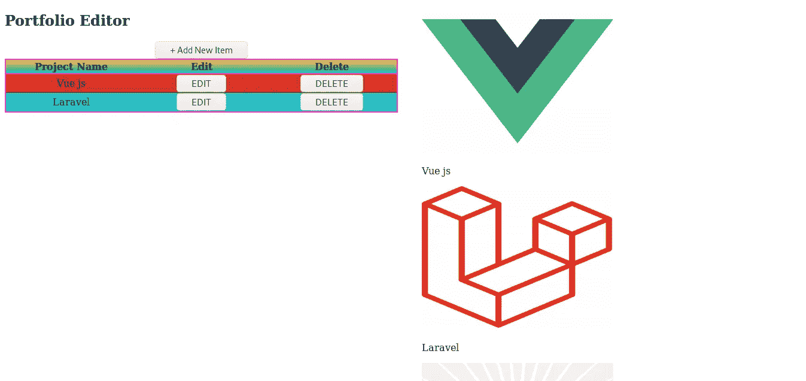

## 式样

每个图形都应该有边框

```
<style *scoped*>
    figure {
        border: solid;
    }
</style>
```

让我们使用 flexbox 来拟合一行中的数字。数字在`**#portfolio-gallery**`

```
<style *scoped*>
    **#portfolio-gallery {
        display:flex;
    }**
    figure {
        border:solid;
    }
</style>
```

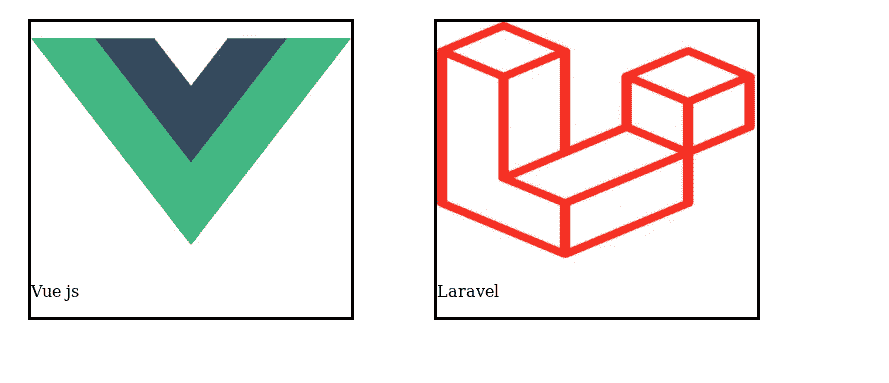

如果没有空格，我们使用`**flex-wrap:wrap**` **将数字换行。**这有助于提高画廊的响应能力。

```
#portfolio-gallery {
    display:flex;
    **flex-wrap: wrap;**
}
```

我们希望**文本在图像的前面。为此，我们必须将`figure`的`width`和`height`设置为与图像的宽度和高度相同。我们的图像是 **320px** 乘 **240px** ，所以让我们应用这个宽度和高度**

```
figure {
    border:solid;
    **width:320px; 
    height:240px;**
}
```

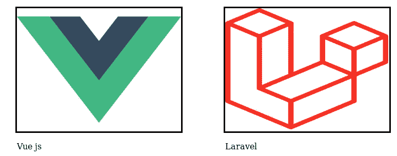

现在商品名称已经超出了边界。

虽然**项目名称**是`**figure**`元素的一部分，但从视觉上看，情况不再如此。

要将文本放在图像之上，图像和文本都需要有相同的类；让我们把这个类叫做**卡片——内容:**

```

<p ***class*="card-content"**>{{item.name}}</p>
```

在`**style**`标签中，我们需要

```
.card-content{position: absolute;}
```

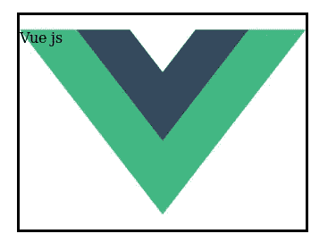

我们想把这个**文本**放到`**figure**`的`**center**`里，做成`**white**`，并给它一个背景。

问题是 p 元素的宽度和高度与图像或图形不同。我们可以给`**p**` 元素相同的宽度和高度，但问题是如果我们决定改变图形的宽度和高度，我们就必须改变文本元素的宽度和高度。

为了避免这种麻烦，我们可以将`**width:100%;height:100%**` 应用到**。卡片内容**。

```
.card-content{ **width: 100%;
    height: 100%;**
    position: absolute;}
```

然而，这具有灾难性的影响:

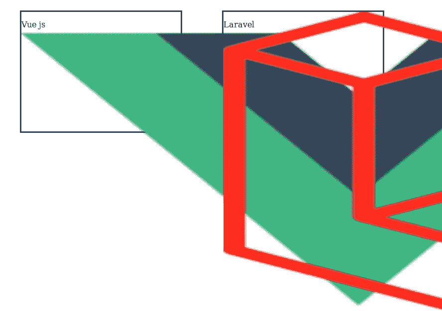

正在发生的是，自从**。卡片内容**被设置到**位置:绝对**，它接管页面。

什么能阻止这次收购？

答案是**父元素**

我们可以简单地将父元素设置为**位置:相对**

```
figure {
    border:solid;
    width:320px;
    height:240px;
    position: relative;
}
```

现在我们使用`**width:100%;height:100%**`没有视觉上的崩溃。

让我们改进代码:

**代码改进**:我们可以赋予图形元素**卡片**的类，将`**style**`中的`**figure**`改为`**.card**`

```
<figure *v-for*="item *in* items" ***class*="card"**>
    
    <p *class*="card-content">{{item.name}}</p>
</figure>**f̶i̶g̶u̶r̶e̶** .card {
    border:solid;
    width:320px;
    height:240px;
    position: relative;
}
```

**为什么这个代码比较好？**我们可能会选择再次使用`**figure**`，但不是相同的样式，所以如果我们通过类而不是标记名来设计元素的样式，这是更好的代码实践。

再加几个项目吧。我们可以使用我们为此制作的文件夹编辑器😄

一旦我们添加了项目，我们可以从 App.vue 中移除或注释掉 PortfolioEditor

```
<div *id*="app">
    **<̶P̶o̶r̶t̶f̶o̶l̶i̶o̶E̶d̶i̶t̶o̶r̶/̶>̶**
    <Portfolio/>
</div>
```

现在我们有了类似这样的东西:

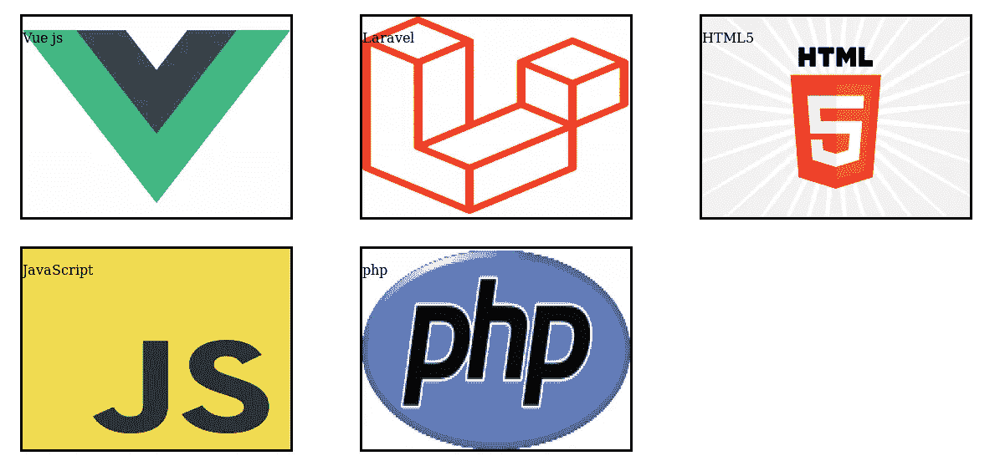

你可以看到我们有**空白空间**。这是因为`**flex-wrap: wrap;**`在可视网页中创建了**行**，一旦所有的项目(五个项目)都被显示出来，这一行就没有其他东西可以显示了。

我们来解决这个问题。

为了解决这个问题，我们可以使用`**flex-grow:1**` **。**如**属性名**所示，`**flex-grow**`使柔性项目变大。**值** `**1**`表示是，而**值** `**0**`表示否

```
.card {
    border:solid;
    width:320px;
    height:240px;
    position: relative;
    **flex-grow: 1**
}
```

现在我们来看看投资组合。看起来是这样的:

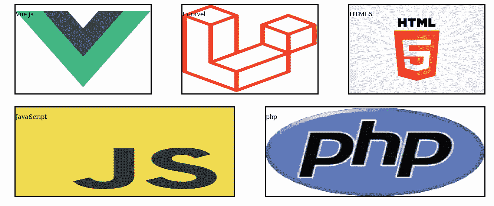

这里有好有坏。

**好:**两排都是**等横排**。

**不好:**它拉长了图像，从而使其外观变得更差。

我们可以创建一个包含图像元素的元素。我们将 **card-content** 类应用于该元素。这样，图像不会被拉伸，而是它所在的元素会被拉伸。

```
<figure *v-for*="item *in* items" *class*="card">
    **<div *class*="card-content">**
        
    **</div>**
    <p *class*="card-content">{{item.name}}</p>
</figure>
```

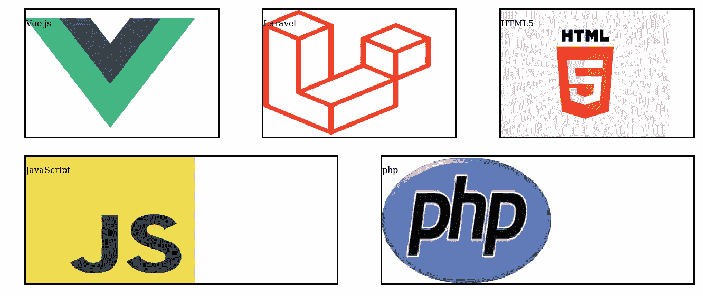

通过将 **flex-center** 类添加到包含的 div 中，可以使图像居中。

```
<div class="card-content **flex-center**">
     </div>.flex-center {
*display*: flex; *justify-content*: center; *align-items*: center
}
```

并且我们可以让文本出现在`**figure**` / **的底部。使用水平居中元素**的`**justify-content:center;**`和垂直居中元素**的`**align-items: flex-end**` 卡**元素。

```
.card p {
*display*: flex; *justify-content*: center; *align-items*: **flex-end**
}
```

文字会在卡片下面，因为它有一个`**margin**`。我们需要将边距设置为`**0**`

```
.card p {
*display*: flex; *justify-content*: center; *align-items*: end**; margin: 0**
}
```

我们也可以使用**字体大小**和**透明背景颜色**使用 **rgba**

```
.card p {*display*: flex;*justify-content*: center;*align-items*: flex-end;*margin*: 0;***font-size*: 3em;*****background*:rgba(244,200,3,0.5);**}
```

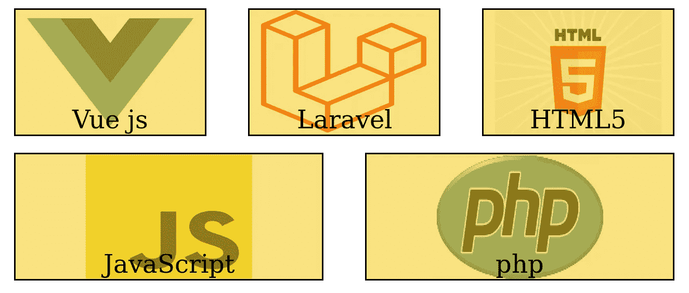

**优点**:居中的图像、大小相等的行、相同的背景色提供了一种“观感”。

**问题:**背景色可能会干扰图片内的颜色。此问题的一个示例如下:

## **rgba 背景色问题**

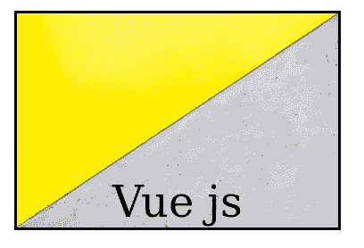

图像可能看起来像这样，但由于添加了透明背景色(即 rgba)，它可能会变成这样:

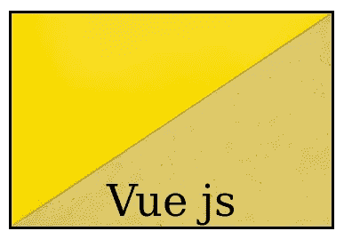

解决这个问题的方法是将文本放入元素中，并将 **card-content** 类应用于该元素。

```
<div **class="card-content"**> <p **c̶l̶a̶s̶s̶=̶"̶c̶a̶r̶d̶-̶c̶o̶n̶t̶e̶n̶t̶"̶**>{{item.name}}</p></div>
```

问题是它会将文本放在顶部，这可能是不可取的:

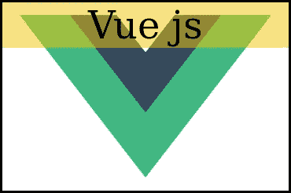

这是因为我们从`**p**`元素中移除了**卡片内容**类，因此`**p**`已经回到了它的初始`**height**`。`**width**`仍然是`**100%**` ，因为子元素继承了父元素的宽度(除非父元素有`**display:flex**` 或`**display:grid)**`)。

我们需要将文本放在卡片的底部，所以我们需要将 flexbox 样式应用到它的父元素。

```
<div class="card-content **card-text-container**"> <p>{{item.name}}</p></div>.card-text-container {***display*: flex; *justify-content*: center; *align-items*: flex-end;**}
```

现在，因为我们已经对父元素应用了 display:flex，所以 p 有了它原来的宽度

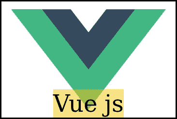

让我们将`**p**`的宽度设置为`**100%;**` 并移除 flex 样式，因为不再需要它们(因为我们在父对象上使用 flexbox)。

```
.card p {***width*:100%;****d̶i̶s̶p̶l̶a̶y̶:̶ ̶f̶l̶e̶x̶;̶****j̶u̶s̶t̶i̶f̶y̶-̶c̶o̶n̶t̶e̶n̶t̶:̶ ̶c̶e̶n̶t̶e̶r̶;̶****a̶l̶i̶g̶n̶-̶i̶t̶e̶m̶s̶:̶ ̶f̶l̶e̶x̶-̶e̶n̶d̶;̶***margin*: 0;*font-size*: 3em;*background*:rgba(244,200,3,0.5);}
```

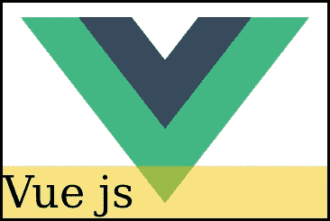

为了使文本居中，我们可以使用`**display:flex; justify-content:center**`或`**text-align:center**` ，因为我们可以用更少的代码来完成工作，所以让我们使用更少的代码版本来做事

```
.card p {
*width*:100%;
**text-align:center;** *margin*: 0;
*font-size*: 3em;
*background*:rgba(244,200,3,0.5);
}
```


问题是，卡片的宽度可能不相等，就像这样:

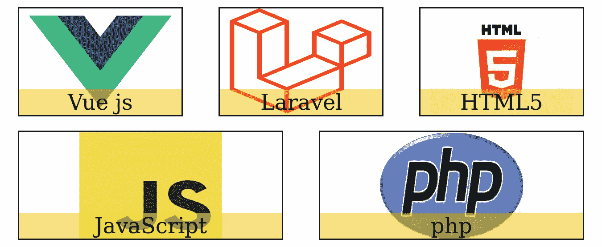

要解决这个，我们可以换**。卡片内容** `**width**`到`**320px**`即图像的宽度。

```
.card-content{
    **w̶i̶d̶t̶h̶:̶ ̶1̶0̶0̶%̶;̶
    width: 320px;**
    height: 100%;
    position: absolute;
}
```

我们现在可以给**添加一个边框。卡片内容**并从**移除边框。卡片**

```
.card { **b̶o̶r̶d̶e̶r̶:̶s̶o̶l̶i̶d̶;̶**
    ...
}.card-content{
    **border: solid;**
    width: 320px;
    height: 100%;
    position: absolute;
}
```


## 代码摘要

这些样式是:

```
#portfolio-gallery {display: flex; flex-wrap: wrap}
.card {
    display: flex; justify-content: center;
    width: 320px; height: 240px;
    position: relative; flex-grow: 1;
}
.card-text-container p {
    margin: 0; font-size: 3em; background-color: rgba(244,200,3,0.5);
    width: 100%; text-align: center;
}
.card-content {
    border: solid; width:320px;height: 100%; position: absolute;
}
.flex-center {
    display: flex; justify-content: center; align-items: center;
}
.card-text-container {
    display: flex; justify-content: center; align-items: flex-end;
}
```

`**<template>**`中的代码是这样的:

```
<section *id*="portfolio">
    <main *id*="portfolio-gallery">
        <figure *v-for*="item *in* items" *class*="card">
                <div *class*="card-content flex-center">
                    
                </div>
                <div *class*="card-content card-text-container">
                    <p>{{item.name}}</p>
                </div>
        </figure>
    </main>
</section>
```

让我们用更短的代码构建同样的东西

# 作品集——替代方法

我们需要什么:

*   作品集应该使用柔性包装
*   背景中的图像
*   卡片底部的文字
*   内容周围的边框
*   项目应该**增长**

**作品集图库应使用 flex-wrap :**

```
#portfolio-gallery {display: flex; flex-wrap: wrap}
```

**背景中的图像**——我们可以简单地将背景图像绑定到文本(`**p class="itemName")**`元素)的父元素，而不是使用两个类为 **card-content 的元素。**

```
<main *id*="portfolio-gallery">
    <figure *v-for*="item *in* items">
        <div ***:style*="'background:url(storage/itempics/small/' + item.img_path + ');'"** *class*="itemNameParent">
            <p *class*="itemName">{{item.name}}</p>
        </div>
    </figure>
</main>
```

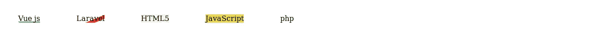

最初，元素只和它们的内容一样大。这意味着文本的父元素只和文本一样大，所以我们需要自己设置父元素的宽度和高度。itemNameParent 的宽度和高度应该与图像的`**width**`和`**height**`相同。

```
.itemNameParent {width: 320px; height: 240px;}
```

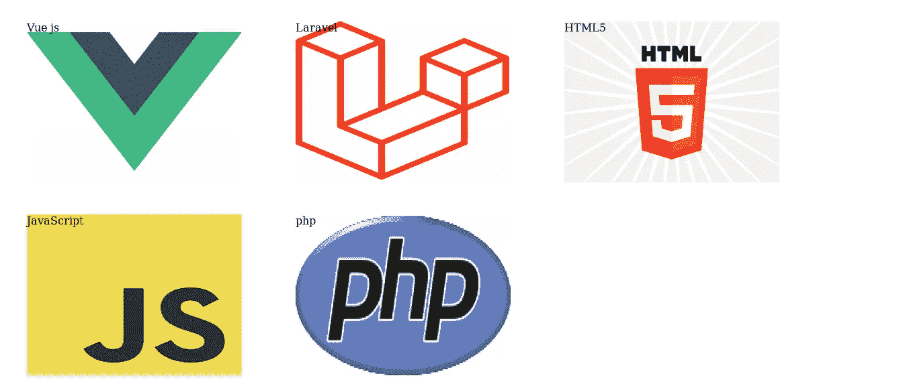

**底部文本:**我们可以使用 flexbox，并使用`**flex-end**`将项目对齐到最后

```
.itemNameParent {
    width: 320px; height: 240px; 
    **display: flex; align-items: flex-end**
}
```

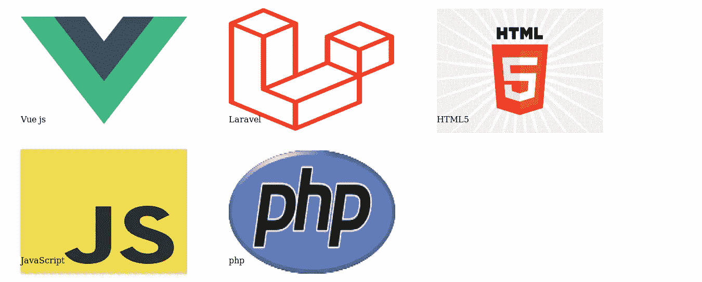

**内容周围的边框:**

```
.itemNameParent {
    width: 320px; height: 240px;
    display: flex; align-items: flex-end;
    **border: solid;**
}
```

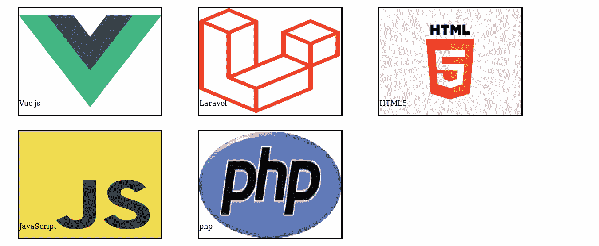

**物品应该增长:**

这里我们要给图元素一个类的**项**:

```
<figure *v-for*="item *in* items" *class*="**item**">...</figure>
```

我们制造了。使用 flex-grow 的灵活项目:

```
.item {flex-grow: 1;}
```

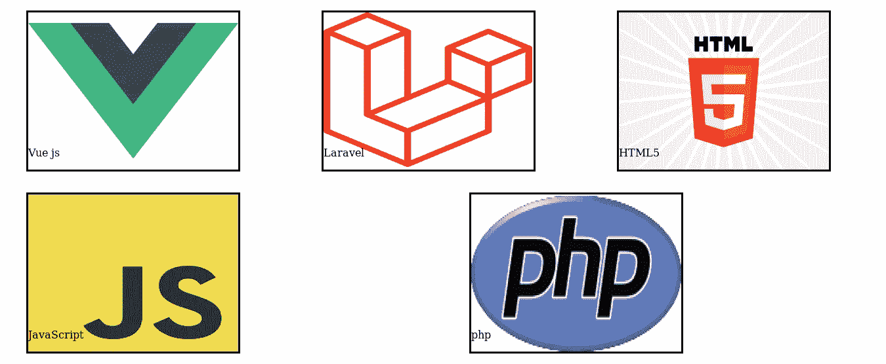

我们应该给**加一个`**border**`。项目**查看我们正在伸缩的项目有多大。

```
.item {flex-grow: 1; **border: solid;**}
```

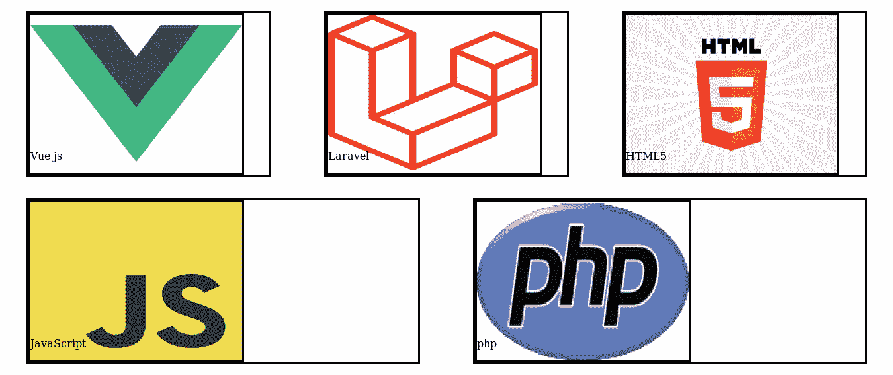

内容 div 应该出现在。项目

```
.item {
    flex-grow: 1;
    border: solid;
    **display: flex; justify-content: center;**
}
```

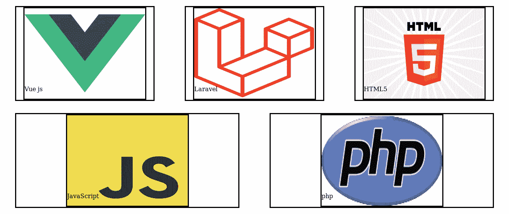

现在我们可以移除边框。项目

```
.item {
    flex-grow: 1;
    **b̶o̶r̶d̶e̶r̶:̶s̶o̶l̶i̶d̶;̶**
    display: flex; justify-content: center;
}
```


我们用更少的代码实现了相同的布局。🎆

我们可以像第一次尝试创建这个图库时一样，对文本应用相同的样式。

```
.itemName {
    margin: 0; font-size: 3em; background-color: rgba(244,200,3,0.5);
    width: 100%; text-align: center;
}
```

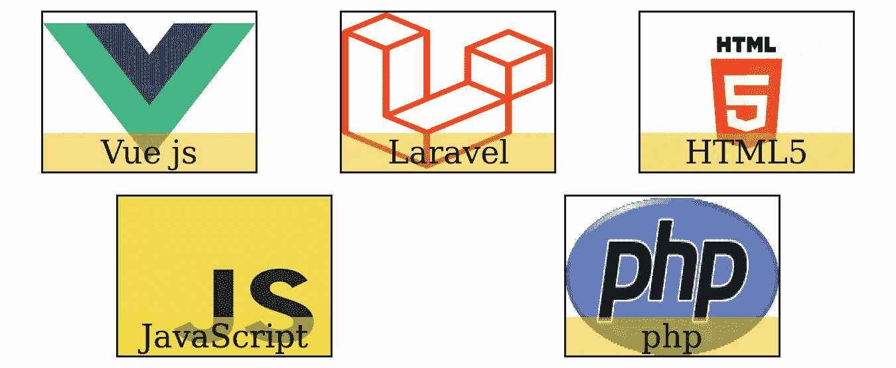

为了增加一些花哨/酷/交互性，我们可以添加一些悬停效果。

# 悬停效果

我们可以添加一个**框阴影**，这样每当有人将鼠标悬停在投资组合项目上时，我们就会得到这样的结果:


这是实现这种效果的代码:

```
.itemNameParent:hover {
    box-shadow: 3px 3px 18px 18px rgba(0,150,255,0.91);
}
```

## 理解阴影和阴影代码

我们有 5 个`**box-shadow**`属性的值。我们需要看看这些价值代表了什么。

**前两个值:**

无论是在现实生活中还是在 web 开发中，**一个影子并不与项目在同一个地方，它是**的影子。

前两个数字代表这个。看一下下面的代码:

```
.itemNameParent:hover {
    box-shadow: 3px 100px;
}
```

3px 是水平方向上的阴影距离**多远**，100px 是垂直方向上的阴影距离**多远**。

**第三个值**:阴影可以模糊也可以清晰。这代表阴影有多模糊。

**第四个值**:阴影扩散多少。数字越大，传播越广。

**第五个值**:这就是阴影的颜色。

综上所述，你可以这样想:

```
.itemNameParent:hover {
    box-shadow: **HORIZONTAL VERTICLE BLURRY SPREAD COLOR**
}
```


[百合班克斯](https://unsplash.com/@lvnatikk?utm_source=medium&utm_medium=referral)在 [Unsplash](https://unsplash.com?utm_source=medium&utm_medium=referral) 上拍摄的照片

让我们做一个模型

# 查看项目模式

我们之前创建的模态在我们单击按钮时打开，这一次我们需要单击包含内容的元素。

我们无法将单击操作添加到。项目，因为我们正在调整组合项目，如果一个项目因为调整而变大，交互区域也会变大，这将使项目的空白区域具有交互性。

我们不希望空白是交互式的。因此，我们必须添加具有类 **itemNameParent** 的元素。

```
<figure *v-for*="item *in* items" *class*="item">
    <div *:style*="'background:url(storage/itempics/small/' + item.img_path + ');'" *class*="itemNameParent" ***@click*="itemClicked(item)"**>
        <p *class*="itemName">{{item.name}}</p>
    </div>
</figure>
```

模态可以简单地在图形之上。

```
**<transition *name*="fade">
    <div *id*="my-modal">
        <div *class*="modal-body">
            <p>Image</p>
            <h1>Modal Text</h1>
        </div>
    </div>
</transition>**
<figure>...</figure>
```

就像前面的模态一样，这也需要在 data()中设置为 **false**

```
data() {
    *return* {
        items: '',
        **showItemModal: *false***}
},
```

我们在 click 方法中将其更改为 **true**

```
itemClicked(item) {
    *if* (*this*.showItemModal === *false*) {
        *this*.showItemModal = *true* } *else if* (*this*.showItemModal === *true*) {
        *this*.showItemModal = *false* }
},
```

一种更简单的方法是:

```
itemClicked(item) {
    *this*.showItemModal = *this*.showItemModal === *false* },
```

## 了解较短的方法

让我们来理解这个版本的方法。这里有 3 点需要理解:

1.  第 **this.showItemModal**
2.  第二部 **this.showItemModal**
3.  **假**

第一个 this.showItemModal 表示 data()返回的属性:

```
***//*** *In the itemClicked(item) method* ***this*.showItemModal** = *this*.showItemModal === *false*
```

第二个表示是`**data() return{}**`中的**当前值**，即真/假

```
// in data() return {}
showItemModal: ***false***
```

所以我们已经确定' **showItemModal** **是当前值**。

第三位(`**=== false**` ) **否定**， **showItemModal** **为当前值**。

```
*this*.showItemModal = *this*.showItemModal **=== *false***
```

所以如果当前值为真，就变成了假。如果当前值为 false，它将变为 true。

我们需要给模态元素添加一个`**v-if**`

```
<div *id*="my-modal" ***v-if*="showItemModal"**>...</div>
```

现在，单击一个投资组合项，模态就会出现和消失。

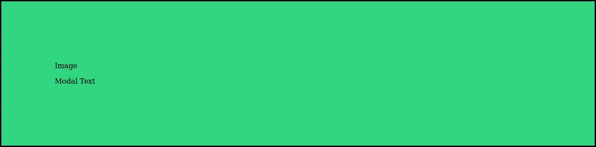

然而，这是出现在上面的项目，我们需要它来接管页面。

为了接管页面，我们已经有了一个 modal 类，我们可以使用它。

```
.modal {
    position: fixed;
    z-index:1;
    top: 0;
    bottom: 0;
    left: 0;
    right: 0;
    background-color: rgba(0, 0, 0, 0.3);
    display: flex;
    justify-content: center;
    align-items: center;
}
```

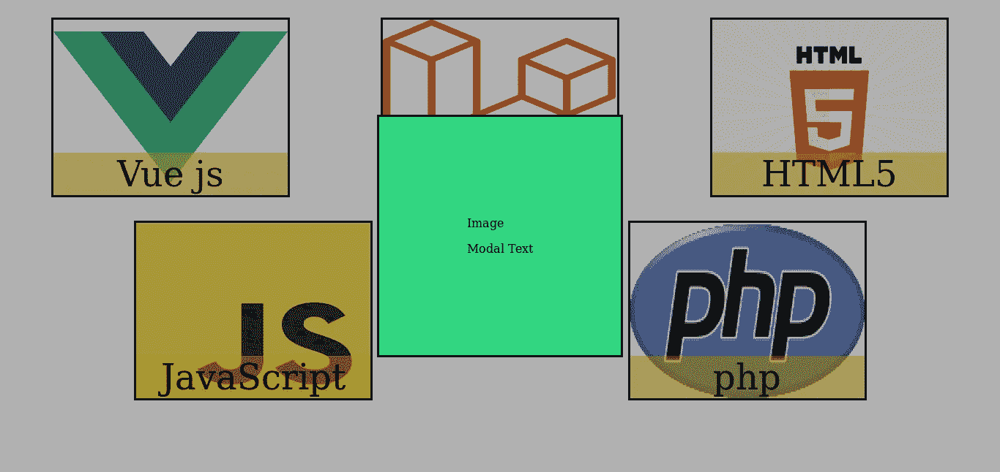

## 向元素传递数据

在构建之前的模型时，我们将数据向下传递给子组件。这一次，我们将数据传递给同一个组件中的**元素。**

就像前面的模式一样，我们从方法中检索项目。

```
data() {
    *return* {
        items: '',
        showItemModal: *false*, **item: ''**    }
},itemClicked(item) {
    ***this*.item = item;** *this*.showItemModal = *this*.showItemModal === *false* },
```

让我们呈现项目名称

```
<transition *name*="fade">
    <div *id*="my-modal" *v-if*="showItemModal" *class*="modal">
        <div *class*="modal-body" *id*="modal-body">
            <p>Image</p> **<h1>{{this.item.name}}</h1>**
        </div>
    </div>
</transition>
```

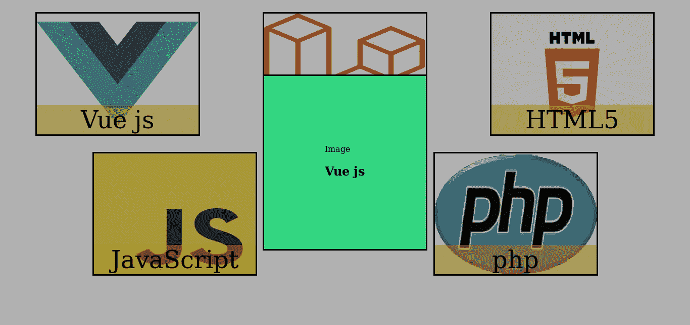

让我们渲染物品的**大**图像。

```
<div *class*="modal-body" *id*="modal-body">
    ****
    <h1>{{this.item.name}}</h1>
</div>
```

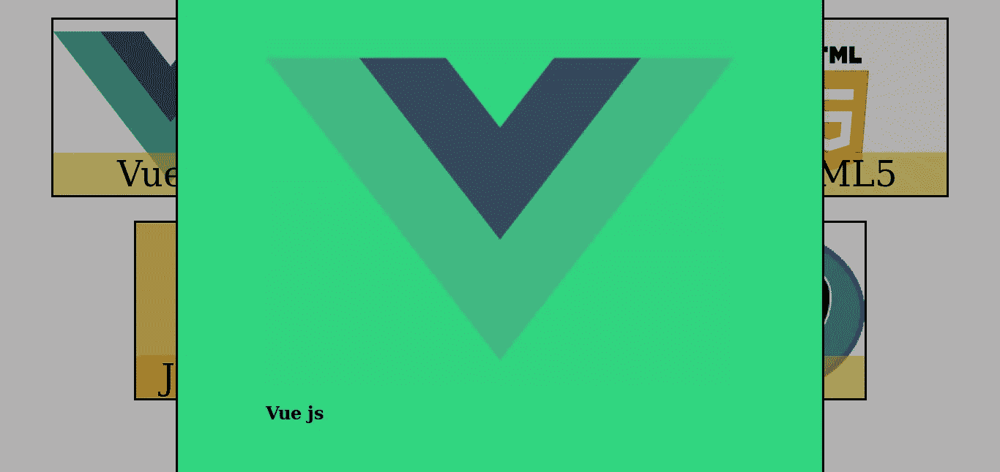

## 使模式可关闭

我们可以使用一个类似于 updateItemModal 中使用的方法，这个方法当然会关闭 showItemModal，如果你在它之外点击的话。

```
closeModal(event) {
    *if* (event.target.matches('.modal')) {
        *this*.**showItemModal** = *false*;
    }
},
```

## 勾选清单

*   带文本的图像(Portfolio.vue) ✅
*   具有更大图像和描述的模型(Portfolio.vue)✅
*   modal (Portfolio.vue)上的关闭按钮

在下一章中，我们将创建一个关闭按钮，以及一个包含简历下载链接的 about 部分。