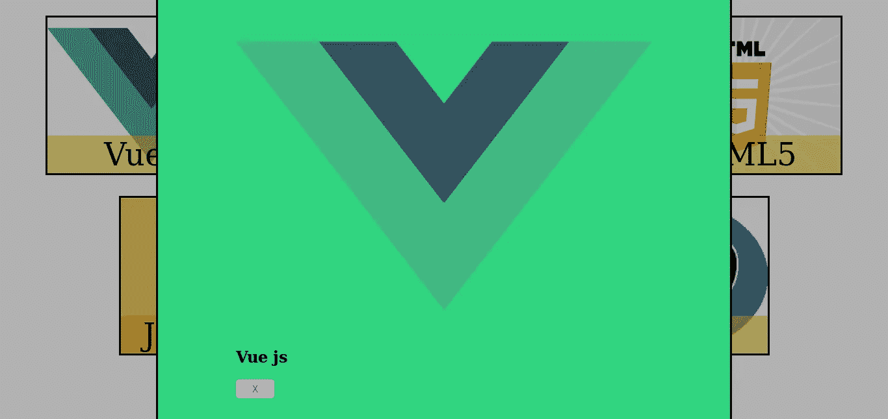
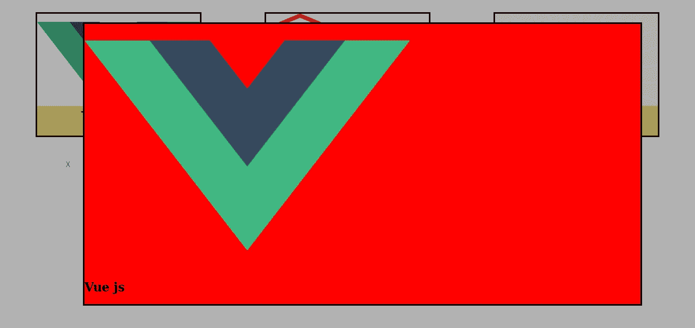
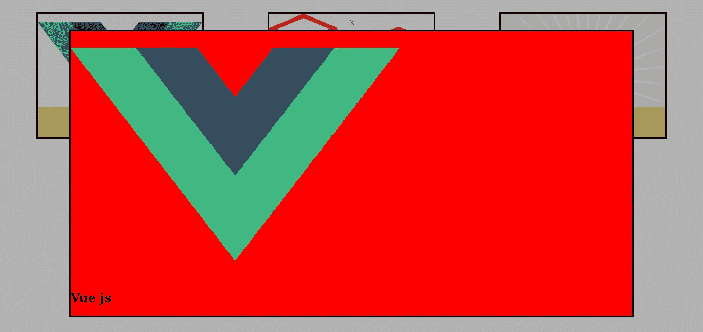
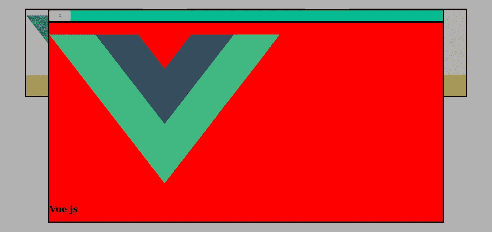
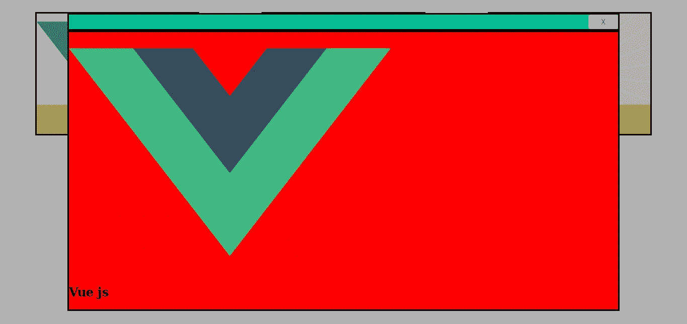
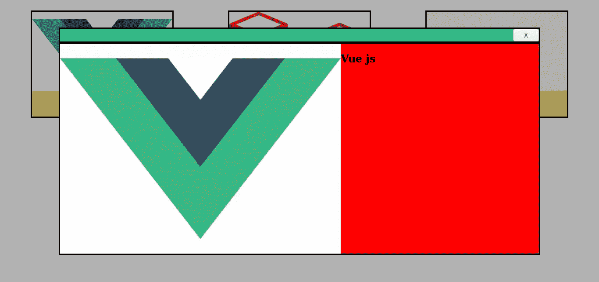
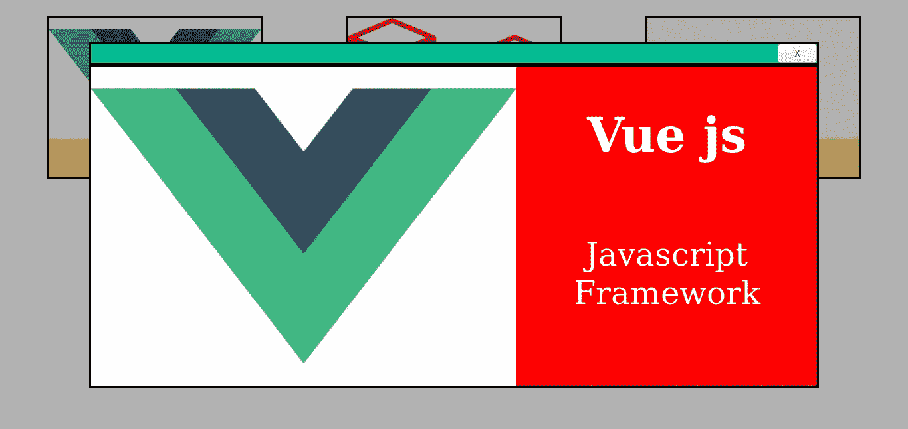
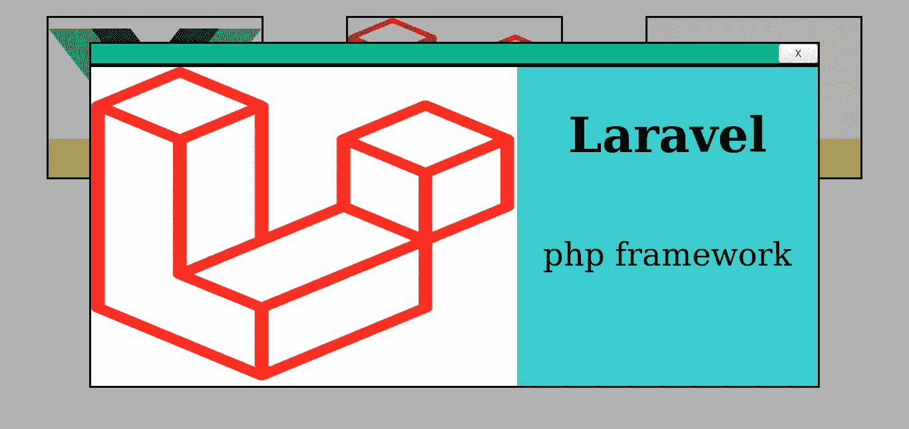
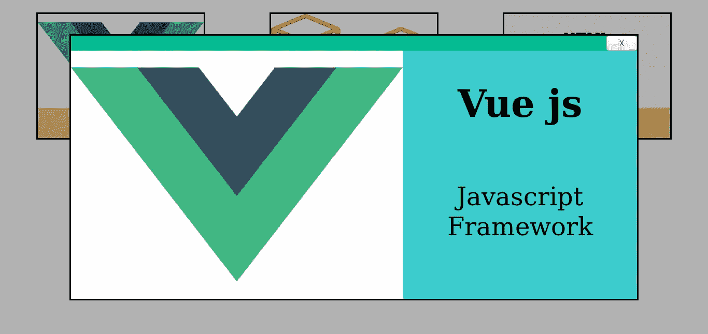

# Laravel 和 Vue:用 CRUD 管理面板创建作品集网站——第 14 章

> 原文：<https://itnext.io/laravel-and-vue-creating-a-portfolio-website-with-a-crud-admin-panel-chapter-14-9f5ca00bf263?source=collection_archive---------7----------------------->

## viewItemModal 的关闭按钮

# 打扫

在上一章中，我们有两种创建作品集的方法。我们选择使用第二种方法，因为它需要更少的代码。

这两种方法都需要`**template**`和`**style**` 标签中的代码。我们现在应该删除任何不再需要的样式。不再需要的样式有:

*   。卡片
*   。卡片内容
*   。柔性中心
*   。卡片 p
*   。卡片-文本-容器

我们应该留下这些风格:

```
<style *scoped*>
    #portfolio-gallery {
        display:flex;
        flex-wrap: wrap;
    }
    .itemNameParent {
        width: 320px;
        height: 240px;
        display: flex;
        align-items: flex-end;
        border:solid;
    }
    .item {
        flex-grow: 1;
        display:flex;
        justify-content:center;
    }
    .itemName {
        margin: 0; 
        font-size: 3em; 
        background-color: rgba(244,200,3,0.5);
        width: 100%; 
        text-align: center;
    }
    .itemNameParent:hover {
        box-shadow: 3px 3px 18px 18px rgba(0,150,255,0.91);
    }
</style>
```

我们也可以从模态中删除 id，因为我们不使用它。

```
<div **i̶d̶=̶"̶m̶y̶-̶m̶o̶d̶a̶l̶"̶** *v-if*="showItemModal" *class*="modal" *@click*="closeModal">
```

## 关闭按钮

我们可以在项目名称下面添加一个关闭按钮

```
<div *id*="my-modal" *v-if*="showItemModal" *class*="modal" *@click*="closeModal">
    <div *class*="modal-body">
        
        <h1>{{this.item.name}}</h1>
        **<button  *class*="modal-close-btn" *href*="#" *@click*="closeModalBtn">
            <span>X</span>
        </button>**
    </div>
</div>
```



此按钮的方法是:

```
closeModalBtn() {
    *this*.showItemModal = *false* }
```

我们可以将它添加到 closeModal(event)方法的下面。

不要将`**closeModal(event)**`和`**closeModalBtn()**` 方法相互混淆。

`**closeModal(event)**` **是**用于关闭模态，当你点击模态外的**时。**

`**closeModalBtn()**` 是关闭模态，当点击按钮上的**时。**

让我们更改显示项目模式的布局

# **改变显示项目模式的布局**

我们可以将 modal-body 的类改为 showItem-modal-body

```
<div *class*="showItem-modal-body">
    
    <h1>{{this.item.name}}</h1>
    <button  *class*="modal-close-btn" *href*="#" *@click*="closeModalBtn">
        <span>X</span>
    </button>
</div>
```

第一件事是给这个类的边界，背景和宽度

```
.showItem-modal-body {
    background: red;
    border: solid;
    width:80vw;
}
```


“关闭”按钮可以移动到具有 showItem-modal-header 类的元素中。

让我们创建该元素并将关闭按钮移到那里。

```
**<div *class*="showItem-modal-header">
    <button  *class*="modal-close-btn" *href*="#" *@click*="closeModalBtn">
        <span>X</span>
    </button>
</div>**
<div *class*="showItem-modal-body">
    
    <h1>{{this.item.name}}</h1>
</div>
```



现在关闭按钮出现在红色框的左侧。这是因为这里的父元素拥有 **modal** 类，而 modal 类拥有 style `**display:flex**` **。**

我们需要给 modal 添加一个类，并添加样式`**flex-direction:column**`

```
<div *v-if*="showItemModal" *class*="modal **showItemModal**" *@click*="closeModal">.showItemModal {
    flex-direction: column;
}
```



我们应该给模态标题一个背景，宽度和边框。

```
.showItem-modal-header {
    background: #04BC92;
    border: solid;
    width:80vw;
}
```



```
.modal-close-btn {
    float: right;
}
```



让我们给图像一个背景色

```
img {background:white;}
```

将 flexbox 与模态几何体一起使用

```
.showItem-modal-body {
    background: red;
    border: solid;
    width:80vw; **display: flex;**
 }
```



我们需要创建一个包含名称和描述的元素。让我们给这个元素一个**项目描述区域**的 id。我们需要使用 flexbox，让它垂直(`**flex-direction:column;**`)，让它随着`**flex:1**`一起成长

```
<div *class*="showItem-modal-body">
        
    **<div *id*="project-description-area">
        <h1>{{this.item.name}}</h1>
        <p>{{this.item.description}}</p>
    </div>**
</div>#project-description-area {
    display: flex;
    flex-direction: column;
    flex: 1;
}
```

我们需要使它的字体颜色明亮，将文本居中对齐，并使用比默认字体更大的字体。

```
#project-description-area {
    display: flex;
    flex-direction: column;
    flex: 1;
    **color: white;
    text-align: center;
    font-size: 3em;**
}
```



让我们改变项目描述区域的背景。我们还应该改变字体颜色，使它更容易看。

```
#project-description-area {
    display: flex;
    flex-direction: column;
    flex: 1;
    **color: black;**
    text-align: center;
    font-size: 3em;
    **background: #39CCCC;**
}
```



让我们去掉模态页眉的**下边框**和模态正文的**上边框**。

```
.showItem-modal-header {
    background: #04BC92;
    border: solid;
    border-bottom: none;
    width:80vw;
}
.showItem-modal-body {
    background: red;
    border: solid;
    border-top: none;
    width:80vw;
    display: flex;
    flex-wrap: wrap;
}
```



# 勾选清单

*   带文本的图像(Portfolio.vue) ✅
*   具有更大图像和描述的模型(Portfolio.vue)✅
*   莫代尔(Portfolio.vue)✅)上的关闭按钮

现在是时候创建“关于”部分了

在创建 about 部分之前，我们需要通过分离做一些**准备。**

## **分离准备(第 14 章版本)**

在继续处理这两个组件之前，我们应该将一些组件移动到它们各自的文件夹中；类似于第七章的分离准备。

我们应该将 Portfolio.vue 移动到 **public/sections** 文件夹中。

我们还应该将 PortfolioEditor、PortfolioEditorTable、confirmDeleteModal、addItemModal 和 updateItemModal 移动到 **admin/sections** 文件夹**中。**

resources/js/public/home.vue👇：

```
<template>
    <masthead *:profile*="profile"/>
    <portfolio/>
</template>

<script>
    *import* masthead *from* "./sections/masthead";
    *import* Portfolio *from* "./sections/Portfolio";
    *export default* {
        name: "home",
        components: {
            Portfolio,
            masthead
        },
        data() {
            *return* {
                profile: {
                    type:Object
                }
            }
        },
        mounted() {
            *this*.getProfile();
        },
        methods: {
            getProfile() {
                axios.get('/api/profile')
                    .then(response => {
                        console.log(response.data);
                        *this*.profile = response.data;
                    })
                    .catch(error => {
                        *console*.log(error);
                    });
            },
        }
    }
</script>
```

我们需要确保 Portfolio.vue 在`**<style></style>**`中有以下类

```
.modal {
    top: 0;
    bottom: 0;
    left: 0;
    right: 0;
    background-color: rgba(0, 0, 0, 0.3);
    display: flex;
    justify-content: center;
    align-items: center;
}
.showItemModal {
    display:flex;
    flex-direction: column;
    position: fixed;
    z-index: 1;
}
```

resources/js/admin/home.vue👇：

```
<template>
    <div *id*="admin-home">
        <ProfileEditor/>
        <PortfolioEditor/>
    </div>
</template>

<script>
    *import* ProfileEditor *from* "./sections/ProfileEditor";
    *import* PortfolioEditor *from* "./sections/PortfolioEditor";
    *export default* {
        name: "home",
        components: {
            PortfolioEditor,
            ProfileEditor
        }
    }
</script>
```

# 关于部分

App.vue👇：

```
<template>
    <div *id*="app">
        <About/>
    </div>
</template>
<script>
    *import* About *from* './About';
    *export default* {
        name: "App",
        components: {
            About
        },
        data() {
            *return* {}
        },
        mounted() {
        },
        methods: {},
    }
</script>
```

“关于”部分需要两件事:

1.  关于文本
2.  下载简历按钮

我们需要创建 about.vue，在 about.vue 中，应该有一个地方有**关于文本**和**下载简历按钮**。

About.vue👇：

```
<template>
    <section *id*="about">
        <p>About Text</p>
        <button>Download CV</button>
    </section>
</template>
```

这是构建该组件的初始阶段。我们还需要建立它的对应部分，即关于 Editor.vue

AboutEditor 需要一个将上传简历的**表单。**简历必须是 pdf、doc 或 docx 格式。

AboutEditor.vue👇：

```
<template>
    <section *id*="about-editor">
        <h1>About Editor</h1>
        <form *enctype*="multipart/form-data" *id*="about-form">
            <input *type*="file" *@change*="selectFile" *name*="cv" ***accept*=".doc, .docx, .pdf"**>
            <button *@click.prevent*="onSubmit">Submit</button>
        </form>
    </section>
</template>
```

这些方法将会和以前的表格中的方法相似

```
selectFile(event) {
    *this*.file = event.target.files[0];
},
onSubmit() {
    *let* fd = *new* FormData();
    fd.append('cv', *this*.file);
    *this*.postAboutForm(fd);
},
postAboutForm(fd) {
    axios.post('api/about', fd)
},
```

api 路线(在**api.php**):

```
Route::*post*('/about', 'AboutController@postAboutForm');
```

我们应该创建 AboutController

```
php artisan make:controller AboutController
```

postAboutForm 函数()应该上传文件。该文件的关键字为 **cv**

```
*public function* postAboutForm(){
    $file = request()->file('**cv**');
    $file->store('/public/cvs');
}
```

store()函数在这里上传你的文件，但是它使用了一个**散列文件名**。

## 避免散列文件名

为了避免散列文件名，您只需使用 **storeAs()** 而不是 store()

```
*public function* postAboutForm(){
    $file = request()->file('cv');
    **$̶f̶i̶l̶e̶-̶>̶s̶t̶o̶r̶e̶(̶'̶/̶p̶u̶b̶l̶i̶c̶/̶c̶v̶s̶'̶)̶;̶**
    $file->storeAs('public/cvs', 'FILENAMEHERE');
}
```

使用 storeAs()函数时，需要指定文件名。这里我们要用**原文件名**。

## 原始文件名

使用`**getClientOriginalName()**;`可以获得原始文件名，然后我们在 storeAs 函数中使用它。

```
*public function* postAboutForm(){
    $file = request()->file('cv');
    **$originalName** = $file->getClientOriginalName();
    $file->storeAs('public/cvs', **$originalName**);
}
```

现在我们可以上传文件了，它会以原来的名字上传。


加文·阿兰伍德在 [Unsplash](https://unsplash.com?utm_source=medium&utm_medium=referral) 上的照片

在第 15 章，我们将看看公众是如何下载简历的。