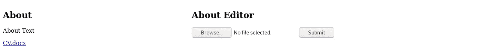

# Laravel 和 Vue:用 CRUD 管理面板创建作品集网站——第 15 章

> 原文：<https://itnext.io/laravel-and-vue-creating-a-portfolio-website-with-a-crud-admin-panel-chapter-15-40507d27a340?source=collection_archive---------4----------------------->

## 下载简历

在第 14 章中，我们创建了上传简历的功能。现在我们需要一个下载简历的能力。

# 创建下载简历的能力

我们需要遵循以下步骤:

1.  将**原始文件名**存储在数据库表中
2.  使原始文件名在路线中可用
3.  接收脚本标签中的原始文件名
4.  使用原始文件名创建'**下载 cv'** **链接**(模板标签)


## 1.数据库表中的**原始文件名**

像往常一样，我们需要进行迁移

```
php artisan make:migration CreateAboutTable
```

在迁移中，我们需要创建一个名为 **cv_path** 的**字符串列**

```
*public function* up()
{
    Schema::create('about', *function* (Blueprint $table) {
        $table->bigIncrements('id'); **$table->string('cv_path');**
        $table->timestamps();
    });
}
```

然后我们迁移并准备好一张桌子

```
php artisan migrate
```


Abel Y Costa 在 [Unsplash](https://unsplash.com?utm_source=medium&utm_medium=referral) 上拍摄的照片

现在，我们创建“关于”模型

```
php artisan make:model About
```

在 about 模型中，我们需要一个包含`**cv_path**`的可填充数组。

About.php:👇

```
*<?php

namespace* App;

*use* Illuminate\Database\Eloquent\Model;

*class* About *extends* Model
{
    *protected* $table = 'about';
    *protected* $fillable = [**'cv_path'**];
}
```

现在来更改 about 控制器的 postAboutForm()函数，以便它将 cv_path 存储在数据库表中

AboutController.php 中的 postAboutForm():👇

```
*public function* postAboutForm(){
    $file = request()->file('cv');
    $originalName = $file->getClientOriginalName();
    $file->storeAs('public/cvs', $originalName);
    **$about = *new* About();
    $about->cv_path = $originalName;
    $about->save();**
}
```

这个函数做两件事，即**上传 cv** 和**存储 cv 路径。**简历上传到 **storage/app/public/cvs** 文件夹。


## 2.在路线中可用的原始文件名

让我们创建一条给我们 cv_path 的路径

```
Route::*get*('/cv_path', 'AboutController@getCVPath');
```

关于控制器中的功能:👇

```
*public function* getCVPath() {
    *return* About::*all*()[0]->cv_path;
}
```

有了上面的代码，如果我们访问路由，就会看到原来的文件名/ `cv_path`。


## 3.使用 Vue 组件的脚本标签接收原始文件名

在 About.vue 的方法块中，我们需要一个接收 cv_path 的方法

```
getCVPath() {
    axios.get('/api/cv_path')
        .then(response => *this*.cv_path = response.data)
        .catch(error => *console*.log(error))
},
```

并且在安装块中

```
mounted() {
    *this*.getCVPath();
},
```

data() return {}

```
data() {
    *return* {
        cv_path: '',
    }
},
```


## 4.使用原始文件名创建'**下载 CV'** **链接**(模板标签)

下载链接只是一个带有`**download**`属性的锚(`<a></a>`元素)

```
<a *href*="#" ***download***></a>
```

我们需要这个链接的一些文本，我们可以只使用`**cv_path**`

```
<a *href*="#" *download*>**{{cv_path}}**</a>
```

现在我们可以使用`**v-bind:**`并连接 cv_path

```
<a *v-bind:href*="'/storage/cvs/' + *this*.cv_path" *download*>{{cv_path}}</a>
```

我们可以使用`**v-bind:**`的较短版本，即`**:**`

```
<a *:href*="'/storage/cvs/' + *this*.cv_path" *download*>{{cv_path}}</a>
```


让我们确保 App.vue 有 About 和 AboutEditor 组件

```
<div *id*="app">
    <About/>
    <AboutEditor/>
</div>
```

让我们向 about 组件添加一个`**h1**`,并在 web 浏览器中加载页面

```
<section *id*="about">
    <h1>About</h1>
    <p>About Text</p>
    <a *:href*="'/storage/cvs/' + *this*.cv_path" *download*>{{cv_path}}</a>
</section>
```


我们可以看到部分标题😃，关于文本😃但是没有下载链接👎。

在我们上传简历之前，我们看不到下载链接。所以我们上传一份简历吧。


当我们点击提交时，文件将被上传。现在我们需要刷新页面。



现在我们可以看到用于下载简历的链接。👍

但是……

上传更新的简历怎么办？这个简历链接会被替换吗？

答案是否定的😦。与我们目前拥有的代码，新的简历将得到上传，但链接不会被取代。然而，我们可以通过创建一个 **CV 选择器**来轻松处理这个问题。

CV 选择器将在下一章(第 16 章)创建。