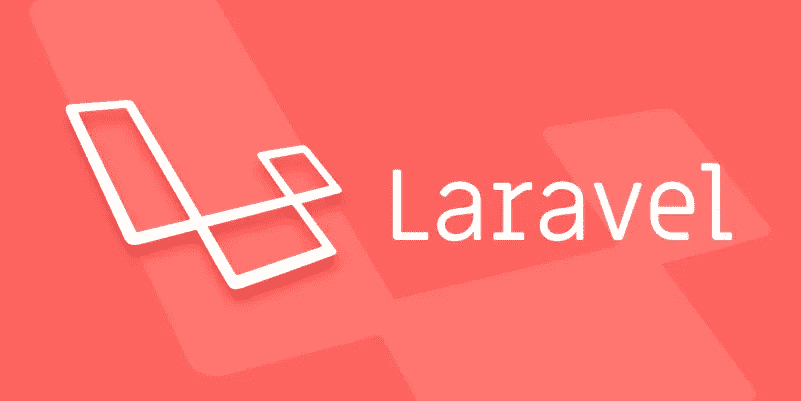
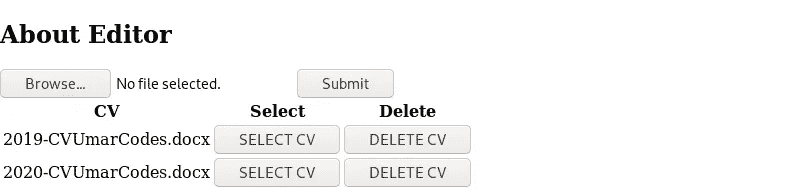

# Laravel 和 Vue:用 CRUD 管理面板创建作品集网站——第 16 章

> 原文：<https://itnext.io/laravel-and-vue-creating-a-portfolio-website-with-a-crud-admin-panel-chapter-16-2ee3ffef1c32?source=collection_archive---------9----------------------->



## CV 选择器

我们应该构建一个 CVSelector 组件，并将其作为 AboutEditor 的子组件。

关于 Editor.vue 的模板:👇

```
<template>
    <section *id*="about-editor">
        <h1>About Editor</h1>
        <form *enctype*="multipart/form-data" *id*="about-form">
            <input *type*="file" *@change*="selectFile" *name*="cv" *accept*=".doc, .docx, .pdf" *id*="cv_upload">
            <button *@click.prevent*="onSubmit">Submit</button>
        </form>
        **<CVSelector/>**
    </section>
</template>
```

导入 CVSelector 组件并将其放入 components 块中

```
<script>
    *import* **CVSelector** *from* './**CVSelector**';
    *export default* {
        name: 'AboutEditor',
        components: {
            **CVSelector**
        },
....
</script>
```

CVSelector 组件可以包含一个带有`**v-for**`循环的表。表格列的标题为 **CV** 、**选择**和**删除**。CV 列将有来自 v-for 循环的`**cv_path**` 。选择栏将有'**选择 cv'** 按钮，删除栏将有**'删除 cv'** 按钮。

CVSelector.vue 的模板:👇

```
<template>
    <table>
        <thead>
        <tr>
            <th>CV</th>
            <th>Select</th>
            <th>Delete</th>
        </tr>
        </thead>
        <tbody>
        <tr *v-for*="cv *in* cvlist">
            <td>{{cv.cv_path}}</td>
            <td>
                <button *@click*="selectCVPopup(cv)">SELECT CV</button>
            </td>
            <td>
                <button *@click*="deleteCVPopup(cv)">DELETE CV</button>
            </td>
        </tr>
        </tbody>
    </table>
</template>
```

`**cvlist**`应在数据()返回{}

```
data() {
    *return* {
        cvlist: '',
    }
},
```

获取 cvlist 的方法

```
getCVList() {
    axios.get('/api/cvlist').then(
        response => *this*.cvlist = response.data
    )
},
```

装载后运行该方法

```
mounted() {
    *this*.getCVList();
},
```

获取 cvlist 的 api 路径

```
Route::*get*('/cvlist', 'AboutController@getCVList');
```

AboutController 中的 getCVList()函数应该获取所有的 About 表

```
*public function* getCVList() {
    *return* About::*all*();
}
```

现在，如果我们访问该页面并上传几份简历，我们将会看到如下内容:



现在是构建 selectCVModal 的时候了。

## 选择 CVModal

在桌子下面，我们可以有一个 **selectCVModal** 组件。我们必须记住，我们只能拥有****一个根元素**。这意味着我们必须将表和 selectCVModal 组件放在一个元素中，如下所示:**

```
<template>
    <div *id*="cv-selector">
        <table>
          ...
        </table>
        <**selectCVModal** *v-if*="**selectCVModal**" *:cv*="cv"/>
    </div>
</template>
```

**与其他模态类似，这也依赖于一个为真的**数据属性**和一个通过属性的**。在这种情况下，数据属性是`**selectCVModal**` ，传递的属性是`**cv**` **。******

```
data() {
    *return* {
        cvlist: '',
        cv: '',
        selectCVModal: *false*,
    }
},
```

**selectCVModal 应该有一个是/否问题。另一个模态，我们在是**confirmdeletedemodal 中有一个是/否问题。我们可以简单地复制组件并修改它以适应这种情况。****

**以下修改以**粗体**显示**

```
<template>
    <transition *name*="fade">
        <div *id*="my-modal" *class*="modal">
            <div *class*="modal-body">
                **<h1>Select <b *style*="color:red">{{cv.cv_path}}</b>?</h1>**
                <div *class*="btn-row">
                    <button *@click*="confirm">Yes</button>
                    <button *@click*="cancel">No</button>
                </div>
            </div>
        </div>
    </transition>
</template>
<script>
    *export default* {
        name: '**selectCVPopup**',
        props: {
            **cv: ''**
        },
        methods: {
            confirm() {
                axios.post(**`api/selectcv/${*this*.cv.id}`**).then(
                    ***this*.$parent.selectCVModal = *false***).then(
                    ***this*.$parent.getCVList()**
                )
            },
            cancel() {
                ***this*.$parent.selectCVModal = *false*;**
            },
        }
    }
</script>
```

**选择 cv 的 api 路由应该包含/{id}**

```
Route::*post*('/selectcv/{id}', 'AboutController@selectCV');
```

## **在数据库中选择简历**

*   **选择简历的方法是让**数据库记录**有一些独特的不同**
*   **具有唯一差异的**记录可在路线上获得。****
*   **该特定记录的`**cv_path**` 将用于 About.vue 的脚本和模板中。**

## ****独特的差异****

**我们可以添加一个 **cv_active** 列。列的类型是**布尔型**(而不是通常的字符串列)。**

**布尔列包含`**1**`或`**0**`。**

**所选 cv 的**布尔列将以`**1**`作为其值。****

**其他 cv 的**布尔列将使用`**0**`作为它们的值。****

**让我们做一个迁移来添加布尔列。**

```
**php artisan make:migration AddCVActiveColumn**
```

**在 AddCVActiveColumn 迁移的 up()函数中:**

```
Schema::table('about', *function* (Blueprint $table) {
    $table->**boolean**('**cv_active**');
});
```

**让我们迁移:**

```
**php artisan migrate**
```

**现在我们有了布尔列，我们应该编写控制器函数。**

```
*public function* selectCV() {
    $id = request()->id;
    About::*where*('id', $id)->update(['cv_active' => 1]);
    About::*where*('id', '!=',$id)->update(['cv_active' => 0]);
}
```

> **代码解释:当`**id**` **列的值**与所选 cv 的`**id**` **匹配时，将`**cv_active**`列变为`**1**`。哪里不匹配，就把 cv_active 列转到`**0**`。****

## **渲染活动 CV 链接**

**现在我们必须修改 AboutController 的 getCVPath()函数来获得 cv，其中 cv_active 的值为 1:**

```
*public function* getCVPath() {
    *return* About::*all*()
        ->where('cv_active', 1)
        ->first()
        ->cv_path;
}
```

**现在，您将获得渲染到 about.vue 组件上的活动 CV 链接。**

**如果你只是想显示最新上传的简历作为链接，而不是通过选择器。**

## **显示没有 CV 选择器的最新 CV**

**我们可以在 postAboutForm()函数中使用`**cv_active**`列，这样当我们上传 cv 时，cv 的 cv_active 列显示为 1。**

**其他列可以通过使用 **$about- > id** 变为 0(因为当您向数据库表中插入一行时，会自动生成一个 id)。**

```
*public function* postAboutForm(){
    $file = request()->file('cv');
    $originalName = $file->getClientOriginalName();
    $file->storeAs('public/cvs', $originalName);
    $about = *new* About();
    $about->cv_path = $originalName;
    **$about->cv_active = 1;
    About::*where*('id', '!=',$about->id)->update(['cv_active' => 0]);**
    $about->save();
}
```

## **deleteCVModal**

**本章最后要做的是 deleteCVModal。它可以放在 selectCVModal 下，如下所示:**

```
<selectCVModal *v-if*="selectCVModal" *:cv*="cv"/>
<deleteCVModal *v-if*="deleteCVModal" *:cv*="cv"/>
```

**让我们将 deleteCVModal 添加到 data() return {}中**

```
data() {
    *return* {
        cvlist: '',
        cv: '',
        selectCVModal: *false*,
        **deleteCVModal: *false*,**
    }
},
```

**将其作为子组件导入 CVSelector.vue**

```
*import* deleteCVModal *from* './deleteCVModal';
```

**将它放在组件块中**

```
components: {
    selectCVModal,
    **deleteCVModal**
},
```

**非常类似于 selectCVModal。有一个值得注意的区别**

**需要注意的区别:我们用`**cv_path**` 代替 id。我们将使用 cv_path 删除。**

```
<template>
    <transition *name*="fade">
        <div *id*="my-modal" *style*="border: solid; z-index: 1" *class*="modal">
            <div *class*="modal-body">
                **<h1>Delete <b *style*="color:red">{{cv.cv_path}}</b> from the cv list?</h1>**
                <div *class*="btn-row">
                    <button *@click*="confirm">Yes</button>
                    <button *@click*="cancel">No</button>
                </div>
            </div>
        </div>
    </transition>
</template>
<script>
    *export default* {
        props: {
            cv: ''
        },
        methods: {
            confirm() {
                **axios.delete(`api/cv/${*this*.cv.cv_path}`)**.then(
                    *this*.$parent.deleteCVModal = *false* ).then(
                    *this*.$parent.getCVList()
                )
            },
            cancel() {
                *this*.$parent.confirmDeleteModal = *false*;
            },

        },
    }
</script>
```

**使用 cv_path 路线删除 cv**

```
Route::*delete*('/cv/{cv_path}', 'AboutController@destroy');
```

**AboutController.php 的销毁功能可以用来删除数据库记录和文件。**

**Storage::delete 正在使用 cv_path 删除文件。**

```
*public function* destroy($cv_path) {
    About::*where*('cv_path', $cv_path)->delete();
    Storage::*delete*('public/cvs/' . $cv_path);
}
```

**在第 17 章中，我们将创建一个联系表单。**