# Laravel 和 Vue:用 CRUD 管理面板创建作品集网站——第 17 章

> 原文：<https://itnext.io/laravel-and-vue-creating-a-portfolio-website-with-a-crud-admin-panel-chapter-17-fe8fe8cb979f?source=collection_archive---------5----------------------->

## 联系方式和电子邮件


由[梅林达·金佩尔](https://unsplash.com/@melindagimpel?utm_source=medium&utm_medium=referral)在 [Unsplash](https://unsplash.com?utm_source=medium&utm_medium=referral) 上拍摄的照片

我们从表单组件开始，我们有一个包含 id contact、h1 heading Contact 和一个空表单元素的部分。

```
<template>
    <section id="contact">
        <h1>Contact</h1>
        <form>

        </form>
    </section>
</template>

<script>
    export default {
        name: "Contact"
    }
</script>

<style scoped>

</style>
```

在表单元素中，我们可以有:

*   姓名的输入
*   电子邮件地址的输入
*   消息的输入
*   提交表单的输入`**input type="submit"**`

```
<form>
    <input type="text" placeholder="name"/>
    <input type="text" placeholder="email"/>
    <input type="text" placeholder="message"/>
    <input type="submit"/>
</form>
```

我们得到这样的结果:


我们现在需要做一些造型

## 式样

让我们将联系人部分的样式设置为有一个`**background**`，和完整的`**height**` 。

```
section#contact {
    background: springgreen;
    height:100vh;
}
```

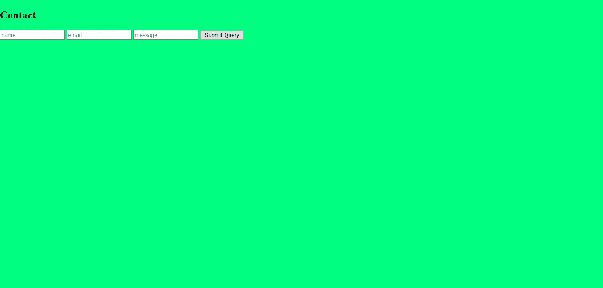

让我们将 contact 部分的内容居中。

```
section#contact {
    background: springgreen;
    height:100vh;
    **display: flex;
    justify-content: center;
    align-items: center;**
}
```

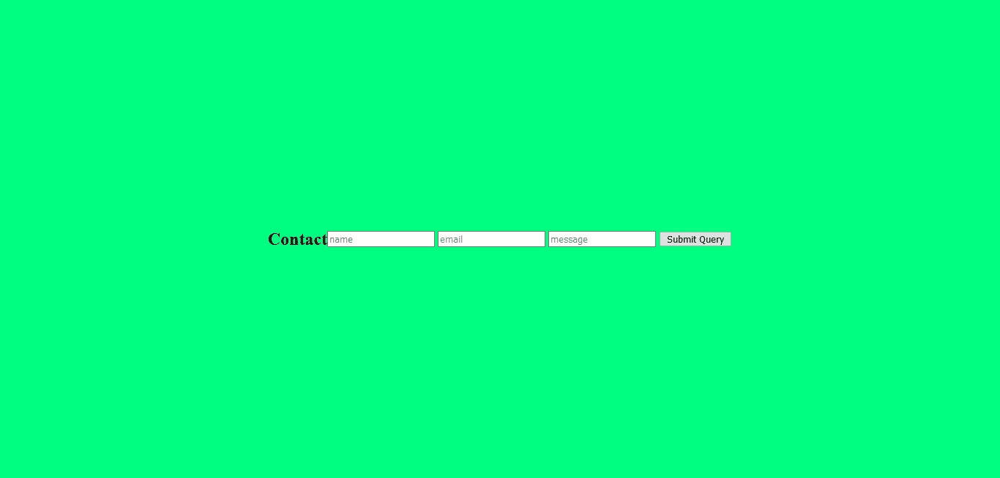

让我们改变外观，使内容垂直显示。

```
section#contact {
    background: springgreen;
    height:100vh;
    display: flex;
    justify-content: center;
    align-items: center;
    **flex-direction: column;**
}
```

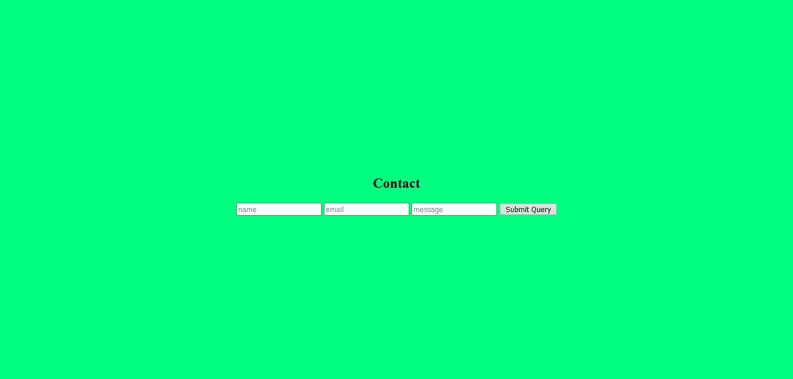

让我们也使形式垂直

```
section#contact form {
    display: flex; 
    flex-direction: column;
}
```

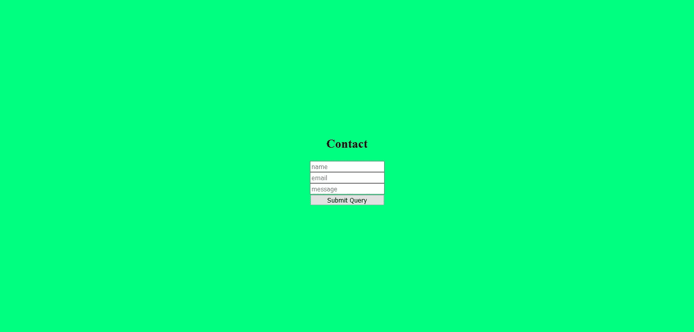

输入太小，又太近，我们需要用`**width**` 把它们放大，用`**margin**`把它们拉开

```
input {
    width: 500px;
    margin: 10px 0;
}
```

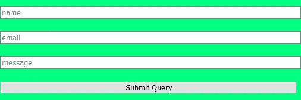

如果我们仔细观察，我们会发现`**<input type="text">**` 元素比`**<input type="submit">**` 元素更宽。这是因为这些输入有不同的`**box-sizing**` **。**让我们了解一下装箱尺寸**。**

## 盒子尺寸

有两种类型的装箱规格。这些是`**content-box**`和`**border-box**`。`<input type="submit">` 的默认框尺寸为**边框**，而`<input type="text">`的默认框尺寸为**内容框。**

如果您查看**提交输入**的 developer tools/inspect 元素，您将在**框模型下看到以下内容。**

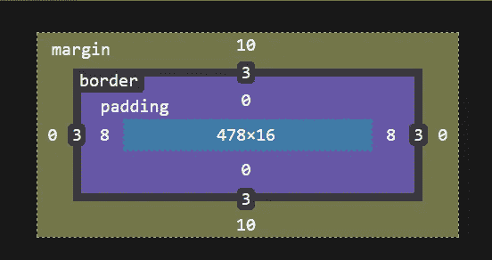

如果框尺寸是 border-box，浏览器将添加边框和填充作为设置宽度的**部分。**

如果框的大小是内容框，浏览器将包括一个边框和填充，作为设置宽度的**附加物。**

**提交**的默认框大小是 border-box，所以我们得到 3+8+478+8+3 = 500px。

以下是我们`**<input type="text">**`的盒子模型:

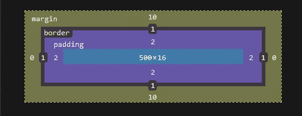

文本输入的默认框大小是内容框，所以我们得到 1+2+500+2+1

现在我们了解了盒子大小，让我们回到样式上来。

## **回到造型**

让我们给所有输入相同的框大小

```
input {
    width: 500px;
    margin: 10px 0;
    box-sizing: border-box;
}
```

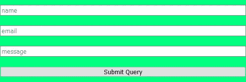

当您在输入框中键入内容时，占位符文本会显示出来。在以下情况下，这可能是一个问题:

> 你正在填写一张表格，你接了一个电话或任何让你离开网站设备(电脑或电话)的事情。当你回来的时候，如果你不记得你填写的是哪一个字段，你将不得不清除所有输入的数据来阅读占位符文本。

为了避免这个问题，我们可以添加`**label**`元素，并使用`**for**`属性将它们与各自的输入相关联。for 属性必须链接到输入的`**id**` 属性。

简单地说，一个标签用于哪个输入由属性— `**for**` **来指示。**

```
<label **for="name"**>Name</label>
<input type="text" placeholder="name" **id="name"**/>
```

## 对于属性的重要性

`**for**`属性之所以重要，是因为`**for**`允许你点击标签，它将被视为点击输入。也就是说，点击标签会在输入框内给你一个文本光标。

这很有帮助，因为你可以合理地点击输入，开始输入，而不是只点击输入，这样更容易使用。

让我们给每个输入一个 id 和一个标签(除了提交输入)。给提交输入一个标签可能会导致意外的表单提交。

```
<label for="name">Name</label>
<input type="text" placeholder="name" id="name"/>
<label for="email">Email</label>
<input type="text" placeholder="email" id="email"/>
<label for="message">Message</label>
<input type="text" placeholder="message" id="message"/>
<input type="submit"/>
```

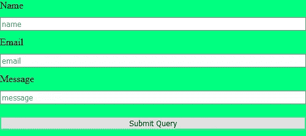

用户应该能够点击提交按钮，消息应该被带到某个电子邮件地址。为此，我们需要建立一个电子邮件 API 服务。

## 设置电子邮件 API 服务

我们可以使用许多电子邮件服务，其中之一是 SendInBlue。让我们设置 SendInBlue。

首先你必须注册 SendInBlue，一旦你登录，你必须找到或创建你的 api 密匙。查找/创建 API 密钥的地址是:

[https://account.sendinblue.com/advanced/api](https://account.sendinblue.com/advanced/api)

要在 Laravel 中使用 API 键，我们需要:

*   **安装 SendinBlue 的 API v3 Php 库**
*   **使表单可提交**
*   **使用 SendInBlue API 的功能**

## 正在安装 **SendinBlue 的 API v3 Php 库**

```
composer require sendinblue/api-v3-sdk "^6.1.0" 
```

## 使表单可提交

更改表单以包含 v-models，并向提交输入添加一个方法。

```
<label for="name">Name</label>
<input type="text" placeholder="name" id="name" **v-model="form.name"**/>
<label for="email">Email</label>
<input type="text" placeholder="email" id="email" **v-model="form.email"**/>
<label for="message">Message</label>
<input type="text" placeholder="message" id="message" **v-model="form.message"**/>
<input type="submit" **@click.prevent="sendmail"**/>
```

data():

```
form: {
    name: '',
    email: '',
    message: '',
},
```

方法:

```
appendFormData() {
    let fd = new ***FormData***();
    fd.append('name', this.form.name);
    fd.append('email', this.form.email);
    fd.append('message', this.form.message);
    return fd;
},sendmail() {
    let fd = this.appendFormData();
    axios.post('api/mail', fd)
},
```

api 路线:

```
Route::*post*('/mail', 'ContactController@mail');
```

生成 ContactController

```
php artisan make:controller ContactController
```

这里是我们将使用 SendInBlue API 的**函数的地方**

## **将使用 SendInBlue API 的函数**

我们现在需要获取 SendInBlue 提供的代码，并**修改它**以满足我们的需求。

邮件功能的代码摘自此处:

 [## 发送交易电子邮件

### 交易电子邮件用于所有非促销电子邮件:当用户创建帐户时发送，当他们…

developers.sendinblue.com](https://developers.sendinblue.com/docs/send-a-transactional-email) 

如果您向下滚动'**发送交易电子邮件**'页面，您会发现'**使用 Sendinblue API 客户端创建您的 API 请求:'**

你会发现这个盒子:

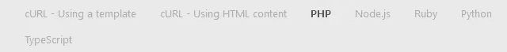

点击 php 将显示我们需要修改的 PHP 代码。

```
<?php
require_once(__DIR__ . '/vendor/autoload.php');

// Configure API key authorization: api-key
$config = SendinBlue\Client\Configuration::getDefaultConfiguration()->setApiKey('api-key', 'YOUR_API_KEY');

// Uncomment below line to configure authorization using: partner-key
// $config = SendinBlue\Client\Configuration::getDefaultConfiguration()->setApiKey('partner-key', 'YOUR_API_KEY');

$apiInstance = new SendinBlue\Client\Api\SMTPApi(
    // If you want use custom http client, pass your client which implements `GuzzleHttp\ClientInterface`.
    // This is optional, `GuzzleHttp\Client` will be used as default.
    new GuzzleHttp\Client(),
    $config
);
$sendSmtpEmail = new \SendinBlue\Client\Model\SendSmtpEmail(); // \SendinBlue\Client\Model\SendSmtpEmail | Values to send a transactional email
$sendSmtpEmail['to'] = array(array('email'=>'testmail@example.com', 'name'=>'John Doe'));
$sendSmtpEmail['templateId'] = 59;
$sendSmtpEmail['params'] = array('name'=>'John', 'surname'=>'Doe');
$sendSmtpEmail['headers'] = array('X-Mailin-custom'=>'custom_header_1:custom_value_1|custom_header_2:custom_value_2');

try {
    $result = $apiInstance->sendTransacEmail($sendSmtpEmail);
    print_r($result);
} catch (Exception $e) {
    echo 'Exception when calling SMTPApi->sendTransacEmail: ', $e->getMessage(), PHP_EOL;
}
?>
```

之间的代码可以放入邮件功能

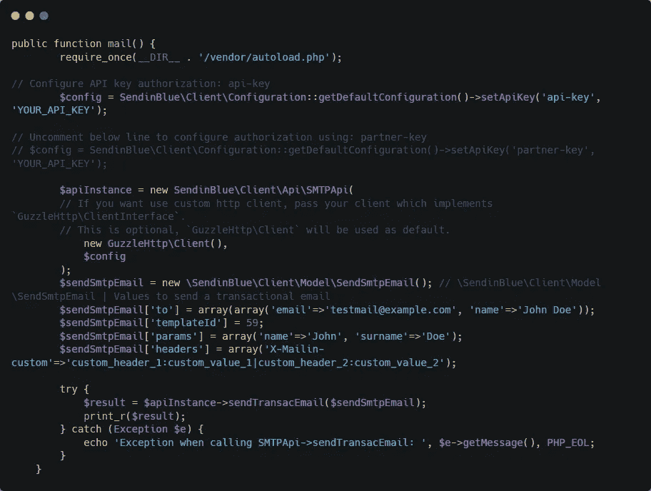

我们不需要以下两行:

1.  require_once(__DIR__。/vendor/autoload . PHP ')；
2.  $ sendSmtpEmail[' template id ']= 59；

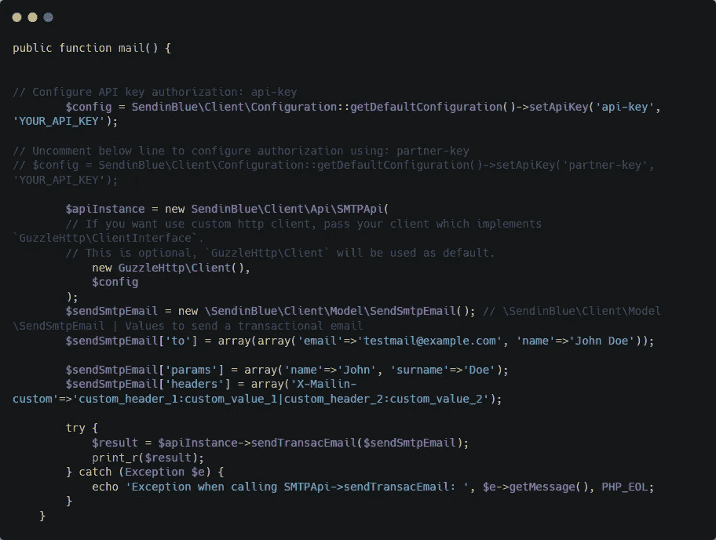

我们可以删除评论

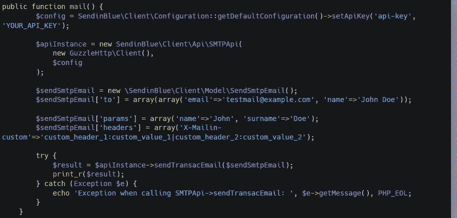

我们可以通过添加使用行来缩短函数中的行，从而重构代码

```
use GuzzleHttp\Client;
use SendinBlue\Client\Api\SMTPApi;
use SendinBlue\Client\ApiException;
use SendinBlue\Client\Configuration;
use SendinBlue\Client\Model\SendSmtpEmail;
use SendinBlue\Client\Model\SendSmtpEmailSender;
```

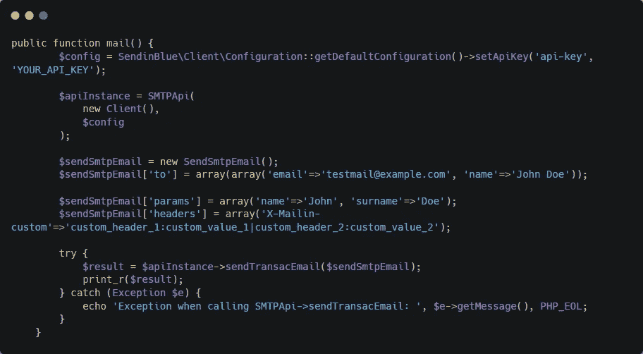

我们可以将数组从()语法改为方括号语法。

```
**$array = array(
    "foo" => "bar",
    "bar" => "foo",
);**TO**$array = [
    "foo" => "bar",
    "bar" => "foo",
];**
```

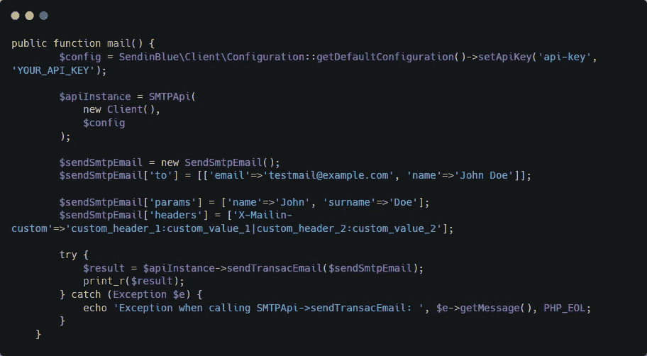

我们还应该缩短 config 行

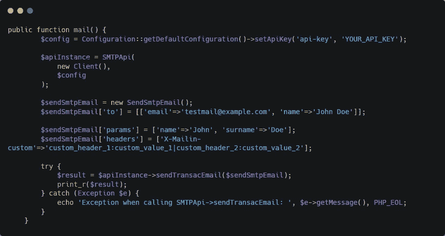

如果我们在填充了 API 密钥的情况下运行此代码，我们会得到以下错误:

> 调用未定义的函数 smtpapi()

这是因为在 SMTPApi 之前需要单词 new

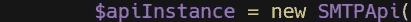

## 一系列错误

现在，当我们发送表单时，我们看到以下错误:

> 消息:[400]客户端错误:` post[https://api.sendinblue.com/v3/smtp/email`](https://api.sendinblue.com/v3/smtp/email`)导致` 400 错误请求`响应:
> {"code":"missing_parameter "，" message":"sender is missing"}

错误消息之所以存在，是因为发送者是必不可少的。要添加发件人，我们需要添加以下内容:

```
$from = [
    'name' => request('name'),
    'email' => request('email')
];
$sendSmtpEmail['sender'] = new SendSmtpEmailSender($from);
```

提交表单后，您将会收到一条错误消息，指出**主题是必填的**

> 消息:[400]客户端错误:` post[https://api.sendinblue.com/v3/smtp/email`](https://api.sendinblue.com/v3/smtp/email`)导致` 400 错误请求`响应:
> {"code":"missing_parameter "，" message ":"需要主题" }

要添加主题，我们只需添加如下内容:

```
$sendSmtpEmail['subject'] = 'Contact Form Message';
```

现在我们将得到以下错误:

> 消息:[400]客户端错误:` post【https://api.sendinblue.com/v3/smtp/email`】T2 导致` 400 错误请求`响应:
> {"code":"missing_parameter "，" message ":"需要 htmlContent 或 text content " }

这是要求 **htmlContent 或者 textContent。这是因为我们既可以发送纯文本电子邮件，也可以发送 html 电子邮件。**

我们只想从消息输入框中取出明文消息并发送它。

`$sendSmtpEmail[‘textContent’] = request(‘message’);`

```
public function mail() {
    $config = Configuration::*getDefaultConfiguration*()->setApiKey('api-key', 'API KEY HERE');

    $apiInstance = new SMTPApi(
        new Client(),
        $config
    );

    $sendSmtpEmail = new SendSmtpEmail();
    **$sendSmtpEmail['to'] = [['email'=>'ENTER YOUR EMAIL HERE', 'name'=>'ENTER YOUR NAME HERE']];
    $from = [
        'name' => request('name'),
        'email' => request('email')
    ];**
    **$sendSmtpEmail['sender'] = new SendSmtpEmailSender($from);
    $sendSmtpEmail['subject'] = 'Contact Form Message';
    $sendSmtpEmail['textContent'] = request('message');**
    $sendSmtpEmail['params'] = ['name'=>'John', 'surname'=>'Doe'];
    $sendSmtpEmail['headers'] = ['X-Mailin-custom'=>'custom_header_1:custom_value_1|custom_header_2:custom_value_2'];

    try {
        $result = $apiInstance->sendTransacEmail($sendSmtpEmail);
        print_r($result);
    } catch (Exception $e) {
        echo 'Exception when calling SMTPApi->sendTransacEmail: ', $e->getMessage(), *PHP_EOL*;
    }
}
```

如果你设置了一个真实的邮箱，这个代码会起作用，你会在你的收件箱里找到邮件。我们可以重写这段代码，以便于阅读。

实际发送消息的代码是`**$apiInstance->sendTransacEmail($sendSmtpEmail)**`

我们可以通过向它添加细节来构建$ sendsmtmpemail(就像已经做的那样),或者我们可以预先编写细节并将它们应用于**$ sendsmtmpemail**,如下所示:

```
public function mail() {
    $config = Configuration::*getDefaultConfiguration*()->setApiKey('api-key',
        '**API KEY HERE**');
    $apiInstance = new SMTPApi(
        new Client(),
        $config
    );
    $from = [
        'name' => request('name'),
        'email' => request('email')
    ];
    $to = [
        'name' => '**E**NTER YOUR NAME HERE',
        'email' => 'ENTER YOUR OWN EMAIL HERE'
    ];
    $details = [
        'textContent' => request('message'),
        'sender' => new SendSmtpEmailSender($from),
        'subject' => 'Contact Form Message',
        'to' => [$to]
    ];

    $sendSmtpEmail = new SendSmtpEmail($details);

    try {
        $apiInstance->sendTransacEmail($sendSmtpEmail);
        return 'done';
    } catch (ApiException $e) {
        return json_decode($e->getResponseBody(),true)['message'];
    }
}
```

在这两种情况下，都使用 SendInBlue 库的 SendSmtpEmail 类。

我们需要处理以下问题:

*   联系人表单验证
*   沿着输入显示服务器端错误
*   填写输入时隐藏错误
*   输入为空时立即显示错误
*   使用 tenaray 运算符代替 if 语句

我们将在下一章——第 18 章——讨论这些问题。