# Laravel 和 Vue:用 CRUD 管理面板创建作品集网站——第 18 章

> 原文：<https://itnext.io/laravel-and-vue-creating-a-portfolio-website-with-a-crud-admin-panel-chapter-18-42a7068fa796?source=collection_archive---------8----------------------->

## 处理联系表格和电子邮件错误

# 联系人表单的 Laravel 验证

为了让我们的电子邮件获得成功，我们需要:

1.  发报机
2.  有效发件人电子邮件
3.  文本内容/html 内容

我们可以创建一个表单请求，并在规则函数中要求这些。

```
**php artisan make:request ContactFormRequest**
```

让我们将授权功能设置为`**true**`并考虑规则功能。

```
public function authorize()
{
    return **true**;
}
```

从我们的邮件功能中可以看到，发件人由**姓名和**电子邮件组成。

```
$from = [
        'name' => request('name'),
        'email' => request('email')
    ];'sender' => new SendSmtpEmailSender($from),
```

所以我们在规则中增加了名字和电子邮件的功能。

```
public function rules()
{
    return [
        'name' => 'required',
        'email' => 'required',
    ];
}
```

1.  发件人✔️
2.  有效发件人电子邮件
3.  文本内容/html 内容

电子邮件必须是有效的电子邮件地址。我们需要给邮件规则添加`**| email**` 。

```
public function rules()
{
    return [
        'name' => 'required',
        'email' => 'required | **email**',
    ];
}
```

1.  发件人✔️
2.  有效发件人电子邮件✔️
3.  文本内容/html 内容

对于 textContent/htmlContent，请求()必须包含消息数据

```
public function rules()
{
    return [
        'name' => 'required',
        'email' => 'required | email',
        **'message' => 'required'**
    ];
}
```

1.  发件人✔️
2.  有效发件人电子邮件✔️
3.  textContent/htmlContent✔️

一旦规则写好了，我们就可以将请求添加到 mail()函数的括号中

```
public function mail(**ContactFormMailRequest $request**) {
...}
```

接下来要处理的是错误消息如何出现在 Contact 部分。

# 沿着输入显示服务器端错误

## `.then()`和。catch()

我们需要添加`**.then()**`和`**.catch()**`来分别处理成功和错误。

```
sendmail() {
    let fd = this.appendFormData();
    axios.post('api/mail', fd)
**.then(response => *console*.log(response))
.catch(error => *console*.log(error))**
},
```

发送一个空表单会在控制台中显示如下错误:

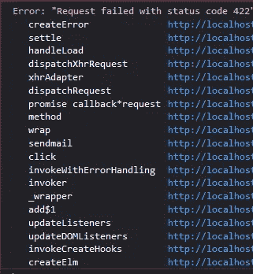

如果我们阅读 axios 文档🔍，我们找到一个名为**的处理错误的部分。**显示错误响应数据在`**error.response.data**`

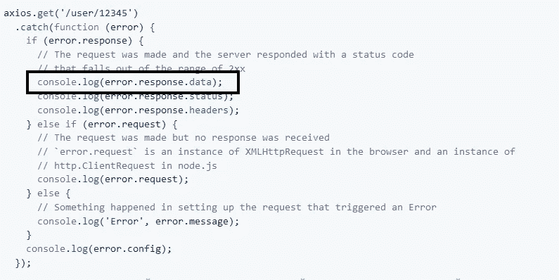

让我们记录错误响应数据

```
sendmail() {
    let fd = this.appendFormData();
    axios.post('api/mail', fd)
.then(response => *console*.log(response))
.catch(error => *console*.log(**error.response.data**))
},
```

在控制台中，我们发现 **error.response.data** 有一个名为 **errors** 的对象和一个名为 **message 的属性。**

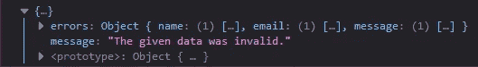

我们需要的是**错误对象**，我们需要它出现在**数据()**中。

## 将错误数据放入数据()

在 data()中，我们需要一个对象来存储捕获的错误

```
data() {
    return {
        form: {
            name: '',
            email: '',
            message: '',
        },
        **LVErrors: {
        }**
    }
},
```

我们需要改变。catch()代码，以便错误出现在 LVErrors data()返回对象中

```
sendmail() {
    let fd = this.appendFormData();
    axios.post('api/mail', fd)
.then(response => *console*.log(response))
.catch(error => *this.LVErrors =* **error.response.data**)
},
```

如果我们**提交一个空表单**并使用 **Vue DevTools** ，我们可以看到以下内容:

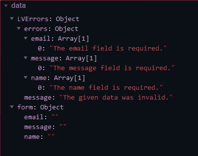

错误在**错误对象**中，我们不需要消息属性，所以让我们更改。catch()代码，以便在此。LVErrors

```
.catch(error => *this.LVErrors =* error.response.data**.errors**)
```

现在我们提交一个空表单，我们看到一些相似但不同的东西。

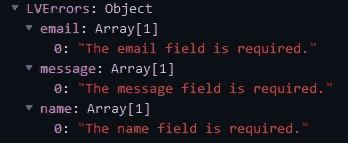

我们现在可以使用双花括号{{ }}来呈现错误消息。如果我们使用一个 span 元素，我们的代码将类似于:

`**<span>{{ LVErrors.name }}</span>**` (渲染**名**错误)。

让我们在名称标签下面测试一下。

```
<label for="name">Name</label>
**<span>{{LVErrors.name}}</span>**
<input type="text" placeholder="name" id="name" v-model="form.name"/>
```

提交一个空表单后，我们得到:

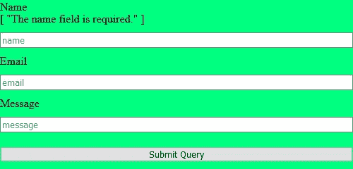

`**{{LVErrors.name}}**` 渲染 **[“名称字段是必需的。”】**因为`**{{LVErrors.name}}**` 包含一个数组，数组中是**索引 0** 处的消息字符串。

我们有三种方法来解决这个问题:

1.  花括号中的索引号{{ }}
2.  data() return{}的 LVErrors 对象中的空属性
3.  Vue.set

## 1.花括号中的索引号{{ }}

为了渲染没有数组括号[]的错误，我们可以在`**{{LVErrors.name}}**` 上加上【0】，这样就变成了`**{{LVErrors.name[0]}}**` **。**

现在我们会有这个:

```
<label for="name">Name</label>
<span>{{LVErrors.name**[0]**}}</span>
<input type="text" placeholder="name" id="name" v-model="form.name"/>
```

我们可能会得到以下错误:

> "类型错误:_vm。LVErrors.name 未定义"

出现此错误是因为我们要求 LVErrors.name 的**索引[0]，而在加载页面时 LVErrors.name 不存在。Vue 希望在我们查看对象的索引之前，该对象已经存在。**

为了解决这个问题，我们可以通过使用 **v-if** 使`**{{ LVErrors.name[0] }}**` 的出现有条件:

```
<span **v-if="LVErrors.name"**>{{LVErrors.name[0]}}</span>
```

现在在`data() return {}`中的 LVErrors.name 已经存在的情况下，错误信息会出现在**(不带方括号)**页面上。

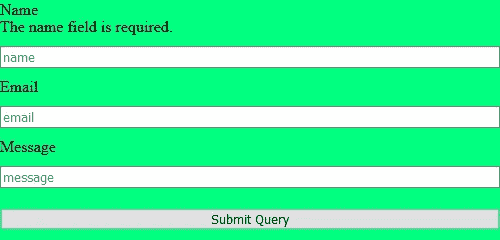

## 2.data() return{}的 LVErrors 对象中的空属性

解决消息以 **[ "MESSAGE HERE" ]** 方式出现的问题的第二种方法是自己在 data() return {}中创建属性，并将其设置为空字符串。

因此，不使用 v-if，您可以像这样将 name 放入 data() return {}中:

```
LVErrors: {
    'name' : ''
},
```

我们可以有错误**而没有 v-if**

```
<span>{{LVErrors.name[0]}}</span>
```

当我们**加载页面并且不提交表单**时，我们将在 inspect 元素中看到一个空的跨度:

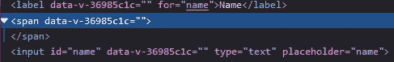

如果我们**加载页面并提交表单**:

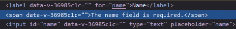

> 注意:应该在提交表单后使用 INSPECT ELEMENT/DEVTOOLS，否则我们看不到 SPAN 元素中的消息

第三种方法是使用 Vue.set，我们来看看 Vue.set

## 3.Vue.set

Vue.set 是一个内置的 Vue 函数，允许你用一个键和值填充一个对象。这里有一个例子:


你有一个叫香蕉的物体，像这样:

```
data() {
    return {
        banana: {

        }
    }
},
```

你有这个方法:

```
addColor() {
    Vue.set(this.banana, 'color', 'banana');
}
```

在页面加载时，Vue Devtools 将显示一个名为 banana 的空对象，如下所示:

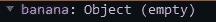

当您使用 Vue.set 方法时，您会发现对象 banana 已经填充了 propertyName 和值。propertyName 是颜色，值是黄色:

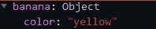

> 注意:您可能需要单击刷新按钮来查看 Vue Devtools 中的数据更改。


如果您想实时查看数据变化，可以在模板元素中使用`{{ banana }}`。

现在我们已经理解了 Vue.set，让我们看看如何使用它来达到我们的目的

## 我们如何使用 Vue.set

我们的目的是**用在**error . response . data . errors**中找到的错误消息填充 LVErrors**

要使用 Vue.set，我们必须遵循以下语法:

**Vue.set(目标，属性名，值)**

*   我们的**目标**是 **LVErrors** 。
*   我们想要的**属性名**是**错误名**。
*   我们想要的**值**就是**错误信息**。

现在的问题是“我们可以从哪里获得属性名和值？”

我们知道可以在接收到的对象(error.response.data.errors)中找到属性名

和

我们知道这些值在每一项的索引 0 处。

由于有多个错误需要设置，我们应该在 in 循环中使用一个**。catch()像这样:**

```
.catch(error => {
    let errors = error.response.data.errors;
    **for** (const item **in** errors) {
        Vue.set(this.LVErrors, item, errors[item][0])
    }
});
```

现在，对于 errors 对象中的每个项目，将设置项目名称和值。

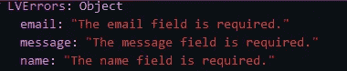

现在，我们可以通过如下代码让所有错误出现在我们的输入旁边:

```
<label for="name">Name</label>
**<span>{{LVErrors.name}}</span>**
<input type="text" placeholder="name" id="name" v-model="form.name"/>
<label for="email">Email</label>
**<span>{{LVErrors.email}}</span>**
<input type="text" placeholder="email" id="email" v-model="form.email"/>
<label for="message">Message</label>
**<span>{{LVErrors.message}}</span>**
<input type="text" placeholder="message" id="message" v-model="form.message"/>
<input type="submit" @click.prevent="sendmail"/>
```

现在，在提交表单时，您将看到如下所示的内容:

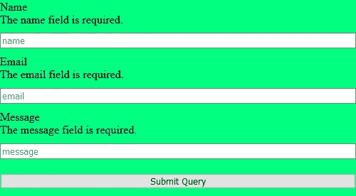

现在是时候隐藏错误了，不管它们各自的输入框中是否有文本。

但在此之前，让我们给错误一些样式

`<span **class="error"**>{{LVErrors.name}}</span>`

```
.error {color:red;}
```


## 填写输入时隐藏错误

这里我们要做的是**观察数据变化。**

Vue 有一个名为`**$watch**` 的内置方法，它允许您检测 data()中的值何时发生了变化。一旦值发生变化，您就可以对数据变化进行反应/回调，这是一个函数。

如果我们想观看 **form.name，**我们将添加以下代码:

```
this.$watch('form.name', function() {console.log('watching data change')})
```

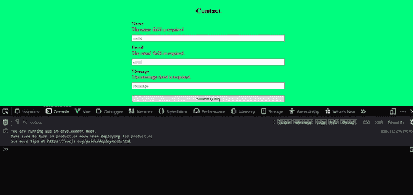

如果你想观察整个表单对象，你必须像这样添加`{deep:true}`:

```
**this.$watch('form',** function() {console.log('watching data change')**, {deep:true});**
```

在我们的例子中，我们可以使用`**$watch**`来检测姓名、电子邮件或消息是否已经改变，并在呈现的页面中隐藏它们各自的错误。

```
sendmail() {
    let fd = this.appendFormData();
    axios.post('api/mail', fd)
        .then(response => ***console***.log(response))
        .catch(error => {
            let errors = error.response.data.errors;
            for (const item in errors) {
                Vue.set(this.LVErrors, item, errors[item][0])
            }
        });
    **this.$watch('form', this.watchForm, {deep:true});**
},watchForm() {
    let value = ***document***.activeElement.value;
    let inputId = ***document***.activeElement.id;
    let errorElem = ***document***.querySelector(`span[data-id='${inputId}']`);
    if (value !== "") {
        errorElem.classList.add("hide");
    } else {
        errorElem.classList.remove("hide");
    }
},
```

> 代码解释:我们在`**this.$watch**` **中调用 watchForm()函数。**
> 
> watchForm()函数根据表单输入是否被填充来隐藏和显示错误。
> 
> 我们正在获取我们正在输入的元素的`**value**`和`**id**`(document . active element)。
> 
> 我们使用该 id 并将其与错误元素(即 span) data-id 进行匹配(使用 document.querySelector())。
> 
> 如果 activeElement 有输入的内容，我们添加 hide 类，否则我们删除 hide 类。
> 
> hide 类是一个 css 类，位于 style 元素中

```
.hide {
    opacity: 0;
}
```

表单代码应该是:

```
<form>
<label for="name">Name</label>
<span class="error" **data-id="name"**>{{LVErrors.name}}</span>
<input type="text" placeholder="name" id="name" v-model="form.name"/>

<label for="email">Email</label>
<span class="error" **data-id="email"**>{{LVErrors.email}}</span>
<input type="text" placeholder="email" id="email" v-model="form.email"/>

<label for="message">Message</label>
<span class="error" **data-id="message"**>{{LVErrors.message}}</span>
<input type="text" placeholder="message" id="message" v-model="form.message"/>

<input type="submit" @click.prevent="sendmail"/>
</form>
```

我们还可以通过使用三元运算符而不是 if 语句来重构代码。

## 三元运算符

**“三元运算符”**类似于**“if else 语句”**，两者都查看条件是否为真，然后对此做出响应。

区别在于语法。

if 语句的语法是:

```
if (condition) {// do stuff if true} else {// do stuff if false
}
```

三元运算符的语法是:

```
condition ? DO STUFF IF TRUE : DO STUFF IF FALSE
```

在我们的例子中，条件是:`**value !== ""**`

在条件之后，我们有一个问号`value !== "" **?**`

问号后面是条件为真时应该发生的情况。如果条件为真，我们应该添加隐藏类

`value !== "" ? **errorElem.classList.add("hide")**`

如果为真，do stuff 位后面跟一个冒号`value !== "" ? **errorElem.classList.add("hide") :**`

如果条件为假，我们删除隐藏类`value !== "" ? errorElem.classList.add("hide") : **errorElem.classList.remove("hide");**`

因此，我们的 if 语句被重构为:

```
if (value !== "") {
        errorElem.classList.add("hide");
    } else {
        errorElem.classList.remove("hide");
    }
```

收件人:

```
value !== "" ? errorElem.classList.add("hide") : **errorElem.classList.remove("hide");**
```

watchform 函数现在看起来像这样:

```
watchForm() {
    let value = ***document***.activeElement.value;
    let id = ***document***.activeElement.id;
    let errorElem = ***document***.querySelector(`span[data-id='${id}']`);
    value !== "" ? errorElem.classList.add("hide") : errorElem.classList.remove("hide");
},
```

在第 19 章中，我们将做联系表单的客户端验证。