# Laravel 和 Vue:用 CRUD 管理面板创建作品集网站——第 19 章

> 原文：<https://itnext.io/laravel-and-vue-creating-a-portfolio-website-with-a-crud-admin-panel-chapter-19-de3a8d9e69ce?source=collection_archive---------1----------------------->

## 联系表单的客户端验证和脚注编辑器

对于客户端验证，我们可以为每个输入添加 HTML5 属性 **required**

输入的名称变为:

```
<input type="text" placeholder="name" id="name" v-model="form.name" **required**/>
```

电子邮件输入变成:

```
<input type="text" placeholder="email" id="email" v-model="form.email" **required**/>
```

消息输入变为:

```
<input type="text" placeholder="message" id="message" v-model="form.message" **required**/>
```

让我们提交表格。

## 问题

这里我们有一个问题，添加所需的属性似乎没有效果。表单以同样的方式运行，就好像缺少必需的属性一样。

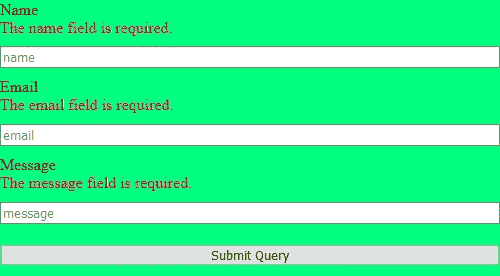

## 为什么会出现这个问题？

这个问题的原因是我们在提交输入中使用了@click.prevent。

```
<input type="submit" @click.prevent="sendmail"/>
```

## 我们能带上。防止远离？

如果我们。阻止掉，这将是结果:

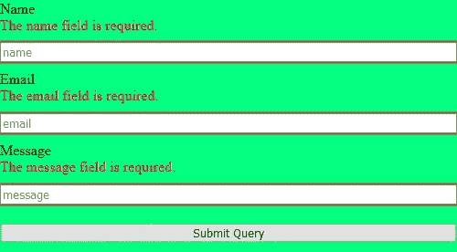

HTML5 需要属性验证和 Laravel 验证。这也是一个问题，因为它忽略了客户端验证的要点。

客户端验证的目的是增加安全性。在表单被发送到服务器进行验证之前，可以在客户端对其进行检查。这使得服务器不太可能遇到无效信息。

## 解决办法

解决方案是有一种将验证分步骤进行的方法。首先进行客户端验证，然后根据表单是否成功通过客户端验证，表单将被发送到服务器。

我们将使用一个名为`**reportValidity()**`的内置 JavaScript 方法

我们的提交输入变为:

```
<input type="submit" @click.prevent="clientSideValidation"/>
```

该方法运行 reportValidity()，如果成功，则运行我们的 sendmail()方法:

```
clientSideValidation() {
    let validity = ***document***.querySelector(`form`).reportValidity();
    if (validity) {
        this.sendmail();
    }
},
```

## 多线消息

现在，我们只能发送一行消息。要发送多行消息，需要一个 textarea。

让我们将消息框改为`**<textarea></textarea>**`而不是输入。

```
<textarea type="text" placeholder="message" id="message" v-model="form.message" required/>
```

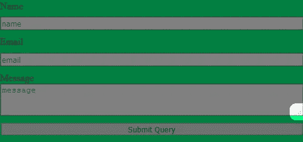

我们可以取消文本区域的调整大小功能，并设置一个高度，如下所示:

```
textarea {
    resize: none;
    height:200px;
}
```

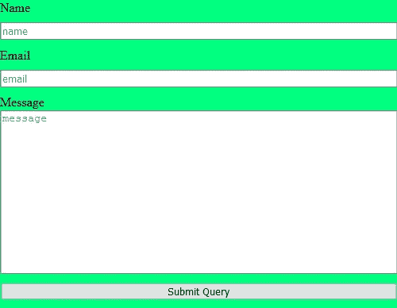

现在你可以输入一条多行消息，一封多行邮件将被发送到收件箱。

让我们来看看页脚编辑器和页脚组件。


【https://unsplash.com/@firmbee 

# 页脚编辑器

在页脚，我们将有社交媒体链接。

我们应该在个人资料表中添加社交媒体链接。

所以我们需要一次迁移

```
php artisan make:migration CreateSocialMediaLinksTable
```

在迁移中，我们将有社交媒体网站的专栏。

```
public function up()
{
    Schema::create('social_links', function (Blueprint $table) {
        $table->bigIncrements('id');
        $table->string('facebook')->nullable();
        $table->string('twitter')->nullable();
        $table->string('medium')->nullable();
        $table->timestamps();
    });
}
```

让我们迁移这个。

```
php artisan migrate
```

现在有桌子了，我们需要一张表格。

我们需要创建一个 vue 组件—**social medialinks editor . vue**

```
<template>
    <section id="socialMediaLinksEditor">

    </section>
</template>
```

在该部分中，我们将有一个标题和一个表单。

```
<section id="socialMediaLinksEditor">
    <h1>Add your social media links</h1>
    <form>
    </form>
</section>
```

在表单中，我们需要**标签**、**文本输入**和**提交输入**。

```
<form>
    <label for="facebook">Facebook</label>
    <input type="text" id="facebook"/>
    <label for="twitter">Twitter</label>
    <input type="text" id="twitter"/>
    <label for="medium">Medium</label>
    <input type="text" id="medium"/>
    <input type="submit" value="submit">
</form>
```


让我们来设计组件的样式。

```
#socialMediaLinksEditor {
    background: aquamarine;
    height: 100vh;
    display: flex;
    justify-content: center;
    align-items: center;
    flex-direction: column;
}
```

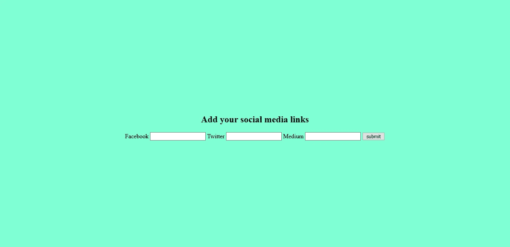

让我们来设计表单的样式。

```
form {
    display:flex;
    flex-direction:column;
    border:solid;
    background: bisque;
}
```

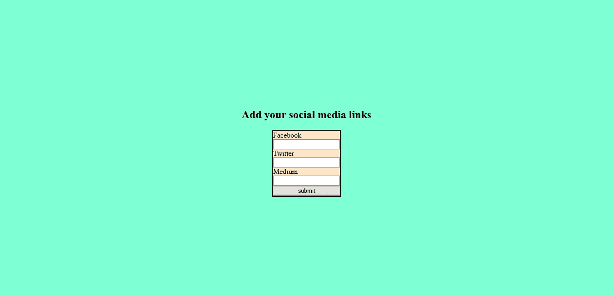

输入似乎太小，让我们给他们更多的高度。

```
input {
    height: 30px;
    font-size: 1em;
}
```

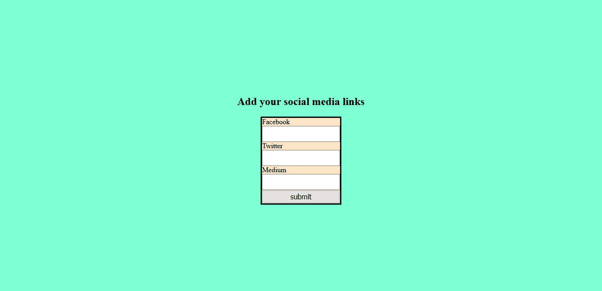

我们可以将标签和文本输入一起分类到 div 中。

```
<form>
    <div class="form-group">
        <label for="facebook">Facebook</label>
        <input type="text" id="facebook"/>
    </div>
    <div class="form-group">
        <label for="twitter">Twitter</label>
        <input type="text" id="twitter"/>
    </div>
    <div class="form-group">
        <label for="medium">Medium</label>
        <input type="text" id="medium"/>
    </div>
    <input type="submit" value="submit">
</form>
```

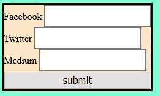

设置表单组的样式。

```
.form-group {
    display: grid;
    grid-template-columns: 1fr 1fr;
    padding: 10px;
    border-bottom: dotted;
}
```

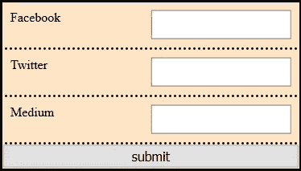

使用`**:last-of-type**`去掉最后一个表单组的虚线边框。

```
.form-group**:last-of-type** {
    border-bottom: none;
}
```

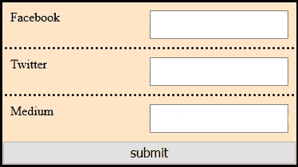

将标签居中

```
label {
    display: flex;
    justify-content: center;
    align-items: center;
}
```

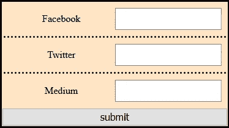

我们已经设计了表单，现在我们需要**一个提交方法**和 **v-models** 。

# 提交表单

## <template></template>

```
<form>
    <div class="form-group">
        <label for="facebook">Facebook</label>
        <input type="text" id="facebook" **v-model="social.facebook"**/>
    </div>
    <div class="form-group">
        <label for="twitter">Twitter</label>
        <input type="text" id="twitter" **v-model="social.twitter"**/>
    </div>
    <div class="form-group">
        <label for="medium">Medium</label>
        <input type="text" id="medium" **v-model="social.medium"**/>
    </div>
    <input type="submit" value="submit" **@click="onSubmit"**>
</form>
```

```
data() {
    return {
        social: {
            facebook: '',
            medium: '',
            twitter: ''
        },
    }
},
```

## 追加表单数据并将其发送到发送路径的方法:

```
onSubmit() {
    let fd = new ***FormData***();
    fd.append('facebook', this.social.facebook);
    fd.append('twitter', this.social.twitter);
    fd.append('medium', this.social.medium);
    this.postSocial(fd);
},postSocial(fd) {
    axios.post('api/social', fd);
},
```

社交链接 post 路由应该链接到控制器中的一个函数，该函数将发送的表单数据存储在数据库中:

## API 路线

```
Route::*post*('/social', 'SocialController@store');
```

## 创建一个社交链接的模型。

```
php artisan make:model Social
```

## 为社交链接创建一个控制器。

```
php artisan make:controller SocialController
```

现在 Laravel 已经生成了一个名为**SocialController.php**的文件。

在控制器中，我们需要使用社会模型和存储功能。

```
use App\Social;
```

store()函数类似于 ProfileController.php 的 store 函数。

```
public function store()
{
    $social = Social::*all*();
    if ($social->isEmpty()) {
        $this->insertData($social = new Social());
    } else {
        $this->insertData($social = Social::*findOrFail*(1));
    }
}

private function insertData(Social $social) {
    if (request()->filled('facebook')) {
        $social->facebook = request()->facebook;
    }
    if (request()->filled('twitter')) {
        $social->twitter = request()->twitter;
    }
    if (request()->filled('medium')) {
        $social->medium = request()->medium;
    }
    $social->save();
    return 'data inserted';
}
```

## 提交后获取数据

回到 vue 组件，我们应该添加表单提交和服务器响应之后发生的事情。

```
postSocial(fd) {
    axios.post('api/social', fd)
        .then(this.getSocial())
},getSocial() {
    axios.get('/api/social')
        .then(response => this.social = response.data)
        .catch(error => {
            ***console***.log(error);
        });
},
```

获取社交数据的 api 途径:

```
Route::*get*('/social', 'SocialController@index');
```

在控制器函数中，我们将使用`::first()`和 inside ::first()，我们将有一个数组来获取我们想要的数据库列。

让我们获得 facebook、medium 和 twitter 专栏。

```
public function index() {
    return Social::*first*(['facebook', 'medium', 'twitter']);
}
```

现在，如果数据库字段有数据，文本输入将显示该数据。

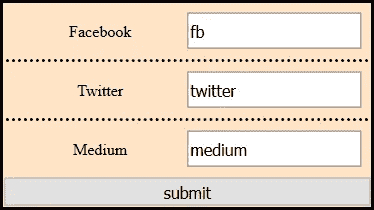

## 获取页面加载数据

这里我们简单地有一个`mounted()` 块并添加了`this.getSocial`

```
mounted() {
    this.getSocial();
},
```

现在我们需要处理页脚组件。我们将在第 20 章中讨论这个问题。

到时候见。