# Laravel 和 Vue:用 CRUD 管理面板创建作品集网站——第 20 章

> 原文：<https://itnext.io/laravel-and-vue-creating-a-portfolio-website-with-a-crud-admin-panel-chapter-20-738046daec6b?source=collection_archive---------8----------------------->

## 页脚组件/避免冲突


背景图片来自 Alexas_Fotos / Pixabay

# 可能会发生碰撞

我们需要创建一个页脚组件。我们通常会:

*   创建组件文件
*   在 App.vue 的脚本中导入文件
*   将文件包含在 App.vue 的脚本元素的组件块中
*   使用 App.vue 模板中的组件

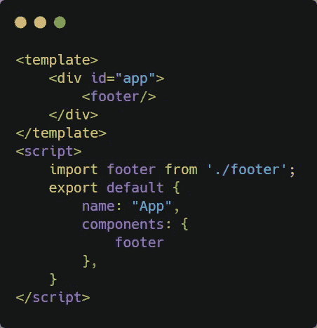

如果在浏览器中运行，您将在浏览器控制台中看到以下消息:

> **不要使用内置或保留的 HTML 元素作为组件 id: footer**

因为 footer 元素是为 HTML 保留的，所以它不能用于包含组件。

## 解决办法

简单地说，把页脚标记改成可以接受的。模板、导入行和组件块中应使用可接受的名称。

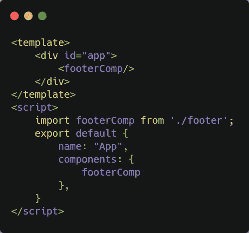

## 在页脚组件中

在模板元素中，我们需要页脚元素。在页脚元素中，我们需要一个标题和一个显示社交媒体图标的元素。

> 注意:`<footer>`可以在这里使用，因为虽然保留元素**不能作为 Vue 组件**使用，但这并不意味着它们不能在 Vue 组件中使用**。**

```
<template>
    <footer>
        <h1>My social links</h1>
        <div id="social-links">

        </div>
    </footer>
</template>

<script>
    export default {
        name: "Footer"
    }
</script>

<style scoped>

</style>
```

#social-links 元素应该有一些链接。

```
<div id="social-links">
    <a href="">Facebook</a>
    <a href="">Twitter</a>
    <a href="">Medium</a>
</div>
```

在浏览器中，它看起来像这样:

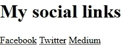

链接应该是有条件的。一个链接应该只出现在其数据库字段已被填写。为此我们需要`**v-if**` s

```
<div id="social-links">
    <a v-if="facebook" href="">Facebook</a>
    <a v-if="twitter" href="">Twitter</a>
    <a v-if="medium" href="">Medium</a>
</div>
```

这会产生如下错误:

> 属性或方法“facebook”未在实例上定义，但在呈现期间被引用。

我们需要在脚本标签的 data()返回对象中定义 v-ifs

```
<script>
    export default {
        name: "Footer",
        data() {
            return {
                facebook: '',
                twitter: '',
                medium: '',
            }
        }
    }
</script>
```

如果 facebook、twitter 和 medium 对象为空，则不会显示任何链接。

## 将数据放入数据()

在这里，我们只是使用来自**social medialinks editor . vue**的相同的`**getSocial()**`方法，并从一个挂载块运行它

```
mounted() {
    this.getSocial();
},
methods: {
    getSocial() {
        axios.get('/api/social')
            .then(response => this.social = response.data)
            .catch(error => console.log(error));
    },
}
```

将**社交**添加到 data()返回对象中

```
data() {
    return {
        facebook: '',
        twitter: '',
        medium: '',
        social: ''
    }
},
```

我们可以在 Vue Devtools 中看到，社会对象正在被接收

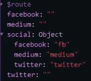

我们现在应该改变我们的 v-if，使它们与社会目标相联系

```
<div id="social-links">
    <a v-if="**social.facebook**" href="">Facebook</a>
    <a v-if="**social.twitter**" href="">Twitter</a>
    <a v-if="**social.medium**" href="">Medium</a>
</div>
```

因为，我们现在在社会对象中接收社会媒体链接，我们可以通过去除我们先前的 v-if 定义来清理 data()块。


由 [Lukas ter Poorten](https://unsplash.com/@conversietopper?utm_source=medium&utm_medium=referral) 在 [Unsplash](https://unsplash.com?utm_source=medium&utm_medium=referral) 上拍摄

data() {
返回{
̶f̶a̶c̶e̶b̶o̶o̶k̶:̶̶'̶'̶,̶
̶t̶w̶i̶t̶t̶e̶r̶:̶̶'̶'̶,̶
̶m̶e̶d̶i̶u̶m̶:̶̶'̶'̶,̶
社交:' '
}
}，

我们只剩下

```
data() {
    return {
        social: ''
    }
},
```

现在我们有了:

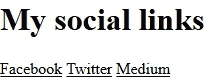

虽然这看起来没有什么变化，但是链接现在是有条件的。

我们可以使用 **tinker 来测试这一点。**让我们在终端或 cmd 中运行 tinker

```
php artisan tinker
```

在 tinker 中，我们使用第一行的 id `**1**`来`**find**`

```
App\Social::find(1)
```

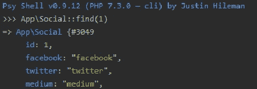

我们将`App\Social::find(1)`赋给一个变量

```
$social = App\Social::find(1)
```

然后我们像这样改变一个字段的值:

```
**$social->facebook = ''**
```

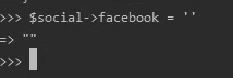

我们必须节约，否则就没用了

要保存，必须使用 save()函数。

```
**$social->save();**
```

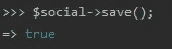

终端/cmd 返回 true。

现在我们可以通过再次使用`::find(1)`来查看它是否发生了变化。

```
$social = App\Social::find(1)
```

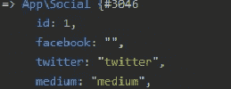

我们可以看到 facebook 值现在是空的。

让我们检查一下浏览器窗口以及 Vue Devtools 中呈现的内容。

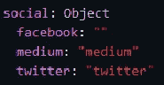

facebook 链接不会出现在浏览器窗口中，并且在 Vue Devtools 中，该值为空。这意味着我们的假设正在起作用。✅

**进一步检查**:我们也可以转到社交 api 路线，我们会发现:

```
{"facebook":"","medium":"medium","twitter":"twitter"}
```

## 绑定+链接

我们现在应该使用`**v-bind**`绑定 href 属性

```
<a v-if="social.facebook" 
**v-bind:href="'https://facebook.com/' + social.facebook"**>
Facebook
</a>
```

> 代码解释:
> 
> 如果填写了 **social.facebook** ，
> 
> 将 href 属性绑定到 **social.facebook**
> 
> 添加一串**https://facebook.com/**作为前缀

让我们将约束和结论应用于所有的社会联系:

```
<a v-if="social.facebook" **v-bind:href="'https://facebook.com/' + social.facebook"**>Facebook</a>
<a v-if="social.twitter" **v-bind:href="'https://twitter.com/' + social.twitter"**>Twitter</a>
<a v-if="social.medium" **v-bind:href="'https://medium.com/' + social.medium"**>Medium</a>
```

如果我们加载页面，我们会看到链接的内部文本，即脸书，推特，媒体。

此时，我们需要使用双花括号{{}} 将内部文本替换为**值**

```
<a v-if="social.facebook" v-bind:href="'https://facebook.com/' + social.facebook">**{{social.facebook}}**</a>
<a v-if="social.twitter" v-bind:href="'https://twitter.com/' + social.twitter">**{{social.twitter}}**</a>
<a v-if="social.medium" v-bind:href="'https://medium.com/' + social.medium">**{{social.medium}}**</a>
```

我们可以给这些值加上前缀`**svg**` **s** ，后跟一个正斜杠/。

```
<a v-if="social.facebook" v-bind:href="'https://facebook.com/' + social.facebook">
    **<svg  width="24" height="24" viewBox="0 0 24 24"><path d="M22.675 0h-21.35c-.732 0-1.325.593-1.325 1.325v21.351c0 .731.593 1.324 1.325 1.324h11.495v-9.294h-3.128v-3.622h3.128v-2.671c0-3.1 1.893-4.788 4.659-4.788 1.325 0 2.463.099 2.795.143v3.24l-1.918.001c-1.504 0-1.795.715-1.795 1.763v2.313h3.587l-.467 3.622h-3.12v9.293h6.116c.73 0 1.323-.593 1.323-1.325v-21.35c0-.732-.593-1.325-1.325-1.325z"/></svg>**
    /
    {{social.facebook}}
</a>
```

这里使用的 SVG 可以在以下位置找到:

[https://iconmonstr.com/](https://iconmonstr.com/twitter-3-svg/)

如果你有 twitter 和 medium 的值，但没有 facebook 的值，你会得到这样的结果:

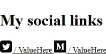

如果你填写 facebook 字段，你会看到这样的内容:

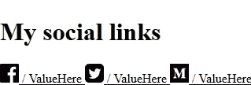

## 页脚看起来是什么样子

我们应该编辑 App.vue，这样我们就可以在 footerComp 上有一个组件

```
<div id="app">
    <socialMediaLinksEditor/>
    <footerComp/>
</div>
<script>
    import socialMediaLinksEditor from './socialMediaLinksEditor'
    import footerComp from './footer';
    export default {
        name: "App",
        components: {
            socialMediaLinksEditor,
            footerComp
        }
    }
</script>
```

我们看到了这个:

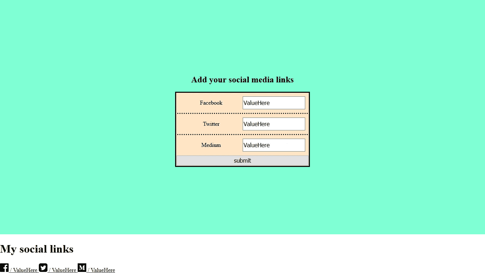

我们可以使用 CSS 将链接均匀地分布在元素宽度上

```
#social-links {
    display:flex;
    justify-content:space-evenly;
}
```

我们可以给页脚添加背景色

```
footer {
    background: #dd3e54;
}
```

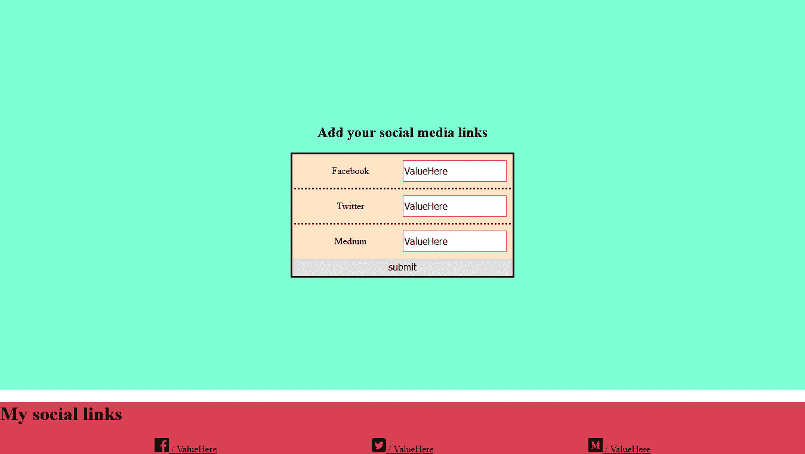

您现在可能会注意到，在页脚和前面的组件之间有一个空白。这种白色差距的原因是利润率。我们需要将 h1 边距设置为 0。

```
h1 {
    margin: 0;
}
```

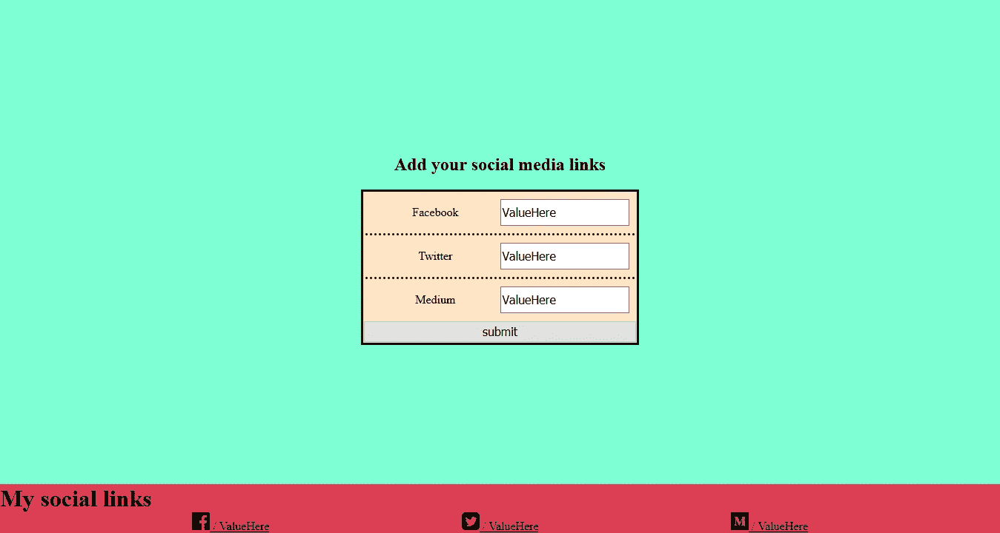

让我们

*   让页脚变大
*   使页脚成为两个相等列的网格。
*   将页脚项与页脚中心对齐
*   将 h1 的**文本对准 **h1 元素**的中心。**

> 元素的宽度可以比其中包含的文本更宽。如果您使用开发工具，您可以看到 h1 元素比它的文本大

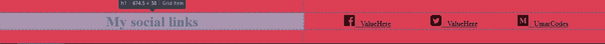

```
footer {
    background: #dd3e54;
    height: 100px;
    display: grid;
    grid-template-columns: 1fr 1fr;
    align-items: center;
}h1 { text-align:center; }
```


让我们给 svgs 一个边框和背景。

```
svg {
    border: white solid;
    background: white;
}
```

让我们来设计链接并添加悬停效果。

```
a {
    color:white;
    border:solid black;
    background: black;
    display: flex;
    justify-content: center;
    align-items: center;
}

a:hover {
    border-style: groove;
    border-width:10px;
}
```


悬停时，边框样式变为`groove`，宽度变为`10px`

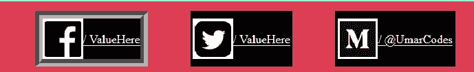

现在我们有了自己的页脚和相应的编辑器，即 socialMediaLinksEditor.vue，是时候创建一个**完整的公共主页**并将 vue-router 添加到应用程序/网站中了。

这些我们将在下一章讨论。