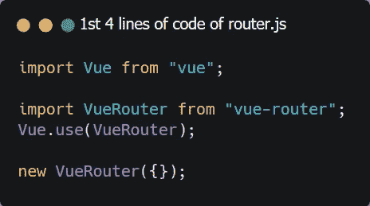
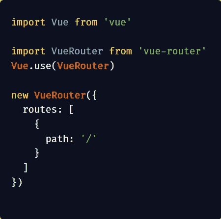
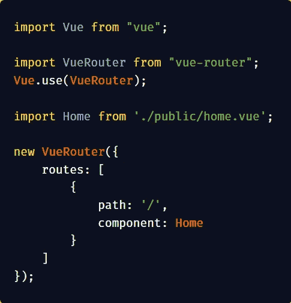

# Laravel 和 Vue:用 CRUD 管理面板创建作品集网站——第 21 章

> 原文：<https://itnext.io/laravel-and-vue-creating-a-portfolio-website-with-a-crud-admin-panel-chapter-21-868e648fcae7?source=collection_archive---------8----------------------->

## vue-路由器和公共主页

# Vue 路由器

我们已经看到拉弗尔有路由文件，web.php 和 api.php。Vue 也有路由，但是只有在我们安装了**路由器的情况下，使用 vue 进行路由才是可能的(这里的**路由器指的是路由器包，而不是硬件**)。**

Vue 的路由器有很多，Vue 的官方路由器叫 Vue-Router。让我们安装它:

我们应该转到终端/cmd 并键入:

```
npm i vue-router
```

这将把 vue-router 下载到项目中。我们可以通过检查 **node_modules** 文件夹来验证这一点，其中应该有一个名为 vue-router 的文件夹。

现在我们需要编写路由代码。

## 写路由👅 🔀

在这里，我们创建一个名为 router.js 的文件。我们用下面几行开始这个文件:

```
*import* Vue *from* "vue";

*import* VueRouter *from* "vue-router";
```

上述两行是第三行工作所必需的，即:

```
Vue.use(VueRouter);
```

这当然使我们能够使用 VueRouter。您可以通过创建一个路由器实例来使用它，即`new VueRouter()`，在 VueRouter 实例中有一个对象{}，这样就形成了第四行:

```
*new* VueRouter({});
```



在 VueRouter 的对象中，应该有一个名为 **routes** 的数组[]

```
*new* VueRouter({
    routes: []
});
```

在 routes 数组中，将会有对象{}。这些对象将定义路线。

让我们将下面的对象放在 routes 数组中。

```
{
    path: '/',
},
```



该路径需要分配一个 vue 组件。

```
{
    path: '/',
    component: Home
},
```

我们必须创建并导入组件。此组件需要导入到 VueRouter 实例之上(新的 VueRouter)

```
*import* Home *from* './public/home.vue';
```

现在，我们的 router.js 文件应该如下所示:



下一步是导出 VueRouter 实例，以便可以在创建我们的 vue 应用程序的文件 **app.js** 中使用。

为了导出实例，我们将它分配给一个**常量**和**导出**常量

```
*import* Vue *from* "vue";

*import* VueRouter *from* "vue-router";
Vue.use(VueRouter);
*import* Home *from* './public/home.vue';

***const* router** = *new* VueRouter({
    routes: [
        {
            path: '/',
            component: Home
        }
    ]
});

***export default* router;**
```

我们可以看到，在`**new VueRouter**`之前，有`**const router =**` ，然后使用行`**export default router**`导出这个常量；

**我们可以看到，要编写路由文件，我们必须做到以下几点:**

1.  导入 Vue
2.  导入 VueRouter
3.  Vue.use(VueRouter)
4.  创建一个包含对象的 VueRouter 实例(`**new VueRouter({});**`)
5.  在 VueRouter 实例中创建一个 routes 数组
6.  在路线数组中创建对象。这些对象定义路线。
7.  在路线定义对象中有`**path**` 和`**component**` 。
8.  创建并导入一个 Vue 组件，并将其用作`**component**`的值
9.  将 VueRouter 实例分配给一个**常量**并将其导出(导出默认路由器)

## 导入 router.js

现在，我们应该打开 **app.js** ，我们的代码应该更改为包含 router.js 文件:

```
require('./bootstrap');

window.Vue = require('vue');

*import* App *from* './App.vue';
*import* router *from* './router.js';

*const* app = *new* Vue({
    el: '#app',
    render: h => h(App),
    router
});
```

## 使用<router-view>进行路由</router-view>

如果我们在浏览器中运行应用程序，我们可以看到屏幕上显示了 **App.vue** 的内容。

App.vue 的`**template**` 需要更改如下:

```
<template>
    <router-view/>
</template>
```

`**<router-view/>**`元素显示被路由的组件。

现在是时候在公共主页上工作了

# 公共主页

公共主页将是一个单页网站，这意味着所有的元素都需要堆叠。


public/home.vue 的模板元素应该如下所示:

```
<template>
    <div *id*="public-home">
        <masthead *:profile*="profile"/>
        <portfolio/>
        <about/>
        <contact/>
        <footerComp/>
    </div>
</template>
```

元件必须导入并包含在元件块中。

```
<script>
    *import* masthead *from* "./sections/masthead";
    *import* Portfolio *from* "./sections/Portfolio";
    *import* About *from* "./sections/About";
    *import* Contact *from* "./sections/Contact";
    *import* FooterComp *from* "./sections/Footer";
    *export default* {
        name: "home",
        components: {
            masthead,
            Portfolio,
            About,
            Contact,
            FooterComp
        },
        data() {
            *return* {
                profile: {
                    type:Object
                }
            }
        },
        mounted() {
            *this*.getProfile();
        },
        methods: {
            getProfile() {
                axios.get('/api/profile')
                    .then(response => {
                        *this*.profile = response.data;
                    })
                    .catch(error => {
                        console.log(error);
                    });
            },
        }
    }
</script>
```

在下一章，我们将在管理主页上工作，并添加一个登录系统，这样你就可以在使用任何编辑器组件之前登录。

到时候见。