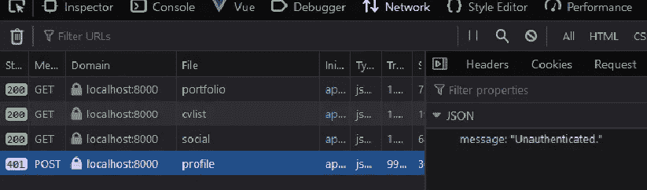
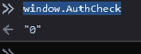
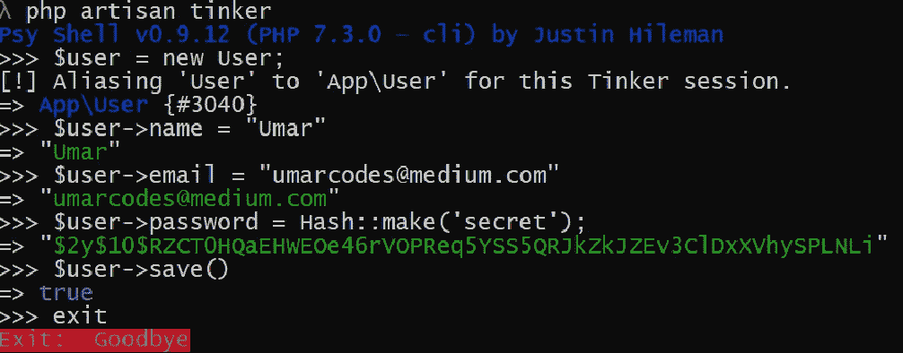
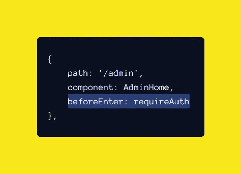
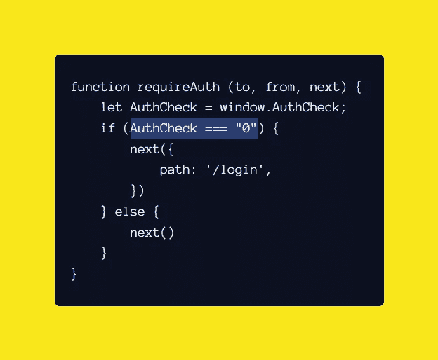
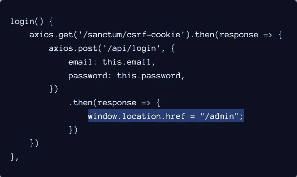

# Laravel 和 Vue:用 CRUD 管理面板创建作品集网站——第 22 章

> 原文：<https://itnext.io/laravel-and-vue-creating-a-portfolio-website-with-a-crud-admin-panel-chapter-22-72866624bd4d?source=collection_archive---------0----------------------->

## 管理主页和登录系统

我们的管理员主页应该是这样的:

admin/home.vue👇

```
<template>
    <div *id*="admin-home">
        <ProfileEditor/>
        <PortfolioEditor/>
        <AboutEditor/>
        <social-media-links-editor/>
    </div>
</template>

<script>
    *import* ProfileEditor *from* "./sections/ProfileEditor";
    *import* PortfolioEditor *from* "./sections/PortfolioEditor";
    *import* AboutEditor *from* "./sections/AboutEditor";
    *import* SocialMediaLinksEditor *from* "./sections/socialMediaLinksEditor";

    *export default* {
        name: "AdminHome",
        components: {
            SocialMediaLinksEditor,
            AboutEditor,
            PortfolioEditor,
            ProfileEditor
        },
    }
</script>
```

让我们考虑一下登录系统。


【https://unsplash.com/@robschreckhise 

## 为什么我们需要一个登录系统？

我们需要它，因为有一些**函数/api 路径**我们不想对公众开放。我们只希望他们由管理员运行。

## 这些函数/api 路径在哪里？

管理功能在**api.php**路线文件中。我们需要保护这些路线。

## 我们如何保护路线？

我们可以通过安装和使用 **santum 中间件**来保护 api 路由。

在本章中，我们将:

1.  安装圣所中间件
2.  分配 santum 中间件
3.  阻止未经身份验证的用户访问管理组件
4.  创建登录组件
5.  创建用户
6.  重定向经过身份验证的用户

# 安装圣所中间件

我们应该转到 terminal/cmd 并键入以下内容:

```
**composer require laravel/sanctum**
```

> 故障排除:结论不要安装

如果你得到一个类似于**的错误——结论:不要在控制台中安装…**this，通过在终端中运行`**composer update**` 来更新 composer。

并在 composer 更新完成后运行`**composer require laravel/sanctum**` 。

N ext，我们必须在终端运行以下命令:

```
**php artisan vendor:publish --provider="Laravel\Sanctum\SanctumServiceProvider"**
```

这将给我们在配置文件夹中的**sanctum.php**。

现在，我们应该在**vendor/laravel/sanctum/src/Http/Middleware**中有一个名为**EnsureFrontendRequestsAreStateful.php**的文件

我们必须通过添加下面的**使用行**在 **app/Http/Kernal.php** 中使用这个文件

`**use Laravel\Sanctum\Http\Middleware\EnsureFrontendRequestsAreStateful;**`

我们需要将它插入内核的受保护中间件的 **api 数组**

```
'api' => [
    EnsureFrontendRequestsAreStateful::class,
    ...
],
```

现在我们应该去我们的。env 文件，并添加以下内容:

```
*SANCTUM_STATEFUL_DOMAINS*=domain.example
```

在这里，我们可以说圣所安装。现在，我们需要通过将中间件分配给一些路由来使用它。

## 分配圣所中间件

要将中间件分配给一条路线，必须添加`**->middleware('INSERT NAME OF MIDDLEWARE')**` **。**

在这里，我们想要使用的中间件是 **auth:sanctum** ，因此我们将保护 **/profile** post 路由，如下所示:

```
Route::*post*('/profile','ProfileController@store')->middleware('auth:sanctum');
```

我们 ***可以*** 将代码`**->middleware('auth:sanctum')**` 添加到我们想要受密室保护的每条路线。这很好，但是很费时间。

如果您不想将相同的代码键入或复制粘贴到不同的路由中，那么您可以将中间件应用到一组路由中，如下所示:

```
Route::*middleware*('**auth:sanctum**')->group(*function* () {
    // INSERT ROUTES HERE
});
```

让我们去**api.php**创建一个中间件路由组，如下所示:

```
Route::*middleware*('**auth:sanctum**')->group(*function* () {
    Route::*post*('/profile', 'ProfileController@store');
    ...
});
```

现在，如果我们发布到 **api/profile，**它将通过 sanctum 中间件，并在您未登录的情况下，在网络选项卡中显示 401 错误。



此时:

*   未经认证的用户不能使用*管理组件😃👍*
*   *未经认证的用户可以 ***访问*** 管理组件🙁👎*

> *是时候把眉头拧下来了*
> 
> *让我们阻止未经身份验证的用户访问管理组件。*

## *阻止未经身份验证的用户访问管理组件*

*我们需要去 **router.js** 加一个**导航卫士。***

## *导航防护装置*

*导航守卫是 Vue.js 的一项功能，如果不满足条件，它可以帮助您重定向或取消对某条路线的访问。*

**

*我们要用的导航护板是 **beforeEnter。***

*我们必须编辑路由器的管理路径对象，以包含 beforeEnter 保护:*

```
*{
    path: '/admin',
    component: AdminHome,
    **beforeEnter: INSERT FUNCTION NAME HERE**
},*
```

*我们需要创建一个功能，它将:*

*   *检查用户是否未经身份验证*
*   *如果未经认证，请转到**/登录路径***
*   *如果通过验证，则转到所需的路线*

*让我们来看看如何构建这样一个函数:*

```
**function* requireAuth (to, from, next) {
    *if* (USER IS UNAUTHENTICATED) {
        next({
            path: '/login',
        })
    } *else* {
        next()
    }
}*
```

*为了让这样的函数工作，数据必须从 Laravel 传递到 Vue。我们需要到**welcome.blade.php**并在< head > < /head >元素中插入以下脚本。*

```
*<script>
    window.AuthCheck = "{{ Auth::*check*() ? 1 : 0}}"
</script>*
```

*Laravel 将检查用户是否登录，并返回 1 或 0。我们可以访问浏览器控制台，看到如果我们键入`**window.AuthCheck**` ，我们要么得到 1，要么得到 0。*

**

*我们正在构建的函数现在可以更改如下:*

```
**function* requireAuth (to, from, next) {
    *let* AuthCheck = window.AuthCheck;
    *if* (AuthCheck === "0") {
        next({
            path: '/login',
        })
    } *else* {
        next()
    }
}*
```

*在进入之前，我们可以把它用作**导航护栏。***

```
*{
    path: '/admin',
    component: AdminHome,
    **beforeEnter: requireAuth**
},*
```

*如果我们转到管理路径，我们将被重定向到登录路径。*

*此时:*

*   *未经认证的用户无法使用*Admin 组件😃👍**
*   **未经认证的用户无法 ***访问*** 管理组件😃👍**

**我们现在面临的问题是缺少登录组件。我们被重定向到登录路由，但是我们在该路由上没有看到任何组件。这意味着我们需要创建一个登录组件。**

# **登录组件**

**我们从绑定到数据返回对象的简单登录表单开始。**

**我们现在需要通过添加登录函数/方法来使它起作用。**

**当使用 sanctum 中间件时，我们必须做的第一件事是对 **/sanctum/csrf-cookie** 执行一个 get 请求，在 then 块中我们可以编写让用户登录的代码。**

```
**methods: {
    login() {
        **axios.get('/sanctum/csrf-cookie').then(response => {

        })**
    }
}**
```

**在我们执行 get 请求之后，我们**将**发送到 **api/login****

```
**login() {
    axios.get('/sanctum/csrf-cookie').then(response => {
        **axios.post('/api/login', {
            email: *this*.email,
            password: *this*.password,
        })**
    })
},**
```

**在 api.php 的相应路线应该是:**

```
**Route::*post*('/login', 'Auth\LoginController@login');**
```

**现在我们有了一个登录组件，我们需要创建一个用户。**

## **创建用户**

**创建用户将通过 tinker 完成。我们应该从终端键入`php artisan tinker`开始修补。**

****重要—密码必须经过哈希处理****

```
**Hash::make(‘INSERT PASSWORD HERE’)**
```

****

**接下来，我们需要在用户通过身份验证后将他们重定向到管理组件。**

## **重定向经过身份验证的用户**

**这里，我们应该添加一个`**then block**`来编程用户登录后会发生什么。**

****

**用户登录后，我们应该使用`**this.$router.push({path: ‘/admin’})**` ，这样经过验证的用户就会被重定向到 **/admin****

```
**login() {
    axios.get('/sanctum/csrf-cookie').then(response => {
        axios.post('/api/login', {
            email: *this*.email,
            password: *this*.password,
        })
            .then(response => {
                **this.$router.push({path: ‘/admin’})**
            })
    })
},**
```

**如果我们插入正确的电子邮件和密码，Vue 会将我们重定向到 **/admin** 路径，但我们会遇到一个导航守卫(**before enter:require auth)**。**

****

**导航卫士将我们重定向回登录组件，因为**welcome.blade.php**中的`**window.AuthCheck**`**T22 的值仍然为 0。****

****

**当我们在浏览器中加载刀片文件时，我们得到这个值。这意味着我们要么需要在登录时**重新加载+重定向站点**，要么在登录时**更改值**。**

## **重新加载+重定向与更改值**

**重新加载+重定向网站并转到管理路径的代码是`window.location.href = "/admin";`**

****

**这是可行的，但效率不高。我们希望避免网站重新加载，因此改变窗口的价值。手动授权更好。**

**我们的登录方法应该是这样的:**

**现在，导航员会看着窗户。AuthCheck 并发现它的值为 1，让经过身份验证的用户转到 admin 路径。**

**完成后，我们现在有了一个投资组合网站，使用 Laravel 和 Vue 创建了一个 CRUD 管理面板。**

**以下是该网站活动版本的链接:**

**[umar.app/portfolio](https://umar.app/portfolio/)**

**[umar.app/portfolio/admin](https://umar.app/portfolio/admin)**

> **谢谢你**