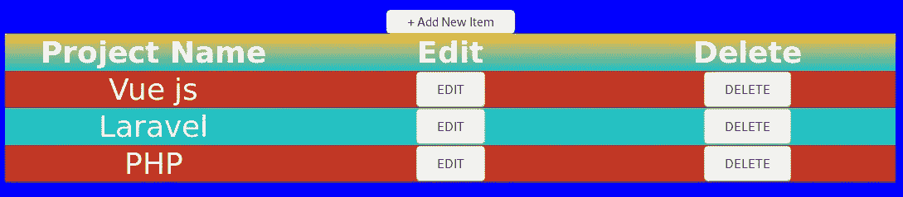
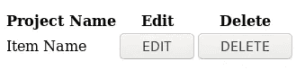
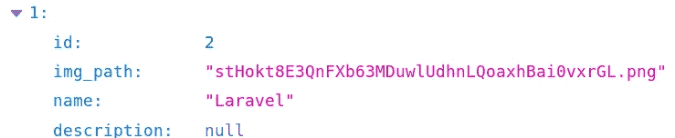
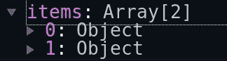
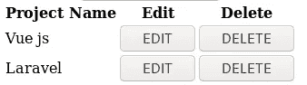
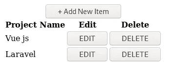

# Laravel 和 Vue:用 CRUD 管理面板创建作品集网站——第八章

> 原文：<https://itnext.io/laravel-and-vue-creating-a-portfolio-website-with-a-crud-admin-panel-chapter-eight-9750f15670dc?source=collection_archive---------3----------------------->

## 在 PortfolioEditor 中实现 CRUD 函数

在第七章中，我们创建了一个提交投资组合数据的表单，并使用它来提交投资组合数据。在本章的结尾，我们看到我们仍然需要做以下事情:

*   前端验证
*   后端验证
*   读取、更新和删除功能
*   重构组合控制器

验证与我们用来添加数据的表单相关。让我们来解决验证问题。

## 前端验证(用于添加数据)

我们可以从 ProfileEditor.vue 中复制 validationErrors()计算方法，并删除“请至少填写一个字段”规则。

> **名称变更**:方法名称从`*validationErrors()*`变更为`*validation()*`。

前端验证将类似于 ProfileEditor 的前端验证。不同之处在于，我们现在要求图像和项目名称，而不是要求至少一个字段。描述是可选的。

**验证规则**:我们需要一个文件，我们需要一个名称，但是描述是可选的；因此，将有一个文件验证规则和一个名称验证规则，但没有描述验证规则。

*   需要姓名
*   需要图像
*   提交按钮被禁用，直到我们有一个名字和图像

```
computed: {
    validation(){
        *this*.disabled = *true*;
        **i̶f̶ ̶(̶t̶h̶i̶s̶.̶n̶a̶m̶e̶ ̶=̶=̶=̶ ̶'̶'̶ ̶&̶&̶ ̶t̶h̶i̶s̶.̶f̶i̶l̶e̶.̶l̶e̶n̶g̶t̶h̶ ̶<̶=̶ ̶0̶)̶ ̶{̶
̶ ̶ ̶ ̶ ̶ ̶ ̶ ̶ ̶ ̶ ̶ ̶ ̶r̶e̶t̶u̶r̶n̶ ̶'̶p̶l̶e̶a̶s̶e̶ ̶f̶i̶l̶l̶ ̶a̶t̶ ̶l̶e̶a̶s̶t̶ ̶o̶n̶e̶ ̶f̶i̶e̶l̶d̶'̶;̶
̶ ̶ ̶ ̶ ̶ ̶ ̶ ̶ ̶}̶**
        ***if* (*this*.name === '') {
            *return* 'please fill in the project name';
        }
        *if* (!*this*.file) {
            *return* 'please select an image';
        }**
        *if* (*this*.file && !*this*.file.type.startsWith("image/")) {
            *return* 'file must be an image';
        }
        *else* {
            *this*.disabled = *false*;
            *return* ':)'
        }
    }
}
```

对于提交按钮，有一个禁用的属性，并将禁用的属性绑定到`**disabled**`

```
<button *@click.prevent*="onSubmit" ***:disabled*="disabled"**>Submit</button>
```

在数据()中插入`**disabled**`

```
data() {
    *return* {
        file: '',
        name: '',
        description: '', **disabled: *true*,**
    }
},
```

在表单的提交按钮下面放一个误差栏

```
<div *class*="errorBar">{{validation}}</div>
```

> 我们可以勾选前端验证

*   前端验证✔️
*   后端验证
*   读取、更新和删除功能
*   重构组合控制器

## 后端验证(用于添加数据)

让我们以稍微不同的方式进行 laravel 验证。上一次，我们看到它可以在商店功能中完成。这一次，我们想将验证重构为一个单独的**请求**。

```
**php artisan make:request StorePortfolioItemRequest**
```

这将在以下位置创建一个文件:

**App \ Http \ Requests \ storepoportfolioitemrequest . PHP**

该请求文件将处理您的验证。

如果 authorize()函数返回 false，则将其更改为 true。该函数允许您使用该文件提供的验证。

> 我们可以稍后将此功能更改为仅在登录后授权。

```
*public function* authorize()
{
    *return true*;
}
```

对 itempic 和 name 应用`**required**`规则。名称应该是 portfolio_items 表中的`**unique**`。

```
*public function* rules()
{
    *return* [
        'itempic' => 'required',
        'name' => 'required|unique:portfolio_items',
    ];
}
```

现在将 store()括号中的`Request $request`改为`**StorePortfolioItemRequest** $request`

```
*public function* store(**R̶e̶q̶u̶e̶s̶t̶** **StorePortfolioItemRequest** $request) {
    $file = $request->itempic;
    $hashName = $file->hashName();
    $this->resizeAndStore($file, $hashName);
    $this->storeDetails($hashName);
}
```

后端验证得到一个滴答

我们可以勾选后端验证

*   前端验证✔️
*   后端验证✔️
*   读取、更新和删除功能
*   重构组合控制器

**读取、更新和删除功能**将在表中实现。

让我们创建一个允许我们执行 CRUD 操作的表。

**读取** —我们需要将读取的内容呈现到表格中

**更新** —我们需要使用一个类似于创建表单的表单来更新信息

**删除** —我们需要一个删除按钮和一个确认删除弹出窗口。

## 创建 CRUD 表—读取

我们需要一个带有项目名称的表格，从投资组合中删除项目的选项，以及更改项目细节的选项等。

让我们用要点来说明:

*   项目名
*   编辑按钮
*   删除按钮
*   添加按钮

我们的桌子看起来会像这样:



让我们有一个表格元素

```
<table>

</table>
```

在 table 元素中，我们需要一个`**thead**`和一个`**tbody**`元素。`**thead**`是包含标题的元素，即上图中的项目名称、编辑和删除。`**tbody**` 将包含其他行。

```
<table>
    <thead></thead>
    <tbody></tbody>
</table>
```

使用`**th**`元素的`thead`元素内的表格标题:

```
<table>
    <thead>
        **<tr>
            <th>Project Name</th>
            <th>Edit</th>
            <th>Delete</th>
        </tr>**
    </thead>
    <tbody></tbody>
</table>
```

在`tbody`内

```
<table>
    <thead>
        <tr>
            <th>Project Name</th>
            <th>Edit</th>
            <th>Delete</th>
        </tr>
    </thead>
    <tbody>
        **<tr>
            <td>Item Name</td>
            <td>
                <button>EDIT</button>
            </td>
            <td>
                <button>DELETE</button>
            </td>
        </tr>**
    </tbody>
</table>
```

现在，您应该看到类似这样的内容:



开始时的 CRUD 表

这就是创建一个与数据库无关的表的方法。对于链接到数据库的表，我们需要使用 For 循环。在 Vue js 中，for 循环被称为 v-for 循环。为了得到 v-for 方法，我们需要经历“数据库-路由-脚本-模板”这条路。


[卡斯登·沃斯(@karsten.wuerth)](https://unsplash.com/@karsten_wuerth?utm_source=medium&utm_medium=referral) 在 [Unsplash](https://unsplash.com?utm_source=medium&utm_medium=referral) 上的照片


我们应该提交一些项目，然后数据库部分就完成了。✅


我们去路线上看看组合物品



路线部分是✅做的


脚本标签的 getPortfolio()方法

```
getPortfolio() {
    axios.get('/api/portfolio')
        .then(response => {
            *this*.items = response.data;
        })
        .catch(error => {
            *console*.log(error);
        });
},
```

脚本标记中的数据()

```
data() {
    *return* {
        items: '',
    }
},
```

脚本标签部分是✅做的


## 是时候使用 v-for 了

如果我们使用 vue-devtools，我们可以看到从路线中得到的项目



我们可以使用 v-for 来遍历这些项目并显示部分`**items**`数据。在这种情况下，我们想要显示的部分是在每个项目中都可以找到的**名称**。

**v-for 循环如何工作**:

1.  在上图中，您可以看到一个编号为 0 的对象和一个编号为 1 的对象。
2.  我们为这些对象设计了一个`**variable**`。
3.  然后`**variable**`被用作 v-for 循环引号中的第一个单词，即`**""**`

```
v-for="variable in object"
```

我们想要循环的对象叫做`**items**`

```
v-for="variable in **o̶b̶j̶e̶c̶t̶** **items**"
```

“项目中的对象”的合适词是“项目”，所以让我们将`**variable**`改为`**item**`

```
v-for="**item** in items"
```

将这个 v-for 应用到`**tbody**`中的`**tr**`以呈现所有项目，并使用{{item.name}}获取每个项目中的名称

```
<tr *v-for*="item *in* items">
    <td>{{**item.name**}}</td>
    <td>
        <button>EDIT</button>
    </td>
    <td>
        <button>DELETE</button>
    </td>
</tr>
```

表中呈现了两个项目的数据



让我们在`**thead**`上方构建添加按钮

```
<caption><button>+ Add New Item</button></caption>
<thead>
...
</thead>
```



## 创建 CRUD 表-更新

单击编辑按钮时，我们希望弹出一个模态，该模态应该包含更新表单。

```
<button ***@click*="editItemPopup(item)"**>EDIT</button>
```

在方法中:

```
**editItemPopup(item) {
    *this*.item = item;
    *if* (*this*.updateItemModal === *false*) {
        *this*.updateItemModal = *true*;
    }
    *else if* (*this*.updateItemModal === *true*) {
        *this*.updateItemModal = *false*;
    }
},**
```

> 代码解释:**edititempubup**是将要使用的方法。**括号中的项目**为`**variable**`的 v 型。

我们可以看到 v-for 也可以用来运行方法。

在 PortfolioEditor.vue 变得太大之前，我们应该让表成为一个子组件，并把项目作为道具传递(类似于第三章)。

```
<template>
    <section>
        <h1>Portfolio Editor</h1>
        <form>...</form>
        <portfolio-editor-table *:items*="items"/>
    </section>
</template>

<script>
    *import* portfolioEditorTable *from* './portfolioEditorTable';
    *export default* {
        name: "PortfolioEditor",
        data() {
            *return* {
                items: '',
            }
        },
        components: {portfolioEditorTable},
        mounted() {
            *this*.getPortfolio();
        },
        methods: {
            getPortfolio() {
                axios.get('/api/portfolio')
                    .then(response => {
                        *this*.items = response.data;
                    })
                    .catch(error => {
                        *console*.log(error);
                    });
            }
        }
    }
</script>
```

传递道具(在 portfolioEditorTable.vue 中)

```
<script>
    *export default* {
        name: "portfolioEditorTable",
        **props: {
          items: ''
        },**
        data() {
            *return* {
                p: *this*.$parent
            }
        }
    }
</script>
```

您可能已经注意到，在数据中有`**p: this.$parent**` **。**这只是为了让你在父类中调用方法时不必键入`**this.$parent**` ，你只需将其缩写为`**p**` (或者你选择的任何东西)。

```
<button ***@click*="p.editItemPopup(item)"**>EDIT</button>
```

我们应该在父组件中保留 editItemPopup 方法，因为我们希望将 CRUD api 方法放在一个文件中，而将“非 api”方法放在其他文件中。

因此，如果您已经在表组件中获得了 edititempubup(item ),您应该将它移动到父组件中。

导入 update-item-modal 并将其放在 PortfolioEditor.vue 中的 table 组件上方

```
<section>
    <h1>Portfolio Editor</h1>
    <update-item-modal *v-if*="updateItemModal" *:item*="item"/>
    <portfolio-editor-table *:items*="items"/>
</section>
```

我们将在下一章创建这个模型。

在上一章的结尾，我们列出了在未来章节中要做的事情。根据该列表，我们已经解决了前端和后端验证(对于添加/创建功能)

我们还没有到以下几点:

*   前端验证(用于更新功能)
*   后端验证(用于更新功能)
*   更新和删除功能(读取完成)
*   重构组合控制器

我们还没有创建一个投资组合。vue 组件将包括

*   带文本的图像
*   具有更大图像和描述的模型
*   模态上的关闭按钮

 [## Laravel 和 Vue:用 CRUD 管理面板创建作品集网站——第九章

### 组合编辑器的更新模式

medium.com](https://medium.com/@UmarCodes/laravel-and-vue-creating-a-portfolio-website-with-a-crud-admin-panel-chapter-nine-7acf3268ee0d)