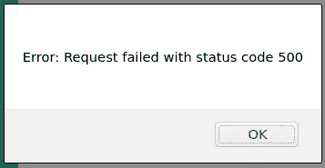
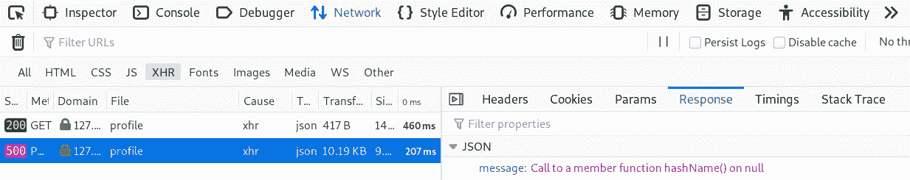
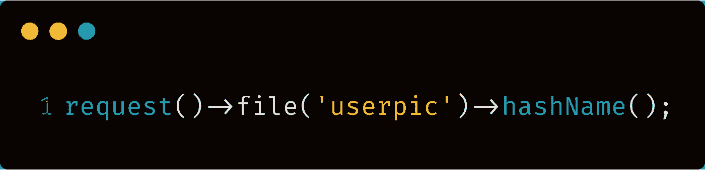
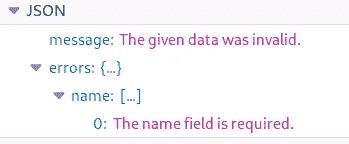
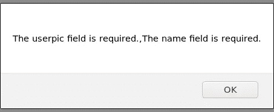
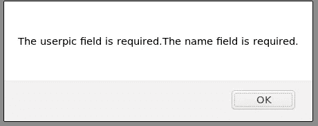
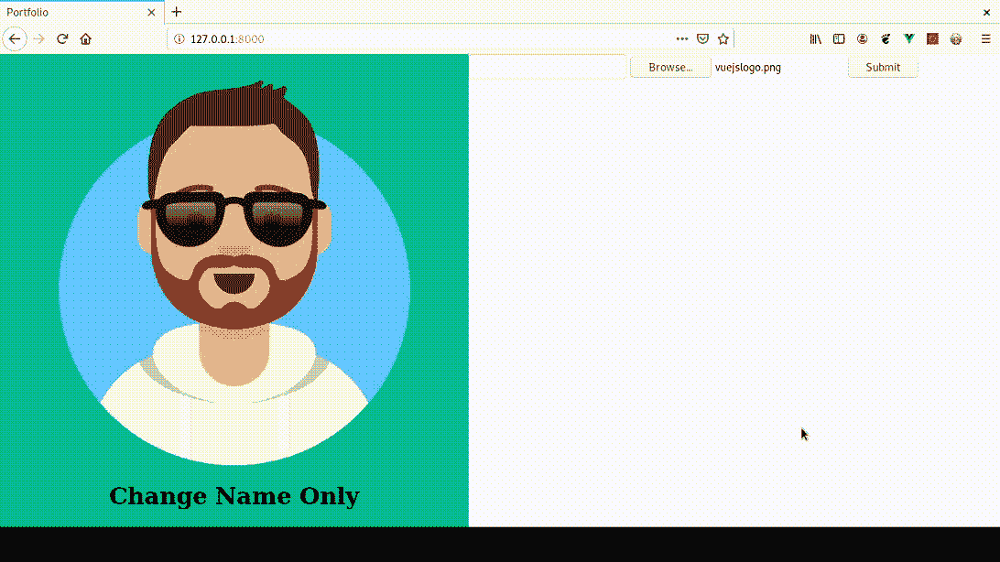
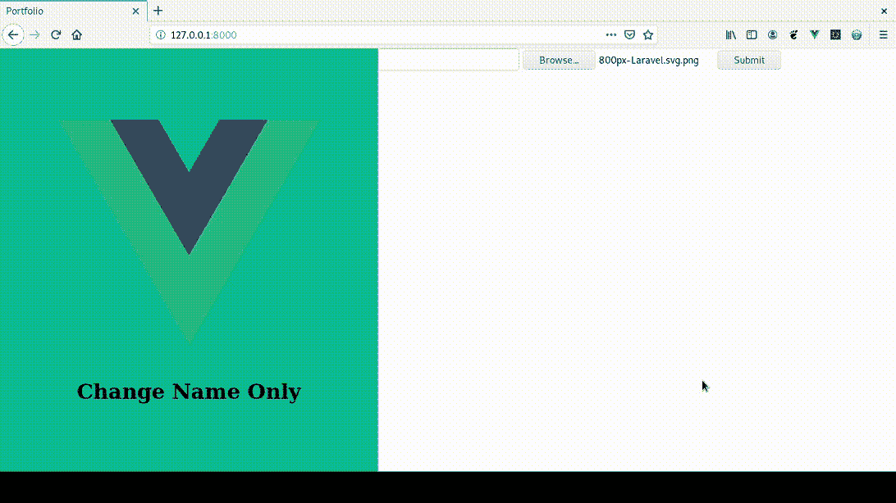

# Laravel 和 Vue:用 CRUD 管理面板创建作品集网站——第五章

> 原文：<https://itnext.io/laravel-and-vue-creating-a-portfolio-website-with-a-crud-admin-panel-chapter-five-d4c6ceeff93c?source=collection_archive---------3----------------------->

## Laravel 表单验证、错误消息和处理成功

**回顾:**在上一章中，我们创建了更新功能并重构了代码，因为如果我们不重构代码，它将变得难以查看。

**现在**:我们要解决一个问题。问题是当我们提交表单时，我们必须在 network 选项卡中查看表单是否已成功提交。

表单的用户可能不知道错误代码和 web 开发术语。用户也可能不知道如何使用网络选项卡或 **inspect element/web 开发工具**的任何部分。

我们需要一种方式来告诉用户正在发生什么。正在发生的是**‘错误正在发生’**和**‘表单未被验证’**。

我们还需要一些临时造型。

# 临时造型

将以下代码添加到 app.vue 中:

```
<style *id*="temporary">
 #app {
     display: grid;
     grid-auto-flow: column;
 }
 img {
      max-width: 100%;
       height: auto;
  }
</style>
```

现在，你将有刊头和形式并排。

# 通过警报通知用户

用户需要一种直观的方式来知道错误正在发生以及哪些错误正在发生。

让我们试试警报——更改 onSubmit 方法以显示 JavaScript 警报

```
onSubmit() {
    *let* fd = *new* FormData();
    fd.append('name', *this*.name);
    fd.append('userpic', *this*.file);

    axios.post('api/profile', fd)
        .then(response => {
 ***console*.log("response " + response);
            alert(response);**
        })
        .catch(error => {
 ***console*.log("ERROR " + error);
            alert(error)**
        })
},
```

> 代码解释:
> **然后** —如果一切顺利，记录**字响应**和**响应本身**。此外，创建一个**警告框**，其中出现**响应**。
> 
> **捕捉** —如果有错误，记录**文字错误**和**错误本身**。此外，创建一个**警告框**，其中显示错误。

发布一个空表单将会得到一个类似如下的警告框:



使用 HTTP 500 消息发出警报

我们会看到一个警告框，显示以下消息:

> 错误:请求失败，状态代码为 500

类似的消息将出现在浏览器控制台中:

> 错误错误:请求失败，状态代码为 500

这些消息对用户不太友好。让我们制作用户友好的信息。

## **用户友好的错误信息**

Laravel 具有验证功能，可以帮助我们用用户友好的语言发出这些错误消息。

如果我们查看网络选项卡，我们会发现这个 500 错误的消息

> 消息:在 null 上调用成员函数 **hashName()**



这意味着我们在控制器函数中使用了 **hashName()** ，但是我们使用的 hashName()是**不存在**。

让我们使用 CTRL+F(或者程序中使用的任意组合键)在控制器中找到 hashName()。在 PHPStorm 中，是 CTRL+F)。

```
*public function* insertData($profile) {
    $profile->name = request()->name;
    **$profile->img_path = request()->file('userpic')->hashName();**
    $profile->save();
    *return* request()->file('userpic')->store('/public/userpics');
}
```



在我们的控制器中，我们可以看到:

*   hashName()用于一个具有“userpic ”密钥的**文件**
*   userpic 文件应该在**请求()**中。

因为没有提交文件:

*   **请求()中不存在关键字为“userpic** 的文件
*   如果某样东西不存在，你就不能给它命名

我们应该有 Laravel 验证，它使用所需的规则**。**

在 ProfileController 的 store()函数中，在开头添加一个验证器，如下所示:

```
*public function* store(Request $request)
{
    ***$this*->validate($request, [
        'userpic' => 'required'
    ]);**

    $profile = Profile::*all*();
    *if* ($profile->isEmpty()) {
        *return $this*->insertData($profile = *new* Profile());
    } *else* {
        *return $this*->insertData($profile = Profile::*all*()[0]);
    }
}
```

现在，您将看到一条 500 状态错误消息

> 列“名称”不能为空

因此，在验证代码中，我们将在**名称**上添加使用**必需的**规则。

```
*public function* store(Request $request)
{
    *$this*->validate($request, [
        'userpic' => 'required',
        '**name**' => '**required**'
    ]);
    $profile = Profile::*all*();
    *if* ($profile->isEmpty()) {
        *$this*->insertData($profile = *new* Profile());
    } *else* {
        *$this*->insertData($profile = Profile::*findOrFail*(1));
    }
}
```

现在,“选择一个文件并提交一个空的名称框”将得到一个 422 状态错误，消息如下:

> 给定的数据无效。

和一个错误 json。你可以在下图中看到这些。



将验证器代码放在函数的开始是非常重要的。

当您提交表单时，request()数据将通过验证代码。如果 request()数据没有通过验证，您将在 network 选项卡中看到 422 状态错误，并且不会插入任何数据。

> 422 状态意味着服务器知道你想做什么，但是它认为你(客户端)出错了。
> 
> 由于我们没有通过验证，我们得到一个 422 状态，因为我们在客户端出错了。

您在警报中得到一个 422 错误

> 错误:请求失败，状态代码为 422

**我们的目标是**:我们的目标是将**验证器错误消息**放入警告框。

**为什么**:验证器错误消息使用了没有术语的语言，因此更加用户友好

当我们使用 axios js 时，错误的响应数据在 **error.response.data 内。**让我们将它记录在控制台中

```
console.log(error.response.data)
```

现在，我们得到一个带有**消息**和**错误** **的对象**。这与您在“网络”选项卡中获得的内容是一样的。

让我们记录 error.response.data 中的 errors 对象

```
console.log(error.response.data**.errors**)
```

这是我们需要的对象，因为这是我们接收验证器消息的对象。

我们需要获取这个对象的值，并把它们放在一个警告框中。我们使用`**Object.values()**`获取对象的值

```
.catch(error => {
    *let* er = error.response.data.errors;
    *let* ov = **Object.values(er)**;
    alert(ov);
})
```

现在，警报看起来像这样:



我们得到了由 Laravel 的验证器提供的错误信息。

你可能会注意到两条消息之间有一个逗号。为了去掉逗号，我们可以使用 join 方法。

```
alert(ov.**join('')**);
```



注意，使用`**join('')**`后，逗号消失了。

我们的警报起作用了。😃

但是如果您只想更新一个字段呢？有时候你想:

*   保留当前名称的同时更改图像
*   在保持当前图像的同时更改名称。

为了解决这两种情况，我们需要使用验证规则 **required_without**

# 必需 _ 无

这是一个验证规则，仅当其他字段为空时，该字段才成为必填字段。在我们的例子中，如果 userpic 为空，我们希望名称是必需的，如果名称为空，我们希望 userpic 字段是必需的。

```
*$this*->validate($request, [
    'userpic' => '**required_without**:name',
    'name' => '**required_without**:userpic'
]);
```

为了确保不需要的**正常工作，我们需要看看三个场景并解决它们的问题:**

1.  当表单为空时提交表单。
2.  提交没有填写名称字段的文件。
3.  提交未选择文件的已填写名称字段。

## 1.表单为空时提交表单

任务:提交一个空表单，你会得到一个警告框，上面写着:

> 当名称不存在时，需要 userpic 字段。当 userpic 不存在时，名称字段是必需的。

这很好。我们毫无问题地收到了所需的**消息，而没有收到**消息。

## 2.提交没有填写名称字段的文件。

**问题:**如果提交一个没有名称字段的文件，将返回 500 状态错误。


> 别担心，我们能处理好。

查看 network 选项卡，您会发现一个响应 json。

**列“名称”不能为空** —这意味着我们尝试**插入**名称和文件已经被数据库拒绝**。**

这里发生的是我们的**请求()数据**通过了验证。然而，当**请求()数据**传递给`**insertData()**`函数时，会出现 500 错误。这个 500 错误是因为数据库拒绝了请求。

**解决方案尝试**:只有填写了 **request()- > name** ，我们才能尝试提交名称。这可以通过`**request()->filled()**`完成，如下图所示:

```
*public function* insertData($profile) {
    ***if* (request()->filled('name')) {
        $profile->name = request()->name;
    }**
    $profile->img_path = request()->file('userpic')->hashName();
    $profile->save();
    request()->file('userpic')->store('/public/userpics');
}
```

现在，尝试提交一个没有填写名称字段的文件。我们发现它在更新图像的同时保持了相同的**名称**。

**问题已解决**:现在可以提交没有姓名字段的文件了。😃

## 3.提交未选择文件的已填写名称字段。

**问题:**这样做的话，我们会得到 500 错误和消息

> **在 null 上调用成员函数 hashName()**

如前所述(在**通过警报通知用户—用户友好的错误消息**中)，我们在控制器函数中使用 **hashName()** ，但是我们使用的 hashName()是**不存在**。

**解决方案尝试:**让我们只插入文件数据，如果请求有一个带有 **userpic** 关键字的文件，这可以使用`**hasfile('')**`来完成:

```
*public function* insertData($profile) {
    *if* (request()->filled('name')) {
        $profile->name = request()->name;
    } *if* (request()->**hasFile**('userpic')) {
        $profile->img_path = request()->file('userpic')->hashName();
    } $profile->save();
    request()->file('userpic')->store('/public/userpics');
}
```

通过提交没有文件的填充名称字段来测试此代码。我们现在看到的是另一个 500 错误

> 对空成员函数存储()的调用

这个错误说的函数和**公共函数 store()不是同一个函数。**

错误所指的函数用在 insertData()的底部

```
**request()->file('userpic')**->store('/public/userpics');
```

`**request()->file('userpic')**`此处为空。我们不能对 null 使用 store()。

**错误解释**:如果您没有提交任何文件，那么请求()中不会包含任何文件。上面的代码试图从请求()中存储一个文件，但是该文件为空，因为我们从未提交过。

让我们重新组织代码，这样**成员函数 store()** 只在 request()拥有带有 **userpic** 关键字的文件时使用。

```
*public function* insertData($profile) {
    *if* (request()->filled('name')) {
        $profile->name = request()->name;
    } *if* (request()->hasFile('**userpic**')) {
        $profile->img_path = request()->file('userpic')->hashName();
        **request()->file('userpic')->store('/public/userpics');**
    } $profile->save();
}
```

**问题已解决**:现在提交没有文件的名称将获得 200 状态。200 状态表示 OK。您还可以返回新创建/编辑的数据库行作为响应，如下所示:

```
$profile->save();
***return***Profile::*all*()[0];
```

记得在`**$this->insertData**` 前用`**return**` 这个词。否则`**insertData()**`功能会将数据返回到存储功能，但不会返回到客户端，因此您不会在网络选项卡中看到它。

我们当前的 store()和 insertData()函数:

```
*public function* store(Request $request)
{
    *$this*->validate($request, [
        'userpic' => 'required_without:name',
        'name' => 'required_without:userpic'
    ]);

    $profile = Profile::*all*();
    *if* ($profile->isEmpty()) {
        ***return*** *$this*->insertData($profile = *new* Profile());
    } *else* {
        ***return*** *$this*->insertData($profile = Profile::*all*()[0]);
    }
}

*public function* insertData($profile) {
    *if* (request()->filled('name')) {
        $profile->name = request()->name;
    }
    *if* (request()->hasFile('userpic')) {
        $profile->img_path = request()->file('userpic')->hashName();
        request()->file('userpic')->store('/public/userpics');
    }
    $profile->save();
    ***return***Profile::*all*()[0];
}
```

现在我们有以下更新能力:

*   仅更新名称
*   仅更新用户图片
*   更新名称和用户图片

如果我们在表单为空的时候提交它，我们会得到一个合适的错误消息。

现在我们如何处理成功？

## 处理成功

我们如何处理成功？这不仅仅是一个生活问题或者财务问题。在我们的例子中，这也是一个表单验证问题。

如果我们得到一个 200 状态响应，axios 就转移到它的`**.then**`方法。我们可以修改`**.then**`来使用`**this.$parent**`从父组件运行一个方法

```
axios.post('api/profile', fd)
    **.then(*this*.$parent.getProfile())**
    .catch(error => {
        *let* er = error.response.data.errors;
        *let* ov = Object.values(er);
        alert(ov.join(''));
    })
```

这里我们的父组件是 **App.vue** ，它包含`**getProfile()**`。

`**getProfile()**` 是帮助我们渲染轮廓数据的方法。

我们现在可以插入数据，它会立即出现在页面**上**。不需要重装。

让我们来测试一下:

插入姓名:


插入图像:



插入两者:



# 摘要

我们在本章中做了什么:

*   使用 Laravel 验证来验证表单
*   显示 Laravel 验证错误的 JavaScript 警报
*   使用`**required_without**` 来确保至少需要一个字段
*   在将名称和文件保存到数据库之前，使用了`**request()-hasFile()**`和`**$request->filled()**`来确保请求分别有一个文件和名称。
*   通过在数据插入时简单地重新运行`**getProfile()**`方法成功处理。

在下一章，我们将处理**前端表单验证**和**图像调整**

[](/laravel-and-vue-creating-a-portfolio-website-with-a-crud-admin-panel-chapter-six-6f7ed2b23b42) [## Laravel 和 Vue:用 CRUD 管理面板创建作品集网站——第六章

### 前端表单验证和调整图像大小

itnext.io](/laravel-and-vue-creating-a-portfolio-website-with-a-crud-admin-panel-chapter-six-6f7ed2b23b42)